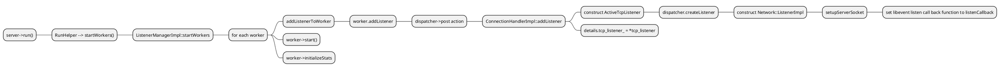
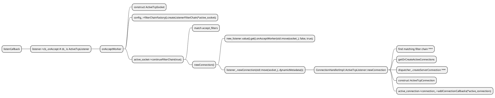
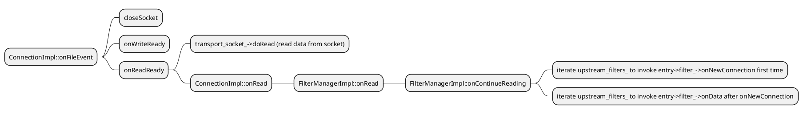

# Envoy HTTP Source Code analyze

## HTTP Function backtrace
```
#0  Envoy::Http::CodecClient::onData (this=0x55555d70f950, data=...) at source/common/http/codec_client.cc:125
#1  0x000055555ac53357 in Envoy::Http::CodecClient::CodecReadFilter::onData (this=0x55555d671670, data=...) at bazel-out/k8-dbg/bin/source/common/http/_virtual_includes/codec_client_lib/common/http/codec_client.h:176
#2  0x000055555a730f55 in Envoy::Network::FilterManagerImpl::onContinueReading (this=0x55555d7a6078, filter=0x0, buffer_source=...) at source/common/network/filter_manager_impl.cc:66
#3  0x000055555a731157 in Envoy::Network::FilterManagerImpl::onRead (this=0x55555d7a6078) at source/common/network/filter_manager_impl.cc:76
#4  0x000055555a71a938 in Envoy::Network::ConnectionImpl::onRead (this=0x55555d7a6000, read_buffer_size=242) at source/common/network/connection_impl.cc:297
#5  0x000055555a71e1e9 in Envoy::Network::ConnectionImpl::onReadReady (this=0x55555d7a6000) at source/common/network/connection_impl.cc:579
#6  0x000055555a71cdec in Envoy::Network::ConnectionImpl::onFileEvent (this=0x55555d7a6000, events=3) at source/common/network/connection_impl.cc:539
#7  0x000055555a728a3e in Envoy::Network::ConnectionImpl::ConnectionImpl(Envoy::Event::Dispatcher&, std::__1::unique_ptr<Envoy::Network::ConnectionSocket, std::__1::default_delete<Envoy::Network::ConnectionSocket> >&&, std::__1::unique_ptr<Envoy::Network::TransportSocket, std::__1::default_delete<Envoy::Network::TransportSocket> >&&, Envoy::StreamInfo::StreamInfo&, bool)::$_6::operator()(unsigned int) const (this=0x55555d221268, events=3) at source/common/network/connection_impl.cc:77 
#8  0x000055555a728a01 in std::__1::__invoke<Envoy::Network::ConnectionImpl::ConnectionImpl(Envoy::Event::Dispatcher&, std::__1::unique_ptr<Envoy::Network::ConnectionSocket, std::__1::default_delete<Envoy::Network::ConnectionSocket> >&&, std::__1::unique_ptr<Envoy::Network::TransportSocket, std::__1::default_delete<Envoy::Network::TransportSocket> >&&, Envoy::StreamInfo::StreamInfo&, bool)::$_6&, unsigned int> (__f=..., __args=@0x7fffedc0cd64: 3) at /opt/llvm/bin/../include/c++/v1/type_traits:3539
#9  0x000055555a7289a2 in std::__1::__invoke_void_return_wrapper<void>::__call<Envoy::Network::ConnectionImpl::ConnectionImpl(Envoy::Event::Dispatcher&, std::__1::unique_ptr<Envoy::Network::ConnectionSocket, std::__1::default_delete<Envoy::Network::ConnectionSocket> >&&, std::__1::unique_ptr<Envoy::Network::TransportSocket, std::__1::default_delete<Envoy::Network::TransportSocket> >&&, Envoy::StreamInfo::StreamInfo&, bool)::$_6&, unsigned int>(Envoy::Network::ConnectionImpl::ConnectionImpl(Envoy::Event::Dispatcher&, std::__1::unique_ptr<Envoy::Network::ConnectionSocket, std::__1::default_delete<Envoy::Network::ConnectionSocket> >&&, std::__1::unique_ptr<Envoy::Network::TransportSocket, std::__1::default_delete<Envoy::Network::TransportSocket> >&&, Envoy::StreamInfo::StreamInfo&, bool)::$_6&, unsigned int&&) (__args=@0x7fffedc0cd64: 3, __args=@0x7fffedc0cd64: 3) at /opt/llvm/bin/../include/c++/v1/__functional_base:348
#10 0x000055555a728962 in std::__1::__function::__alloc_func<Envoy::Network::ConnectionImpl::ConnectionImpl(Envoy::Event::Dispatcher&, std::__1::unique_ptr<Envoy::Network::ConnectionSocket, std::__1::default_delete<Envoy::Network::ConnectionSocket> >&&, std::__1::unique_ptr<Envoy::Network::TransportSocket, std::__1::default_delete<Envoy::Network::TransportSocket> >&&, Envoy::StreamInfo::StreamInfo&, bool)::$_6, std::__1::allocator<Envoy::Network::ConnectionImpl::ConnectionImpl(Envoy::Event::Dispatcher&, std::__1::unique_ptr<Envoy::Network::ConnectionSocket, std::__1::default_delete<Envoy::Network::ConnectionSocket> >&&, std::__1::unique_ptr<Envoy::Network::TransportSocket, std::__1::default_delete<Envoy::Network::TransportSocket> >&&, Envoy::StreamInfo::StreamInfo&, bool)::$_6>, void (unsigned int)>::operator()(unsigned int&&) (this=0x55555d221268, __arg=@0x7fffedc0cd64: 3) at /opt/llvm/bin/../include/c++/v1/functional:1540
#11 0x000055555a727aa3 in std::__1::__function::__func<Envoy::Network::ConnectionImpl::ConnectionImpl(Envoy::Event::Dispatcher&, std::__1::unique_ptr<Envoy::Network::ConnectionSocket, std::__1::default_delete<Envoy::Network::ConnectionSocket> >&&, std::__1::unique_ptr<Envoy::Network::TransportSocket, std::__1::default_delete<Envoy::Network::TransportSocket> >&&, Envoy::StreamInfo::StreamInfo&, bool)::$_6, std::__1::allocator<Envoy::Network::ConnectionImpl::ConnectionImpl(Envoy::Event::Dispatcher&, std::__1::unique_ptr<Envoy::Network::ConnectionSocket, std::__1::default_delete<Envoy::Network::ConnectionSocket> >&&, std::__1::unique_ptr<Envoy::Network::TransportSocket, std::__1::default_delete<Envoy::Network::TransportSocket> >&&, Envoy::StreamInfo::StreamInfo&, bool)::$_6>, void (unsigned int)>::operator()(unsigned int&&) (this=0x55555d221260, __arg=@0x7fffedc0cd64: 3) at /opt/llvm/bin/../include/c++/v1/functional:1714
#12 0x000055555a70fd8d in std::__1::__function::__value_func<void (unsigned int)>::operator()(unsigned int&&) const (this=0x55555d221260, __args=@0x7fffedc0cd64: 3) at /opt/llvm/bin/../include/c++/v1/functional:1867
#13 0x000055555a70f87f in std::__1::function<void (unsigned int)>::operator()(unsigned int) const (this=0x55555d221260, __arg=3) at /opt/llvm/bin/../include/c++/v1/functional:2473
#14 0x000055555a70d9eb in Envoy::Event::FileEventImpl::mergeInjectedEventsAndRunCb (this=0x55555d2211e0, events=3) at source/common/event/file_event_impl.cc:122
#15 0x000055555a70dc21 in Envoy::Event::FileEventImpl::assignEvents(unsigned int, event_base*)::$_1::operator()(int, short, void*) const (this=0x45, what=38, arg=0x55555d2211e0) at source/common/event/file_event_impl.cc:95
#16 0x000055555a70da26 in Envoy::Event::FileEventImpl::assignEvents(unsigned int, event_base*)::$_1::__invoke(int, short, void*) (what=38, arg=0x55555d2211e0) at source/common/event/file_event_impl.cc:79
#17 0x000055555b2c77ee in event_persist_closure (base=0x55555d67c2c0, ev=0x55555d2211e8) at /data/.cache/bazel/_bazel_felixdu/0f5dd88bbe2d9aa0986ad7f9beec7bfa/sandbox/linux-sandbox/90/execroot/envoy/external/com_github_libevent_libevent/event.c:1639
#18 0x000055555b2c6e18 in event_process_active_single_queue (base=0x55555d67c2c0, activeq=0x55555d6703e0, max_to_process=2147483647, endtime=0x0) at /data/.cache/bazel/_bazel_felixdu/0f5dd88bbe2d9aa0986ad7f9beec7bfa/sandbox/linux-sandbox/90/execroot/envoy/external/com_github_libevent_libevent/event.c:1698
#19 0x000055555b2c15da in event_process_active (base=0x55555d67c2c0) at /data/.cache/bazel/_bazel_felixdu/0f5dd88bbe2d9aa0986ad7f9beec7bfa/sandbox/linux-sandbox/90/execroot/envoy/external/com_github_libevent_libevent/event.c:1799
#20 0x000055555b2c048c in event_base_loop (base=0x55555d67c2c0, flags=0) at /data/.cache/bazel/_bazel_felixdu/0f5dd88bbe2d9aa0986ad7f9beec7bfa/sandbox/linux-sandbox/90/execroot/envoy/external/com_github_libevent_libevent/event.c:2041
#21 0x000055555a748f58 in Envoy::Event::LibeventScheduler::run (this=0x55555d6776e0, mode=Envoy::Event::Dispatcher::RunType::Block) at source/common/event/libevent_scheduler.cc:53
#22 0x000055555a70157a in Envoy::Event::DispatcherImpl::run (this=0x55555d677680, type=Envoy::Event::Dispatcher::RunType::Block) at source/common/event/dispatcher_impl.cc:209
#23 0x000055555a6d27da in Envoy::Server::WorkerImpl::threadRoutine (this=0x55555d3141e0, guard_dog=...) at source/server/worker_impl.cc:133
#24 0x000055555a6d9dcc in Envoy::Server::WorkerImpl::start(Envoy::Server::GuardDog&)::$_4::operator()() const (this=0x55555d374cc8) at source/server/worker_impl.cc:99
#25 0x000055555a6d9d8d in std::__1::__invoke<Envoy::Server::WorkerImpl::start(Envoy::Server::GuardDog&)::$_4&> (__f=...) at /opt/llvm/bin/../include/c++/v1/type_traits:3539
#26 0x000055555a6d9d3d in std::__1::__invoke_void_return_wrapper<void>::__call<Envoy::Server::WorkerImpl::start(Envoy::Server::GuardDog&)::$_4&>(Envoy::Server::WorkerImpl::start(Envoy::Server::GuardDog&)::$_4&) (__args=...) at /opt/llvm/bin/../include/c++/v1/__functional_base:348
#27 0x000055555a6d9d0d in std::__1::__function::__alloc_func<Envoy::Server::WorkerImpl::start(Envoy::Server::GuardDog&)::$_4, std::__1::allocator<Envoy::Server::WorkerImpl::start(Envoy::Server::GuardDog&)::$_4>, void ()>::operator()() ( this=0x55555d374cc8) at /opt/llvm/bin/../include/c++/v1/functional:1540
#28 0x000055555a6d8e3e in std::__1::__function::__func<Envoy::Server::WorkerImpl::start(Envoy::Server::GuardDog&)::$_4, std::__1::allocator<Envoy::Server::WorkerImpl::start(Envoy::Server::GuardDog&)::$_4>, void ()>::operator()() (this=0x55555d374cc0) at /opt/llvm/bin/../include/c++/v1/functional:1714
#29 0x00005555589bcf85 in std::__1::__function::__value_func<void ()>::operator()() const (this=0x55555d374cc0) at /opt/llvm/bin/../include/c++/v1/functional:1867
#30 0x00005555589bcf45 in std::__1::function<void ()>::operator()() const (this=0x55555d374cc0) at /opt/llvm/bin/../include/c++/v1/functional:2473
#31 0x000055555b444652 in Envoy::Thread::ThreadImplPosix::ThreadImplPosix(std::__1::function<void ()>, absl::optional<Envoy::Thread::Options> const&)::{lambda(void*)#1}::operator()(void*) const (this=0x55555d374cb0, arg=0x55555d374cb0) at source/common/common/posix/thread_impl.cc:49
#32 0x000055555b444625 in Envoy::Thread::ThreadImplPosix::ThreadImplPosix(std::__1::function<void ()>, absl::optional<Envoy::Thread::Options> const&)::{lambda(void*)#1}::__invoke(void*) (arg=0x55555d374cb0) at source/common/common/posix/thread_impl.cc:48
#33 0x00007ffff7e3deaa in start_thread () from /lib64/libpthread.so.0
#34 0x00007ffff7d6daff in clone () from /lib64/libc.so.6
```

## Construct ConnectionImpl
```
#0  Envoy::Network::ConnectionImpl::ConnectionImpl (this=0x55555d78a500, dispatcher=..., socket=..., transport_socket=..., stream_info=..., connected=true) at source/common/network/connection_impl.cc:62
#1  0x000055555a706474 in std::__1::make_unique<Envoy::Network::ConnectionImpl, Envoy::Event::DispatcherImpl&, std::__1::unique_ptr<Envoy::Network::ConnectionSocket, std::__1::default_delete<Envoy::Network::ConnectionSocket> >, std::__1::unique_ptr<Envoy::Network::TransportSocket, std::__1::default_delete<Envoy::Network::TransportSocket> >, Envoy::StreamInfo::StreamInfo&, bool> (__args=@0x7fffeac066df: true, __args=@0x7fffeac066df: true, __args=@0x7fffeac066df: true, __args=@0x7fffeac066df: true, __args=@0x7fffeac066df: true) at /opt/llvm/bin/../include/c++/v1/memory:3028
#2  0x000055555a6ffb71 in Envoy::Event::DispatcherImpl::createServerConnection (this=0x55555d67e000, socket=..., transport_socket=..., stream_info=...) at source/common/event/dispatcher_impl.cc:112
#3  0x000055555a6e18a4 in Envoy::Server::ConnectionHandlerImpl::ActiveTcpListener::newConnection (this=0x55555d76a870, socket=..., dynamic_metadata=...) at source/server/connection_handler_impl.cc:406
#4  0x000055555a6e0b97 in Envoy::Server::ConnectionHandlerImpl::ActiveTcpSocket::newConnection (this=0x55555d288540) at source/server/connection_handler_impl.cc:326
#5  0x000055555a6e0ff7 in Envoy::Server::ConnectionHandlerImpl::ActiveTcpSocket::continueFilterChain (this=0x55555d288540, success=true) at source/server/connection_handler_impl.cc:277
#6  0x000055555a6e122f in Envoy::Server::ConnectionHandlerImpl::ActiveTcpListener::onAcceptWorker (this=0x55555d76a870, socket=..., hand_off_restored_destination_connections=false, rebalanced=false) at source/server/connection_handler_impl.cc:359
#7  0x000055555a6e2078 in Envoy::Server::ConnectionHandlerImpl::ActiveTcpListener::onAccept (this=0x55555d76a870, socket=...) at source/server/connection_handler_impl.cc:339
#8  0x000055555a74313a in Envoy::Network::ListenerImpl::listenCallback (fd=67, remote_addr=0x7fffeac06e18, remote_addr_len=16, arg=0x55555d701f40) at source/common/network/listener_impl.cc:78
#9  0x000055555b2d2b09 in listener_read_cb (fd=62, what=2, p=0x55555d7076b0) at /data/.cache/bazel/_bazel_felixdu/0f5dd88bbe2d9aa0986ad7f9beec7bfa/sandbox/linux-sandbox/90/execroot/envoy/external/com_github_libevent_libevent/listener.c:437
#10 0x000055555b2c77ee in event_persist_closure (base=0x55555d67cb00, ev=0x55555d7076e8) at /data/.cache/bazel/_bazel_felixdu/0f5dd88bbe2d9aa0986ad7f9beec7bfa/sandbox/linux-sandbox/90/execroot/envoy/external/com_github_libevent_libevent/event.c:1639
#11 0x000055555b2c6e18 in event_process_active_single_queue (base=0x55555d67cb00, activeq=0x55555d670470, max_to_process=2147483647, endtime=0x0) at /data/.cache/bazel/_bazel_felixdu/0f5dd88bbe2d9aa0986ad7f9beec7bfa/sandbox/linux-sandbox/90/execroot/envoy/external/com_github_libevent_libevent/event.c:1698
#12 0x000055555b2c15da in event_process_active (base=0x55555d67cb00) at /data/.cache/bazel/_bazel_felixdu/0f5dd88bbe2d9aa0986ad7f9beec7bfa/sandbox/linux-sandbox/90/execroot/envoy/external/com_github_libevent_libevent/event.c:1799
#13 0x000055555b2c048c in event_base_loop (base=0x55555d67cb00, flags=0) at /data/.cache/bazel/_bazel_felixdu/0f5dd88bbe2d9aa0986ad7f9beec7bfa/sandbox/linux-sandbox/90/execroot/envoy/external/com_github_libevent_libevent/event.c:2041
#14 0x000055555a748f58 in Envoy::Event::LibeventScheduler::run (this=0x55555d67e060, mode=Envoy::Event::Dispatcher::RunType::Block) at source/common/event/libevent_scheduler.cc:53
#15 0x000055555a70157a in Envoy::Event::DispatcherImpl::run (this=0x55555d67e000, type=Envoy::Event::Dispatcher::RunType::Block) at source/common/event/dispatcher_impl.cc:209
#16 0x000055555a6d27da in Envoy::Server::WorkerImpl::threadRoutine (this=0x55555d2a26e0, guard_dog=...) at source/server/worker_impl.cc:133
#17 0x000055555a6d9dcc in Envoy::Server::WorkerImpl::start(Envoy::Server::GuardDog&)::$_4::operator()() const (this=0x55555d374a98) at source/server/worker_impl.cc:99
#18 0x000055555a6d9d8d in std::__1::__invoke<Envoy::Server::WorkerImpl::start(Envoy::Server::GuardDog&)::$_4&> (__f=...) at /opt/llvm/bin/../include/c++/v1/type_traits:3539
#19 0x000055555a6d9d3d in std::__1::__invoke_void_return_wrapper<void>::__call<Envoy::Server::WorkerImpl::start(Envoy::Server::GuardDog&)::$_4&>(Envoy::Server::WorkerImpl::start(Envoy::Server::GuardDog&)::$_4&) (__args=...) at /opt/llvm/bin/../include/c++/v1/__functional_base:348
#20 0x000055555a6d9d0d in std::__1::__function::__alloc_func<Envoy::Server::WorkerImpl::start(Envoy::Server::GuardDog&)::$_4, std::__1::allocator<Envoy::Server::WorkerImpl::start(Envoy::Server::GuardDog&)::$_4>, void ()>::operator()() ( this=0x55555d374a98) at /opt/llvm/bin/../include/c++/v1/functional:1540
#21 0x000055555a6d8e3e in std::__1::__function::__func<Envoy::Server::WorkerImpl::start(Envoy::Server::GuardDog&)::$_4, std::__1::allocator<Envoy::Server::WorkerImpl::start(Envoy::Server::GuardDog&)::$_4>, void ()>::operator()() (this=0x55555d374a90) at /opt/llvm/bin/../include/c++/v1/functional:1714
#22 0x00005555589bcf85 in std::__1::__function::__value_func<void ()>::operator()() const (this=0x55555d374a90) at /opt/llvm/bin/../include/c++/v1/functional:1867
#23 0x00005555589bcf45 in std::__1::function<void ()>::operator()() const (this=0x55555d374a90) at /opt/llvm/bin/../include/c++/v1/functional:2473
#24 0x000055555b444652 in Envoy::Thread::ThreadImplPosix::ThreadImplPosix(std::__1::function<void ()>, absl::optional<Envoy::Thread::Options> const&)::{lambda(void*)#1}::operator()(void*) const (this=0x55555d374a80, arg=0x55555d374a80) at source/common/common/posix/thread_impl.cc:49
#25 0x000055555b444625 in Envoy::Thread::ThreadImplPosix::ThreadImplPosix(std::__1::function<void ()>, absl::optional<Envoy::Thread::Options> const&)::{lambda(void*)#1}::__invoke(void*) (arg=0x55555d374a80) at source/common/common/posix/thread_impl.cc:48
#26 0x00007ffff7e3deaa in start_thread () from /lib64/libpthread.so.0
#27 0x00007ffff7d6daff in clone () from /lib64/libc.so.6
```


```c++
Network::ConnectionPtr
DispatcherImpl::createServerConnection(Network::ConnectionSocketPtr&& socket,
                                       Network::TransportSocketPtr&& transport_socket,
                                       StreamInfo::StreamInfo& stream_info) {
  ASSERT(isThreadSafe());
  return std::make_unique<Network::ConnectionImpl>(*this, std::move(socket),
                                                   std::move(transport_socket), stream_info, true);
}

Network::ClientConnectionPtr
DispatcherImpl::createClientConnection(Network::Address::InstanceConstSharedPtr address,
                                       Network::Address::InstanceConstSharedPtr source_address,
                                       Network::TransportSocketPtr&& transport_socket,
                                       const Network::ConnectionSocket::OptionsSharedPtr& options) {
  ASSERT(isThreadSafe());
  return std::make_unique<Network::ClientConnectionImpl>(*this, address, source_address,
                                                         std::move(transport_socket), options);
}
```



`listenCallback` registered as libevent `evconnlistener_new` callback, when new connection arrived, this call back function invoked:



