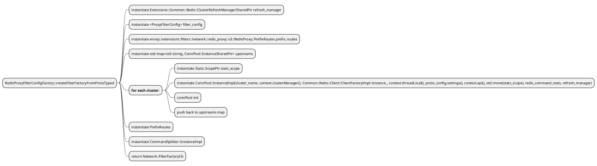
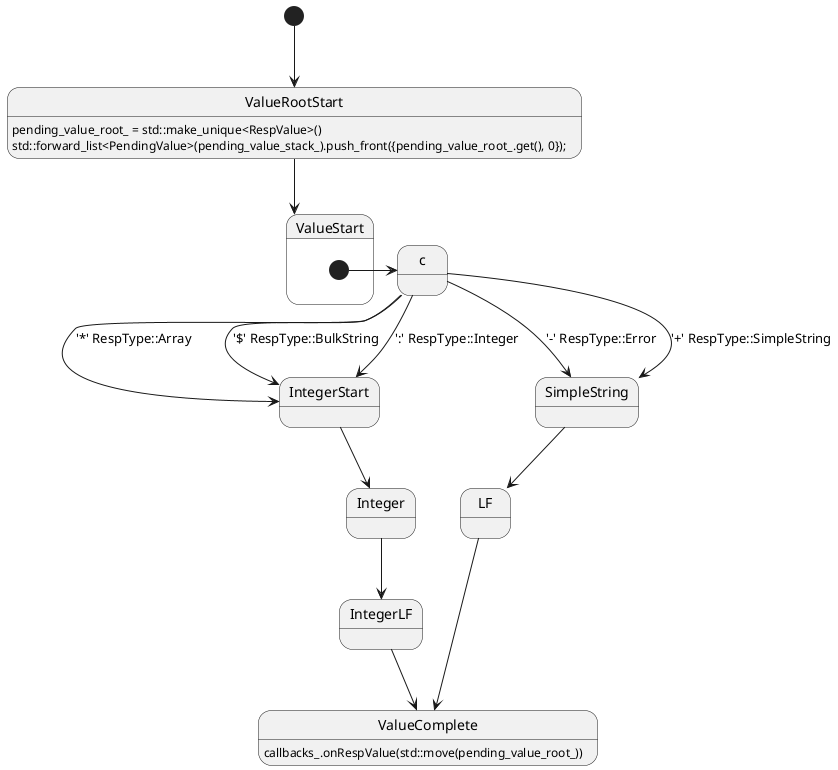

# Envoy Redis Code Analyze

## Class Diagrams
```plantuml
@startuml
'set namespaceSeparator ::
' upstream configurations
interface Upstream::ProtocolOptionsConfig {}
note right: All extension protocol specific options returned by the method at NamedNetworkFilterConfigFactory::createProtocolOptions must be derived from this class.

class RedisProxy::ProtocolOptionsConfigImpl {
	+ std::string authUsername(Api::Api& api)
	+ std::string authPassword(Api::Api& api)
	+ {static} const std::string authUsername(const Upstream::ClusterInfoConstSharedPtr info, Api::Api& api)
	+ {static} const std::string authPassword(const Upstream::ClusterInfoConstSharedPtr info, Api::Api& api)

	- envoy::config::core::v3::DataSource auth_username_;
	- envoy::config::core::v3::DataSource auth_password_;
}

Upstream::ProtocolOptionsConfig <|.. RedisProxy::ProtocolOptionsConfigImpl

' proxy filter config
interface Config::UntypedFactory {
	+ {abstract} std::string name()
	+ {abstract} std::string category()
	+ {abstract} std::string configType()
}

interface Config::TypedFactory {
	+ {abstract} ProtobufTypes::MessagePtr createEmptyConfigProto()
	+ std::string configType()
}

class Server::Configuration::ProtocolOptionsFactory {
	+ {abstract} Upstream::ProtocolOptionsConfigConstSharedPtr createProtocolOptionsConfig(const Protobuf::Message& config, ProtobufMessage::ValidationVisitor& validation_visitor)
	+ {abstract} ProtobufTypes::MessagePtr createEmptyProtocolOptionsProto()
}

class Server::Configuration::NamedNetworkFilterConfigFactory {
	+ {abstract} Network::FilterFactoryCb createFilterFactoryFromProto(const Protobuf::Message& config, FactoryContext& filter_chain_factory_context)
	+ std::string category() return "envoy.filters.network"
	+ bool isTerminalFilter() return false
}

class Extensions::NetworkFilters::Common::FactoryBase {
	+ <b>Network::FilterFactoryCb createFilterFactoryFromProto(const Protobuf::Message& proto_config, Server::Configuration::FactoryContext& context)</b>
	+ ProtobufTypes::MessagePtr createEmptyConfigProto()
	+ ProtobufTypes::MessagePtr createEmptyProtocolOptionsProto()
	+ Upstream::ProtocolOptionsConfigConstSharedPtr createProtocolOptionsConfig(const Protobuf::Message& proto_config, ProtobufMessage::ValidationVisitor& validation_visitor)
	+ std::string name()
	+ bool isTerminalFilter()
	# FactoryBase(const std::string& name, bool is_terminal = false)

	- Network::FilterFactoryCb createFilterFactoryFromProtoTyped(const ConfigProto& proto_config, Server::Configuration::FactoryContext& context)
	- Upstream::ProtocolOptionsConfigConstSharedPtr createProtocolOptionsTyped(const ProtocolOptionsProto&)
	- const std::string name_
	- const bool is_terminal_filter_
}

class RedisProxy::RedisProxyFilterConfigFactory {
	-  Network::FilterFactoryCb createFilterFactoryFromProtoTyped(const envoy::extensions::filters::network::thrift_proxy::v3::ThriftProxy& proto_config,Server::Configuration::FactoryContext& context)
	-  Upstream::ProtocolOptionsConfigConstSharedPtr createProtocolOptionsTyped(const envoy::extensions::filters::network::thrift_proxy::v3::ThriftProtocolOptions& proto_config)
}
note right: Common::FactoryBase<envoy::extensions::filters::network::redis_proxy::v3::RedisProxy, envoy::extensions::filters::network::redis_proxy::v3::RedisProtocolOptions>

Config::UntypedFactory <|-- Config::TypedFactory
Config::TypedFactory <|.. Server::Configuration::ProtocolOptionsFactory
Server::Configuration::ProtocolOptionsFactory <|-- Server::Configuration::NamedNetworkFilterConfigFactory
Server::Configuration::NamedNetworkFilterConfigFactory <|-- Extensions::NetworkFilters::Common::FactoryBase
Extensions::NetworkFilters::Common::FactoryBase <|-- RedisProxy::RedisProxyFilterConfigFactory


' ProxyFilsterConfig
class RedisProxy::ProxyFilterConfig {
        + Network::DrainDecision& drain_decision_
        + Runtime::Loader& runtime_
        + std::string stat_prefix_
        + std::string redis_drain_close_runtime_key_{"redis.drain_close_enabled"}
        + ProxyStats stats_
        + std::string downstream_auth_username_
        + std::string downstream_auth_password_

        - {static} ProxyStats generateStats(const std::string& prefix, Stats::Scope& scope)
}

' ProxyFilter
interface Network::ReadFilter {
	+ {abstract} FilterStatus onData(Buffer::Instance& data, bool end_stream)
	+ {abstract} FilterStatus onNewConnection()
	+ {abstract} void initializeReadFilterCallbacks(ReadFilterCallbacks& callbacks)
}

interface Common::Redis::DecoderCallbacks {
        + {abstract} void onRespValue(RespValuePtr&& value)
}

interface Network::ConnectionCallbacks {
	+ {abstract} void onEvent(ConnectionEvent event)
	+ {abstract} void onAboveWriteBufferHighWatermark()
	+ {abstract} void onBelowWriteBufferLowWatermark()
}

class RedisProxy::ProxyFilter {
	+ void initializeReadFilterCallbacks(Network::ReadFilterCallbacks& callbacks)
	+ Network::FilterStatus onData(Buffer::Instance& data, bool end_stream)
	+ Network::FilterStatus onNewConnection()

	+ void onEvent(Network::ConnectionEvent event)
	+ void onAboveWriteBufferHighWatermark()
	+ void onBelowWriteBufferLowWatermark()

	+ void onRespValue(Common::Redis::RespValuePtr&& value)
	+ bool connectionAllowed()

	- void onAuth(PendingRequest& request, const std::string& password)
	- void onAuth(PendingRequest& request, const std::string& username, const std::string& password)
	- void onResponse(PendingRequest& request, Common::Redis::RespValuePtr&& value)

	- Common::Redis::DecoderPtr decoder_
	- Common::Redis::EncoderPtr encoder_
	- CommandSplitter::Instance& splitter_
	- ProxyFilterConfigSharedPtr config_
	- Buffer::OwnedImpl encoder_buffer_
	- Network::ReadFilterCallbacks* callbacks_{}
	- std::list<PendingRequest> pending_requests_
	- bool connection_allowed_
}

interface RedisProxy::CommandSplitter::SplitCallbacks {
	+ {abstract} void onAuth(const std::string& password)
	+ {abstract} void onAuth(const std::string& username, const std::string& password)
	+ {abstract} void onResponse(Common::Redis::RespValuePtr&& value)
}

class RedisProxy::ProxyFilter::PendingRequest {
        + bool connectionAllowed() { return parent_.connectionAllowed(); }
        + void onAuth(const std::string& password) { parent_.onAuth(*this, password); }
        + void onAuth(const std::string& username, const std::string& password) { parent_.onAuth(*this, username, password); }
        + void onResponse(Common::Redis::RespValuePtr&& value) override { parent_.onResponse(*this, std::move(value)); }

        + ProxyFilter& parent_;
        + Common::Redis::RespValuePtr pending_response_;
        + CommandSplitter::SplitRequestPtr request_handle_;
}

RedisProxy::CommandSplitter::SplitCallbacks <|.. RedisProxy::ProxyFilter::PendingRequest
RedisProxy::ProxyFilter::PendingRequest --> RedisProxy::ProxyFilter : parent_ = ProxyFilter

interface Common::Redis::Decoder {
	+ {abstract} void decode(Buffer::Instance& data)
}

class Common::Redis::DecoderImpl {
	+ void decode(Buffer::Instance& data)

	- void parseSlice(const Buffer::RawSlice& slice)
	- DecoderCallbacks& callbacks_
}

interface Common::Redis::Encoder {
	+ {abstract} void encode(const RespValue& value, Buffer::Instance& out)
}

class Common::Redis::EncoderImpl {
	+ void encode(const RespValue& value, Buffer::Instance& out)
}

interface RedisProxy::CommandSplitter::Instance {
	+ {abstract} SplitRequestPtr makeRequest(Common::Redis::RespValuePtr&& request, SplitCallbacks& callbacks)
}

class RedisProxy::CommandSplitter::InstanceImpl {
	+ SplitRequestPtr makeRequest(Common::Redis::RespValuePtr&& request, SplitCallbacks& callbacks)

	- void addHandler(Stats::Scope& scope, const std::string& stat_prefix, const std::string& name, bool latency_in_micros, CommandHandler& handler)
	- void onInvalidRequest(SplitCallbacks& callbacks)

	- RouterPtr router_
	- CommandHandlerFactory<SimpleRequest> simple_command_handler_
	- CommandHandlerFactory<EvalRequest> eval_command_handler_
	- CommandHandlerFactory<MGETRequest> mget_handler_
	- CommandHandlerFactory<MSETRequest> mset_handler_
	- CommandHandlerFactory<SplitKeysSumResultRequest> split_keys_sum_result_handler_
	- TrieLookupTable<HandlerDataPtr> handler_lookup_table_
	- InstanceStats stats_
	- TimeSource& time_source_
}

RedisProxy::CommandSplitter::Instance <|.. RedisProxy::CommandSplitter::InstanceImpl

Network::ReadFilter <|.. RedisProxy::ProxyFilter
Common::Redis::DecoderCallbacks <|.. RedisProxy::ProxyFilter
Network::ConnectionCallbacks <|.. RedisProxy::ProxyFilter

Common::Redis::Decoder <|.. Common::Redis::DecoderImpl
Common::Redis::DecoderImpl o-- RedisProxy::ProxyFilter
Common::Redis::Encoder <|.. Common::Redis::EncoderImpl
Common::Redis::EncoderImpl o-- RedisProxy::ProxyFilter
RedisProxy::CommandSplitter::InstanceImpl o-- RedisProxy::ProxyFilter
RedisProxy::ProxyFilterConfig o-- RedisProxy::ProxyFilter

RedisProxy::ProxyFilter::PendingRequest *-- RedisProxy::ProxyFilter : list[]

Common::Redis::DecoderImpl --> RedisProxy::ProxyFilter : DecoderImpl's callbacks_ is ProxyFilter

' ConnPool
interface RedisProxy::ConnPool::Instance {
	+ {abstract} Common::Redis::Client::PoolRequest* makeRequest(const std::string& hash_key, RespVariant&& request, PoolCallbacks& callbacks)
}

class RedisProxy::ConnPool::InstanceImpl {
	+ Common::Redis::Client::PoolRequest* makeRequest(const std::string& hash_key, RespVariant&& request, PoolCallbacks& callbacks)
	+ Common::Redis::Client::PoolRequest* makeRequestToHost(const std::string& host_address, const Common::Redis::RespValue& request, Common::Redis::Client::ClientCallbacks& callbacks)
	+ init()

	- const std::string cluster_name_
	- Upstream::ClusterManager& cm_
	- Common::Redis::Client::ClientFactory& client_factory_
	- ThreadLocal::SlotPtr tls_
	- Common::Redis::Client::ConfigSharedPtr config_
	- Api::Api& api_
	- Stats::ScopeSharedPtr stats_scope_
	- Common::Redis::RedisCommandStatsSharedPtr redis_command_stats_
	- RedisClusterStats redis_cluster_stats_
	- const Extensions::Common::Redis::ClusterRefreshManagerSharedPtr refresh_manager_
}

RedisProxy::ConnPool::Instance <|.. RedisProxy::ConnPool::InstanceImpl
RedisProxy::ConnPool::InstanceImpl::ThreadLocalPool *-- RedisProxy::ConnPool::InstanceImpl

class RedisProxy::ConnPool::InstanceImpl::ThreadLocalActiveClient {
	+ void onEvent(ConnectionEvent event)
	+ void onAboveWriteBufferHighWatermark() {}
	+ void onBelowWriteBufferLowWatermark() {}

	- ThreadLocalPool& parent_
	- Upstream::HostConstSharedPtr host_
	- Common::Redis::Client::ClientPtr redis_client_
}

Network::ConnectionCallbacks <|.. RedisProxy::ConnPool::InstanceImpl::ThreadLocalActiveClient

interface Common::Redis::Client::ClientCallbacks {
	+ {abstract} void onResponse(RespValuePtr&& value)
	+ {abstract} void onFailure()
	+ {abstract} bool onRedirection(RespValuePtr&& value, const std::string& host_address,bool ask_redirection)
}

interface Common::Redis::Client::PoolRequest {
	+ {abstract} void cancel()
}

class RedisProxy::ConnPool::InstanceImpl::PendingRequest {
	+ void onResponse(Common::Redis::RespValuePtr&& response)
	+ void onFailure()
	+ bool onRedirection(Common::Redis::RespValuePtr&& value, const std::string& host_address, bool ask_redirection)
	+ void cancel()

	+ ThreadLocalPool& parent_
	+ RespVariant incoming_request_
	+ Common::Redis::Client::PoolRequest* request_handler_
	+ PoolCallbacks& pool_callbacks_
}

Common::Redis::Client::ClientCallbacks <|.. RedisProxy::ConnPool::InstanceImpl::PendingRequest
Common::Redis::Client::PoolRequest <|.. RedisProxy::ConnPool::InstanceImpl::PendingRequest

interface ThreadLocal::ThreadLocalObject {}

interface Upstream::ClusterUpdateCallbacks {
	+ {abstract} void onClusterAddOrUpdate(ThreadLocalCluster& cluster)
	+ {abstract} void onClusterRemoval(const std::string& cluster_name)
}

class RedisProxy::ConnPool::InstanceImpl::ThreadLocalPool {
	+ ThreadLocalActiveClientPtr& threadLocalActiveClient(Upstream::HostConstSharedPtr host)
	+ Common::Redis::Client::PoolRequest* makeRequest(const std::string& key, RespVariant&& request, PoolCallbacks& callbacks)
	+ Common::Redis::Client::PoolRequest* makeRequestToHost(const std::string& host_address, const Common::Redis::RespValue& request, Common::Redis::Client::ClientCallbacks& callbacks)
	+ void onClusterAddOrUpdateNonVirtual(Upstream::ThreadLocalCluster& cluster)
	+ void onHostsAdded(const std::vector<Upstream::HostSharedPtr>& hosts_added)
	+ void onHostsRemoved(const std::vector<Upstream::HostSharedPtr>& hosts_removed)
	+ void drainClients()

	+ void onClusterAddOrUpdate(Upstream::ThreadLocalCluster& cluster) override { onClusterAddOrUpdateNonVirtual(cluster); }
	+ void onClusterRemoval(const std::string& cluster_name)
	+ void onRequestCompleted()

	+ std::weak_ptr<InstanceImpl> parent_
	+ Event::Dispatcher& dispatcher_
	+ const std::string cluster_name_
	+ Upstream::ClusterUpdateCallbacksHandlePtr cluster_update_handle_
	+ Upstream::ThreadLocalCluster* cluster_{}
	+ std::unordered_map<Upstream::HostConstSharedPtr, ThreadLocalActiveClientPtr> client_map_
	+ Envoy::Common::CallbackHandle* host_set_member_update_cb_handle_{}
	+ std::unordered_map<std::string, Upstream::HostConstSharedPtr> host_address_map_
	+ std::string auth_username_
	+ std::string auth_password_
	+ std::list<Upstream::HostSharedPtr> created_via_redirect_hosts_
	+ std::list<ThreadLocalActiveClientPtr> clients_to_drain_
	+ std::list<PendingRequest> pending_requests_
	+ Event::TimerPtr drain_timer_
	+ bool is_redis_cluster_
	+ Common::Redis::Client::ClientFactory& client_factory_
	+ Common::Redis::Client::ConfigSharedPtr config_
	+ Stats::ScopeSharedPtr stats_scope_
	+ Common::Redis::RedisCommandStatsSharedPtr redis_command_stats_
	+ RedisClusterStats redis_cluster_stats_
	+ const Extensions::Common::Redis::ClusterRefreshManagerSharedPtr refresh_manager_
}

ThreadLocal::ThreadLocalObject <|.. RedisProxy::ConnPool::InstanceImpl::ThreadLocalPool
Upstream::ClusterUpdateCallbacks <|.. RedisProxy::ConnPool::InstanceImpl::ThreadLocalPool
RedisProxy::ConnPool::InstanceImpl::ThreadLocalActiveClient *-- RedisProxy::ConnPool::InstanceImpl::ThreadLocalPool
RedisProxy::ConnPool::InstanceImpl::PendingRequest *-- RedisProxy::ConnPool::InstanceImpl::ThreadLocalPool


' Router

interface RedisProxy::Route {
	+ ConnPool::InstanceSharedPtr upstream()
	+ const MirrorPolicies& mirrorPolicies()
}

class RedisProxy::Prefix {
	+ ConnPool::InstanceSharedPtr upstream() const override { return upstream_; }
	+ const MirrorPolicies& mirrorPolicies() const override { return mirror_policies_; };
	+ const std::string& prefix() const { return prefix_; }
	+ bool removePrefix() const { return remove_prefix_; }

	- const std::string prefix_;
	- const bool remove_prefix_;
	- const ConnPool::InstanceSharedPtr upstream_;
	- MirrorPolicies mirror_policies_;
}

RedisProxy::Route <|.. RedisProxy::Prefix


interface RedisProxy::Router {
  + {abstract} RouteSharedPtr upstreamPool(std::string& key)
}

class RedisProxy::PrefixRoutes {
  + RouteSharedPtr upstreamPool(std::string& key)

  - TrieLookupTable<PrefixSharedPtr> prefix_lookup_table_
  - bool case_insensitive_
  - Upstreams upstreams_
  - RouteSharedPtr catch_all_route_
}

RedisProxy::Router <|.. RedisProxy::PrefixRoutes
RedisProxy::PrefixRoutes o-- RedisProxy::CommandSplitter::InstanceImpl
RedisProxy::Prefix o-- RedisProxy::PrefixRoutes
RedisProxy::ConnPool::InstanceImpl o-- RedisProxy::PrefixRoutes


' ClientImpl
interface Event::DeferredDeletable {}
interface Client::Client {
	void addConnectionCallbacks(Network::ConnectionCallbacks& callbacks)
	bool active()
	void close()
	PoolRequest* makeRequest(const RespValue& request, ClientCallbacks& callbacks)
	void initialize(const std::string& auth_username, const std::string& auth_password)
}

class Client::ClientImpl {
	+ {static} create

	+ void addConnectionCallbacks(Network::ConnectionCallbacks& callbacks)
	+ void close() override;
	+ PoolRequest* makeRequest(const RespValue& request, ClientCallbacks& callbacks)
	+ bool active()
	+ void flushBufferAndResetTimer();
	+ void initialize(const std::string& auth_username, const std::string& auth_password)

	- void onConnectOrOpTimeout();
	- void onData(Buffer::Instance& data);
	- void putOutlierEvent(Upstream::Outlier::Result result);

	- void onRespValue(RespValuePtr&& value) override;

	- void onEvent(Network::ConnectionEvent event) override;
	- void onAboveWriteBufferHighWatermark() override {}
	- void onBelowWriteBufferLowWatermark() override {}

	- Upstream::HostConstSharedPtr host_;
	- Network::ClientConnectionPtr connection_;
	- EncoderPtr encoder_;
	- Buffer::OwnedImpl encoder_buffer_;
	- DecoderPtr decoder_;
	- const Config& config_;
	- std::list<PendingRequest> pending_requests_;
	- Event::TimerPtr connect_or_op_timer_;
	- bool connected_{};
	- Event::TimerPtr flush_timer_;
	- Envoy::TimeSource& time_source_;
	- const RedisCommandStatsSharedPtr redis_command_stats_;
	- Stats::Scope& scope_;
}

Event::DeferredDeletable <|-- Client::Client
Client::Client <|.. Client::ClientImpl
Common::Redis::DecoderCallbacks <|.. Client::ClientImpl


@enduml
```

## Function Backtraces

### Register Factory
`REGISTER_FACTORY` is invoked when process start, this will create a static variable `Envoy::Registry::RegisterFactory<Envoy::Extensions::NetworkFilters::RedisProxy::RedisProxyFilterConfigFactory, Envoy::Server::Configuration::NamedNetworkFilterConfigFactory>` `RedisProxyFilterConfigFactory_registered`.
and a new instance as `RedisProxyFilterConfigFactory_registered`'s member variable instantiated. and this factory will be added into a class static flat_hash_map.

```c++
REGISTER_FACTORY(RedisProxyFilterConfigFactory,
                 Server::Configuration::NamedNetworkFilterConfigFactory){"envoy.redis_proxy"};

#define REGISTER_FACTORY(FACTORY, BASE)                                                            \
  ABSL_ATTRIBUTE_UNUSED void forceRegister##FACTORY() {}                                           \
  static Envoy::Registry::RegisterFactory</* NOLINT(fuchsia-statically-constructed-objects) */     \
                                          FACTORY, BASE>                                           \
      FACTORY##_registered
```

```
#0  Envoy::Extensions::NetworkFilters::RedisProxy::RedisProxyFilterConfigFactory::RedisProxyFilterConfigFactory (this=0x55555c5e8cd8 <Envoy::Extensions::NetworkFilters::RedisProxy::RedisProxyFilterConfigFactory_registered>)
    at bazel-out/k8-dbg/bin/source/extensions/filters/network/redis_proxy/_virtual_includes/config/extensions/filters/network/redis_proxy/config.h:71
#1  0x0000555559ca9854 in Envoy::Registry::RegisterFactory<Envoy::Extensions::NetworkFilters::RedisProxy::RedisProxyFilterConfigFactory, Envoy::Server::Configuration::NamedNetworkFilterConfigFactory>::RegisterFactory (
    this=0x55555c5e8cd8 <Envoy::Extensions::NetworkFilters::RedisProxy::RedisProxyFilterConfigFactory_registered>, deprecated_names=...) at bazel-out/k8-dbg/bin/include/envoy/registry/_virtual_includes/registry/envoy/registry/registry.h:590
#2  0x0000555559ca898c in __cxx_global_var_init.16(void) () at source/extensions/filters/network/redis_proxy/config.cc:104
#3  0x0000555559ca89d3 in _GLOBAL__sub_I_config.cc ()
#4  0x000055555c38e255 in __libc_csu_init (argc=7, argv=0x7fffffffd988, envp=0x7fffffffd9c8) at elf-init.c:88
#5  0x00007ffff7c97d9a in __libc_start_main () from /lib64/libc.so.6
#6  0x00005555586bafaa in _start () at ../sysdeps/x86_64/start.S:120
```

when envoy starts, at initialize phase, it will read the bootstrap configuration and then create Listener, then FilterChain for this listener will be created. in this example, RedisProxyFilter will be regared as one item in filter chain, `Envoy::Extensions::NetworkFilters::RedisProxy::RedisProxyFilterConfigFactory::createFilterFactoryFromProtoTyped` will be invoked in this phase.
then server.run invoked to start the dispatcher.
```
#0  Envoy::Extensions::NetworkFilters::RedisProxy::RedisProxyFilterConfigFactory::createFilterFactoryFromProtoTyped (this=0x55555c5e8cd8 <Envoy::Extensions::NetworkFilters::RedisProxy::RedisProxyFilterConfigFactory_registered>, proto_config=..., context=...) at source/extensions/filters/network/redis_proxy/config.cc:39 
#1  0x0000555559caa0f3 in Envoy::Extensions::NetworkFilters::Common::FactoryBase<envoy::extensions::filters::network::redis_proxy::v3::RedisProxy, envoy::extensions::filters::network::redis_proxy::v3::RedisProtocolOptions>::createFilterFactoryFromProto (this=0x55555c5e8cd8 <Envoy::Extensions::NetworkFilters::RedisProxy::RedisProxyFilterConfigFactory_registered>, proto_config=..., context=...) at bazel-out/k8-dbg/bin/source/extensions/filters/network/common/_virtual_includes/factory_base_lib/extensions/filters/network/common/factory_base.h:21 
#2  0x000055555a58978e in Envoy::Server::ProdListenerComponentFactory::createNetworkFilterFactoryList_ (filters=..., filter_chain_factory_context=...) at source/server/listener_manager_impl.cc:116
#3  0x000055555a5b0a0f in Envoy::Server::ProdListenerComponentFactory::createNetworkFilterFactoryList (this=0x55555d2c0168, filters=..., filter_chain_factory_context=...) at bazel-out/k8-dbg/bin/source/server/_virtual_includes/listener_manager_lib/server/listener_manager_impl.h:78
#4  0x000055555a5935f9 in Envoy::Server::ListenerFilterChainFactoryBuilder::buildFilterChainInternal (this=0x7fffffffa628, filter_chain=..., filter_chain_factory_context=...) at source/server/listener_manager_impl.cc:983
#5  0x000055555a593277 in Envoy::Server::ListenerFilterChainFactoryBuilder::buildFilterChain (this=0x7fffffffa628, filter_chain=..., context_creator=...) at source/server/listener_manager_impl.cc:950
#6  0x000055555a5d5ad2 in Envoy::Server::FilterChainManagerImpl::addFilterChain (this=0x55555d2e1058, filter_chain_span=..., filter_chain_factory_builder=..., context_creator=...) at source/server/filter_chain_manager_impl.cc:201
#7  0x000055555a56fdbb in Envoy::Server::ListenerImpl::buildFilterChains (this=0x55555d2e0e00) at source/server/listener_impl.cc:449
#8  0x000055555a56e91c in Envoy::Server::ListenerImpl::ListenerImpl (this=0x55555d2e0e00, config=..., version_info=..., parent=..., name=..., added_via_api=false, workers_started=false, hash=17953629068929326481, concurrency=12) at source/server/listener_impl.cc:279
#9  0x000055555a5aeb48 in std::__1::make_unique<Envoy::Server::ListenerImpl, envoy::config::listener::v3::Listener const&, std::__1::basic_string<char, std::__1::char_traits<char>, std::__1::allocator<char> > const&, Envoy::Server::ListenerManagerImpl&, std::__1::basic_string<char, std::__1::char_traits<char>, std::__1::allocator<char> > const&, bool&, bool&, unsigned long const&, unsigned int> (__args=@0x7fffffffb19c: 12, __args=@0x7fffffffb19c: 12, __args=@0x7fffffffb19c: 12, __args=@0x7fffffffb19c: 12,__args=@0x7fffffffb19c: 12, __args=@0x7fffffffb19c: 12, __args=@0x7fffffffb19c: 12, __args=@0x7fffffffb19c: 12) at /opt/llvm/bin/../include/c++/v1/memory:3028 
#10 0x000055555a58e1eb in Envoy::Server::ListenerManagerImpl::addOrUpdateListenerInternal (this=0x55555d389c80, config=..., version_info=..., added_via_api=false, name=...) at source/server/listener_manager_impl.cc:419
#11 0x000055555a58d65e in Envoy::Server::ListenerManagerImpl::addOrUpdateListener (this=0x55555d389c80, config=..., version_info=..., added_via_api=false) at source/server/listener_manager_impl.cc:363
#12 0x000055555a62c480 in Envoy::Server::Configuration::MainImpl::initialize (this=0x55555d2c0208, bootstrap=..., server=..., cluster_manager_factory=...) at source/server/configuration_impl.cc:82
#13 0x000055555a5129c3 in Envoy::Server::InstanceImpl::initialize (this=0x55555d2c0000, options=..., local_address=..., component_factory=..., hooks=...) at source/server/server.cc:468
#14 0x000055555a50ec1f in Envoy::Server::InstanceImpl::InstanceImpl (this=0x55555d2c0000, init_manager=..., options=..., time_system=..., local_address=..., hooks=..., restarter=..., store=..., access_log_lock=..., component_factory=..., random_generator=..., tls=..., thread_factory=..., file_system=..., process_context=...) at source/server/server.cc:98 
#15 0x0000555558715bde in std::__1::make_unique<Envoy::Server::InstanceImpl, Envoy::Init::Manager&, Envoy::OptionsImpl const&, Envoy::Event::TimeSystem&, std::__1::shared_ptr<Envoy::Network::Address::Instance const>&, Envoy::ListenerHooks&, Envoy::Server::HotRestart&, Envoy::Stats::ThreadLocalStoreImpl&, Envoy::Thread::BasicLockable&, Envoy::Server::ComponentFactory&, std::__1::unique_ptr<Envoy::Runtime::RandomGenerator, std::__1::default_delete<Envoy::Runtime::RandomGenerator> >, Envoy::ThreadLocal::InstanceImpl&, Envoy::Thread::ThreadFactory&, Envoy::Filesystem::Instance&, std::__1::unique_ptr<Envoy::ProcessContext, std::__1::default_delete<Envoy::ProcessContext> > > (__args=..., __args=..., __args=..., __args=..., __args=..., __args=..., __args=..., __args=..., __args=..., __args=..., __args=..., __args=..., __args=..., __args=...) at /opt/llvm/bin/../include/c++/v1/memory:3028
#16 0x0000555558711bba in Envoy::MainCommonBase::MainCommonBase (this=0x55555d1e25f8, options=..., time_system=..., listener_hooks=..., component_factory=..., random_generator=..., thread_factory=..., file_system=..., process_context=...) at source/exe/main_common.cc:81
#17 0x0000555558712ff1 in Envoy::MainCommon::MainCommon (this=0x55555d1e2000, argc=7, argv=0x7fffffffd988) at source/exe/main_common.cc:190
#18 0x0000555558718004 in std::__1::make_unique<Envoy::MainCommon, int&, char**&> (__args=@0x7fffffffd7f0: 0x7fffffffd988, __args=@0x7fffffffd7f0: 0x7fffffffd988) at /opt/llvm/bin/../include/c++/v1/memory:3028
#19 0x00005555587131ac in Envoy::MainCommon::main(int, char**, std::__1::function<void (Envoy::Server::Instance&)>) (argc=7, argv=0x7fffffffd988, hook=...) at source/exe/main_common.cc:217
#20 0x00005555586bb0cb in main (argc=7, argv=0x7fffffffd988) at source/exe/main.cc:12
```



Network::FilterFactoryCb
```c++
return [splitter, filter_config](Network::FilterManager& filter_manager) -> void {
  Common::Redis::DecoderFactoryImpl factory;
  filter_manager.addReadFilter(std::make_shared<ProxyFilter>(
      factory, Common::Redis::EncoderPtr{new Common::Redis::EncoderImpl()}, *splitter,
      filter_config));
};
```


as below described, the call back function `Network::FilterFactoryCb` will be invoked when new connection to this listener arrived(oka connection accepted), it will construct RedisProxy::ProxyFilter as the read filter.
so when new data arrived on this connection, ProxyFilter's onData will be invoked.
```
#0  Envoy::Extensions::NetworkFilters::RedisProxy::RedisProxyFilterConfigFactory::createFilterFactoryFromProtoTyped(envoy::extensions::filters::network::redis_proxy::v3::RedisProxy const&, Envoy::Server::Configuration::FactoryContext&)::$_0::operator()(Envoy::Network::FilterManager&) const (this=0x55555d7bf6b8, filter_manager=...) at source/extensions/filters/network/redis_proxy/config.cc:94
#1  0x0000555559ca8652 in std::__1::__invoke<Envoy::Extensions::NetworkFilters::RedisProxy::RedisProxyFilterConfigFactory::createFilterFactoryFromProtoTyped(envoy::extensions::filters::network::redis_proxy::v3::RedisProxy const&, Envoy::Server::Configuration::FactoryContext&)::$_0&, Envoy::Network::FilterManager&> (__f=..., __args=...) at /opt/llvm/bin/../include/c++/v1/type_traits:3539
#2  0x0000555559ca85f2 in std::__1::__invoke_void_return_wrapper<void>::__call<Envoy::Extensions::NetworkFilters::RedisProxy::RedisProxyFilterConfigFactory::createFilterFactoryFromProtoTyped(envoy::extensions::filters::network::redis_proxy::v3::RedisProxyconst&, Envoy::Server::Configuration::FactoryContext&)::$_0&, Envoy::Network::FilterManager&>(Envoy::Extensions::NetworkFilters::RedisProxy::RedisProxyFilterConfigFactory::createFilterFactoryFromProtoTyped(envoy::extensions::filters::network::redis_proxy::v3::RedisProxy const&, Envoy::Server::Configuration::FactoryContext&)::$_0&, Envoy::Network::FilterManager&) (__args=..., __args=...) at /opt/llvm/bin/../include/c++/v1/__functional_base:348
#3  0x0000555559ca85b2 in std::__1::__function::__alloc_func<Envoy::Extensions::NetworkFilters::RedisProxy::RedisProxyFilterConfigFactory::createFilterFactoryFromProtoTyped(envoy::extensions::filters::network::redis_proxy::v3::RedisProxy const&, Envoy::Server::Configuration::FactoryContext&)::$_0, std::__1::allocator<Envoy::Extensions::NetworkFilters::RedisProxy::RedisProxyFilterConfigFactory::createFilterFactoryFromProtoTyped(envoy::extensions::filters::network::redis_proxy::v3::RedisProxy const&, Envoy::Server::Configuration::FactoryContext&)::$_0>, void (Envoy::Network::FilterManager&)>::operator()(Envoy::Network::FilterManager&) (this=0x55555d7bf6b8, __arg=...) at /opt/llvm/bin/../include/c++/v1/functional:1540
#4  0x0000555559ca77a3 in std::__1::__function::__func<Envoy::Extensions::NetworkFilters::RedisProxy::RedisProxyFilterConfigFactory::createFilterFactoryFromProtoTyped(envoy::extensions::filters::network::redis_proxy::v3::RedisProxy const&, Envoy::Server::Configuration::FactoryContext&)::$_0, std::__1::allocator<Envoy::Extensions::NetworkFilters::RedisProxy::RedisProxyFilterConfigFactory::createFilterFactoryFromProtoTyped(envoy::extensions::filters::network::redis_proxy::v3::RedisProxy const&, Envoy::Server::Configuration::FactoryContext&)::$_0>, void (Envoy::Network::FilterManager&)>::operator()(Envoy::Network::FilterManager&) (this=0x55555d7bf6b0, __arg=...) at /opt/llvm/bin/../include/c++/v1/functional:1714
#5  0x000055555a62f88d in std::__1::__function::__value_func<void (Envoy::Network::FilterManager&)>::operator()(Envoy::Network::FilterManager&) const (this=0x55555d6ca4b0, __args=...) at /opt/llvm/bin/../include/c++/v1/functional:1867
#6  0x000055555a62d2d0 in std::__1::function<void (Envoy::Network::FilterManager&)>::operator()(Envoy::Network::FilterManager&) const (this=0x55555d6ca4b0, __arg=...) at /opt/llvm/bin/../include/c++/v1/functional:2473
#7  0x000055555a62bdb6 in Envoy::Server::Configuration::FilterChainUtility::buildFilterChain(Envoy::Network::FilterManager&, std::__1::vector<std::__1::function<void (Envoy::Network::FilterManager&)>, std::__1::allocator<std::__1::function<void (Envoy::Network::FilterManager&)> > > const&) (filter_manager=..., factories=...) at source/server/configuration_impl.cc:32
#8  0x000055555a57203a in Envoy::Server::ListenerImpl::createNetworkFilterChain(Envoy::Network::Connection&, std::__1::vector<std::__1::function<void (Envoy::Network::FilterManager&)>, std::__1::allocator<std::__1::function<void (Envoy::Network::FilterManager&)> > > const&) (this=0x55555d2e0e00, connection=..., filter_factories=...) at source/server/listener_impl.cc:599
#9  0x000055555a6e1a81 in Envoy::Server::ConnectionHandlerImpl::ActiveTcpListener::newConnection (this=0x55555d874870, socket=..., dynamic_metadata=...) at source/server/connection_handler_impl.cc:413
#10 0x000055555a6e0b97 in Envoy::Server::ConnectionHandlerImpl::ActiveTcpSocket::newConnection (this=0x55555d63e2a0) at source/server/connection_handler_impl.cc:326
#11 0x000055555a6e0ff7 in Envoy::Server::ConnectionHandlerImpl::ActiveTcpSocket::continueFilterChain (this=0x55555d63e2a0, success=true) at source/server/connection_handler_impl.cc:277
#12 0x000055555a6e122f in Envoy::Server::ConnectionHandlerImpl::ActiveTcpListener::onAcceptWorker (this=0x55555d874870, socket=..., hand_off_restored_destination_connections=false, rebalanced=false) at source/server/connection_handler_impl.cc:359
#13 0x000055555a6e2078 in Envoy::Server::ConnectionHandlerImpl::ActiveTcpListener::onAccept (this=0x55555d874870, socket=...) at source/server/connection_handler_impl.cc:339
#14 0x000055555a74313a in Envoy::Network::ListenerImpl::listenCallback (fd=67, remote_addr=0x7ffff1415d78, remote_addr_len=16, arg=0x55555d8526e0) at source/common/network/listener_impl.cc:78
#15 0x000055555b2d2b09 in listener_read_cb (fd=62, what=2, p=0x55555d6ff550) at /data/.cache/bazel/_bazel_felixdu/0f5dd88bbe2d9aa0986ad7f9beec7bfa/sandbox/linux-sandbox/90/execroot/envoy/external/com_github_libevent_libevent/listener.c:437
#16 0x000055555b2c77ee in event_persist_closure (base=0x55555d2c7600, ev=0x55555d6ff588) at /data/.cache/bazel/_bazel_felixdu/0f5dd88bbe2d9aa0986ad7f9beec7bfa/sandbox/linux-sandbox/90/execroot/envoy/external/com_github_libevent_libevent/event.c:1639
#17 0x000055555b2c6e18 in event_process_active_single_queue (base=0x55555d2c7600, activeq=0x55555d6662f0, max_to_process=2147483647, endtime=0x0) at /data/.cache/bazel/_bazel_felixdu/0f5dd88bbe2d9aa0986ad7f9beec7bfa/sandbox/linux-sandbox/90/execroot/envoy/external/com_github_libevent_libevent/event.c:1698
#18 0x000055555b2c15da in event_process_active (base=0x55555d2c7600) at /data/.cache/bazel/_bazel_felixdu/0f5dd88bbe2d9aa0986ad7f9beec7bfa/sandbox/linux-sandbox/90/execroot/envoy/external/com_github_libevent_libevent/event.c:1799
#19 0x000055555b2c048c in event_base_loop (base=0x55555d2c7600, flags=0) at /data/.cache/bazel/_bazel_felixdu/0f5dd88bbe2d9aa0986ad7f9beec7bfa/sandbox/linux-sandbox/90/execroot/envoy/external/com_github_libevent_libevent/event.c:2041
#20 0x000055555a748f58 in Envoy::Event::LibeventScheduler::run (this=0x55555d66eae0, mode=Envoy::Event::Dispatcher::RunType::Block) at source/common/event/libevent_scheduler.cc:53
#21 0x000055555a70157a in Envoy::Event::DispatcherImpl::run (this=0x55555d66ea80, type=Envoy::Event::Dispatcher::RunType::Block) at source/common/event/dispatcher_impl.cc:209
#22 0x000055555a6d27da in Envoy::Server::WorkerImpl::threadRoutine (this=0x55555d2d9e50, guard_dog=...) at source/server/worker_impl.cc:133
#23 0x000055555a6d9dcc in Envoy::Server::WorkerImpl::start(Envoy::Server::GuardDog&)::$_4::operator()() const (this=0x55555d6e6a98) at source/server/worker_impl.cc:99
#24 0x000055555a6d9d8d in std::__1::__invoke<Envoy::Server::WorkerImpl::start(Envoy::Server::GuardDog&)::$_4&> (__f=...) at /opt/llvm/bin/../include/c++/v1/type_traits:3539
#25 0x000055555a6d9d3d in std::__1::__invoke_void_return_wrapper<void>::__call<Envoy::Server::WorkerImpl::start(Envoy::Server::GuardDog&)::$_4&>(Envoy::Server::WorkerImpl::start(Envoy::Server::GuardDog&)::$_4&) (__args=...) at /opt/llvm/bin/../include/c++/v1/__functional_base:348
#26 0x000055555a6d9d0d in std::__1::__function::__alloc_func<Envoy::Server::WorkerImpl::start(Envoy::Server::GuardDog&)::$_4, std::__1::allocator<Envoy::Server::WorkerImpl::start(Envoy::Server::GuardDog&)::$_4>, void ()>::operator()() (this=0x55555d6e6a98) at /opt/llvm/bin/../include/c++/v1/functional:1540
#27 0x000055555a6d8e3e in std::__1::__function::__func<Envoy::Server::WorkerImpl::start(Envoy::Server::GuardDog&)::$_4, std::__1::allocator<Envoy::Server::WorkerImpl::start(Envoy::Server::GuardDog&)::$_4>, void ()>::operator()() (this=0x55555d6e6a90) at /opt/llvm/bin/../include/c++/v1/functional:1714
#28 0x00005555589bcf85 in std::__1::__function::__value_func<void ()>::operator()() const (this=0x55555d6e6a90) at /opt/llvm/bin/../include/c++/v1/functional:1867
#29 0x00005555589bcf45 in std::__1::function<void ()>::operator()() const (this=0x55555d6e6a90) at /opt/llvm/bin/../include/c++/v1/functional:2473
#30 0x000055555b444652 in Envoy::Thread::ThreadImplPosix::ThreadImplPosix(std::__1::function<void ()>, absl::optional<Envoy::Thread::Options> const&)::{lambda(void*)#1}::operator()(void*) const (this=0x55555d6e6a80, arg=0x55555d6e6a80) at source/common/common/posix/thread_impl.cc:49
#31 0x000055555b444625 in Envoy::Thread::ThreadImplPosix::ThreadImplPosix(std::__1::function<void ()>, absl::optional<Envoy::Thread::Options> const&)::{lambda(void*)#1}::__invoke(void*) (arg=0x55555d6e6a80) at source/common/common/posix/thread_impl.cc:48
#32 0x00007ffff7e41eb1 in start_thread () from /lib64/libpthread.so.0
#33 0x00007ffff7d6fccf in clone () from /lib64/libc.so.6
```

### onData

```plantuml
@startmindmap
* ProxyFilter::onData
	* (DecoderImpl)decoder_->decode(data)
		* <b>for each buffer slice</b>
			* parseSlice(slice)
				* ProxyFilter::onRespValue
					* std::list<PendingRequest> pending_requests_.emplace_back(*this)
					* PendingRequest& request = pending_requests_.back()
					* CommandSplitter::SplitRequestPtr split = splitter_.makeRequest(std::move(value), request)
						* SplitRequestPtr request_ptr = (CommandHandlerFactory<SimpleRequest>)handler->handler_.get().startRequest(std::move(request), callbacks, handler->command_stats_, time_source_);
							* SimpleRequest::create()
								* construct CommandSplitter::SimpleRequest
								* route = router.upstreamPool(prefix);
								* request_ptr->handler_ = makeSingleServerRequest(route, base_request->asArray()[0].asString(), base_request->asArray()[1].asString(), base_request, *request_ptr);
								* CommandSplitter::makeSingleServerRequest
									* auto handler = route->upstream()->makeRequest(key, ConnPool::RespVariant(incoming_request), callbacks);
										* ConnPool::InstanceImpl::makeRequest
											* tls_->getTyped<ThreadLocalPool>().makeRequest(key, std::move(request), callbacks)
												* InstanceImpl::ThreadLocalPool::makeRequest
													* Clusters::Redis::RedisLoadBalancerContextImpl lb_context(key, config_->enableHashtagging(),is_redis_cluster_, getRequest(request),config_->readPolicy());
													* Upstream::HostConstSharedPtr host = cluster_->loadBalancer().chooseHost(&lb_context);
													* pending_requests_.emplace_back(*this, std::move(request), callbacks)
													* PendingRequest& pending_request = pending_requests_.back()
													* ThreadLocalActiveClientPtr& client = this->threadLocalActiveClient(host)
													* pending_request.request_handler_ = client->redis_client_->makeRequest(getRequest(pending_request.incoming_request_), pending_request)
														* ClientImpl::makeRequest callback is pending_request
															* pending_requests_.emplace_back(*this, callbacks, command);
															* encoder_->encode(request, encoder_buffer_)
															* start timer to wrtie encoder_buffer_
		* data.drain(data.length)
@endmindmap
```


> CommandSplitter::InstanceImpl's callbacks is PendingRequest item


instantiate `ConnPool::InstanceImpl`
```c
message RedisProxy {
  message ConnPoolSettings {
    enum ReadPolicy {
      MASTER = 0 [(udpa.annotations.enum_value_migrate).rename = "PRIMARY"];
      PREFER_MASTER = 1 [(udpa.annotations.enum_value_migrate).rename = "PREFER_PRIMARY"];
      REPLICA = 2;
      PREFER_REPLICA = 3;
      ANY = 4;
    }

    google.protobuf.Duration op_timeout = 1 [(validate.rules).duration = {required: true}];
    bool enable_hashtagging = 2;
    bool enable_redirection = 3;
    uint32 max_buffer_size_before_flush = 4;
    google.protobuf.Duration buffer_flush_timeout = 5;
    google.protobuf.UInt32Value max_upstream_unknown_connections = 6;
    bool enable_command_stats = 8;
    ReadPolicy read_policy = 7
  }

  message PrefixRoutes {
    message Route {
      message RequestMirrorPolicy {
        string cluster = 1
        config.core.v3.RuntimeFractionalPercent runtime_fraction = 2;
        bool exclude_read_commands = 3;
      }

      string prefix = 1;
      bool remove_prefix = 2;
      string cluster = 3 [(validate.rules).string = {min_bytes: 1}];
      repeated RequestMirrorPolicy request_mirror_policy = 4;
    }

    repeated Route routes = 1;

    bool case_insensitive = 2;
    Route catch_all_route = 4;
  }

  string stat_prefix = 1;
  ConnPoolSettings settings = 3
  bool latency_in_micros = 4;
  PrefixRoutes prefix_routes = 5;
  config.core.v3.DataSource downstream_auth_password = 6
  config.core.v3.DataSource downstream_auth_username = 7
}

using Upstreams = std::map<std::string, ConnPool::InstanceSharedPtr>;
Upstreams upstreams;
for (auto& cluster : unique_clusters) {
	Stats::ScopePtr stats_scope =
		context.scope().createScope(fmt::format("cluster.{}.redis_cluster", cluster));
	auto conn_pool_ptr = std::make_shared<ConnPool::InstanceImpl>(
			cluster, context.clusterManager(), Common::Redis::Client::ClientFactoryImpl::instance_,
			context.threadLocal(), proto_config.settings(), context.api(), std::move(stats_scope),
			redis_command_stats, refresh_manager);
	conn_pool_ptr->init();
	upstreams.emplace(cluster, conn_pool_ptr);
}

InstanceImpl::InstanceImpl(
		const std::string& cluster_name, Upstream::ClusterManager& cm,
		Common::Redis::Client::ClientFactory& client_factory, ThreadLocal::SlotAllocator& tls,
		const envoy::extensions::filters::network::redis_proxy::v3::RedisProxy::ConnPoolSettings&
		config,
		Api::Api& api, Stats::ScopePtr&& stats_scope,
		const Common::Redis::RedisCommandStatsSharedPtr& redis_command_stats,
		Extensions::Common::Redis::ClusterRefreshManagerSharedPtr refresh_manager)
: cluster_name_(cluster_name), cm_(cm), client_factory_(client_factory),
	tls_(tls.allocateSlot()), config_(new Common::Redis::Client::ConfigImpl(config)), api_(api),
	stats_scope_(std::move(stats_scope)),
	redis_command_stats_(redis_command_stats), redis_cluster_stats_{REDIS_CLUSTER_STATS(
			POOL_COUNTER(*stats_scope_))},
	refresh_manager_(std::move(refresh_manager)) {}

	void InstanceImpl::init() {
		// Note: `this` and `cluster_name` have a a lifetime of the filter.
		// That may be shorter than the tls callback if the listener is torn down shortly after it is
		// created. We use a weak pointer to make sure this object outlives the tls callbacks.
		std::weak_ptr<InstanceImpl> this_weak_ptr = this->shared_from_this();
		tls_->set(
				[this_weak_ptr](Event::Dispatcher& dispatcher) -> ThreadLocal::ThreadLocalObjectSharedPtr {
				if (auto this_shared_ptr = this_weak_ptr.lock()) {
				return std::make_shared<ThreadLocalPool>(this_shared_ptr, dispatcher,
						this_shared_ptr->cluster_name_);
				}
				return nullptr;
				});
	}
```

```
PrefixRoutes: public Router
        TrieLookupTable<PrefixSharedPtr> prefix_lookup_table_;           -->    Prefix: public Route
                                                                                        std::string prefix_
                                                                                        ConnPool::InstanceSharedPtr upstream_

        std::map<std::string, ConnPool::InstanceSharedPtr> upstreams_;   -->    ConnPool::InstanceImpl

        upstreamPool(std::string& key) -> get the Prefix Route from prefix_lookup_table_
```


### parseSlice
- State::ValueRootStart
	std::forward_list<PendingValue>(pending_value_stack_).push_front({pending_value_root_.get(), 0});



```
#0  Envoy::Network::ConnectionImpl::streamInfo (this=0x55555d28d200) at bazel-out/k8-dbg/bin/source/common/network/_virtual_includes/connection_lib/common/network/connection_impl.h:90
#1  0x000055555a731353 in Envoy::Network::FilterManagerImpl::onWrite (this=0x55555d28d278, filter=0x0, buffer_source=...) at source/common/network/filter_manager_impl.cc:105
#2  0x000055555a731196 in Envoy::Network::FilterManagerImpl::onWrite (this=0x55555d28d278) at source/common/network/filter_manager_impl.cc:79
#3  0x000055555a71bb85 in Envoy::Network::ConnectionImpl::write (this=0x55555d28d200, data=..., end_stream=false, through_filter_chain=true) at source/common/network/connection_impl.cc:417
#4  0x000055555a71bf40 in Envoy::Network::ConnectionImpl::write (this=0x55555d28d200, data=..., end_stream=false) at source/common/network/connection_impl.cc:396
#5  0x0000555559d019c8 in Envoy::Extensions::NetworkFilters::Common::Redis::Client::ClientImpl::flushBufferAndResetTimer (this=0x55555d8710e0) at source/extensions/filters/network/common/redis/client_impl.cc:100
#6  0x0000555559d01d3e in Envoy::Extensions::NetworkFilters::Common::Redis::Client::ClientImpl::makeRequest (this=0x55555d8710e0, request=..., callbacks=...) at source/extensions/filters/network/common/redis/client_impl.cc:123
#7  0x0000555559cd6f95 in Envoy::Extensions::NetworkFilters::RedisProxy::ConnPool::InstanceImpl::ThreadLocalPool::makeRequest (this=0x55555d8804f8, key=..., request=..., callbacks=...) at source/extensions/filters/network/redis_proxy/conn_pool_impl.cc:269
#8  0x0000555559cd699b in Envoy::Extensions::NetworkFilters::RedisProxy::ConnPool::InstanceImpl::makeRequest (this=0x55555d6ea6d8, key=..., request=..., callbacks=...) at source/extensions/filters/network/redis_proxy/conn_pool_impl.cc:72
#9  0x0000555559cbdb0c in Envoy::Extensions::NetworkFilters::RedisProxy::CommandSplitter::(anonymous namespace)::makeSingleServerRequest (route=..., command=..., key=..., incoming_request=..., callbacks=...) at source/extensions/filters/network/redis_proxy/command_splitter_impl.cc:30
#10 0x0000555559cbd88a in Envoy::Extensions::NetworkFilters::RedisProxy::CommandSplitter::SimpleRequest::create (router=..., incoming_request=..., callbacks=..., command_stats=..., time_source=...) at source/extensions/filters/network/redis_proxy/command_splitter_impl.cc:115
#11 0x0000555559ccb4e2 in Envoy::Extensions::NetworkFilters::RedisProxy::CommandSplitter::CommandHandlerFactory<Envoy::Extensions::NetworkFilters::RedisProxy::CommandSplitter::SimpleRequest>::startRequest (this=0x55555d65f628, request=..., callbacks=..., command_stats=..., time_source=...) at bazel-out/k8-dbg/bin/source/extensions/filters/network/redis_proxy/_virtual_includes/command_splitter_lib/extensions/filters/network/redis_proxy/command_splitter_impl.h:251
#12 0x0000555559cc2586 in Envoy::Extensions::NetworkFilters::RedisProxy::CommandSplitter::InstanceImpl::makeRequest (this=0x55555d65f618, request=..., callbacks=...) at source/extensions/filters/network/redis_proxy/command_splitter_impl.cc:480
#13 0x0000555559ccdc68 in Envoy::Extensions::NetworkFilters::RedisProxy::ProxyFilter::onRespValue (this=0x55555d86d918, value=...) at source/extensions/filters/network/redis_proxy/proxy_filter.cc:65
#14 0x0000555559d0e612 in Envoy::Extensions::NetworkFilters::Common::Redis::DecoderImpl::parseSlice (this=0x55555d799640, slice=...) at source/extensions/filters/network/common/redis/codec_impl.cc:533
#15 0x0000555559d0cde1 in Envoy::Extensions::NetworkFilters::Common::Redis::DecoderImpl::decode (this=0x55555d799640, data=...) at source/extensions/filters/network/common/redis/codec_impl.cc:334
#16 0x0000555559cce860 in Envoy::Extensions::NetworkFilters::RedisProxy::ProxyFilter::onData (this=0x55555d86d918, data=...) at source/extensions/filters/network/redis_proxy/proxy_filter.cc:153
#17 0x000055555a730f55 in Envoy::Network::FilterManagerImpl::onContinueReading (this=0x55555d88c2f8, filter=0x0, buffer_source=...) at source/common/network/filter_manager_impl.cc:66
#18 0x000055555a731157 in Envoy::Network::FilterManagerImpl::onRead (this=0x55555d88c2f8) at source/common/network/filter_manager_impl.cc:76
#19 0x000055555a71a938 in Envoy::Network::ConnectionImpl::onRead (this=0x55555d88c280, read_buffer_size=20) at source/common/network/connection_impl.cc:297
#20 0x000055555a71e1e9 in Envoy::Network::ConnectionImpl::onReadReady (this=0x55555d88c280) at source/common/network/connection_impl.cc:579
#21 0x000055555a71cdec in Envoy::Network::ConnectionImpl::onFileEvent (this=0x55555d88c280, events=3) at source/common/network/connection_impl.cc:539
#22 0x000055555a728a3e in Envoy::Network::ConnectionImpl::ConnectionImpl(Envoy::Event::Dispatcher&, std::__1::unique_ptr<Envoy::Network::ConnectionSocket, std::__1::default_delete<Envoy::Network::ConnectionSocket> >&&, std::__1::unique_ptr<Envoy::Network::TransportSocket, std::__1::default_delete<Envoy::Network::TransportSocket> >&&, Envoy::StreamInfo::StreamInfo&, bool)::$_6::operator()(unsigned int) const (this=0x55555d2210c8, events=3) at source/common/network/connection_impl.cc:77
#23 0x000055555a728a01 in std::__1::__invoke<Envoy::Network::ConnectionImpl::ConnectionImpl(Envoy::Event::Dispatcher&, std::__1::unique_ptr<Envoy::Network::ConnectionSocket, std::__1::default_delete<Envoy::Network::ConnectionSocket> >&&, std::__1::unique_ptr<Envoy::Network::TransportSocket, std::__1::default_delete<Envoy::Network::TransportSocket> >&&, Envoy::StreamInfo::StreamInfo&, bool)::$_6&, unsigned int> (__f=..., __args=@0x7fffeb409cc4: 3) at /opt/llvm/bin/../include/c++/v1/type_traits:3539
#24 0x000055555a7289a2 in std::__1::__invoke_void_return_wrapper<void>::__call<Envoy::Network::ConnectionImpl::ConnectionImpl(Envoy::Event::Dispatcher&, std::__1::unique_ptr<Envoy::Network::ConnectionSocket, std::__1::default_delete<Envoy::Network::ConnectionSocket> >&&, std::__1::unique_ptr<Envoy::Network::TransportSocket, std::__1::default_delete<Envoy::Network::TransportSocket> >&&, Envoy::StreamInfo::StreamInfo&, bool)::$_6&, unsigned int>(Envoy::Network::ConnectionImpl::ConnectionImpl(Envoy::Event::Dispatcher&, std::__1::unique_ptr<Envoy::Network::ConnectionSocket, std::__1::default_delete<Envoy::Network::ConnectionSocket> >&&, std::__1::unique_ptr<Envoy::Network::TransportSocket, std::__1::default_delete<Envoy::Network::TransportSocket> >&&, Envoy::StreamInfo::StreamInfo&, bool)::$_6&, unsigned int&&) (__args=@0x7fffeb409cc4: 3, __args=@0x7fffeb409cc4: 3) at /opt/llvm/bin/../include/c++/v1/__functional_base:348
#25 0x000055555a728962 in std::__1::__function::__alloc_func<Envoy::Network::ConnectionImpl::ConnectionImpl(Envoy::Event::Dispatcher&, std::__1::unique_ptr<Envoy::Network::ConnectionSocket, std::__1::default_delete<Envoy::Network::ConnectionSocket> >&&, std::__1::unique_ptr<Envoy::Network::TransportSocket, std::__1::default_delete<Envoy::Network::TransportSocket> >&&, Envoy::StreamInfo::StreamInfo&, bool)::$_6, std::__1::allocator<Envoy::Network::ConnectionImpl::ConnectionImpl(Envoy::Event::Dispatcher&, std::__1::unique_ptr<Envoy::Network::ConnectionSocket, std::__1::default_delete<Envoy::Network::ConnectionSocket> >&&, std::__1::unique_ptr<Envoy::Network::TransportSocket, std::__1::default_delete<Envoy::Network::TransportSocket> >&&, Envoy::StreamInfo::StreamInfo&, bool)::$_6>, void (unsigned int)>::operator()(unsigned int&&) (this=0x55555d2210c8, __arg=@0x7fffeb409cc4: 3) at /opt/llvm/bin/../include/c++/v1/functional:1540
#26 0x000055555a727aa3 in std::__1::__function::__func<Envoy::Network::ConnectionImpl::ConnectionImpl(Envoy::Event::Dispatcher&, std::__1::unique_ptr<Envoy::Network::ConnectionSocket, std::__1::default_delete<Envoy::Network::ConnectionSocket> >&&, std::__1::unique_ptr<Envoy::Network::TransportSocket, std::__1::default_delete<Envoy::Network::TransportSocket> >&&, Envoy::StreamInfo::StreamInfo&, bool)::$_6, std::__1::allocator<Envoy::Network::ConnectionImpl::ConnectionImpl(Envoy::Event::Dispatcher&, std::__1::unique_ptr<Envoy::Network::ConnectionSocket, std::__1::default_delete<Envoy::Network::ConnectionSocket> >&&, std::__1::unique_ptr<Envoy::Network::TransportSocket, std::__1::default_delete<Envoy::Network::TransportSocket> >&&, Envoy::StreamInfo::StreamInfo &, bool)::$_6>, void (unsigned int)>::operator()(unsigned int&&) (this=0x55555d2210c0, __arg=@0x7fffeb409cc4: 3) at /opt/llvm/bin/../include/c++/v1/functional:1714
#27 0x000055555a70fd8d in std::__1::__function::__value_func<void (unsigned int)>::operator()(unsigned int&&) const (this=0x55555d2210c0, __args=@0x7fffeb409cc4: 3) at /opt/llvm/bin/../include/c++/v1/functional:1867
#28 0x000055555a70f87f in std::__1::function<void (unsigned int)>::operator()(unsigned int) const (this=0x55555d2210c0, __arg=3) at /opt/llvm/bin/../include/c++/v1/functional:2473
#29 0x000055555a70d9eb in Envoy::Event::FileEventImpl::mergeInjectedEventsAndRunCb (this=0x55555d221040, events=3) at source/common/event/file_event_impl.cc:122
#30 0x000055555a70dc21 in Envoy::Event::FileEventImpl::assignEvents(unsigned int, event_base*)::$_1::operator()(int, short, void*) const (this=0x43, what=38, arg=0x55555d221040) at source/common/event/file_event_impl.cc:95
#31 0x000055555a70da26 in Envoy::Event::FileEventImpl::assignEvents(unsigned int, event_base*)::$_1::__invoke(int, short, void*) (what=38, arg=0x55555d221040) at source/common/event/file_event_impl.cc:79
#32 0x000055555b2c77ee in event_persist_closure (base=0x55555d672840, ev=0x55555d221048) at /data/.cache/bazel/_bazel_felixdu/0f5dd88bbe2d9aa0986ad7f9beec7bfa/sandbox/linux-sandbox/90/execroot/envoy/external/com_github_libevent_libevent/event.c:1639
#33 0x000055555b2c6e18 in event_process_active_single_queue (base=0x55555d672840, activeq=0x55555d666410, max_to_process=2147483647, endtime=0x0) at /data/.cache/bazel/_bazel_felixdu/0f5dd88bbe2d9aa0986ad7f9beec7bfa/sandbox/linux-sandbox/90/execroot/envoy/external/com_github_libevent_libevent/event.c:1698
#34 0x000055555b2c15da in event_process_active (base=0x55555d672840) at /data/.cache/bazel/_bazel_felixdu/0f5dd88bbe2d9aa0986ad7f9beec7bfa/sandbox/linux-sandbox/90/execroot/envoy/external/com_github_libevent_libevent/event.c:1799
#35 0x000055555b2c048c in event_base_loop (base=0x55555d672840, flags=0) at /data/.cache/bazel/_bazel_felixdu/0f5dd88bbe2d9aa0986ad7f9beec7bfa/sandbox/linux-sandbox/90/execroot/envoy/external/com_github_libevent_libevent/event.c:2041
#36 0x000055555a748f58 in Envoy::Event::LibeventScheduler::run (this=0x55555d66fce0, mode=Envoy::Event::Dispatcher::RunType::Block) at source/common/event/libevent_scheduler.cc:53
#37 0x000055555a70157a in Envoy::Event::DispatcherImpl::run (this=0x55555d66fc80, type=Envoy::Event::Dispatcher::RunType::Block) at source/common/event/dispatcher_impl.cc:209
#38 0x000055555a6d27da in Envoy::Server::WorkerImpl::threadRoutine (this=0x55555d2d8eb0, guard_dog=...) at source/server/worker_impl.cc:133
#39 0x000055555a6d9dcc in Envoy::Server::WorkerImpl::start(Envoy::Server::GuardDog&)::$_4::operator()() const (this=0x55555d6e67f8) at source/server/worker_impl.cc:99
#40 0x000055555a6d9d8d in std::__1::__invoke<Envoy::Server::WorkerImpl::start(Envoy::Server::GuardDog&)::$_4&> (__f=...) at /opt/llvm/bin/../include/c++/v1/type_traits:3539
#41 0x000055555a6d9d3d in std::__1::__invoke_void_return_wrapper<void>::__call<Envoy::Server::WorkerImpl::start(Envoy::Server::GuardDog&)::$_4&>(Envoy::Server::WorkerImpl::start(Envoy::Server::GuardDog&)::$_4&) (__args=...) at /opt/llvm/bin/../include/c++/v1/__functional_base:348
#42 0x000055555a6d9d0d in std::__1::__function::__alloc_func<Envoy::Server::WorkerImpl::start(Envoy::Server::GuardDog&)::$_4, std::__1::allocator<Envoy::Server::WorkerImpl::start(Envoy::Server::GuardDog&)::$_4>, void ()>::operator()() (this=0x55555d6e67f8) at /opt/llvm/bin/../include/c++/v1/functional:1540
#43 0x000055555a6d8e3e in std::__1::__function::__func<Envoy::Server::WorkerImpl::start(Envoy::Server::GuardDog&)::$_4, std::__1::allocator<Envoy::Server::WorkerImpl::start(Envoy::Server::GuardDog&)::$_4>, void ()>::operator()() (this=0x55555d6e67f0) at /opt/llvm/bin/../include/c++/v1/functional:1714
#44 0x00005555589bcf85 in std::__1::__function::__value_func<void ()>::operator()() const (this=0x55555d6e67f0) at /opt/llvm/bin/../include/c++/v1/functional:1867
#45 0x00005555589bcf45 in std::__1::function<void ()>::operator()() const (this=0x55555d6e67f0) at /opt/llvm/bin/../include/c++/v1/functional:2473
#46 0x000055555b444652 in Envoy::Thread::ThreadImplPosix::ThreadImplPosix(std::__1::function<void ()>, absl::optional<Envoy::Thread::Options> const&)::{lambda(void*)#1}::operator()(void*) const (this=0x55555d6e67e0, arg=0x55555d6e67e0)
#47 0x000055555b444625 in Envoy::Thread::ThreadImplPosix::ThreadImplPosix(std::__1::function<void ()>, absl::optional<Envoy::Thread::Options> const&)::{lambda(void*)#1}::__invoke(void*) (arg=0x55555d6e67e0) at source/common/common/posix/thread_impl.cc:48
#48 0x00007ffff7e41eb1 in start_thread () from /lib64/libpthread.so.0
#49 0x00007ffff7d6fccf in clone () from /lib64/libc.so.6
```

Response
```
  * frame #0: 0x0000555559cce752 envoy-static`Envoy::Extensions::NetworkFilters::RedisProxy::ProxyFilter::onResponse(this=0x000055555d869618, request=0x000055555d851150, value=0x000055555d659ca8) at proxy_filter.cc:136:11
    frame #1: 0x0000555559ccf69c envoy-static`Envoy::Extensions::NetworkFilters::RedisProxy::ProxyFilter::PendingRequest::onResponse(this=0x000055555d851150, value=0x000055555d659ca8) at proxy_filter.h:108:15
    frame #2: 0x0000555559cbd705 envoy-static`Envoy::Extensions::NetworkFilters::RedisProxy::CommandSplitter::SingleServerRequest::onResponse(this=0x000055555d2d78b0, response=0x000055555d659ca8) at command_splitter_impl.cc:90:14
    frame #3: 0x0000555559cdab21 envoy-static`Envoy::Extensions::NetworkFilters::RedisProxy::ConnPool::InstanceImpl::PendingRequest::onResponse(this=0x000055555d85ea10, response=0x000055555d659ca8) at conn_pool_impl.cc:400:19
    frame #4: 0x0000555559d03122 envoy-static`Envoy::Extensions::NetworkFilters::Common::Redis::Client::ClientImpl::onRespValue(this=0x000055555d874fc0, value=0x000055555d659ca8) at client_impl.cc:250:15
    frame #5: 0x0000555559d0e802 envoy-static`Envoy::Extensions::NetworkFilters::Common::Redis::DecoderImpl::parseSlice(this=0x000055555d659c80, slice=0x00007ffff040e4a8) at codec_impl.cc:533:20
    frame #6: 0x0000555559d0cfd1 envoy-static`Envoy::Extensions::NetworkFilters::Common::Redis::DecoderImpl::decode(this=0x000055555d659c80, data=0x000055555d28f2c0) at codec_impl.cc:334:5
    frame #7: 0x0000555559d0226a envoy-static`Envoy::Extensions::NetworkFilters::Common::Redis::Client::ClientImpl::onData(this=0x000055555d874fc0, data=0x000055555d28f2c0) at client_impl.cc:156:15
    frame #8: 0x0000555559d076b7 envoy-static`Envoy::Extensions::NetworkFilters::Common::Redis::Client::ClientImpl::UpstreamReadFilter::onData(this=0x000055555d6654d0, data=0x000055555d28f2c0, (null)=false) at client_impl.h:101:15
    frame #9: 0x000055555a731145 envoy-static`Envoy::Network::FilterManagerImpl::onContinueReading(this=0x000055555d28f278, filter=0x0000000000000000, buffer_source=0x000055555d28f200) at filter_manager_impl.cc:66:48
    frame #10: 0x000055555a731347 envoy-static`Envoy::Network::FilterManagerImpl::onRead(this=0x000055555d28f278) at filter_manager_impl.cc:76:3
    frame #11: 0x000055555a71ab28 envoy-static`Envoy::Network::ConnectionImpl::onRead(this=0x000055555d28f200, read_buffer_size=5) at connection_impl.cc:297:19
    frame #12: 0x000055555a71e3d9 envoy-static`Envoy::Network::ConnectionImpl::onReadReady(this=0x000055555d28f200) at connection_impl.cc:579:5
    frame #13: 0x000055555a71cfdc envoy-static`Envoy::Network::ConnectionImpl::onFileEvent(this=0x000055555d28f200, events=3) at connection_impl.cc:539:5
    frame #14: 0x000055555a728c2e envoy-static`Envoy::Network::ConnectionImpl::ConnectionImpl(this=0x000055555d223198, events=3)::$_6::operator()(unsigned int) const at connection_impl.cc:77:74
    frame #15: 0x000055555a728bf1 envoy-static`decltype(__f=0x000055555d223198, __args=0x00007ffff040ed64)::$_6&>(fp)(std::__1::forward<unsigned int>(fp0))) std::__1::__invoke<Envoy::Network::ConnectionImpl::ConnectionImpl(Envoy::Event::Dispatcher&, std::__1::unique_ptr<Envoy::Network::ConnectionSocket, std::__1::default_delete<Envoy::Network::ConnectionSocket> >&&, std::__1::unique_ptr<Envoy::Network::TransportSocket, std::__1::default_delete<Envoy::Network::TransportSocket> >&&, Envoy::StreamInfo::StreamInfo&, bool)::$_6&, unsigned int>(Envoy::Network::ConnectionImpl::ConnectionImpl(Envoy::Event::Dispatcher&, std::__1::unique_ptr<Envoy::Network::ConnectionSocket, std::__1::default_delete<Envoy::Network::ConnectionSocket> >&&, std::__1::unique_ptr<Envoy::Network::TransportSocket, std::__1::default_delete<Envoy::Network::TransportSocket> >&&, Envoy::StreamInfo::StreamInfo&, bool)::$_6&, unsigned int&&) at type_traits:3539:1
    frame #16: 0x000055555a728b92 envoy-static`void std::__1::__invoke_void_return_wrapper<void>::__call<Envoy::Network::ConnectionImpl::ConnectionImpl(__args=0x000055555d223198, __args=0x00007ffff040ed64)::$_6&, unsigned int>(Envoy::Network::ConnectionImpl::ConnectionImpl(Envoy::Event::Dispatcher&, std::__1::unique_ptr<Envoy::Network::ConnectionSocket, std::__1::default_delete<Envoy::Network::ConnectionSocket> >&&, std::__1::unique_ptr<Envoy::Network::TransportSocket, std::__1::default_delete<Envoy::Network::TransportSocket> >&&, Envoy::StreamInfo::StreamInfo&, bool)::$_6&, unsigned int&&) at __functional_base:348:9
    frame #17: 0x000055555a728b52 envoy-static`std::__1::__function::__alloc_func<Envoy::Network::ConnectionImpl::ConnectionImpl(Envoy::Event::Dispatcher&, std::__1::unique_ptr<Envoy::Network::ConnectionSocket, std::__1::default_delete<Envoy::Network::ConnectionSocket> >&&, std::__1::unique_ptr<Envoy::Network::TransportSocket, std::__1::default_delete<Envoy::Network::TransportSocket> >&&, Envoy::StreamInfo::StreamInfo&, bool)::$_6, std::__1::allocator<Envoy::Network::ConnectionImpl::ConnectionImpl(Envoy::Event::Dispatcher&, std::__1::unique_ptr<Envoy::Network::ConnectionSocket, std::__1::default_delete<Envoy::Network::ConnectionSocket> >&&, std::__1::unique_ptr<Envoy::Network::TransportSocket, std::__1::default_delete<Envoy::Network::TransportSocket> >&&, Envoy::StreamInfo::StreamInfo&, bool)::$_6>, void (unsigned int)>::operator(this=0x000055555d223198, __arg=0x00007ffff040ed64)(unsigned int&&) at functional:1540:16
    frame #18: 0x000055555a727c93 envoy-static`std::__1::__function::__func<Envoy::Network::ConnectionImpl::ConnectionImpl(Envoy::Event::Dispatcher&, std::__1::unique_ptr<Envoy::Network::ConnectionSocket, std::__1::default_delete<Envoy::Network::ConnectionSocket> >&&, std::__1::unique_ptr<Envoy::Network::TransportSocket, std::__1::default_delete<Envoy::Network::TransportSocket> >&&, Envoy::StreamInfo::StreamInfo&, bool)::$_6, std::__1::allocator<Envoy::Network::ConnectionImpl::ConnectionImpl(Envoy::Event::Dispatcher&, std::__1::unique_ptr<Envoy::Network::ConnectionSocket, std::__1::default_delete<Envoy::Network::ConnectionSocket> >&&, std::__1::unique_ptr<Envoy::Network::TransportSocket, std::__1::default_delete<Envoy::Network::TransportSocket> >&&, Envoy::StreamInfo::StreamInfo&, bool)::$_6>, void (unsigned int)>::operator(this=0x000055555d223190, __arg=0x00007ffff040ed64)(unsigned int&&) at functional:1714:12
    frame #19: 0x000055555a70ff7d envoy-static`std::__1::__function::__value_func<void (unsigned int)>::operator(this=0x000055555d223190, __args=0x00007ffff040ed64)(unsigned int&&) const at functional:1867:16
    frame #20: 0x000055555a70fa6f envoy-static`std::__1::function<void (unsigned int)>::operator(this=0x000055555d223190, __arg=3)(unsigned int) const at functional:2473:12
    frame #21: 0x000055555a70dbdb envoy-static`Envoy::Event::FileEventImpl::mergeInjectedEventsAndRunCb(this=0x000055555d223110, events=3) at file_event_impl.cc:122:3
    frame #22: 0x000055555a70de11 envoy-static`Envoy::Event::FileEventImpl::assignEvents(this=0x0000000000000044, (null)=68, what=38, arg=0x000055555d223110)::$_1::operator()(int, short, void*) const at file_event_impl.cc:95:16
    frame #23: 0x000055555a70dc16 envoy-static`Envoy::Event::FileEventImpl::assignEvents((null)=68, what=38, arg=0x000055555d223110)::$_1::__invoke(int, short, void*) at file_event_impl.cc:79:7
    frame #24: 0x000055555b2c7c2e envoy-static`event_persist_closure(base=0x000055555d1cb8c0, ev=0x000055555d223118) at event.c:1639:9
    frame #25: 0x000055555b2c7258 envoy-static`event_process_active_single_queue(base=0x000055555d1cb8c0, activeq=0x000055555d664320, max_to_process=2147483647, endtime=0x0000000000000000) at event.c:1698:4
    frame #26: 0x000055555b2c1a1a envoy-static`event_process_active(base=0x000055555d1cb8c0) at event.c:1799:9
    frame #27: 0x000055555b2c08cc envoy-static`event_base_loop(base=0x000055555d1cb8c0, flags=0) at event.c:2041:12
    frame #28: 0x000055555a7493c8 envoy-static`Envoy::Event::LibeventScheduler::run(this=0x000055555d66cde0, mode=Block) at libevent_scheduler.cc:53:3
    frame #29: 0x000055555a70176a envoy-static`Envoy::Event::DispatcherImpl::run(this=0x000055555d66cd80, type=Block) at dispatcher_impl.cc:209:19
    frame #30: 0x000055555a6d29ca envoy-static`Envoy::Server::WorkerImpl::threadRoutine(this=0x000055555d312050, guard_dog=0x000055555d6726e0) at worker_impl.cc:133:16
    frame #31: 0x000055555a6d9fbc envoy-static`Envoy::Server::WorkerImpl::start(this=0x000055555d8581d8)::$_4::operator()() const at worker_impl.cc:99:38
    frame #32: 0x000055555a6d9f7d envoy-static`decltype(__f=0x000055555d8581d8)::$_4&>(fp)()) std::__1::__invoke<Envoy::Server::WorkerImpl::start(Envoy::Server::GuardDog&)::$_4&>(Envoy::Server::WorkerImpl::start(Envoy::Server::GuardDog&)::$_4&) at type_traits:3539:1
    frame #33: 0x000055555a6d9f2d envoy-static`void std::__1::__invoke_void_return_wrapper<void>::__call<Envoy::Server::WorkerImpl::start(__args=0x000055555d8581d8)::$_4&>(Envoy::Server::WorkerImpl::start(Envoy::Server::GuardDog&)::$_4&) at __functional_base:348:9
    frame #34: 0x000055555a6d9efd envoy-static`std::__1::__function::__alloc_func<Envoy::Server::WorkerImpl::start(Envoy::Server::GuardDog&)::$_4, std::__1::allocator<Envoy::Server::WorkerImpl::start(Envoy::Server::GuardDog&)::$_4>, void ()>::operator(this=0x000055555d8581d8)() at functional:1540:16
    frame #35: 0x000055555a6d902e envoy-static`std::__1::__function::__func<Envoy::Server::WorkerImpl::start(Envoy::Server::GuardDog&)::$_4, std::__1::allocator<Envoy::Server::WorkerImpl::start(Envoy::Server::GuardDog&)::$_4>, void ()>::operator(this=0x000055555d8581d0)() at functional:1714:12
    frame #36: 0x00005555589bd145 envoy-static`std::__1::__function::__value_func<void ()>::operator(this=0x000055555d8581d0)() const at functional:1867:16
    frame #37: 0x00005555589bd105 envoy-static`std::__1::function<void ()>::operator(this=0x000055555d8581d0)() const at functional:2473:12
    frame #38: 0x000055555b444a92 envoy-static`Envoy::Thread::ThreadImplPosix::ThreadImplPosix(this=0x000055555d8581c0, arg=0x000055555d8581c0)>, absl::optional<Envoy::Thread::Options> const&)::'lambda'(void*)::operator()(void*) const at thread_impl.cc:49:11
    frame #39: 0x000055555b444a65 envoy-static`Envoy::Thread::ThreadImplPosix::ThreadImplPosix(arg=0x000055555d8581c0)>, absl::optional<Envoy::Thread::Options> const&)::'lambda'(void*)::__invoke(void*) at thread_impl.cc:48:9
    frame #40: 0x00007ffff7e3aeaa libpthread.so.0`start_thread + 218
    frame #41: 0x00007ffff7d6ab1f libc.so.6`__clone + 63
```

When create the ClientImpl instance, it will create the new connection to host and set connection call back.
also add UpstreamReadFilter as the Connection Read Filter, so when response arrived, UpstreamReadFilter's onData will be invoked.
```
ClientPtr ClientImpl::create(Upstream::HostConstSharedPtr host, Event::Dispatcher& dispatcher,
                             EncoderPtr&& encoder, DecoderFactory& decoder_factory,
                             const Config& config,
                             const RedisCommandStatsSharedPtr& redis_command_stats,
                             Stats::Scope& scope) {
  auto client = std::make_unique<ClientImpl>(host, dispatcher, std::move(encoder), decoder_factory,
                                             config, redis_command_stats, scope);
  client->connection_ = host->createConnection(dispatcher, nullptr, nullptr).connection_;
  client->connection_->addConnectionCallbacks(*client);
  client->connection_->addReadFilter(Network::ReadFilterSharedPtr{new UpstreamReadFilter(*client)});
  client->connection_->connect();
  client->connection_->noDelay(true);
  return client;
}
```




```plantuml
@startmindmap
* Common::Redis::Client::ClientImpl::UpstreamReadFilter::onData
	* ClientImpl::onData
		* DecoderImpl->decode(data)
			* <b>for each Slice</b>
				* parseSlice
					* ClientImpl::onRespValue
						* PendingRequest& request = pending_requests_.front();
						* ClientCallbacks& callbacks = request.callbacks_;
						* ConnPool::InstanceImpl::PendingRequest::onResponse
							* pool_callbacks_.onResponse(std::move(response));
								* CommandSplitter::SingleServerRequest::onResponse
									* ProxyFilter::PendingRequest::onResponse
										* ProxyFilter::onResponse
											* request.pending_response_ = std::move(value);
											* request.request_handle_ = nullptr;
											* <b>while (!pending_requests_.empty() && pending_requests_.front().pending_response_)</b>
												* encoder_->encode(*pending_requests_.front().pending_response_, encoder_buffer_)
												* pending_requests_.pop_front()
											* callbacks_->connection().write(encoder_buffer_, false)
												* Envoy::Network::FilterManagerImpl::ActiveReadFilter::connection().write(encoder_buffer_, false)
							* parent_.onRequestCompleted();
								* InstanceImpl::ThreadLocalPool::onRequestCompleted
									* while (!pending_requests_.empty() && !pending_requests_.front().request_handler_)
										* pending_requests_.pop_front();
@endmindmap
```

## Summary

1. envoy 中用到的C++高级用法
- absl::any
- absl::optional
- absl::string_view
- absl::flat_hash_set
- std::list/map/vector's emplace replacement of push_back
- anonymous function
- right value reference/std::move
- smart pointers(shared_ptr/unique_ptr)
- fmt::format
- for(auto & mirror : routers)
- default/override/finally/explicit

2. design patterns
- Factory

3. other techiniques
- grpc
- protobuf
- libevent
- different protocols
