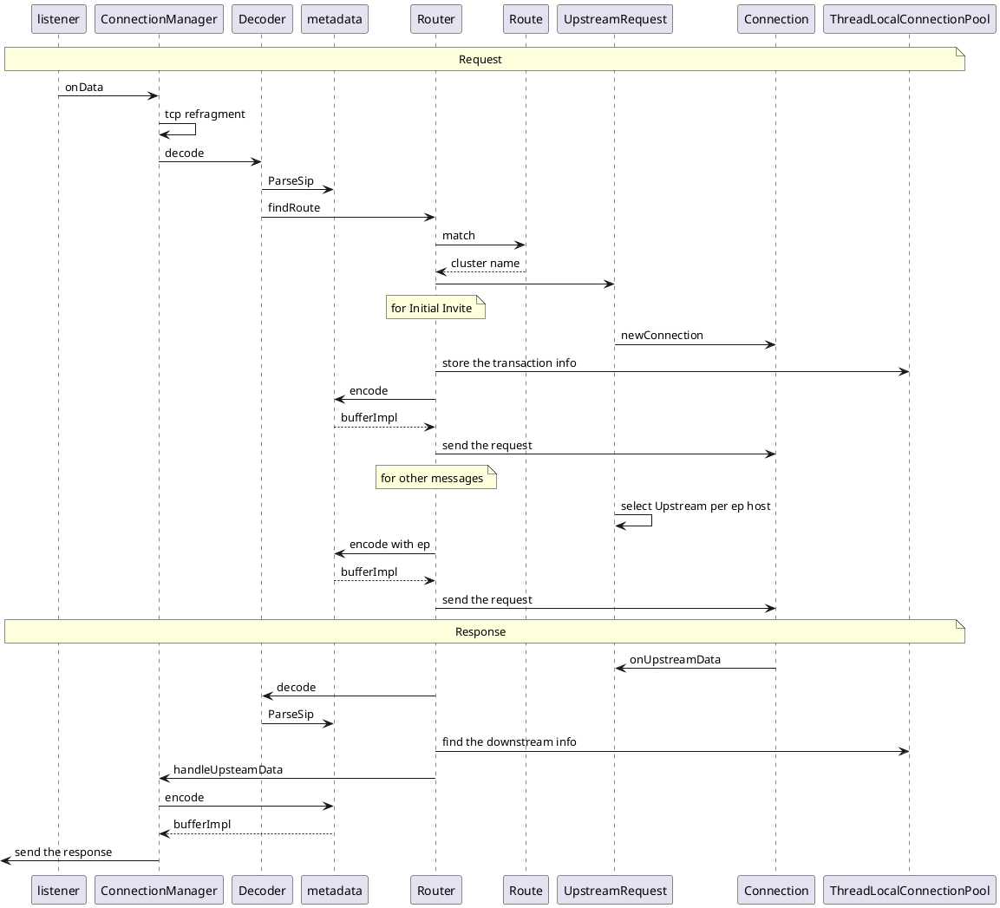
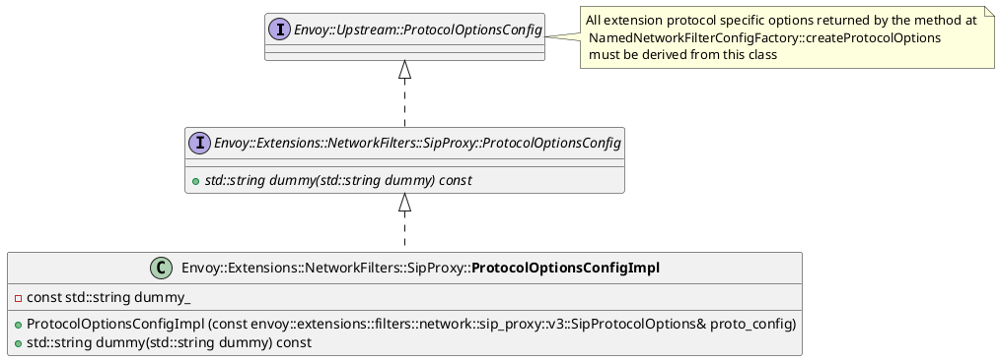
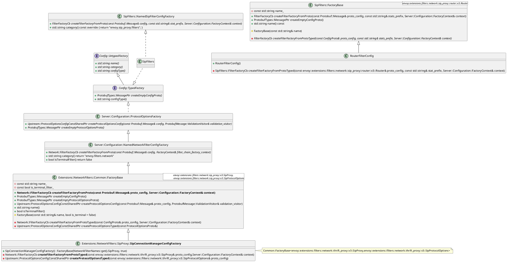
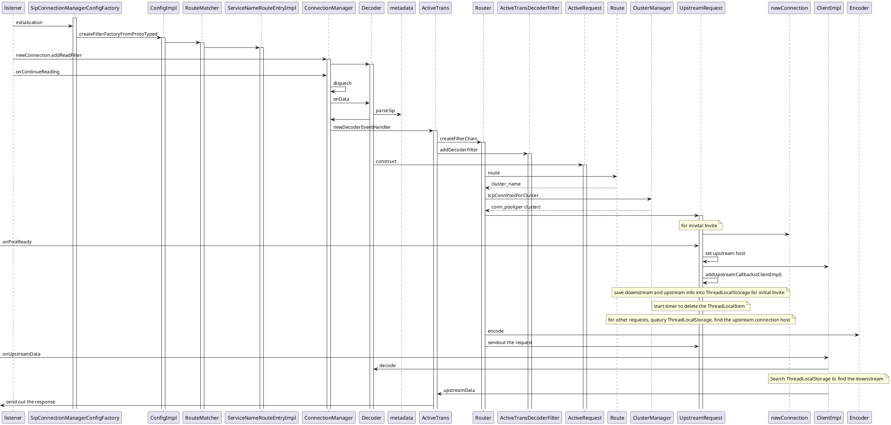
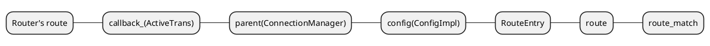
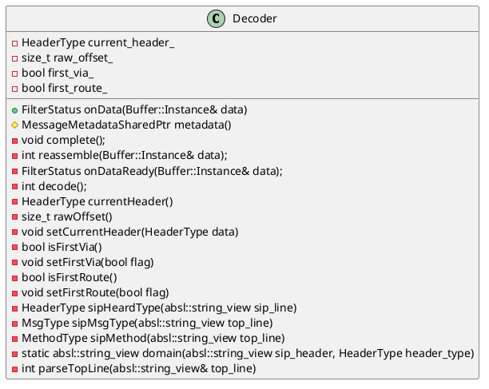

# Envoy Sip Proxy Extension

## Overview
This document aims to propose a high level design for supporting SIP within the Envoy Proxy.

### Use-Cases

1. sip application sidecar
2. sip ingress/egress gateway

## DataFlow



## Configuration
### api/envoy/extensions/filters/network/sip_proxy/v3/sip_proxy.proto
```protobuf
message SipProxy {
  message SipSettings {
    // |---------|-------------------------|----------|------------------------------------------------------------------------------|
    // | Timer   | Default value           | Section  | Meaning                                                                      |
    // |---------|-------------------------|----------|------------------------------------------------------------------------------|
    // | T1      | 500 ms                  | 17.1.1.1 | Round-trip time (RTT) estimate                                               |
    // | T2      | 4 sec                   | 17.1.2.2 | Maximum re-transmission interval for non-INVITE requests and INVITE responses|
    // | T4      | 5 sec                   | 17.1.2.2 | Maximum duration that a message can remain in the network                    |
    // | Timer A | initially T1            | 17.1.1.2 | INVITE request re-transmission interval, for UDP only                        |
    // | Timer B | 64*T1                   | 17.1.1.2 | INVITE transaction timeout timer                                             |
    // | Timer D | > 32 sec. for UDP       | 17.1.1.2 | Wait time for response re-transmissions                                      |
    // |         | 0 sec. for TCP and SCTP |          |                                                                              |
    // | Timer E | initially T1            | 17.1.2.2 | Non-INVITE request re-transmission interval, UDP only                        |
    // | Timer F | 64*T1                   | 17.1.2.2 | Non-INVITE transaction timeout timer                                         |
    // | Timer G | initially T1            | 17.2.1   | INVITE response re-transmission interval                                     |
    // | Timer H | 64*T1                   | 17.2.1   | Wait time for ACK receipt                                                    |
    // | Timer I | T4 for UDP              | 17.2.1   | Wait time for ACK re-transmissions                                           |
    // |         | 0 sec. for TCP and SCTP |          |                                                                              |
    // | Timer J | 64*T1 for UDP           | 17.2.2   | Wait time for re-transmissions of non-INVITE requests                        |
    // |         | 0 sec. for TCP and SCTP |          |                                                                              |
    // | Timer K | T4 for UDP              | 17.1.2.2 | Wait time for response re-transmissions                                      |
    // |         | 0 sec. for TCP and SCTP |          |                                                                              |
    // |---------|-------------------------|----------|------------------------------------------------------------------------------|
    //
    // transaction timeout timer [Timer B] unit is milliseconds, default value 64*T1.
    google.protobuf.Duration transaction_timeout = 1;
  }

  // The human readable prefix to use when emitting statistics.
  string stat_prefix = 1 [(validate.rules).string = {min_len: 1}];

  // The route table for the connection manager is static and is specified in this property.
  RouteConfiguration route_config = 2;

  // A list of individual Sip filters that make up the filter chain for requests made to the
  // Sip proxy. Order matters as the filters are processed sequentially. For backwards
  // compatibility, if no sip_filters are specified, a default Sip router filter
  // (`envoy.filters.sip.router`) is used.
  repeated SipFilter sip_filters = 3;

  SipSettings settings = 4;
}

// SipFilter configures a Sip filter.
message SipFilter {
  // The name of the filter to instantiate. The name must match a supported
  // filter. The built-in filters are:
  //
  // [#comment:TODO(zuercher): Auto generate the following list]
  // * :ref:`envoy.filters.sip.router <config_sip_filters_router>`
  // * :ref:`envoy.filters.sip.rate_limit <config_sip_filters_rate_limit>`
  string name = 1 [(validate.rules).string = {min_len: 1}];

  // Filter specific configuration which depends on the filter being instantiated. See the supported
  // filters for further documentation.
  oneof config_type {
    google.protobuf.Any typed_config = 3;
  }
}

// SipProtocolOptions specifies Sip upstream protocol options. This object is used in
// in
// :ref:`typed_extension_protocol_options<envoy_api_field_config.cluster.v3.Cluster.typed_extension_protocol_options>`,
// keyed by the name `envoy.filters.network.sip_proxy`.
message SipProtocolOptions {
  bool session_affinity = 1;

  bool registration_affinity = 2;
}
```

### api/envoy/extensions/filters/network/sip_proxy/v3/route.proto
```protobuf
// [#protodoc-title: Sip Proxy Route Configuration]
// Sip Proxy :ref:`configuration overview <config_network_filters_sip_proxy>`.

message RouteConfiguration {
  // The name of the route configuration. Reserved for future use in asynchronous route discovery.
  string name = 1;

  // The list of routes that will be matched, in order, against incoming requests. The first route
  // that matches will be used.
  repeated Route routes = 2;
}

message Route {
  // Route matching parameters.
  RouteMatch match = 1 [(validate.rules).message = {required: true}];

  // Route request to some upstream cluster.
  RouteAction route = 2 [(validate.rules).message = {required: true}];
}

message RouteMatch {
  oneof match_specifier {
    option (validate.required) = true;
    // If specified, the route must have the service name as the request method name prefix. As a
    // special case, an empty string matches any service name. Only relevant when service
    // multiplexing.
    string service_name = 2;
  }

  // Inverts whatever matching is done in the :ref:`method_name
  // <envoy_api_field_extensions.filters.network.sip_proxy.v3.RouteMatch.method_name>` or
  // :ref:`service_name
  // <envoy_api_field_extensions.filters.network.sip_proxy.v3.RouteMatch.service_name>` fields.
  // Cannot be combined with wildcard matching as that would result in routes never being matched.
  //
  // .. note::
  //
  //   This does not invert matching done as part of the :ref:`headers field
  //   <envoy_api_field_extensions.filters.network.sip_proxy.v3.RouteMatch.headers>` field. To
  //   invert header matching, see :ref:`invert_match
  //   <envoy_api_field_config.route.v3.HeaderMatcher.invert_match>`.
  bool invert = 3;

  // Specifies a set of headers that the route should match on. The router will check the request’s
  // headers against all the specified headers in the route config. A match will happen if all the
  // headers in the route are present in the request with the same values (or based on presence if
  // the value field is not in the config). Note that this only applies for Sip transports and/or
  // protocols that support headers.
  repeated config.route.v3.HeaderMatcher headers = 4;
}

// [#next-free-field: 7]
message RouteAction {
//  option (udpa.annotations.versioning).previous_message_type =
//      "envoy.config.filter.network.sip_proxy.v2alpha1.RouteAction";

  oneof cluster_specifier {
    option (validate.required) = true;

    // Indicates a single upstream cluster to which the request should be routed
    // to.
    string cluster = 1 [(validate.rules).string = {min_len: 1}];

    // Multiple upstream clusters can be specified for a given route. The
    // request is routed to one of the upstream clusters based on weights
    // assigned to each cluster.
    WeightedCluster weighted_clusters = 2;

    // Envoy will determine the cluster to route to by reading the value of the
    // Sip header named by cluster_header from the request headers. If the
    // header is not found or the referenced cluster does not exist Envoy will
    // respond with an unknown method exception or an internal error exception,
    // respectively.
    string cluster_header = 6
        [(validate.rules).string = {min_len: 1 well_known_regex: HTTP_HEADER_VALUE strict: false}];
  }

  // Optional endpoint metadata match criteria used by the subset load balancer. Only endpoints in
  // the upstream cluster with metadata matching what is set in this field will be considered.
  // Note that this will be merged with what's provided in :ref:`WeightedCluster.metadata_match
  // <envoy_api_field_extensions.filters.network.sip_proxy.v3.WeightedCluster.ClusterWeight.metadata_match>`,
  // with values there taking precedence. Keys and values should be provided under the "envoy.lb"
  // metadata key.
  config.core.v3.Metadata metadata_match = 3;

  // Specifies a set of rate limit configurations that could be applied to the route.
  // N.B. Sip service or method name matching can be achieved by specifying a RequestHeaders
  // action with the header name ":method-name".
  repeated config.route.v3.RateLimit rate_limits = 4;

  // Strip the service prefix from the method name, if there's a prefix. For
  // example, the method call Service:method would end up being just method.
  bool strip_service_name = 5;
}

// Allows for specification of multiple upstream clusters along with weights that indicate the
// percentage of traffic to be forwarded to each cluster. The router selects an upstream cluster
// based on these weights.
message WeightedCluster {
//  option (udpa.annotations.versioning).previous_message_type =
//      "envoy.config.filter.network.sip_proxy.v2alpha1.WeightedCluster";

  message ClusterWeight {
//    option (udpa.annotations.versioning).previous_message_type =
//        "envoy.config.filter.network.sip_proxy.v2alpha1.WeightedCluster.ClusterWeight";

    // Name of the upstream cluster.
    string name = 1 [(validate.rules).string = {min_len: 1}];

    // When a request matches the route, the choice of an upstream cluster is determined by its
    // weight. The sum of weights across all entries in the clusters array determines the total
    // weight.
    google.protobuf.UInt32Value weight = 2 [(validate.rules).uint32 = {gte: 1}];

    // Optional endpoint metadata match criteria used by the subset load balancer. Only endpoints in
    // the upstream cluster with metadata matching what is set in this field, combined with what's
    // provided in :ref:`RouteAction's metadata_match
    // <envoy_api_field_extensions.filters.network.sip_proxy.v3.RouteAction.metadata_match>`,
    // will be considered. Values here will take precedence. Keys and values should be provided
    // under the "envoy.lb" metadata key.
    config.core.v3.Metadata metadata_match = 3;
  }

  // Specifies one or more upstream clusters associated with the route.
  repeated ClusterWeight clusters = 1 [(validate.rules).repeated = {min_items: 1}];
}
```

### Configuration
```yaml
static_resources:
  listeners:
  - name: listener_0
    address:
      socket_address: { address: 11.0.0.1, port_value: 5060 }
    filter_chains:
    - filters:
      - name: envoy.sip_proxy
        typed_config:
           "@type": type.googleapis.com/envoy.extensions.filters.network.sip_proxy.v3.SipProxy
           stat_prefix: egress_sip
           route_config:
             routes:
             - match:
                domain: "tafe.default.svc.nokia.local"
               route:
                cluster: egress_sip1
             - match:
                domain: "scfe.default.svc.nokia.local"
               route:
                cluster: egress_sip2
#           sip_filters:
#             - name: envoy.filters.sip_proxy.affinity
#               typed_config:
#                 "@type": type.googleapis.com/envoy.extensions.filters.network.sip_proxy.filters.affinity.v3.AffinityConfiguration
#                 affinities:
#                 - match:
#                     domain: "tafe.default.svc.nokia.local"
#                   affinity:
#                     session_affinity: false
#                     registration_affinity: true
#                 - match:
#                     domain: "scfe.default.svc.nokia.local"
#                   affinity:
#                     session_affinity: false
#                     registration_affinity: true
#                     #                     customized_affinity:
#                     #                       cache: xx
#                     #                       cookie_name: xxxx
#                     #                    lba_service:
#                     #                      grpc_service:
#                     #                        envoy_grpc:
#                     #                          cluster_name: lba_service
#                     #                      transport_api_version: V3
#             - name: envoy.filters.sip.router
#               typed_config:
#                 "@type": type.googleapis.com/envoy.extensions.filters.network.sip_proxy.router.v3.Router
           settings:
             transaction_timeout: 32s
             #session_stickness: false
             #             tra_service_config:
             #               grpc_service:
             #                 envoy_grpc:
             #                   cluster_name: tra_service
             #               transport_api_version: V3

  clusters:
  - name: egress_sip1
    type: strict_dns
    connect_timeout: 2s
    lb_policy: ROUND_ROBIN
    dns_refresh_rate: 5s
    typed_extension_protocol_options:
      envoy.filters.network.sip_proxy:
        "@type": type.googleapis.com/envoy.extensions.filters.network.sip_proxy.v3.SipProtocolOptions
        session_affinity: true
        registration_affinity: true
    load_assignment:
      cluster_name: egress_sip
      endpoints:
      - lb_endpoints:
        - endpoint:
            address:
              socket_address:
                address: 12.0.0.1
                port_value: 5060
                protocol: TCP
        - endpoint:
            address:
              socket_address:
                address: 13.0.0.1
                port_value: 5060
                protocol: TCP
                #          load_balancing_weight: 1
                #      - lb_endpoints:
                #        - endpoint:
                #            address:
                #              socket_address:
                #                address: 13.0.0.1
                #                port_value: 5060
                #                protocol: TCP
                #          load_balancing_weight: 99

  - name: egress_sip2
    type: strict_dns
    connect_timeout: 2s
    lb_policy: ROUND_ROBIN
    dns_refresh_rate: 5s
    typed_extension_protocol_options:
      envoy.filters.network.sip_proxy:
        "@type": type.googleapis.com/envoy.extensions.filters.network.sip_proxy.v3.SipProtocolOptions
        session_affinity: true
        registration_affinity: true
    load_assignment:
      cluster_name: egress_sip
      endpoints:
      - lb_endpoints:
        - endpoint:
            address:
              socket_address:
                address: 13.0.0.1
                port_value: 5060
                protocol: TCP
          load_balancing_weight: 100
  - name: tra_service
    type: strict_dns
    connect_timeout: 2s
    lb_policy: ROUND_ROBIN
    http2_protocol_options: {} # enable H2 protocol
    dns_refresh_rate: 5s
    load_assignment:
      cluster_name: tra_service
      endpoints:
      - lb_endpoints:
        - endpoint:
            address:
              socket_address:
                address: 127.0.0.1
                port_value: 50053
                protocol: TCP
admin:
  access_log_path: /dev/null
  address:
    socket_address: { address: 11.0.0.1, port_value: 9657 }
```

## class diagram

### ProtocolOptionsConfigImpl



### ConfigImpl

```plantuml
@startuml
interface Envoy::Extensions::NetworkFilters::SipProxy::Config {
  + {abstract} SipFilters::FilterChainFactory& filterFactory()
  + {abstract} SipFilterStats& stats()
  + {abstract} Router::Config& routerConfig()
}
note right: Config is a configuration interface for ConnectionManager.

interface Envoy::Extensions::NetworkFilters::SipProxy::Router::Config {
    + {abstract} std::shared_ptr<const Route> route(const MessageMetadata& metadata, uint64_t random_value) const
}

interface Envoy::Extensions::NetworkFilters::SipProxy::SipFilters::FilterChainFactory {
    + {abstract} void createFilterChain(FilterChainFactoryCallbacks& callbacks)
}

class Envoy::Extensions::NetworkFilters::SipProxy::ConfigImpl {
    + ConfigImpl(const envoy::extensions::filters::network::sip_proxy::v3::SipProxy& config, Server::Configuration::FactoryContext& context);
    + void createFilterChain(SipFilters::FilterChainFactoryCallbacks& callbacks)
    + Router::RouteConstSharedPtr route(const MessageMetadata& metadata,uint64_t random_value)

    + SipFilterStats& stats() override { return stats_; }
    + SipFilters::FilterChainFactory& filterFactory() override { return *this; }
    + Router::Config& routerConfig() override { return *this; }

    - void processFilter(const envoy::extensions::filters::network::sip_proxy::v3::SipFilter& proto_config);
    - Server::Configuration::FactoryContext& context_
    - const std::string stats_prefix_
    - SipFilterStats stats_
    - std::unique_ptr<Router::RouteMatcher> route_matcher_
    - std::list<SipFilters::FilterFactoryCb> filter_factories_
}

Envoy::Extensions::NetworkFilters::SipProxy::Config <|.. Envoy::Extensions::NetworkFilters::SipProxy::ConfigImpl
Envoy::Extensions::NetworkFilters::SipProxy::Router::Config <|.. Envoy::Extensions::NetworkFilters::SipProxy::ConfigImpl
Envoy::Extensions::NetworkFilters::SipProxy::SipFilters::FilterChainFactory <|..Envoy::Extensions::NetworkFilters::SipProxy::ConfigImpl


Router::RouteMatcher <-down-* Envoy::Extensions::NetworkFilters::SipProxy::ConfigImpl

class Router::RouteMatcher {
  + RouteMatcher(const envoy::extensions::filters::network::sip_proxy::v3::RouteConfiguration&);
  + RouteConstSharedPtr route(const MessageMetadata& metadata, uint64_t random_value) const;

  - std::vector<RouteEntryImplBaseConstSharedPtr> routes_;
}

Router::RouteMatcher "1" *-right-> "many" RouteEntryImplBase


interface RouteEntry {
  + {abstract} const std::string& clusterName() const
  + {abstract} const Envoy::Router::MetadataMatchCriteria* metadataMatchCriteria() const
  + {abstract} const RateLimitPolicy& rateLimitPolicy() const
  + {abstract} virtual bool stripServiceName() const
  + {abstract} const Http::LowerCaseString& clusterHeader() const
}

interface Route {
  + {abstract} const RouteEntry* routeEntry() const
}

RouteEntry <|.. RouteEntryImplBase
Route <|.. RouteEntryImplBase
class RouteEntryImplBase {
    + const std::string& clusterName()
    + const Envoy::Router::MetadataMatchCriteria* metadataMatchCriteria() const
    + const RateLimitPolicy& rateLimitPolicy()
    + bool stripServiceName() const
    + const Http::LowerCaseString& clusterHeader() const

    + const RouteEntry* routeEntry() const
    + {abstract} RouteConstSharedPtr matches(const MessageMetadata& metadata,uint64_t random_value)

    # RouteConstSharedPtr clusterEntry(uint64_t random_value, const MessageMetadata& metadata) const
    # bool headersMatch(const Http::HeaderMap& headers) const

    - const std::string cluster_name_;
    - const std::vector<Http::HeaderUtility::HeaderDataPtr> config_headers_;
    - std::vector<WeightedClusterEntrySharedPtr> weighted_clusters_;
    - uint64_t total_cluster_weight_;
    - Envoy::Router::MetadataMatchCriteriaConstPtr metadata_match_criteria_;
    - const RateLimitPolicyImpl rate_limit_policy_;
    - const bool strip_service_name_;
    - const Http::LowerCaseString cluster_header_
}
WeightedClusterEntry "many" <--* "1" RouteEntryImplBase : clusterEntry
DynamicRouteEntry "1" <--* "1" RouteEntryImplBase : clusterEntry

RouteEntry <|.. WeightedClusterEntry
Route <|.. WeightedClusterEntry
class WeightedClusterEntry {
    + WeightedClusterEntry(const RouteEntryImplBase& parent, const envoy::extensions::filters::network::sip_proxy::v3::WeightedCluster::ClusterWeight& cluster);
    + uint64_t clusterWeight() const { return cluster_weight_; }
    + const std::string& clusterName() const override { return cluster_name_; }
    + const Envoy::Router::MetadataMatchCriteria* metadataMatchCriteria() const

    + const RateLimitPolicy& rateLimitPolicy() const 
    + bool stripServiceName() const
    + const Http::LowerCaseString& clusterHeader() const
    + const RouteEntry* routeEntry() const override { return this; }

    - const RouteEntryImplBase& parent_
    - const std::string cluster_name_
    - const uint64_t cluster_weight_
    - Envoy::Router::MetadataMatchCriteriaConstPtr metadata_match_criteria_
}

RouteEntryImplBase <|.. MethodNameRouteEntryImpl
class MethodNameRouteEntryImpl {
   + MethodNameRouteEntryImpl(const envoy::extensions::filters::network::sip_proxy::v3::Route& route)
   + RouteConstSharedPtr matches(const MessageMetadata& metadata, uint64_t random_value) const

   - const std::string method_name_
   - const bool invert_
}

RouteEntryImplBase <|.. ServiceNameRouteEntryImpl
class ServiceNameRouteEntryImpl {
  + ServiceNameRouteEntryImpl(const envoy::extensions::filters::network::sip_proxy::v3::Route& route)
  + RouteConstSharedPtr matches(const MessageMetadata& metadata, uint64_t random_value) const

  - std::string service_name_;
  - const bool invert_;
}

RouteEntry <|.. DynamicRouteEntry
Route <|.. DynamicRouteEntry
class DynamicRouteEntry {
    + DynamicRouteEntry(const RouteEntryImplBase& parent, absl::string_view cluster_name)
    + const std::string& clusterName() const override { return cluster_name_; }
    + const Envoy::Router::MetadataMatchCriteria* metadataMatchCriteria() const

    + const RateLimitPolicy& rateLimitPolicy() const 
    + bool stripServiceName() const
    + const Http::LowerCaseString& clusterHeader() const
    + const RouteEntry* routeEntry() const override { return this; }

    - const RouteEntryImplBase& parent_
    - const std::string cluster_name_
}
@enduml
```





### Router

```plantuml
@startuml
' Router
interface Network::ConnectionCallbacks {
  + {abstract} void onEvent(ConnectionEvent event)
  + {abstract} void onAboveWriteBufferHighWatermark()
  + {abstract} void onBelowWriteBufferLowWatermark()
}

interface Tcp::ConnectionPool::UpstreamCallbacks {
  + {abstract} void onUpstreamData(Buffer::Instance& data, bool end_stream)
}

class Upstream::LoadBalancerContextBase {
  + absl::optional<uint64_t> computeHashKey()
  + const Network::Connection* downstreamConnection() const
  + const Router::MetadataMatchCriteria* metadataMatchCriteria()
  + const Http::RequestHeaderMap* downstreamHeaders() const
  + const HealthyAndDegradedLoad& determinePriorityLoad(const PrioritySet&, const HealthyAndDegradedLoad& original_priority_load, const Upstream::RetryPriority::PriorityMappingFunc&)
  + bool shouldSelectAnotherHost(const Host&)
  + uint32_t hostSelectionRetryCount() const
  + Network::Socket::OptionsSharedPtr upstreamSocketOptions() const
  + Network::TransportSocketOptionsSharedPtr upstreamTransportSocketOptions() const
}

Network::ConnectionCallbacks <|-- Tcp::ConnectionPool::UpstreamCallbacks
Tcp::ConnectionPool::UpstreamCallbacks <|.. Router::Router
Upstream::LoadBalancerContextBase <|.. Router::Router
ProtocolConverter <|.. Router::Router
SipFilters::DecoderFilter <|.. Router::Router

interface SipFilters::DecoderFilter {
  + {abstract} void onDestroy()
  + {abstract} void setDecoderFilterCallbacks(DecoderFilterCallbacks& callbacks)
}

class Router::Router {
  + Router(Upstream::ClusterManager& cluster_manager, const std::string& stat_prefix, Stats::Scope& scope)
  + void onDestroy()
  + void setDecoderFilterCallbacks(SipFilters::DecoderFilterCallbacks& callbacks)

  + ProtocolConverter(functions)

  + const Network::Connection* downstreamConnection() const
  + const Envoy::Router::MetadataMatchCriteria* metadataMatchCriteria()

  + void onUpstreamData(Buffer::Instance& data, bool end_stream)
  + void onEvent(Network::ConnectionEvent event)
  + void onAboveWriteBufferHighWatermark()
  + void onBelowWriteBufferLowWatermark()

  - void convertMessageBegin(MessageMetadataSharedPtr metadata)
  - void cleanup()
  - RouterStats generateStats(const std::string& prefix, Stats::Scope& scope)

  - Upstream::ClusterManager& cluster_manager_
  - RouterStats stats_

  - SipFilters::DecoderFilterCallbacks* callbacks_{}
  - RouteConstSharedPtr route_{}
  - const RouteEntry* route_entry_{}
  - Upstream::ClusterInfoConstSharedPtr cluster_

  - std::unique_ptr<UpstreamRequest> upstream_request_
  - Buffer::OwnedImpl upstream_request_buffer_
}

Router::Router *--> Router::UpstreamRequest


interface Tcp::ConnectionPool::Callbacks {
  + {abstract} void onPoolFailure(PoolFailureReason reason, Upstream::HostDescriptionConstSharedPtr host)

  + {abstract} void onPoolReady(ConnectionDataPtr&& conn, Upstream::HostDescriptionConstSharedPtr host)
}

Tcp::ConnectionPool::Callbacks <|.. Router::UpstreamRequest

class Router::UpstreamRequest {
    + UpstreamRequest(Router& parent, Tcp::ConnectionPool::Instance& pool, MessageMetadataSharedPtr& metadata, TransportType transport_type, ProtocolType protocol_type)

    + FilterStatus start()
    + void resetStream()
    + void releaseConnection(bool close);

    + void onPoolFailure(ConnectionPool::PoolFailureReason reason, Upstream::HostDescriptionConstSharedPtr host)
    + void onPoolReady(Tcp::ConnectionPool::ConnectionDataPtr&& conn, Upstream::HostDescriptionConstSharedPtr host)

    + void onRequestStart(bool continue_decoding)
    + void onRequestComplete()
    + void onResponseComplete()
    + void onUpstreamHostSelected(Upstream::HostDescriptionConstSharedPtr host)
    + void onResetStream(ConnectionPool::PoolFailureReason reason)

    + Router& parent_
    + Tcp::ConnectionPool::Instance& conn_pool_
    + MessageMetadataSharedPtr metadata_

    + Tcp::ConnectionPool::Cancellable* conn_pool_handle_
    + Tcp::ConnectionPool::ConnectionDataPtr conn_data_
    + Upstream::HostDescriptionConstSharedPtr upstream_host_
    + SipConnectionState* conn_state_
    + TransportPtr transport_
    + ProtocolPtr protocol_
    + SipObjectPtr upgrade_response_

    + bool request_complete_ : 1
    + bool response_started_ : 1
    + bool response_complete_ : 1
}
@enduml
```




### ConnectionManager

```plantuml
@startuml
' ConnectionManager
interface Network::ReadFilter {
        + {abstract} FilterStatus onData(Buffer::Instance& data, bool end_stream)
        + {abstract} FilterStatus onNewConnection()
        + {abstract} void initializeReadFilterCallbacks(ReadFilterCallbacks& callbacks)
}

interface Network::ConnectionCallbacks {
        + {abstract} void onEvent(ConnectionEvent event)
        + {abstract} void onAboveWriteBufferHighWatermark()
        + {abstract} void onBelowWriteBufferLowWatermark()
}

interface DecoderCallbacks {
        + {abstract} DecoderEventHandler& newDecoderEventHandler()
}

Extensions::NetworkFilters::SipProxy::ConnectionManager *-> Decoder

class Extensions::NetworkFilters::SipProxy::ConnectionManager {
  + ConnectionManager(Config& config, Random::RandomGenerator& random_generator,TimeSource& time_system);
  + Network::FilterStatus onData(Buffer::Instance& data, bool end_stream)
  + Network::FilterStatus onNewConnection()
  + void initializeReadFilterCallbacks(ReadFilterCallbacks& callbacks)

  + void onEvent(ConnectionEvent event)
  + void onAboveWriteBufferHighWatermark()
  + void onBelowWriteBufferLowWatermark()

  + DecoderEventHandler& newDecoderEventHandler()

  - void continueDecoding();
  - void dispatch();
  - void sendLocalReply(MessageMetadata& metadata, const DirectResponse& response, bool end_stream);
  - void doDeferredRpcDestroy(ActiveTrans& rpc);
  - void resetAllRpcs(bool local_reset);

  - Config& config_;
  - SipFilterStats& stats_;

  - Network::ReadFilterCallbacks* read_callbacks_{};

  - DecoderPtr decoder_;
  - std::list<ActiveTransPtr> rpcs_;
  - Buffer::OwnedImpl request_buffer_;
  - Random::RandomGenerator& random_generator_;
  - bool stopped_{false};
  - bool half_closed_{false};
  - TimeSource& time_source_
}

interface ProtocolConverter {}

class ResponseDecoder {
    + ResponseDecoder(ActiveTrans& parent, Transport& transport, Protocol& protocol)
    + bool onData(Buffer::Instance& data)
    + DecoderEventHandler& newDecoderEventHandler() override { return *this; }

    - ActiveTrans& parent_;
    - DecoderPtr decoder_;
    - Buffer::OwnedImpl upstream_buffer_;
    - MessageMetadataSharedPtr metadata_;
    - absl::optional<bool> success_;
    - bool complete_ : 1;
    - bool first_reply_field_ : 1;
}
DecoderCallbacks <|.. ResponseDecoder
ProtocolConverter <|.. ResponseDecoder
ResponseDecoder *-> Decoder


interface SipFilters::DecoderFilterCallbacks {
  + {abstract} uint64_t streamId() const
  + {abstract} const Network::Connection* connection() const
  + {abstract} void continueDecoding()
  + {abstract} Router::RouteConstSharedPtr route()
  + {abstract} void sendLocalReply(const SipProxy::DirectResponse& response, bool end_stream)
  + {abstract} void startUpstreamResponse(Transport& transport, Protocol& protocol)
  + {abstract} ResponseStatus upstreamData(Buffer::Instance& data)
  + {abstract} void resetDownstreamConnection()
  + {abstract} StreamInfo::StreamInfo& streamInfo()
}

SipFilters::DecoderFilterCallbacks <|.. ActiveTransDecoderFilter 
class ActiveTransDecoderFilter {
    + ActiveTransDecoderFilter(ActiveTrans& parent, SipFilters::DecoderFilterSharedPtr filter)

    + uint64_t streamId() const
    + const Network::Connection* connection()
    + void continueDecoding()
    + Router::RouteConstSharedPtr route()
    + void sendLocalReply(const DirectResponse& response, bool end_stream)
    + void startUpstreamResponse(Transport& transport, Protocol& protocol)
    + SipFilters::ResponseStatus upstreamData(Buffer::Instance& buffer)
    + void resetDownstreamConnection()
    + StreamInfo::StreamInfo& streamInfo()

    + ActiveTrans& parent_;
    + SipFilters::DecoderFilterSharedPtr handle_
}

interface DeferredDeletable {}

interface DecoderEventHandler {}

interface SipFilters::FilterChainFactoryCallbacks {
  + {abstract} void addDecoderFilter(DecoderFilterSharedPtr filter)
}

DeferredDeletable  <|.. ActiveTrans 
DecoderEventHandler <|.. ActiveTrans
SipFilters::DecoderFilterCallbacks <|.. ActiveTrans
SipFilters::FilterChainFactoryCallbacks <|.. ActiveTrans

ActiveTrans "1" *--> "many" ActiveTransDecoderFilter
ActiveTrans *--> ResponseDecoder
ActiveTrans o--> Route

class ActiveTrans {
    + ActiveTrans(ConnectionManager& parent)

    + DecoderEventHandler(functions)

    + uint64_t streamId() const
    + const Network::Connection* connection()
    + void continueDecoding()
    + Router::RouteConstSharedPtr route()
    + void sendLocalReply(const DirectResponse& response, bool end_stream)
    + void startUpstreamResponse(Transport& transport, Protocol& protocol)
    + SipFilters::ResponseStatus upstreamData(Buffer::Instance& buffer)
    + void resetDownstreamConnection()
    + StreamInfo::StreamInfo& streamInfo()

    + void **addDecoderFilter**(SipFilters::DecoderFilterSharedPtr filter)

    + FilterStatus applyDecoderFilters(ActiveTransDecoderFilter* filter)
    + void finalizeRequest();

    + void **createFilterChain**();
    + void onReset()
    + void onError(const std::string& what)

    + ConnectionManager& parent_
    + Stats::TimespanPtr request_timer_
    + uint64_t stream_id_
    + StreamInfo::StreamInfoImpl stream_info_
    + MessageMetadataSharedPtr metadata_
    + std::list<ActiveTransDecoderFilterPtr> decoder_filters_
    + DecoderEventHandlerSharedPtr upgrade_handler_
    + ResponseDecoderPtr response_decoder_
    + absl::optional<Router::RouteConstSharedPtr> cached_route_
    + Buffer::OwnedImpl response_buffer_
    + int32_t original_sequence_id_{0}
    + MessageType original_msg_type_{MessageType::Call}
    + std::function<FilterStatus(DecoderEventHandler*)> filter_action_
    + absl::any filter_context_
    + bool local_response_sent_ : 1
    + bool pending_transport_end_ : 1
}

Network::ReadFilter <|.. Extensions::NetworkFilters::SipProxy::ConnectionManager
Network::ConnectionCallbacks <|.. Extensions::NetworkFilters::SipProxy::ConnectionManager
DecoderCallbacks <|..  Extensions::NetworkFilters::SipProxy::ConnectionManager

'Decoder

class ActiveRequest {
    + ActiveRequest(DecoderEventHandler& handler) : handler_(handler) {}

    - DecoderEventHandler& handler_;
}

class Decoder {
  + Decoder(Transport& transport, Protocol& protocol, DecoderCallbacks& callbacks)
  + FilterStatus onData(Buffer::Instance& data, bool& buffer_underflow)

  - void complete();

  - DecoderCallbacks& callbacks_;
  - ActiveRequestPtr request_;
  - MessageMetadataSharedPtr metadata_;
  - DecoderStateMachinePtr state_machine_;
  - bool frame_started_{false};
  - bool frame_ended_{false};
}

Decoder *--> ActiveRequest
@enduml
```






### Decoder

```plantuml
@startuml
class HeaderHandler {
    + int processVia(absl::string_view& header)
    + int processPath(absl::string_view& header)
    + int processEvent(absl::string_view& header)
    + int processRoute(absl::string_view& header)
    + int processContact(absl::string_view& header)
    + int processCseq(absl::string_view& header)
    + int processRecordRoute(absl::string_view& header)
    + MessageMetadataSharedPtr metadata()
    + HeaderType currentHeader()
    + size_t rawOffset()
    + bool isFirstVia()
    + bool isFirstRoute()
    + void setFirstVia(bool flag)
    + void setFirstRoute(bool flag)
    + MessageHandler& parent_;
    + HeaderProcessor header_processors_;
}

interface MessageHandler {
    + MessageHandler(std::shared_ptr<HeaderHandler> handler, Decoder& parent)
    + ~MessageHandler()
    + void parseHeader(HeaderType& type, absl::string_view& header)
    + MessageMetadataSharedPtr metadata()
    + HeaderType currentHeader()
    + size_t rawOffset()
    + bool isFirstVia()
    + bool isFirstRoute()
    + void setFirstVia(bool flag)
    + void setFirstRoute(bool flag)

    + std::shared_ptr<HeaderHandler> handler_;
    + Decoder& parent_;
}

class REGISTERHeaderHandler {
    + int processVia(absl::string_view& header)
    + int processRoute(absl::string_view& header)
    + int processRecordRoute(absl::string_view& header)
    + int processPath(absl::string_view& header)
}
REGISTERHeaderHandler --|> HeaderHandler

class INVITEHeaderHandler {
    + int processVia(absl::string_view& header)
    + int processRoute(absl::string_view& header)
    + int processRecordRoute(absl::string_view& header)
}
INVITEHeaderHandler --|> HeaderHandler

class OK200HeaderHandler {
    + int processCseq(absl::string_view& header)
    + int processRecordRoute(absl::string_view& header)
    + int processContact(absl::string_view& header)
}
OK200HeaderHandler --|> HeaderHandler

class GeneralHeaderHandler {
    + int processRoute(absl::string_view& header)
    + int processVia(absl::string_view& header)
    + int processContact(absl::string_view& header)
}
GeneralHeaderHandler --|> HeaderHandler

class SUBSCRIBEHeaderHandler {
    + int processVia(absl::string_view& header)
    + int processRoute(absl::string_view& header)
    + int processRecordRoute(absl::string_view& header)
    + int processContact(absl::string_view& header)
}
SUBSCRIBEHeaderHandler --|> HeaderHandler

class REGISTERHandler {
	+ void parseHeader(HeaderType& type, absl::string_view& header)
}
REGISTERHandler --|> MessageHandler

class INVITEHandler {
	+ void parseHeader(HeaderType& type, absl::string_view& header)
}
INVITEHandler --|> MessageHandler

class OK200Handler {
	+ void parseHeader(HeaderType& type, absl::string_view& header)
}
OK200Handler --|> MessageHandler

class GeneralHandler {
	+ void parseHeader(HeaderType& type, absl::string_view& header)
}
GeneralHandler --|> MessageHandler

class SUBSCRIBEHandler {
	+ void parseHeader(HeaderType& type, absl::string_view& header)
}
SUBSCRIBEHandler --|> MessageHandler

class OthersHandler {
	+ void parseHeader(HeaderType& type, absl::string_view& header)
}
OthersHandler --|> MessageHandler

REGISTERHandler *-- REGISTERHeaderHandler
INVITEHandler *-- INVITEHeaderHandler
OK200Handler *-- OK200HeaderHandler
GeneralHandler *-- GeneralHeaderHandler
SUBSCRIBEHandler *-- SUBSCRIBEHeaderHandler
OthersHandler *-- HeaderHandler
@enduml
```





## ConnectionManager
## Router
## LoadBalancing
## ClusterManager
## Statistics
## Design-Considerations
- The upstream connection shouldn't released per transaction, it shouldn't bind with transaction.
- makeRequest
- makeRequestToHost
- Router should not be constructed by ActiveTrans, Router should match the ActiveTrans by ThreadLocalStorage transaction mapping
- what stored in ThreadLocalStorage:
  - key: transaction_id
  - value: ActiveTrans and upstreamInfo


TODO
1. weighted load balancer, in order to prove external grpc server query is enable;
2. ingress/egress gateway corporate, ingress need to add egress's ip as record-route
3. scale in/scale out
4. contact header analyze should be changed.
