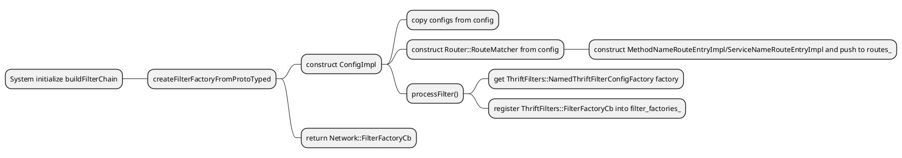
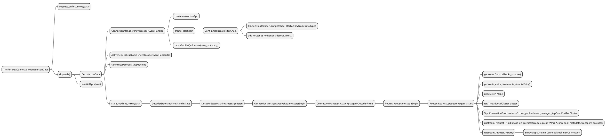

# Envoy Thrift Proxy

## Envoy Thrift Test Environment
Mostly follow `https://thrift.apache.org/tutorial/go`
- download [tutorial.thrift](https://github.com/apache/thrift/blob/master/tutorial/tutorial.thrift) and [shared.thrift](https://github.com/apache/thrift/blob/master/tutorial/shared.thrift)
- `thrift -r --gen go tutorial.thrift`
- `thrift -r --gen go shared.thrift`
- copy `gen-go` folder into client/server
- go mod init thrift-client/thrift-server
- modify tutorial/shared with relevent path
- go build

```plantuml
@startuml
'set namespaceSeparator ::

interface Upstream::ProtocolOptionsConfig {}

interface ThriftProxy::ProtocolOptionsConfig {
	+ TransportType transport(TransportType downstream_transport)
	+ ProtocolType protocol(ProtocolType downstream_protocol)
}

class ThriftProxy::ProtocolOptionsConfigImpl {
	+ ProtocolOptionsConfigImpl(const envoy::extensions::filters::network::thrift_proxy::v3::ThriftProtocolOptions& proto_config)
	- const TransportType transport_
	- const ProtocolType protocol_
}
note right: Upstream Cluster configurations are defined here

Upstream::ProtocolOptionsConfig <|-- ThriftProxy::ProtocolOptionsConfig
ThriftProxy::ProtocolOptionsConfig <|.. ThriftProxy::ProtocolOptionsConfigImpl




' Proxy Filter Factory
interface Config::UntypedFactory {
	+ {abstract} std::string name()
	+ {abstract} std::string category()
	+ {abstract} std::string configType()
}

interface Config::TypedFactory {
	+ {abstract} ProtobufTypes::MessagePtr createEmptyConfigProto()
	+ std::string configType()
}

class Server::Configuration::ProtocolOptionsFactory {
	+ {abstract} Upstream::ProtocolOptionsConfigConstSharedPtr createProtocolOptionsConfig(const Protobuf::Message& config, ProtobufMessage::ValidationVisitor& validation_visitor)
	+ {abstract} ProtobufTypes::MessagePtr createEmptyProtocolOptionsProto()
}

class Server::Configuration::NamedNetworkFilterConfigFactory {
	+ {abstract} Network::FilterFactoryCb createFilterFactoryFromProto(const Protobuf::Message& config, FactoryContext& filter_chain_factory_context)
	+ std::string category() return "envoy.filters.network"
	+ bool isTerminalFilter() return false
}

class Extensions::NetworkFilters::Common::FactoryBase {
	+ <b>Network::FilterFactoryCb createFilterFactoryFromProto(const Protobuf::Message& proto_config, Server::Configuration::FactoryContext& context)</b>
	+ ProtobufTypes::MessagePtr createEmptyConfigProto()
	+ ProtobufTypes::MessagePtr createEmptyProtocolOptionsProto()
	+ Upstream::ProtocolOptionsConfigConstSharedPtr createProtocolOptionsConfig(const Protobuf::Message& proto_config, ProtobufMessage::ValidationVisitor& validation_visitor)
	+ std::string name()
	+ bool isTerminalFilter()
	# FactoryBase(const std::string& name, bool is_terminal = false)

	- Network::FilterFactoryCb createFilterFactoryFromProtoTyped(const ConfigProto& proto_config, Server::Configuration::FactoryContext& context)
	- Upstream::ProtocolOptionsConfigConstSharedPtr createProtocolOptionsTyped(const ProtocolOptionsProto&)
	- const std::string name_
	- const bool is_terminal_filter_
}

class Extensions::NetworkFilters::ThriftProxy::ThriftProxyFilterConfigFactory {
	-  Network::FilterFactoryCb createFilterFactoryFromProtoTyped(const envoy::extensions::filters::network::thrift_proxy::v3::ThriftProxy& proto_config,Server::Configuration::FactoryContext& context)
	-  Upstream::ProtocolOptionsConfigConstSharedPtr createProtocolOptionsTyped(const envoy::extensions::filters::network::thrift_proxy::v3::ThriftProtocolOptions& proto_config)
}
note right: Common::FactoryBase<envoy::extensions::filters::network::thrift_proxy::v3::ThriftProxy,envoy::extensions::filters::network::thrift_proxy::v3::ThriftProtocolOptions>

Config::UntypedFactory <|-- Config::TypedFactory
Config::TypedFactory <|.. Server::Configuration::ProtocolOptionsFactory
Server::Configuration::ProtocolOptionsFactory <|-- Server::Configuration::NamedNetworkFilterConfigFactory
Server::Configuration::NamedNetworkFilterConfigFactory <|-- Extensions::NetworkFilters::Common::FactoryBase
Extensions::NetworkFilters::Common::FactoryBase <|-- Extensions::NetworkFilters::ThriftProxy::ThriftProxyFilterConfigFactory




' Configuration
interface Extensions::NetworkFilters::ThriftProxy::Config {
	+ {abstract} ThriftFilters::FilterChainFactory& filterFactory()
	+ {abstract} ThriftFilterStats& stats()
	+ {abstract} TransportPtr createTransport()
	+ {abstract} ProtocolPtr createProtocol()
	+ {abstract} Router::Config& routerConfig()
}

interface Extensions::NetworkFilters::ThriftProxy::Router::Config {
	+ {abstract} RouteConstSharedPtr route(const MessageMetadata& metadata, uint64_t random_value)
}

interface Extensions::NetworkFilters::ThriftProxy::ThriftFilters::FilterChainFactory {
	+ {abstract} void createFilterChain(FilterChainFactoryCallbacks& callbacks)
}
note left: createFilterChain Called when a new Thrift stream is created on the connection.

class Extensions::NetworkFilters::ThriftProxy::ConfigImpl {
	+ void createFilterChain(ThriftFilters::FilterChainFactoryCallbacks& callbacks)
	+ Router::RouteConstSharedPtr route(const MessageMetadata& metadata, uint64_t random_value)
	+ ThriftFilterStats& stats()
	+ ThriftFilters::FilterChainFactory& filterFactory()
	+ TransportPtr createTransport()
	+ ProtocolPtr createProtocol()
	+ Router::Config& routerConfig()

	- void processFilter(const envoy::extensions::filters::network::thrift_proxy::v3::ThriftFilter& proto_config)

	- Server::Configuration::FactoryContext& context_
	- const std::string stats_prefix_
	- ThriftFilterStats stats_
	- const TransportType transport_
	- const ProtocolType proto_
	- std::unique_ptr<Router::RouteMatcher> route_matcher_
	- std::list<ThriftFilters::FilterFactoryCb> filter_factories_
}

Extensions::NetworkFilters::ThriftProxy::Config <|.. Extensions::NetworkFilters::ThriftProxy::ConfigImpl
Extensions::NetworkFilters::ThriftProxy::Router::Config <|.. Extensions::NetworkFilters::ThriftProxy::ConfigImpl
Extensions::NetworkFilters::ThriftProxy::ThriftFilters::FilterChainFactory <|.. Extensions::NetworkFilters::ThriftProxy::ConfigImpl



' ConnectionManager
interface Network::ReadFilter {
        + {abstract} FilterStatus onData(Buffer::Instance& data, bool end_stream)
        + {abstract} FilterStatus onNewConnection()
        + {abstract} void initializeReadFilterCallbacks(ReadFilterCallbacks& callbacks)
}

interface Network::ConnectionCallbacks {
        + {abstract} void onEvent(ConnectionEvent event)
        + {abstract} void onAboveWriteBufferHighWatermark()
        + {abstract} void onBelowWriteBufferLowWatermark()
}

interface DecoderCallbacks {
        + {abstract} DecoderEventHandler& newDecoderEventHandler()
}

class Extensions::NetworkFilters::ThriftProxy::ConnectionManager {
        + FilterStatus onData(Buffer::Instance& data, bool end_stream)
        + FilterStatus onNewConnection()
        + void initializeReadFilterCallbacks(ReadFilterCallbacks& callbacks)

        + void onEvent(ConnectionEvent event)
        + void onAboveWriteBufferHighWatermark()
        + void onBelowWriteBufferLowWatermark()

        + DecoderEventHandler& newDecoderEventHandler()
}

Network::ReadFilter <|.. Extensions::NetworkFilters::ThriftProxy::ConnectionManager
Network::ConnectionCallbacks <|.. Extensions::NetworkFilters::ThriftProxy::ConnectionManager
DecoderCallbacks <|..  Extensions::NetworkFilters::ThriftProxy::ConnectionManager

class ResponseDecoder {
	+ bool onData(Buffer::Instance& data)

	+ FilterStatus messageBegin(MessageMetadataSharedPtr metadata)
	+ FilterStatus fieldBegin(absl::string_view name, FieldType& field_type, int16_t& field_id)
	+ FilterStatus transportBegin(MessageMetadataSharedPtr metadata)
	+ FilterStatus transportEnd()

	+ DecoderEventHandler& newDecoderEventHandler() override { return *this; }

	+ ActiveRpc& parent_
	+ DecoderPtr decoder_
	+ Buffer::OwnedImpl upstream_buffer_
	+ MessageMetadataSharedPtr metadata_
	+ absl::optional<bool> success_
	+ bool complete_
	+ bool first_reply_field_ 
}

@enduml
```



## Configuration
```
message ThriftProxy {
  TransportType transport = 2 [(validate.rules).enum = {defined_only: true}];
  ProtocolType protocol = 3 [(validate.rules).enum = {defined_only: true}];

  string stat_prefix = 1 [(validate.rules).string = {min_len: 1}];

  RouteConfiguration route_config = 4;

  repeated ThriftFilter thrift_filters = 5;
}

message ThriftFilter {
  string name = 1 [(validate.rules).string = {min_len: 1}];
  oneof config_type {
    google.protobuf.Any typed_config = 3;
  }
}

message ThriftProtocolOptions {
  TransportType transport = 1 [(validate.rules).enum = {defined_only: true}];
  ProtocolType protocol = 2 [(validate.rules).enum = {defined_only: true}];
}
```

## Go through code
ProtocolOptionsConfigImpl

when instantiate `ProtocolOptionsConfigImpl`, it will copy the configuration from protobuf config into `ProtocolOptionsConfigImpl` fields.

### REGISTER_FACTORY
let's begin to analyze the code from `REGISTER_FACTORY(ThriftProxyFilterConfigFactory, Server::Configuration::NamedNetworkFilterConfigFactory)`, the macro defined as:
```c
#define REGISTER_FACTORY(FACTORY, BASE)                                                            \
  ABSL_ATTRIBUTE_UNUSED void forceRegister##FACTORY() {}                                           \
  static Envoy::Registry::RegisterFactory</* NOLINT(fuchsia-statically-constructed-objects) */     \
                                          FACTORY, BASE>                                           \
      FACTORY##_registered
```
the factory `ThriftProxyFilterConfigFactory` is regestered by construct `RegisterFactory`, all is done in constructor.

### createFilterFactoryFromProtoTyped
invoked when system initialize, it will construct `ConfigImpl` and then register `ConnectionManager` as ReadFilter, so in `ConfigImpl`, it converts the configuration from protobuf into `ConfigImpl`'s property. this includes `transport`,`protocol` and `route_matcher`, if no `thrift_filters` defined, a default `envoy.filters.thrift.router` is used. otherwise like `envoy.filters.thrift.rate_limit` can be defined as `thrift_filters` and then invoke `processFilter`

if `ThriftProtocolOptions` is provisioned, `ThriftProxyFilterConfigFactory::createProtocolOptionsTyped` will be invoked:
```
  clusters:
  - name: egress_thrift_1
  ¦ type: static
  ¦ connect_timeout: 2s
  ¦ lb_policy: ROUND_ROBIN
  ¦ dns_refresh_rate: 5s
  ¦ typed_extension_protocol_options:
  ¦ ¦ envoy.filters.network.thrift_proxy:
  ¦ ¦ ¦ "@type": type.googleapis.com/envoy.extensions.filters.network.thrift_proxy.v3.ThriftProtocolOptions
  ¦ ¦ ¦ transport: AUTO_TRANSPORT
  ¦ ¦ ¦ protocol: AUTO_PROTOCOL
```
```
#0  Envoy::Extensions::NetworkFilters::ThriftProxy::ThriftProxyFilterConfigFactory::createProtocolOptionsTyped (this=0x55555d964e58 <Envoy::Extensions::NetworkFilters::ThriftProxy::ThriftProxyFilterConfigFactory_registered>, proto_config=...) at bazel-out/k8-dbg/bin/source/extensions/filters/network/thrift_proxy/_virtual_includes/config/extensions/filters/network/thrift_proxy/config.h:59
#1  0x000055555a8b0cc0 in Envoy::Extensions::NetworkFilters::Common::FactoryBase<envoy::extensions::filters::network::thrift_proxy::v3::ThriftProxy, envoy::extensions::filters::network::thrift_proxy::v3::ThriftProtocolOptions>::createProtocolOptionsConfig (this=0x55555d964e58 <Envoy::Extensions::NetworkFilters::ThriftProxy::ThriftProxyFilterConfigFactory_registered>, proto_config=..., factory_context=...) at bazel-out/k8-dbg/bin/source/extensions/filters/network/common/_virtual_includes/factory_base_lib/extensions/filters/network/common/factory_base.h:40
#2  0x000055555b9d1308 in Envoy::Upstream::(anonymous namespace)::createProtocolOptionsConfig (name=..., typed_config=..., config=..., factory_context=...) at source/common/upstream/upstream_impl.cc:166
#3  0x000055555b9c6e58 in Envoy::Upstream::(anonymous namespace)::parseExtensionProtocolOptions (config=..., factory_context=...) at source/common/upstream/upstream_impl.cc:186
#4  0x000055555b9c453b in Envoy::Upstream::ClusterInfoImpl::ClusterInfoImpl (this=0x2e7e3fb37200, config=..., bind_config=..., runtime=..., socket_matcher=..., stats_scope=..., added_via_api=false, factory_context=...) at source/common/upstream/upstream_impl.cc:704
#5  0x000055555b9e29cd in std::__1::make_unique<Envoy::Upstream::ClusterInfoImpl, envoy::config::cluster::v3::Cluster const&, envoy::config::core::v3::BindConfig const&, Envoy::Runtime::Loader&, std::__1::unique_ptr<Envoy::Upstream::TransportSocketMatcherImpl, std::__1::default_delete<Envoy::Upstream::TransportSocketMatcherImpl> >, std::__1::unique_ptr<Envoy::Stats::Scope, std::__1::default_delete<Envoy::Stats::Scope> >, bool&, Envoy::Server::Configuration::TransportSocketFactoryContextImpl&> (__args=..., __args=..., __args=..., __args=..., __args=..., __args=..., __args=...) at /opt/llvm/bin/../include/c++/v1/memory:3028
#6  0x000055555b9c822e in Envoy::Upstream::ClusterImplBase::ClusterImplBase (this=0x2e7e3fb27420, cluster=..., runtime=..., factory_context=..., stats_scope=..., added_via_api=false) at source/common/upstream/upstream_impl.cc:903
#7  0x000055555ba4a6fc in Envoy::Upstream::StaticClusterImpl::StaticClusterImpl (this=0x2e7e3fb27420, cluster=..., runtime=..., factory_context=..., stats_scope=..., added_via_api=false) at source/common/upstream/static_cluster.cc:14
#8  0x000055555ba4c81c in std::__1::__compressed_pair_elem<Envoy::Upstream::StaticClusterImpl, 1, false>::__compressed_pair_elem<envoy::config::cluster::v3::Cluster const&, Envoy::Runtime::Loader&, Envoy::Server::Configuration::TransportSocketFactoryContextImpl&, std::__1::unique_ptr<Envoy::Stats::Scope, std::__1::default_delete<Envoy::Stats::Scope> >&&, bool&&, 0ul, 1ul, 2ul, 3ul, 4ul> (this=0x2e7e3fb27420, __args=...) at /opt/llvm/bin/../include/c++/v1/memory:2214
#9  0x000055555ba4c555 in std::__1::__compressed_pair<std::__1::allocator<Envoy::Upstream::StaticClusterImpl>, Envoy::Upstream::StaticClusterImpl>::__compressed_pair<std::__1::allocator<Envoy::Upstream::StaticClusterImpl>&, envoy::config::cluster::v3::Cluster const&, Envoy::Runtime::Loader&, Envoy::Server::Configuration::TransportSocketFactoryContextImpl&, std::__1::unique_ptr<Envoy::Stats::Scope, std::__1::default_delete<Envoy::Stats::Scope> >&&, bool&&> (this=0x2e7e3fb27420, __pc=..., __first_args=..., __second_args=...) at /opt/llvm/bin/../include/c++/v1/memory:2298
#10 0x000055555ba4c1e4 in std::__1::__shared_ptr_emplace<Envoy::Upstream::StaticClusterImpl, std::__1::allocator<Envoy::Upstream::StaticClusterImpl> >::__shared_ptr_emplace<envoy::config::cluster::v3::Cluster const&, Envoy::Runtime::Loader&, Envoy::Server::Configuration::TransportSocketFactoryContextImpl&, std::__1::unique_ptr<Envoy::Stats::Scope, std::__1::default_delete<Envoy::Stats::Scope> >, bool> ( this=0x2e7e3fb27400, __a=..., __args=@0x7fffffff9357: false, __args=@0x7fffffff9357: false, __args=@0x7fffffff9357: false, __args=@0x7fffffff9357: false, __args=@0x7fffffff9357: false) at /opt/llvm/bin/../include/c++/v1/memory:3569
#11 0x000055555ba4b378 in std::__1::make_shared<Envoy::Upstream::StaticClusterImpl, envoy::config::cluster::v3::Cluster const&, Envoy::Runtime::Loader&, Envoy::Server::Configuration::TransportSocketFactoryContextImpl&, std::__1::unique_ptr<Envoy::Stats::Scope, std::__1::default_delete<Envoy::Stats::Scope> >, bool> (__args=@0x7fffffff9357: false, __args=@0x7fffffff9357: false, __args=@0x7fffffff9357: false, __args=@0x7fffffff9357: false, __args=@0x7fffffff9357: false) at /opt/llvm/bin/../include/c++/v1/memory:4400
#12 0x000055555ba4afa7 in Envoy::Upstream::StaticClusterFactory::createClusterImpl (this=0x55555d986348 <Envoy::Upstream::StaticClusterFactory_registered>, cluster=..., context=..., socket_factory_context=..., stats_scope=...) at source/common/upstream/static_cluster.cc:65
#13 0x000055555ba48c60 in Envoy::Upstream::ClusterFactoryImplBase::create (this=0x55555d986348 <Envoy::Upstream::StaticClusterFactory_registered>, cluster=..., context=...) at source/common/upstream/cluster_factory_impl.cc:114
#14 0x000055555ba486e7 in Envoy::Upstream::ClusterFactoryImplBase::create (cluster=..., cluster_manager=..., stats=..., tls=..., dns_resolver=..., ssl_context_manager=..., runtime=..., dispatcher=..., log_manager=..., local_info=..., admin=..., singleton_manager=..., outlier_event_logger=..., added_via_api=false, validation_visitor=..., api=...) at source/common/upstream/cluster_factory_impl.cc:78
#15 0x000055555b68703d in Envoy::Upstream::ProdClusterManagerFactory::clusterFromProto (this=0x2e7e3f4c97a0, cluster=..., cm=..., outlier_event_logger=..., added_via_api=false) at source/common/upstream/cluster_manager_impl.cc:1497
#16 0x000055555b679785 in Envoy::Upstream::ClusterManagerImpl::loadCluster (this=0x2e7e3f47fb00, cluster=..., version_info=..., added_via_api=false, cluster_map=...) at source/common/upstream/cluster_manager_impl.cc:723
#17 0x000055555b677cb9 in Envoy::Upstream::ClusterManagerImpl::ClusterManagerImpl (this=0x2e7e3f47fb00, bootstrap=..., factory=..., stats=..., tls=..., runtime=..., local_info=..., log_manager=..., main_thread_dispatcher=..., admin=..., validation_context=..., api=..., http_context=..., grpc_context=...) at source/common/upstream/cluster_manager_impl.cc:294
#18 0x000055555b6867a0 in Envoy::Upstream::ProdClusterManagerFactory::clusterManagerFromProto (this=0x2e7e3f4c97a0, bootstrap=...) at source/common/upstream/cluster_manager_impl.cc:1459
#19 0x000055555bc9c38c in Envoy::Server::Configuration::MainImpl::initialize (this=0x2e7e3fb2a208, bootstrap=..., server=..., cluster_manager_factory=...) at source/server/configuration_impl.cc:77
#20 0x000055555b4ce2d9 in Envoy::Server::InstanceImpl::initialize (this=0x2e7e3fb2a000, options=..., local_address=..., component_factory=..., hooks=...) at source/server/server.cc:499
#21 0x000055555b4c8cb0 in Envoy::Server::InstanceImpl::InstanceImpl (this=0x2e7e3fb2a000, init_manager=..., options=..., time_system=..., local_address=..., hooks=..., restarter=..., store=..., access_log_lock=..., component_factory=..., random_generator=..., tls=..., thread_factory=..., file_system=..., process_context=...) at source/server/server.cc:99
#22 0x00005555590b615e in std::__1::make_unique<Envoy::Server::InstanceImpl, Envoy::Init::Manager&, Envoy::OptionsImpl const&, Envoy::Event::TimeSystem&, std::__1::shared_ptr<Envoy::Network::Address::Instance const>&, Envoy::ListenerHooks&, Envoy::Server::HotRestart&, Envoy::Stats::ThreadLocalStoreImpl&, Envoy::Thread::BasicLockable&, Envoy::Server::ComponentFactory&, std::__1::unique_ptr<Envoy::Random::RandomGenerator, std::__1::default_delete<Envoy::Random::RandomGenerator> >, Envoy::ThreadLocal::InstanceImpl&, Envoy::Thread::ThreadFactory&, Envoy::Filesystem::Instance&, std::__1::unique_ptr<Envoy::ProcessContext, std::__1::default_delete<Envoy::ProcessContext> > > (__args=..., __args=..., __args=..., __args=..., __args=..., __args=..., __args=..., __args=..., __args=..., __args=..., __args=..., __args=..., __args=..., __args=...) at /opt/llvm/bin/../include/c++/v1/memory:3028
#23 0x00005555590b1650 in Envoy::MainCommonBase::MainCommonBase (this=0x2e7e3fc80a88, options=..., time_system=..., listener_hooks=..., component_factory=..., random_generator=..., thread_factory=..., file_system=..., process_context=...) at source/exe/main_common.cc:79
#24 0x00005555590b34b1 in Envoy::MainCommon::MainCommon (this=0x2e7e3fc80400, argc=7, argv=0x7fffffffd978) at source/exe/main_common.cc:190 
#25 0x00005555590b75b4 in std::__1::make_unique<Envoy::MainCommon, int&, char**&> (__args=@0x7fffffffd7e0: 0x7fffffffd978, __args=@0x7fffffffd7e0: 0x7fffffffd978) at /opt/llvm/bin/../include/c++/v1/memory:3028
#26 0x00005555590b366c in Envoy::MainCommon::main(int, char**, std::__1::function<void (Envoy::Server::Instance&)>) (argc=7, argv=0x7fffffffd978, hook=...) at source/exe/main_common.cc:217
#27 0x000055555906514b in main (argc=7, argv=0x7fffffffd978) at source/exe/main.cc:12
```



`processFilter`



If there is no existing upstream connection, `Envoy::Tcp::OriginalConnPoolImpl::newConnection` will create new connection, and **stop the iteration**, waiting for the connection established callback `Router::UpstreamRequest::onPoolReady`, then continue the iteration like below:

```plantuml
@startmindmap
* Envoy::Network::ConnectionImpl::raiseEvent (this=0x55555d28d200, event=Envoy::Network::ConnectionEvent::Connected)
	* Envoy::Network::ConnectionImplBase::raiseConnectionEvent
		* Envoy::Tcp::OriginalConnPoolImpl::ActiveConn::onEvent
			* Envoy::Tcp::OriginalConnPoolImpl::onConnectionEvent
				* Envoy::Tcp::OriginalConnPoolImpl::processIdleConnection
					* Envoy::Tcp::OriginalConnPoolImpl::assignConnection
						* ThriftProxy::Router::Router::UpstreamRequest::onPoolReady
							* ThriftProxy::Router::Router::UpstreamRequest::onRequestStart
								* ThriftProxy::ConnectionManager::ActiveRpcDecoderFilter::continueDecoding
									* ThriftProxy::ConnectionManager::ActiveRpc::continueDecoding
										* ThriftProxy::ConnectionManager::continueDecoding
											* ThriftProxy::ConnectionManager::dispatch
												* ThriftProxy::Decoder::onData

@endmindmap
```



```c++
DecoderEventHandler& ConnectionManager::newDecoderEventHandler() {
  ActiveRpcPtr new_rpc(new ActiveRpc(*this));
  new_rpc->createFilterChain();    route or rate limit
  new_rpc->moveIntoList(std::move(new_rpc), rpcs_);

  return **rpcs_.begin();
}
```


