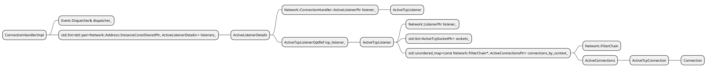
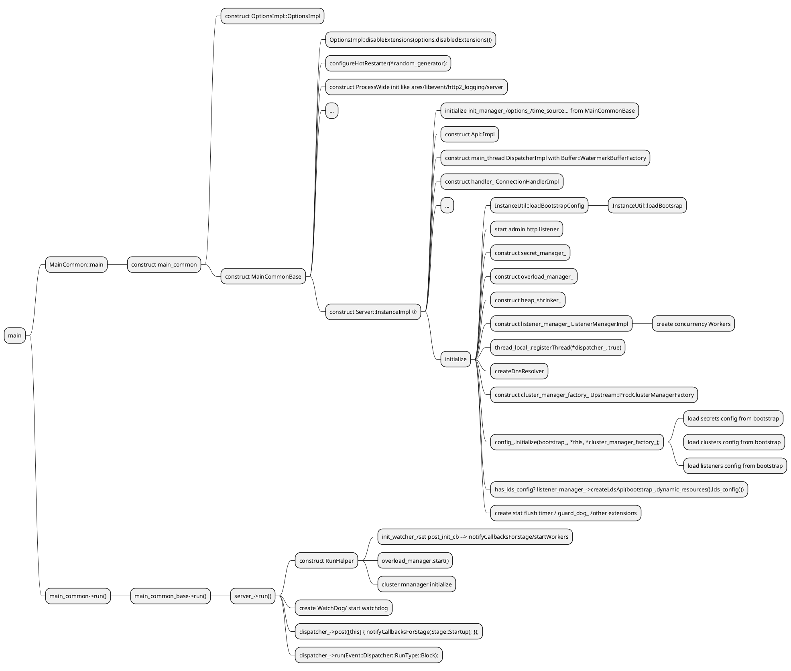
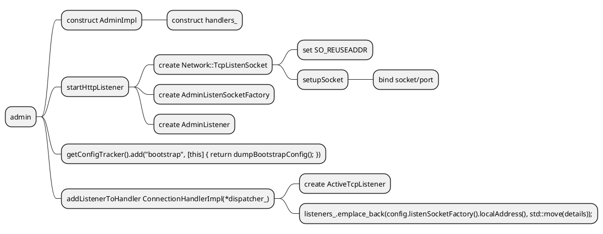

# Envoy

[The basics of Envoy and Envoy extensibility](https://www.tetrate.io/blog/the-basics-of-envoy-and-envoy-extensibility/)

[Istio1.5 & Envoy 数据面 WASM 实践](http://www.360doc.com/content/20/0429/18/46368139_909266443.shtml)

## Why envoy
- the network should be transparent to applications
- when network and application problems do occur it should be easy to determine the source of the problem.

## Envoy Features
- service discovery
- logging
- monitoring
- tracing
- authentication and authorization
- retries
- circuit breaking
- rate limiting

# Envoy Source Code analyze

## bootstrap configurations
`source/server/options_impl.cc` `OptionsImpl::OptionsImpl`
use 3rd-party TCLAP to handle command line arguments. and the command line arguments will be stored into `OptionsImpl`

- concurrency: # of worker threads to run, default std::thread::hardware_concurrency()
- c/config-path: Path to configuration file
- l/log-level: default spdlog::level::level_string_views[default_log_level].data()
- component-log-level: component-log-level
- restart_epoch: hot restart epoch #, default 0
- **service-cluster/node/zone**
- disable-extensions: Comma-separated list of extensions to disable

- Listener  LDS
- Routes    RDS
- Clusters  CDS
- Endpoints EDS

## Envoy Class Diagram
```plantuml
@startuml
Title Envoy Class Diagram

interface Server::Options
class OptionsImpl {
    - envoy::config::bootstrap::v3::Bootstrap config_proto_
}

Server::Options <|.. OptionsImpl

class PlatformImpl {
    - std::unique_ptr<Thread::ThreadFactory> thread_factory_
    - std::unique_ptr<Filesystem::Instance> file_system_

    + Thread::ThreadFactory& threadFactory()
    + Filesystem::Instance& fileSystem()
}

class RealTimeSystem {
    + SchedulerPtr createScheduler(Scheduler&, CallbackScheduler&)
    + SystemTime systemTime()
    + MonotonicTime monotonicTime()

    - RealTimeSource time_source_
}

class DefaultListenerHooks {
    + void onWorkerListenerAdded()
    + void onWorkerListenerRemoved()
    + void onRuntimeCreated()
}

class ProdComponentFactory {
    + Server::DrainManagerPtr createDrainManager
    + Runtime::LoaderPtr createRuntime(Server::Instance& server,
                                   Server::Configuration::Initial& config)
}

'OptionsImpl o-- MainCommonBase
interface SlotAlloctor {
    SlotPtr allocateSlot()
}

interface Instance {
    + void registerThread(Event::Dispatcher& dispatcher, bool main_thread)
    + void shutdownGlobalThreading()
    + void shutdownThread()
    + Event::Dispatcher& dispatcher()
}

class SlotImpl {
    + ThreadLocalObjectSharedPtr get()
    + bool currentThreadRegistered()
    + void runOnAllThreads(const UpdateCb& cb)
    + void set(InitializeCb cb)

    + InstanceImpl& parent_
    + const uint64_t index_
}

class Bookkeeper {
    + ThreadLocalObjectSharedPtr get()
    + bool currentThreadRegistered()
    + void runOnAllThreads(const UpdateCb& cb)
    + void set(InitializeCb cb)

    + InstanceImpl& parent_
    + std::unique_ptr<SlotImpl> slot_
    + std::shared_ptr<uint32_t> ref_count_
}

class ThreadLocalData {
    + Event::Dispatcher* dispatcher_
    + std::vector<ThreadLocalObjectSharedPtr> data_
}

class InstanceImpl {
    + SlotPtr allocateSlot()
    + void registerThread(Event::Dispatcher& dispatcher, bool main_thread)
    + void shutdownGlobalThreading()
    + void shutdownThread()
    + Event::Dispatcher& dispatcher()

    - void recycle(std::unique_ptr<SlotImpl>&& slot)
    - void scheduleCleanup(SlotImpl* slot)
    - void removeSlot(SlotImpl& slot)
    - void runOnAllThreads(Event::PostCb cb)
    - void runOnAllThreads(Event::PostCb cb, Event::PostCb main_callback)
    - static void setThreadLocal(uint32_t index, ThreadLocalObjectSharedPtr object)

    - {static} thread_local ThreadLocalData thread_local_data_
    - absl::flat_hash_map<SlotImpl*, std::unique_ptr<SlotImpl>> deferred_deletes_
    - std::vector<SlotImpl*> slots_
    - std::list<uint32_t> free_slot_indexes_
    - std::list<std::reference_wrapper<Event::Dispatcher>> registered_threads_
    - std::thread::id main_thread_id_
    - Event::Dispatcher* main_thread_dispatcher_
    - std::atomic<bool> shutdown_
}

SlotAlloctor <|-- Instance
Instance <|.. InstanceImpl
SlotImpl *-- InstanceImpl
Bookkeeper *-- InstanceImpl
ThreadLocalData *-- InstanceImpl

class Server::HotRestart {}
class Stats::ThreadLocalStoreImpl {}
class Stats::ThreadLocalStoreImpl {}
class Init::ManagerImpl {
    + State state()
    + void add(const Target& target)
    + void initialize(const Watcher& watcher)

    - void onTargetReady()
    - void ready()

    - const std::string name_
    - State state_
    - uint32_t count_
    - WatcherHandlePtr watcher_handle_
    - const WatcherImpl watcher_
    - std::list<TargetHandlePtr> target_handles_
}

interface Api::Api {
  {abstract} Event::DispatcherPtr allocateDispatcher(const std::string& name)
  {abstract} Event::DispatcherPtr allocateDispatcher(const std::string& name, Buffer::WatermarkFactoryPtr&& watermark_factory)
  {abstract} Thread::ThreadFactory& threadFactory()
  {abstract} Filesystem::Instance& fileSystem()
  {abstract} TimeSource& timeSource()
  {abstract} const Stats::Scope& rootScope()
  {abstract} ProcessContextOptRef processContext()
}

class Api::Impl {
  - Thread::ThreadFactory& thread_factory_
  - Stats::Store& store_
  - Event::TimeSystem& time_system_
  - Filesystem::Instance& file_system_
  - ProcessContextOptRef process_context_
}

Api::Api <|.. Api::Impl

interface Dispatcher {
  + {abstract} const std::string& name()
  + {abstract} TimeSource& timeSource()
  + {abstract} void initializeStats(Stats::Scope& scope, const absl::optional<std::string>& prefix = absl::nullopt)
  + {abstract} void clearDeferredDeleteList()
  + {abstract} Network::ConnectionPtr createServerConnection(Network::ConnectionSocketPtr&& socket, Network::TransportSocketPtr&& transport_socket, StreamInfo::StreamInfo& stream_info)
  + {abstract} Network::ClientConnectionPtr createClientConnection(Network::Address::InstanceConstSharedPtr address, Network::Address::InstanceConstSharedPtr source_address, Network::TransportSocketPtr&& transport_socket, const Network::ConnectionSocket::OptionsSharedPtr& options)
  + {abstract} Network::DnsResolverSharedPtr createDnsResolver(const std::vector<Network::Address::InstanceConstSharedPtr>& resolvers, bool use_tcp_for_dns_lookups)
  + {abstract} FileEventPtr createFileEvent(os_fd_t fd, FileReadyCb cb, FileTriggerType trigger, uint32_t events)
  + {abstract} Filesystem::WatcherPtr createFilesystemWatcher()
  + {abstract} Network::ListenerPtr createListener(Network::SocketSharedPtr&& socket, Network::ListenerCallbacks& cb, bool bind_to_port)
  + {abstract} Network::UdpListenerPtr createUdpListener(Network::SocketSharedPtr&& socket, Network::UdpListenerCallbacks& cb)
  + {abstract} Event::TimerPtr createTimer(TimerCb cb)
  + {abstract} Event::SchedulableCallbackPtr createSchedulableCallback(std::function<void()> cb)
  + {abstract} void deferredDelete(DeferredDeletablePtr&& to_delete)
  + {abstract} void exit()
  + {abstract} SignalEventPtr listenForSignal(int signal_num, SignalCb cb)
  + {abstract} void post(PostCb callback)
  + {abstract} void run(RunType type)
  + {abstract} Buffer::WatermarkFactory& getWatermarkFactory()
  + {abstract} const ScopeTrackedObject* setTrackedObject(const ScopeTrackedObject* object)
  + {abstract} bool isThreadSafe() const
  + {abstract} MonotonicTime approximateMonotonicTime() const
  + {abstract} void updateApproximateMonotonicTime()
}

class DispatcherImpl {
  + event_base& base()

  - TimerPtr createTimerInternal(TimerCb cb)
  - void updateApproximateMonotonicTimeInternal()
  - void runPostCallbacks()

  - const std::string name_
  - Api::Api& api_
  - std::string stats_prefix_
  - std::unique_ptr<DispatcherStats> stats_
  - Thread::ThreadId run_tid_
  - Buffer::WatermarkFactoryPtr buffer_factory_
  - LibeventScheduler base_scheduler_
  - SchedulerPtr scheduler_
  - SchedulableCallbackPtr deferred_delete_cb_
  - SchedulableCallbackPtr post_cb_
  - std::vector<DeferredDeletablePtr> to_delete_1_
  - std::vector<DeferredDeletablePtr> to_delete_2_
  - std::vector<DeferredDeletablePtr>* current_to_delete_
  - Thread::MutexBasicLockable post_lock_
  - std::list<std::function<void()>> post_callbacks_ ABSL_GUARDED_BY(post_lock_)
  - const ScopeTrackedObject* current_object_{}
  - bool deferred_deleting_{}
  - MonotonicTime approximate_monotonic_time_
}

Dispatcher <|.. DispatcherImpl

interface ActiveListener {
    + {abstract} uint64_t listenerTag()
    + {abstract} Listener* listener()
    + {abstract} void pauseListening()
    + {abstract} void resumeListening()
    + {abstract} void shutdownListener()
}

class ActiveListenerImplBase {
    + ActiveListenerImplBase(Network::ConnectionHandler& parent, Network::ListenerConfig* config)
    + uint64_t listenerTag()

    + ListenerStats stats_
    + PerHandlerListenerStats per_worker_stats_
    + Network::ListenerConfig* config_{}
}

note top of ActiveListenerImplBase
 Network::ListenerConfig
end note

interface Network::ListenerCallbacks {
  + {abstract} void onAccept(ConnectionSocketPtr&& socket)
  + {abstract} void onReject()
}

interface Network::BalancedConnectionHandler {
  + {abstract} uint64_t numConnections() const
  + {abstract} void incNumConnections()
  + {abstract} void post(Network::ConnectionSocketPtr&& socket)
}

Network::ListenerCallbacks <|.. ActiveListener
ActiveListenerImplBase <|.. ActiveListener

class ActiveTcpListener {
    + ActiveTcpListener(ConnectionHandlerImpl& parent, Network::ListenerConfig& config)
    + ActiveTcpListener(ConnectionHandlerImpl& parent, Network::ListenerPtr&& listener, Network::ListenerConfig& config)
    + ~ActiveTcpListener()
    + bool listenerConnectionLimitReached()
    + void onAcceptWorker(Network::ConnectionSocketPtr&& socket, bool hand_off_restored_destination_connections, bool rebalanced)
    + void decNumConnections()

    + void removeConnection(ActiveTcpConnection& connection)
    + void newConnection(Network::ConnectionSocketPtr&& socket, const envoy::config::core::v3::Metadata& dynamic_metadata)
    + ActiveConnections& getOrCreateActiveConnections(const Network::FilterChain& filter_chain)

    + void deferredRemoveFilterChains( const std::list<const Network::FilterChain*>& draining_filter_chains)
    + void updateListenerConfig(Network::ListenerConfig& config)

    + ConnectionHandlerImpl& parent_
    + Network::ListenerPtr listener_
    + const std::chrono::milliseconds listener_filters_timeout_
    + const bool continue_on_listener_filters_timeout_
    + std::list<ActiveTcpSocketPtr> sockets_
    + std::unordered_map<const Network::FilterChain*, ActiveConnectionsPtr> connections_by_context_

    + std::atomic<uint64_t> num_listener_connections_
    + bool is_deleting_
}

ActiveListener <|.. ActiveListenerImplBase
ActiveListenerImplBase <|-- ActiveTcpListener
Network::BalancedConnectionHandler <|.. ActiveTcpListener
ActiveConnections o-- ActiveTcpListener

class ActiveConnections {
    ActiveConnections(ActiveTcpListener& listener, const Network::FilterChain& filter_chain)
    ~ActiveConnections()

    ActiveTcpListener& listener_
    const Network::FilterChain& filter_chain_
    std::list<ActiveTcpConnectionPtr> connections_
}

ActiveTcpListener o-- ActiveConnections
Network::FilterChain o-- ActiveConnections
ActiveTcpConnection *-- ActiveConnections

class Network::FilterChain {}
class ActiveTcpConnection {
    void onEvent(Network::ConnectionEvent event)
    void onAboveWriteBufferHighWatermark()
    void onBelowWriteBufferLowWatermark()

    std::unique_ptr<StreamInfo::StreamInfo> stream_info_
    ActiveConnections& active_connections_
    Network::ConnectionPtr connection_
    Stats::TimespanPtr conn_length_
}

ActiveTcpSocket *-- ActiveTcpListener

class ActiveTcpSocket {
    void onTimeout()
    void startTimer()
    void unlink()
    void newConnection()
}

class ActiveListenerDetails {
	+ Network::ConnectionHandler::ActiveListenerPtr listener_
	+ ActiveTcpListenerOptRef tcp_listener_
}

ActiveTcpListener *-- ActiveListenerDetails
ActiveListenerDetails *-- ConnectionHandlerImpl

ActiveTcpListener *-- ActiveConnections
Network::FilterChain *-- ActiveConnections
ActiveTcpConnection *-- ActiveConnections
Network::ConnectionHandler <|.. ConnectionHandlerImpl

interface Network::ConnectionHandler {
  {abstract} uint64_t numConnections() const
  {abstract} void incNumConnections()
  {abstract} void decNumConnections()
  {abstract} void addListener(absl::optional<uint64_t> overridden_listener, ListenerConfig& config)
  {abstract} void removeListeners(uint64_t listener_tag)
  {abstract} void removeFilterChains(uint64_t listener_tag, const std::list<const FilterChain*>& filter_chains, std::function<void()> completion)
  {abstract} void stopListeners(uint64_t listener_tag)
  {abstract} void stopListeners()
  {abstract} void disableListeners()
  {abstract} void enableListeners()
  {abstract} const std::string& statPrefix() const
}

class ConnectionHandlerImpl {
  ConnectionHandlerImpl(Event::Dispatcher& dispatcher)

  Event::Dispatcher& dispatcher_
  const std::string per_handler_stat_prefix_
  std::list<std::pair<Network::Address::InstanceConstSharedPtr, ActiveListenerDetails>> listeners_
  std::atomic<uint64_t> num_handler_connections_
  bool disable_listeners_
}

interface Server::Instance {
  + {abstract} Admin& admin()
  + {abstract} Api::Api& api()
  + {abstract} Upstream::ClusterManager& clusterManager()
  + {abstract} Ssl::ContextManager& sslContextManager()
  + {abstract} Event::Dispatcher& dispatcher()
  + {abstract} Network::DnsResolverSharedPtr dnsResolver()
  + {abstract} void drainListeners()
  + {abstract} DrainManager& drainManager()
  + {abstract} AccessLog::AccessLogManager& accessLogManager()
  + {abstract} void failHealthcheck(bool fail)
  + {abstract} bool healthCheckFailed()
  + {abstract} HotRestart& hotRestart()
  + {abstract} Init::Manager& initManager()
  + {abstract} ListenerManager& listenerManager()
  + {abstract} Envoy::MutexTracer* mutexTracer()
  + {abstract} OverloadManager& overloadManager()
  + {abstract} Secret::SecretManager& secretManager()
  + {abstract} const Options& options()
  + {abstract} Runtime::RandomGenerator& random()
  + {abstract} Runtime::Loader& runtime()
  + {abstract} ServerLifecycleNotifier& lifecycleNotifier()
  + {abstract} void shutdown()
  + {abstract} bool isShutdown()
  + {abstract} void shutdownAdmin()
  + {abstract} Singleton::Manager& singletonManager()
  + {abstract} time_t startTimeCurrentEpoch()
  + {abstract} time_t startTimeFirstEpoch()
  + {abstract} Stats::Store& stats()
  + {abstract} Grpc::Context& grpcContext()
  + {abstract} Http::Context& httpContext()
  + {abstract} ProcessContextOptRef processContext()
  + {abstract} ThreadLocal::Instance& threadLocal()
  + {abstract} const LocalInfo::LocalInfo& localInfo() const
  + {abstract} TimeSource& timeSource()
  + {abstract} std::chrono::milliseconds statsFlushInterval() const
  + {abstract} void flushStats()
  + {abstract} ProtobufMessage::ValidationContext& messageValidationContext()
  + {abstract} Configuration::ServerFactoryContext& serverFactoryContext()
  + {abstract} Configuration::TransportSocketFactoryContext& transportSocketFactoryContext()
  + {abstract} void setDefaultTracingConfig(const envoy::config::trace::v3::Tracing& tracing_config)
}

class Server::InstanceImpl {
   + void run()

   - ProtobufTypes::MessagePtr dumpBootstrapConfig()
   - void flushStatsInternal()
   - void updateServerStats()
   - void initialize(const Options& options, Network::Address::InstanceConstSharedPtr local_address, ComponentFactory& component_factory, ListenerHooks& hooks)
   - void loadServerFlags(const absl::optional<std::string>& flags_path)
   - void startWorkers()
   - void terminate()
   - void notifyCallbacksForStage( Stage stage, Event::PostCb completion_cb = [] {})
   - void onRuntimeReady()
   - void onClusterManagerPrimaryInitializationComplete()

   - Init::Manager& init_manager_
   - std::unique_ptr<Secret::SecretManager> secret_manager_
   - bool workers_started_
   - std::atomic<bool> live_
   - bool shutdown_
   - const Options& options_
   - ProtobufMessage::ProdValidationContextImpl validation_context_
   - TimeSource& time_source_
   - LocalInfo::LocalInfoPtr local_info_
   - HotRestart& restarter_
   - const time_t start_time_
   - time_t original_start_time_
   - Stats::StoreRoot& stats_store_
   - std::unique_ptr<ServerStats> server_stats_
   - Assert::ActionRegistrationPtr assert_action_registration_
   - Assert::ActionRegistrationPtr envoy_bug_action_registration_
   - ThreadLocal::Instance& thread_local_
   - Api::ApiPtr api_
   - Event::DispatcherPtr dispatcher_
   - std::unique_ptr<AdminImpl> admin_
   - Singleton::ManagerPtr singleton_manager_
   - Network::ConnectionHandlerPtr handler_
   - Runtime::RandomGeneratorPtr random_generator_
   - std::unique_ptr<Runtime::ScopedLoaderSingleton> runtime_singleton_
   - std::unique_ptr<Ssl::ContextManager> ssl_context_manager_
   - ProdListenerComponentFactory listener_component_factory_
   - ProdWorkerFactory worker_factory_
   - std::unique_ptr<ListenerManager> listener_manager_
   - absl::node_hash_map<Stage, LifecycleNotifierCallbacks> stage_callbacks_
   - absl::node_hash_map<Stage, LifecycleNotifierCompletionCallbacks> stage_completable_callbacks_
   - Configuration::MainImpl config_
   - Network::DnsResolverSharedPtr dns_resolver_
   - Event::TimerPtr stat_flush_timer_
   - DrainManagerPtr drain_manager_
   - AccessLog::AccessLogManagerImpl access_log_manager_
   - std::unique_ptr<Upstream::ClusterManagerFactory> cluster_manager_factory_
   - std::unique_ptr<Server::GuardDog> guard_dog_
   - bool terminated_
   - std::unique_ptr<Logger::FileSinkDelegate> file_logger_
   - envoy::config::bootstrap::v3::Bootstrap bootstrap_
   - ConfigTracker::EntryOwnerPtr config_tracker_entry_
   - SystemTime bootstrap_config_update_time_
   - Grpc::AsyncClientManagerPtr async_client_manager_
   - Upstream::ProdClusterInfoFactory info_factory_
   - Upstream::HdsDelegatePtr hds_delegate_
   - std::unique_ptr<OverloadManagerImpl> overload_manager_
   - std::vector<BootstrapExtensionPtr> bootstrap_extensions_
   - Envoy::MutexTracer* mutex_tracer_
   - Grpc::ContextImpl grpc_context_
   - Http::ContextImpl http_context_
   - std::unique_ptr<ProcessContext> process_context_
   - std::unique_ptr<Memory::HeapShrinker> heap_shrinker_
   - const std::thread::id main_thread_id_
   - Stats::TimespanPtr initialization_timer_

   - ServerFactoryContextImpl server_contexts_
}

Server::Instance <|.. Server::InstanceImpl
Api::Impl *-- Server::InstanceImpl
DispatcherImpl *-- Server::InstanceImpl
ConnectionHandlerImpl *-- Server::InstanceImpl


InstanceImpl *-- MainCommonBase
Server::HotRestart *-- MainCommonBase
Stats::ThreadLocalStoreImpl *-- MainCommonBase
Stats::ThreadLocalStoreImpl *-- MainCommonBase
Init::ManagerImpl *-- MainCommonBase
Server::InstanceImpl *-- MainCommonBase


class MainCommonBase {
    # ProcessWide process_wide_
    # Grpc::GoogleGrpcContext google_grpc_context_
    # const Envoy::OptionsImpl& options_
    # Server::ComponentFactory& component_factory_
    # Thread::ThreadFactory& thread_factory_
    # Filesystem::Instance& file_system_
    # Stats::SymbolTablePtr symbol_table_
    # Stats::AllocatorImpl stats_allocator_

    # std::unique_ptr<ThreadLocal::InstanceImpl> tls_
    # std::unique_ptr<Server::HotRestart> restarter_
    # std::unique_ptr<Stats::ThreadLocalStoreImpl> stats_store_
    # std::unique_ptr<Logger::Context> logging_context_
    # std::unique_ptr<Init::Manager> init_manager_
    # std::unique_ptr<Server::InstanceImpl> server_

    + bool run()
    + Server::Instance* server()
    + void adminRequest(absl::string_view path_and_query, absl::string_view method,
                    const MainCommonBase::AdminRequestFn& handler)
}

PlatformImpl *-- MainCommon
OptionsImpl *-- MainCommon
MainCommonBase *-- MainCommon
RealTimeSystem *-- MainCommon
DefaultListenerHooks *-- MainCommon
ProdComponentFactory  *-- MainCommon

class MainCommon {
    - PlatformImpl platform_impl_
    - Envoy::OptionsImpl options_
    - Event::RealTimeSystem real_time_system_
    - DefaultListenerHooks default_listener_hooks_
    - ProdComponentFactory prod_component_factory_
    - MainCommonBase base_

    + bool run()
    + void adminRequest(absl::string_view path_and_query, absl::string_view method,
                    const MainCommonBase::AdminRequestFn& handler)
    + Server::Instance* server()
    + {static} int main(int argc, char** argv, PostServerHook hook = nullptr)
}
@enduml
```
### The relationship between dispatcher listener connection socket





```
① server_ = std::make_unique<Server::InstanceImpl>(
	*init_manager_, options_, time_system, local_address, listener_hooks, *restarter_,
	*stats_store_, access_log_lock, component_factory, std::move(random_generator), *tls_,
	thread_factory_, file_system_, std::move(process_context))
```

### Envoy Admin
```c++
  admin_ = std::make_unique<AdminImpl>(initial_config.admin().profilePath(), *this);
```



```plantuml
@startuml
interface Admin {
  + {abstract} bool addHandler(const std::string& prefix, const std::string& help_text, HandlerCb callback, bool removable, bool mutates_server_state)
  + {abstract} bool removeHandler(const std::string& prefix)
  + {abstract} const Network::Socket& socket()
  + {abstract} ConfigTracker& getConfigTracker()
  + {abstract} void startHttpListener(const std::string& access_log_path, const std::string& address_out_path, Network::Address::InstanceConstSharedPtr address, const Network::Socket::OptionsSharedPtr& socket_options, Stats::ScopePtr&& listener_scope)
  + {abstract} Http::Code request(absl::string_view path_and_query, absl::string_view method, Http::ResponseHeaderMap& response_headers, std::string& body)
  + {abstract} void addListenerToHandler(Network::ConnectionHandler* handler)
}
interface Network::FilterChainManager {
  + {abstract} const FilterChain* findFilterChain(const ConnectionSocket& socket)
}
interface Network::FilterChainFactory {
  + {abstract} bool createNetworkFilterChain(Connection& connection, const std::vector<FilterFactoryCb>& filter_factories)
  + {abstract} bool createListenerFilterChain(ListenerFilterManager& listener)
  + {abstract} void createUdpListenerFilterChain(UdpListenerFilterManager& udp_listener, UdpReadFilterCallbacks& callbacks)
}
interface Http::FilterChainFactory {
  + {abstract} void createFilterChain(Http::FilterChainFactoryCallbacks& callbacks) override;
  + {abstract} bool createUpgradeFilterChain(absl::string_view, const Http::FilterChainFactory::UpgradeMap*, Http::FilterChainFactoryCallbacks&)
}
interface Http::ConnectionManagerConfig {
  + {abstract} Http::RequestIDExtensionSharedPtr requestIDExtension()
  + {abstract} const std::list<AccessLog::InstanceSharedPtr>& accessLogs()
  + {abstract} Http::ServerConnectionPtr createCodec(Network::Connection& connection, const Buffer::Instance& data, Http::ServerConnectionCallbacks& callbacks)
  + {abstract} Http::DateProvider& dateProvider()
  + {abstract} std::chrono::milliseconds drainTimeout()
  + {abstract} Http::FilterChainFactory& filterFactory()
  + {abstract} bool generateRequestId() const
  + {abstract} bool preserveExternalRequestId() const
  + {abstract} bool alwaysSetRequestIdInResponse() const
  + {abstract} absl::optional<std::chrono::milliseconds> idleTimeout() const
  + {abstract} bool isRoutable() const
  + {abstract} absl::optional<std::chrono::milliseconds> maxConnectionDuration() const
  + {abstract} uint32_t maxRequestHeadersKb() const
  + {abstract} uint32_t maxRequestHeadersCount() const
  + {abstract} std::chrono::milliseconds streamIdleTimeout() const
  + {abstract} std::chrono::milliseconds requestTimeout() const
  + {abstract} std::chrono::milliseconds delayedCloseTimeout() const
  + {abstract} absl::optional<std::chrono::milliseconds> maxStreamDuration() const
  + {abstract} Router::RouteConfigProvider* routeConfigProvider()
  + {abstract} Config::ConfigProvider* scopedRouteConfigProvider()
  + {abstract} const std::string& serverName() const
  + {abstract} HttpConnectionManagerProto::ServerHeaderTransformation serverHeaderTransformation() const
  + {abstract} Http::ConnectionManagerStats& stats()
  + {abstract} Http::ConnectionManagerTracingStats& tracingStats()
  + {abstract} bool useRemoteAddress() const
  + {abstract} const Http::InternalAddressConfig& internalAddressConfig() const
  + {abstract} uint32_t xffNumTrustedHops() const
  + {abstract} bool skipXffAppend() const
  + {abstract} const std::string& via() const
  + {abstract} Http::ForwardClientCertType forwardClientCert() const
  + {abstract} const std::vector<Http::ClientCertDetailsType>& setCurrentClientCertDetails() const
  + {abstract} const Network::Address::Instance& localAddress() override
  + {abstract} const absl::optional<std::string>& userAgent()
  + {abstract} Tracing::HttpTracerSharedPtr tracer()
  + {abstract} const Http::TracingConnectionManagerConfig* tracingConfig()
  + {abstract} Http::ConnectionManagerListenerStats& listenerStats()
  + {abstract} bool proxy100Continue() const
  + {abstract} const Http::Http1Settings& http1Settings() const
  + {abstract} bool shouldNormalizePath() const
  + {abstract} bool shouldMergeSlashes() const
  + {abstract} bool shouldStripMatchingPort() const
  + {abstract} envoy::config::core::v3::HttpProtocolOptions::HeadersWithUnderscoresAction headersWithUnderscoresAction() const
  + {abstract} const LocalReply::LocalReply& localReply() const
}

class UrlHandler {
    + const std::string prefix_
    + const std::string help_text_
    + const HandlerCb handler_
    + const bool removable_
    + const bool mutates_server_state_
}

class NullRouteConfigProvider {
    + NullRouteConfigProvider(TimeSource& time_source)

    + Router::ConfigConstSharedPtr config()
    + absl::optional<ConfigInfo> configInfo() const
    + SystemTime lastUpdated() const
    + void onConfigUpdate()
    + void validateConfig(const envoy::config::route::v3::RouteConfiguration&) const
    + void requestVirtualHostsUpdate(const std::string&, Event::Dispatcher&, std::weak_ptr<Http::RouteConfigUpdatedCallback>)

    + Router::ConfigConstSharedPtr config_
    + TimeSource& time_source_
}
class AdminListenSocketFactory {
    + Network::Socket::Type socketType() const
    + const Network::Address::InstanceConstSharedPtr& localAddress() const
    + Network::SocketSharedPtr getListenSocket()
    + Network::SocketOptRef sharedSocket() const
    - Network::SocketSharedPtr socket_
    - bool socket_create_{false}
}

interface Network::ListenerConfig {
    + {abstract} Network::FilterChainManager& filterChainManager()
    + {abstract} Network::FilterChainFactory& filterChainFactory()
    + {abstract} Network::ListenSocketFactory& listenSocketFactory()
    + {abstract} bool bindToPort()
    + {abstract} bool handOffRestoredDestinationConnections() const
    + {abstract} uint32_t perConnectionBufferLimitBytes() const
    + {abstract} std::chrono::milliseconds listenerFiltersTimeout() const
    + {abstract} bool continueOnListenerFiltersTimeout() const
    + {abstract} envoy::config::core::v3::TrafficDirection direction() const
    + {abstract} Network::ConnectionBalancer& connectionBalancer()
    + {abstract} ResourceLimit& openConnections()
    + {abstract} const std::vector<AccessLog::InstanceSharedPtr>& accessLogs() const
}

Network::ListenerConfig <|.. AdminListener
class AdminListener {

    + AdminImpl& parent_
    + const std::string name_
    + Stats::ScopePtr scope_
    + Http::ConnectionManagerListenerStats stats_
    + Network::NopConnectionBalancerImpl connection_balancer_
    + BasicResourceLimitImpl open_connections_

    - const std::vector<AccessLog::InstanceSharedPtr> empty_access_logs_
}

class AdminFilterChain {
    + const Network::TransportSocketFactory& transportSocketFactory() const
    + const std::vector<Network::FilterFactoryCb>& networkFilterFactories() const

    - const Network::RawBufferSocketFactory transport_socket_factory_
    - const std::vector<Network::FilterFactoryCb> empty_network_filter_factory_
}

Admin <|.. AdminImpl
Network::FilterChainManager <|.. AdminImpl
Network::FilterChainFactory <|.. AdminImpl
Http::FilterChainFactory <|.. AdminImpl
Http::ConnectionManagerConfig <|.. AdminImpl

UrlHandler *-- AdminImpl
AdminListenSocketFactory  *-- AdminImpl
AdminListener *-- AdminImpl
AdminFilterChain *-- AdminImpl
NullRouteConfigProvider  *-- AdminImpl

class AdminImpl {
  + AdminImpl(const std::string& profile_path, Server::Instance& server)
  + Http::Code runCallback(absl::string_view path_and_query, Http::ResponseHeaderMap& response_headers, Buffer::Instance& response, AdminStream& admin_stream)
  + Network::Socket& mutable_socket()

  + void closeSocket()
  + Server::Instance& server()

  + AdminFilter::AdminServerCallbackFunction createCallbackFunction()

  - void addCircuitSettings(const std::string& cluster_name, const std::string& priority_str, Upstream::ResourceManager& resource_manager, Buffer::Instance& response)
  - void addOutlierInfo(const std::string& cluster_name, const Upstream::Outlier::Detector* outlier_detector, Buffer::Instance& response)
  - void writeClustersAsJson(Buffer::Instance& response)
  - void writeClustersAsText(Buffer::Instance& response)

  - void addAllConfigToDump(envoy::admin::v3::ConfigDump& dump, const absl::optional<std::string>& mask, bool include_eds) const
  - absl::optional<std::pair<Http::Code, std::string>> addResourceToDump(envoy::admin::v3::ConfigDump& dump, const absl::optional<std::string>& mask, const std::string& resource, bool include_eds) const

  - std::vector<const UrlHandler*> sortedHandlers() const
  - envoy::admin::v3::ServerInfo::State serverState()

  - void addLbEndpoint(const Upstream::HostSharedPtr& host, envoy::config::endpoint::v3::LocalityLbEndpoints& locality_lb_endpoint) const
  - ProtobufTypes::MessagePtr dumpEndpointConfigs() const
  - Http::Code handlerAdminHome(absl::string_view path_and_query, Http::ResponseHeaderMap& response_headers, Buffer::Instance& response, AdminStream&)
  - Http::Code handlerClusters(absl::string_view path_and_query, Http::ResponseHeaderMap& response_headers, Buffer::Instance& response, AdminStream&)
  - Http::Code handlerConfigDump(absl::string_view path_and_query, Http::ResponseHeaderMap& response_headers, Buffer::Instance& response, AdminStream&) const
  - Http::Code handlerHelp(absl::string_view path_and_query, Http::ResponseHeaderMap& response_headers, Buffer::Instance& response, AdminStream&)

  - Server::Instance& server_
  - Http::RequestIDExtensionSharedPtr request_id_extension_
  - std::list<AccessLog::InstanceSharedPtr> access_logs_
  - const std::string profile_path_
  - Http::ConnectionManagerStats stats_
  - Stats::IsolatedStoreImpl no_op_store_
  - Http::ConnectionManagerTracingStats tracing_stats_
  - NullRouteConfigProvider route_config_provider_
  - NullScopedRouteConfigProvider scoped_route_config_provider_
  - Server::StatsHandler stats_handler_
  - Server::LogsHandler logs_handler_
  - Server::ProfilingHandler profiling_handler_
  - Server::RuntimeHandler runtime_handler_
  - Server::ListenersHandler listeners_handler_
  - Server::ServerCmdHandler server_cmd_handler_
  - Server::ServerInfoHandler server_info_handler_
  - std::list<UrlHandler> handlers_
  - const uint32_t max_request_headers_kb_{Http::DEFAULT_MAX_REQUEST_HEADERS_KB}
  - const uint32_t max_request_headers_count_{Http::DEFAULT_MAX_HEADERS_COUNT}
  - absl::optional<std::chrono::milliseconds> idle_timeout_
  - absl::optional<std::chrono::milliseconds> max_connection_duration_
  - absl::optional<std::chrono::milliseconds> max_stream_duration_
  - absl::optional<std::string> user_agent_
  - Http::SlowDateProviderImpl date_provider_
  - std::vector<Http::ClientCertDetailsType> set_current_client_cert_details_
  - Http::Http1Settings http1_settings_
  - Http::Http1::CodecStats::AtomicPtr http1_codec_stats_
  - Http::Http2::CodecStats::AtomicPtr http2_codec_stats_
  - ConfigTrackerImpl config_tracker_
  - const Network::FilterChainSharedPtr admin_filter_chain_
  - Network::SocketSharedPtr socket_
  - Network::ListenSocketFactorySharedPtr socket_factory_
  - AdminListenerPtr listener_
  - const AdminInternalAddressConfig internal_address_config_
  - const LocalReply::LocalReplyPtr local_reply_
}
@enduml
```

when construct `AdminImpl`, construct the mainpage handlers list:
```
{"/", "Admin home page", MAKE_ADMIN_HANDLER(handlerAdminHome), false, false},
{"/certs", "print certs on machine",MAKE_ADMIN_HANDLER(server_info_handler_.handlerCerts), false, false},
…
```
then invoke `startHttpListener` to start http listener.
```
    admin_->startHttpListener(initial_config.admin().accessLogPath(), options.adminAddressPath(),
                              initial_config.admin().address(),
                              initial_config.admin().socketOptions(),
                              stats_store_.createScope("listener.admin."));
```
it will create `TcpListenSocket`



There are 2 places that can invoke the http request:
- MainCommon::adminRequest --> MainCommonBase::adminRequest --> AdminImpl::request (Now only found usage in test)
- from network, the function backtrace of http request from network is below:
```
#0  Envoy::Server::AdminImpl::handlerAdminHome (this=0x55555d65e000, response_headers=..., response=...) at source/server/admin/admin.cc:841
#1  0x000055555ad45cf0 in Envoy::Server::AdminImpl::AdminImpl(std::__1::basic_string<char, std::__1::char_traits<char>, std::__1::allocator<char> > const&, Envoy::Server::Instance&)::$_2::operator()(absl::string_view, Envoy::Http::ResponseHeaderMap&, Envoy::Buffer::Instance&, Envoy::Server::AdminStream&) const (this=0x55555d2785c8, path_and_query=..., response_headers=..., data=..., admin_stream=...) at source/server/admin/admin.cc:690
#2  0x000055555ad45c80 in std::__1::__invoke<Envoy::Server::AdminImpl::AdminImpl(std::__1::basic_string<char, std::__1::char_traits<char>, std::__1::allocator<char> > const&, Envoy::Server::Instance&)::$_2&, absl::string_view, Envoy::Http::ResponseHeaderMap&, Envoy::Buffer::Instance&, Envoy::Server::AdminStream&> (__f=..., __args=..., __args=..., __args=..., __args=...) at /opt/llvm/bin/../include/c++/v1/type_traits:3539
#3  0x000055555ad45bd1 in std::__1::__invoke_void_return_wrapper<Envoy::Http::Code>::__call<Envoy::Server::AdminImpl::AdminImpl(std::__1::basic_string<char, std::__1::char_traits<char>, std::__1::allocator<char> > const&, Envoy::Server::Instance&)::$_2&, absl::string_view, Envoy::Http::ResponseHeaderMap&, Envoy::Buffer::Instance&, Envoy::Server::AdminStream&>(Envoy::Server::AdminImpl::AdminImpl(std::__1::basic_string<char, std::__1::char_traits<char>, std::__1::allocator<char> > const&, Envoy::Server::Instance&)::$_2&, absl::string_view&&, Envoy::Http::ResponseHeaderMap&, Envoy::Buffer::Instance&, Envoy::Server::AdminStream&) ( __args=..., __args=..., __args=..., __args=..., __args=...) at /opt/llvm/bin/../include/c++/v1/__functional_base:317
#4  0x000055555ad45b51 in std::__1::__function::__alloc_func<Envoy::Server::AdminImpl::AdminImpl(std::__1::basic_string<char, std::__1::char_traits<char>, std::__1::allocator<char> > const&, Envoy::Server::Instance&)::$_2, std::__1::allocator<Envoy::Server::AdminImpl::AdminImpl(std::__1::basic_string<char, std::__1::char_traits<char>, std::__1::allocator<char> > const&, Envoy::Server::Instance&)::$_2>, Envoy::Http::Code (absl::string_view, Envoy::Http::ResponseHeaderMap&, Envoy::Buffer::Instance&, Envoy::Server::AdminStream&)>::operator()(absl::string_view&&, Envoy::Http::ResponseHeaderMap&, Envoy::Buffer::Instance&, Envoy::Server::AdminStream&) (this=0x55555d2785c8, __arg=..., __arg=..., __arg=..., __arg=...) at /opt/llvm/bin/../include/c++/v1/functional:1540
#5  0x000055555ad44c52 in std::__1::__function::__func<Envoy::Server::AdminImpl::AdminImpl(std::__1::basic_string<char, std::__1::char_traits<char>, std::__1::allocator<char> > const&, Envoy::Server::Instance&)::$_2, std::__1::allocator<Envoy::Server::AdminImpl::AdminImpl(std::__1::basic_string<char, std::__1::char_traits<char>, std::__1::allocator<char> > const&, Envoy::Server::Instance&)::$_2>, Envoy::Http::Code (absl::string_view, Envoy::Http::ResponseHeaderMap&, Envoy::Buffer::Instance&, Envoy::Server::AdminStream&)>::operator()(absl::string_view&&, Envoy::Http::ResponseHeaderMap&, Envoy::Buffer::Instance&, Envoy::Server::AdminStream&) (this=0x55555d2785c0, __arg=..., __arg=..., __arg=..., __arg=...) at /opt/llvm/bin/../include/c++/v1/functional:1714
#6  0x000055555ad7f067 in std::__1::__function::__value_func<Envoy::Http::Code (absl::string_view, Envoy::Http::ResponseHeaderMap&, Envoy::Buffer::Instance&, Envoy::Server::AdminStream&)>::operator()(absl::string_view&&, Envoy::Http::ResponseHeaderMap&, Envoy::Buffer::Instance&, Envoy::Server::AdminStream&) const (this=0x55555d2785c0, __args=..., __args=..., __args=..., __args=...) at /opt/llvm/bin/../include/c++/v1/functional:1867
#7  0x000055555ad6ed53 in std::__1::function<Envoy::Http::Code (absl::string_view, Envoy::Http::ResponseHeaderMap&, Envoy::Buffer::Instance&, Envoy::Server::AdminStream&)>::operator()(absl::string_view, Envoy::Http::ResponseHeaderMap&, Envoy::Buffer::Instance&, Envoy::Server::AdminStream&) const (this=0x55555d2785c0, __arg=..., __arg=..., __arg=..., __arg=...) at /opt/llvm/bin/../include/c++/v1/functional:2473
#8  0x000055555ad3f8ac in Envoy::Server::AdminImpl::runCallback (this=0x55555d65e000, path_and_query=..., response_headers=..., response=..., admin_stream=...) at source/server/admin/admin.cc:800
#9  0x000055555ad75395 in Envoy::Server::AdminImpl::createCallbackFunction()::{lambda(absl::string_view, Envoy::Http::ResponseHeaderMap&, Envoy::Buffer::OwnedImpl&, Envoy::Server::AdminFilter&)#1}::operator()(absl::string_view, Envoy::Http::ResponseHeaderMap&, Envoy::Buffer::OwnedImpl&, Envoy::Server::AdminFilter&) const (this=0x55555d6fec08, path_and_query=..., response_headers=..., response=..., filter=...) at bazel-out/k8-dbg/bin/source/server/admin/_virtual_includes/admin_lib/server/admin/admin.h:189
#10 0x000055555ad75310 in std::__1::__invoke<Envoy::Server::AdminImpl::createCallbackFunction()::{lambda(absl::string_view, Envoy::Http::ResponseHeaderMap&, Envoy::Buffer::OwnedImpl&, Envoy::Server::AdminFilter&)#1}&, absl::string_view, Envoy::Http::ResponseHeaderMap&, Envoy::Buffer::OwnedImpl&, Envoy::Server::AdminFilter&> (__f=..., __args=..., __args=..., __args=..., __args=...) at /opt/llvm/bin/../include/c++/v1/type_traits:3539
#11 0x000055555ad75261 in std::__1::__invoke_void_return_wrapper<Envoy::Http::Code>::__call<Envoy::Server::AdminImpl::createCallbackFunction()::{lambda(absl::string_view, Envoy::Http::ResponseHeaderMap&, Envoy::Buffer::OwnedImpl&, Envoy::Server::AdminFilter&)#1}&, absl::string_view, Envoy::Http::ResponseHeaderMap&, Envoy::Buffer::OwnedImpl&, Envoy::Server::AdminFilter&>(Envoy::Server::AdminImpl::createCallbackFunction()::{lambda(absl::string_view, Envoy::Http::ResponseHeaderMap&, Envoy::Buffer::OwnedImpl&, Envoy::Server::AdminFilter&)#1}&, absl::string_view&&, Envoy::Http::ResponseHeaderMap&, Envoy::Buffer::OwnedImpl&, Envoy::Server::AdminFilter&) (__args=..., __args=..., __args=..., __args=..., __args=...) at /opt/llvm/bin/../include/c++/v1/__functional_base:317
#12 0x000055555ad751c1 in std::__1::__function::__alloc_func<Envoy::Server::AdminImpl::createCallbackFunction()::{lambda(absl::string_view, Envoy::Http::ResponseHeaderMap&, Envoy::Buffer::OwnedImpl&, Envoy::Server::AdminFilter&)#1}, std::__1::allocator<{lambda(absl::string_view, Envoy::Http::ResponseHeaderMap&, Envoy::Buffer::OwnedImpl&, Envoy::Server::AdminFilter&)#1}>, Envoy::Http::Code (absl::string_view, Envoy::Http::ResponseHeaderMap&, Envoy::Buffer::OwnedImpl&, Envoy::Server::AdminFilter&)>::operator()(absl::string_view&&, Envoy::Http::ResponseHeaderMap&, Envoy::Buffer::OwnedImpl&, Envoy::Server::AdminFilter&) ( this=0x55555d6fec08, __arg=..., __arg=..., __arg=..., __arg=...) at /opt/llvm/bin/../include/c++/v1/functional:1540
#13 0x000055555ad74292 in std::__1::__function::__func<Envoy::Server::AdminImpl::createCallbackFunction()::{lambda(absl::string_view, Envoy::Http::ResponseHeaderMap&, Envoy::Buffer::OwnedImpl&, Envoy::Server::AdminFilter&)#1}, std::__1::allocator<{lambda(absl::string_view, Envoy::Http::ResponseHeaderMap&, Envoy::Buffer::OwnedImpl&, Envoy::Server::AdminFilter&)#1}>, Envoy::Http::Code (absl::string_view, Envoy::Http::ResponseHeaderMap&, Envoy::Buffer::OwnedImpl&, Envoy::Server::AdminFilter&)>::operator()(absl::string_view&&, Envoy::Http::ResponseHeaderMap&, Envoy::Buffer::OwnedImpl&, Envoy::Server::AdminFilter&) ( this=0x55555d6fec00, __arg=..., __arg=..., __arg=..., __arg=...) at /opt/llvm/bin/../include/c++/v1/functional:1714
#14 0x000055555ad82697 in std::__1::__function::__value_func<Envoy::Http::Code (absl::string_view, Envoy::Http::ResponseHeaderMap&, Envoy::Buffer::OwnedImpl&, Envoy::Server::AdminFilter&)>::operator()(absl::string_view&&, Envoy::Http::ResponseHeaderMap&, Envoy::Buffer::OwnedImpl&, Envoy::Server::AdminFilter&) const (this=0x55555d6fec00, __args=..., __args=..., __args=..., __args=...) at /opt/llvm/bin/../include/c++/v1/functional:1867
#15 0x000055555ad822d3 in std::__1::function<Envoy::Http::Code (absl::string_view, Envoy::Http::ResponseHeaderMap&, Envoy::Buffer::OwnedImpl&, Envoy::Server::AdminFilter&)>::operator()(absl::string_view, Envoy::Http::ResponseHeaderMap&, Envoy::Buffer::OwnedImpl&, Envoy::Server::AdminFilter&) const (this=0x55555d6fec00, __arg=..., __arg=..., __arg=..., __arg=...) at /opt/llvm/bin/../include/c++/v1/functional:2473
#16 0x000055555ad815b8 in Envoy::Server::AdminFilter::onComplete (this=0x55555d6febd0) at source/server/admin/admin_filter.cc:71
#17 0x000055555ad811d9 in Envoy::Server::AdminFilter::decodeHeaders (this=0x55555d6febd0, headers=..., end_stream=true) at source/server/admin/admin_filter.cc:15
#18 0x000055555ae24e05 in Envoy::Http::ConnectionManagerImpl::ActiveStreamDecoderFilter::decodeHeaders (this=0x55555d6f9ec0, headers=..., end_stream=true) at bazel-out/k8-dbg/bin/source/common/http/_virtual_includes/conn_manager_lib/common/http/conn_manager_impl.h:320
#19 0x000055555adfc234 in Envoy::Http::ConnectionManagerImpl::ActiveStream::decodeHeaders (this=0x55555d286900, filter=0x0, headers=..., end_stream=true) at source/common/http/conn_manager_impl.cc:1088
#20 0x000055555adfb07c in Envoy::Http::ConnectionManagerImpl::ActiveStream::decodeHeaders (this=0x55555d286900, headers=..., end_stream=true) at source/common/http/conn_manager_impl.cc:999
#21 0x000055555ae4b91f in Envoy::Http::Http1::ServerConnectionImpl::onMessageComplete (this=0x55555d754000) at source/common/http/http1/codec_impl.cc:958
#22 0x000055555ae49738 in Envoy::Http::Http1::ConnectionImpl::onMessageCompleteBase (this=0x55555d754010) at source/common/http/http1/codec_impl.cc:752
#23 0x000055555ae4f280 in Envoy::Http::Http1::ConnectionImpl::$_8::operator() (this=0x55555d754028, parser=0x55555d754028) at source/common/http/http1/codec_impl.cc:436
#24 0x000055555ae4f255 in Envoy::Http::Http1::ConnectionImpl::$_8::__invoke (parser=0x55555d754028) at source/common/http/http1/codec_impl.cc:435
#25 0x000055555b2dca5c in http_parser_execute (parser=0x55555d754028, settings=0x55555c610020 <Envoy::Http::Http1::ConnectionImpl::settings_>, data=0x55555d74a040 "GET / HTTP/1.1\r\nHost: 11.0.0.1:9657\r\nAccept: text/html,application/xhtml+xml,application/xml;q=0.9,*/*;q=0.8\r\nUpgrade-Insecure-Requests: 1\r\nUser-Agent: Mozilla/5.0 (X11; Linux x86_--Type <RET> for more, q to quit, c to continue without paging-- 64) AppleWebKit/605."..., len=348) at external/com_github_nodejs_http_parser/http_parser.c:1923
#26 0x000055555ae47d19 in Envoy::Http::Http1::ConnectionImpl::dispatchSlice (this=0x55555d754010, slice=0x55555d74a040 "GET / HTTP/1.1\r\nHost: 11.0.0.1:9657\r\nAccept: text/html,application/xhtml+xml,application/xml;q=0.9,*/*;q=0.8\r\nUpgrade-Insecure-Requests: 1\r\nUser-Agent: Mozilla/5.0 (X11; Linux x86_64) AppleWebKit/605."..., len=348) at source/common/http/http1/codec_impl.cc:580
#27 0x000055555ae47765 in Envoy::Http::Http1::ConnectionImpl::innerDispatch (this=0x55555d754010, data=...) at source/common/http/http1/codec_impl.cc:556
#28 0x000055555ae5486e in Envoy::Http::Http1::ConnectionImpl::dispatch(Envoy::Buffer::Instance&)::$_14::operator()(Envoy::Buffer::Instance&) const (this=0x7fffffffc828, data=...) at source/common/http/http1/codec_impl.cc:539
#29 0x000055555ae5481b in std::__1::__invoke<Envoy::Http::Http1::ConnectionImpl::dispatch(Envoy::Buffer::Instance&)::$_14&, Envoy::Buffer::Instance&> (__f=..., __args=...) at /opt/llvm/bin/../include/c++/v1/type_traits:3539
#30 0x000055555ae5479b in std::__1::__invoke_void_return_wrapper<absl::Status>::__call<Envoy::Http::Http1::ConnectionImpl::dispatch(Envoy::Buffer::Instance&)::$_14&, Envoy::Buffer::Instance&>(Envoy::Http::Http1::ConnectionImpl::dispatch(Envoy::Buffer::Instance&)::$_14&, Envoy::Buffer::Instance&) (__args=..., __args=...) at /opt/llvm/bin/../include/c++/v1/__functional_base:317
#31 0x000055555ae5473b in std::__1::__function::__alloc_func<Envoy::Http::Http1::ConnectionImpl::dispatch(Envoy::Buffer::Instance&)::$_14, std::__1::allocator<Envoy::Http::Http1::ConnectionImpl::dispatch(Envoy::Buffer::Instance&)::$_14>, absl::Status (Envoy::Buffer::Instance&)>::operator()(Envoy::Buffer::Instance&) (this=0x7fffffffc828, __arg=...) at /opt/llvm/bin/../include/c++/v1/functional:1540
#32 0x000055555ae5385d in std::__1::__function::__func<Envoy::Http::Http1::ConnectionImpl::dispatch(Envoy::Buffer::Instance&)::$_14, std::__1::allocator<Envoy::Http::Http1::ConnectionImpl::dispatch(Envoy::Buffer::Instance&)::$_14>, absl::Status (Envoy::Buffer::Instance&)>::operator()(Envoy::Buffer::Instance&) (this=0x7fffffffc820, __arg=...) at /opt/llvm/bin/../include/c++/v1/functional:1714
#33 0x000055555b06eb8b in std::__1::__function::__value_func<absl::Status (Envoy::Buffer::Instance&)>::operator()(Envoy::Buffer::Instance&) const (this=0x7fffffffc820, __args=...) at /opt/llvm/bin/../include/c++/v1/functional:1867
#34 0x000055555b068246 in std::__1::function<absl::Status (Envoy::Buffer::Instance&)>::operator()(Envoy::Buffer::Instance&) const (this=0x7fffffffc820, __arg=...) at /opt/llvm/bin/../include/c++/v1/functional:2473
#35 0x000055555b05cf58 in Envoy::Http::Utility::exceptionToStatus(std::__1::function<absl::Status (Envoy::Buffer::Instance&)>, Envoy::Buffer::Instance&) (dispatch=..., data=...) at source/common/http/utility.cc:41
#36 0x000055555ae47262 in Envoy::Http::Http1::ConnectionImpl::dispatch (this=0x55555d754010, data=...) at source/common/http/http1/codec_impl.cc:538
#37 0x000055555ae4733b in virtual thunk to Envoy::Http::Http1::ConnectionImpl::dispatch(Envoy::Buffer::Instance&) ()
#38 0x000055555adf3f89 in Envoy::Http::ConnectionManagerImpl::onData (this=0x55555d2d5400, data=...) at source/common/http/conn_manager_impl.cc:320
#39 0x000055555a730f55 in Envoy::Network::FilterManagerImpl::onContinueReading (this=0x55555d6cf478, filter=0x0, buffer_source=...) at source/common/network/filter_manager_impl.cc:66
#40 0x000055555a731157 in Envoy::Network::FilterManagerImpl::onRead (this=0x55555d6cf478) at source/common/network/filter_manager_impl.cc:76
#41 0x000055555a71a938 in Envoy::Network::ConnectionImpl::onRead (this=0x55555d6cf400, read_buffer_size=348) at source/common/network/connection_impl.cc:297
#42 0x000055555a71e1e9 in Envoy::Network::ConnectionImpl::onReadReady (this=0x55555d6cf400) at source/common/network/connection_impl.cc:579
#43 0x000055555a71cdec in Envoy::Network::ConnectionImpl::onFileEvent (this=0x55555d6cf400, events=3) at source/common/network/connection_impl.cc:539
#44 0x000055555a728a3e in Envoy::Network::ConnectionImpl::ConnectionImpl(Envoy::Event::Dispatcher&, std::__1::unique_ptr<Envoy::Network::ConnectionSocket, std::__1::default_delete<Envoy::Network::ConnectionSocket> >&&, std::__1::unique_ptr<Envoy::Network::TransportSocket, std::__1::default_delete<Envoy::Network::TransportSocket> >&&, Envoy::StreamInfo::StreamInfo&, bool)::$_6::operator()(unsigned int) const ( this=0x55555d2208a8, events=3) at source/common/network/connection_impl.cc:77
#45 0x000055555a728a01 in std::__1::__invoke<Envoy::Network::ConnectionImpl::ConnectionImpl(Envoy::Event::Dispatcher&, std::__1::unique_ptr<Envoy::Network::ConnectionSocket, std::__1::default_delete<Envoy::Network::ConnectionSocket> >&&, std::__1::unique_ptr<Envoy::Network::TransportSocket, std::__1::default_delete<Envoy::Network::TransportSocket> >&&, Envoy::StreamInfo::StreamInfo&, bool)::$_6&, unsigned int> (__f=..., __args=@0x7fffffffd134: 3) at /opt/llvm/bin/../include/c++/v1/type_traits:3539
#46 0x000055555a7289a2 in std::__1::__invoke_void_return_wrapper<void>::__call<Envoy::Network::ConnectionImpl::ConnectionImpl(Envoy::Event::Dispatcher&, std::__1::unique_ptr<Envoy::Network::ConnectionSocket, std::__1::default_delete<Envoy::Network::ConnectionSocket> >&&, std::__1::unique_ptr<Envoy::Network::TransportSocket, std::__1::default_delete<Envoy::Network::TransportSocket> >&&, Envoy::StreamInfo::StreamInfo&, bool)::$_6&, unsigned int>(Envoy::Network::ConnectionImpl::ConnectionImpl(Envoy::Event::Dispatcher&, std::__1::unique_ptr<Envoy::Network::ConnectionSocket, std::__1::default_delete<Envoy::Network::ConnectionSocket> >&&, std::__1::unique_ptr<Envoy::Network::TransportSocket, std::__1::default_delete<Envoy::Network::TransportSocket> >&&, Envoy::StreamInfo::StreamInfo&, bool)::$_6&, unsigned int&&) (__args=@0x7fffffffd134: 3, __args=@0x7fffffffd134: 3) at /opt/llvm/bin/../include/c++/v1/__functional_base:348
#47 0x000055555a728962 in std::__1::__function::__alloc_func<Envoy::Network::ConnectionImpl::ConnectionImpl(Envoy::Event::Dispatcher&, std::__1::unique_ptr<Envoy::Network::ConnectionSocket, std::__1::default_delete<Envoy::Network::ConnectionSocket> >&&, std::__1::unique_ptr<Envoy::Network::TransportSocket, std::__1::default_delete<Envoy::Network::TransportSocket> >&&, Envoy::StreamInfo::StreamInfo&, bool)::$_6, std::__1::allocator<Envoy::Network::ConnectionImpl::ConnectionImpl(Envoy::Event::Dispatcher&, std::__1::unique_ptr<Envoy::Network::ConnectionSocket, std::__1::default_delete<Envoy::Network::ConnectionSocket> >&&, std::__1::unique_ptr<Envoy::Network::TransportSocket, std::__1::default_delete<Envoy::Network::TransportSocket> >&&, Envoy::StreamInfo::StreamInfo&, bool)::$_6>, void (unsigned int)>::operator()(unsigned int&&) ( this=0x55555d2208a8, __arg=@0x7fffffffd134: 3) at /opt/llvm/bin/../include/c++/v1/functional:1540
#48 0x000055555a727aa3 in std::__1::__function::__func<Envoy::Network::ConnectionImpl::ConnectionImpl(Envoy::Event::Dispatcher&, std::__1::unique_ptr<Envoy::Network::ConnectionSocket, std::__1::default_delete<Envoy::Network::ConnectionSocket> >&&, std::__1::unique_ptr<Envoy::Network::TransportSocket, std::__1::default_delete<Envoy::Network::TransportSocket> >&&, Envoy::StreamInfo::StreamInfo&, bool)::$_6, std::__1::allocator<Envoy::Network::ConnectionImpl::ConnectionImpl(Envoy::Event::Dispatcher&, std::__1::unique_ptr<Envoy::Network::ConnectionSocket, std::__1::default_delete<Envoy::Network::ConnectionSocket> >&&, std::__1::unique_ptr<Envoy::Network::TransportSocket, std::__1::default_delete<Envoy::Network::TransportSocket> >&&, Envoy::StreamInfo::StreamInfo&, bool)::$_6>, void (unsigned int)>::operator()(unsigned int&&) ( this=0x55555d2208a0, __arg=@0x7fffffffd134: 3) at /opt/llvm/bin/../include/c++/v1/functional:1714
#49 0x000055555a70fd8d in std::__1::__function::__value_func<void (unsigned int)>::operator()(unsigned int&&) const (this=0x55555d2208a0, __args=@0x7fffffffd134: 3) at /opt/llvm/bin/../include/c++/v1/functional:1867
#50 0x000055555a70f87f in std::__1::function<void (unsigned int)>::operator()(unsigned int) const (this=0x55555d2208a0, __arg=3) at /opt/llvm/bin/../include/c++/v1/functional:2473
#51 0x000055555a70d9eb in Envoy::Event::FileEventImpl::mergeInjectedEventsAndRunCb (this=0x55555d220820, events=3) at source/common/event/file_event_impl.cc:122
#52 0x000055555a70dc21 in Envoy::Event::FileEventImpl::assignEvents(unsigned int, event_base*)::$_1::operator()(int, short, void*) const (this=0x3e, what=38, arg=0x55555d220820) at source/common/event/file_event_impl.cc:95
#53 0x000055555a70da26 in Envoy::Event::FileEventImpl::assignEvents(unsigned int, event_base*)::$_1::__invoke(int, short, void*) (what=38, arg=0x55555d220820) at source/common/event/file_event_impl.cc:79
#54 0x000055555b2c77ee in event_persist_closure (base=0x55555d2c6000, ev=0x55555d220828) at /data/.cache/bazel/_bazel_felixdu/0f5dd88bbe2d9aa0986ad7f9beec7bfa/sandbox/linux-sandbox/90/execroot/envoy/external/com_github_libevent_libevent/event.c:1639
#55 0x000055555b2c6e18 in event_process_active_single_queue (base=0x55555d2c6000, activeq=0x55555d07c6a0, max_to_process=2147483647, endtime=0x0) at /data/.cache/bazel/_bazel_felixdu/0f5dd88bbe2d9aa0986ad7f9beec7bfa/sandbox/linux-sandbox/90/execroot/envoy/external/com_github_libevent_libevent/event.c:1698
#56 0x000055555b2c15da in event_process_active (base=0x55555d2c6000) at /data/.cache/bazel/_bazel_felixdu/0f5dd88bbe2d9aa0986ad7f9beec7bfa/sandbox/linux-sandbox/90/execroot/envoy/external/com_github_libevent_libevent/event.c:1799
#57 0x000055555b2c048c in event_base_loop (base=0x55555d2c6000, flags=0) at /data/.cache/bazel/_bazel_felixdu/0f5dd88bbe2d9aa0986ad7f9beec7bfa/sandbox/linux-sandbox/90/execroot/envoy/external/com_github_libevent_libevent/event.c:2041
#58 0x000055555a748f58 in Envoy::Event::LibeventScheduler::run (this=0x55555d049b60, mode=Envoy::Event::Dispatcher::RunType::Block) at source/common/event/libevent_scheduler.cc:53
#59 0x000055555a70157a in Envoy::Event::DispatcherImpl::run (this=0x55555d049b00, type=Envoy::Event::Dispatcher::RunType::Block) at source/common/event/dispatcher_impl.cc:209
#60 0x000055555a517156 in Envoy::Server::InstanceImpl::run (this=0x55555d2c0000) at source/server/server.cc:657
#61 0x0000555558712968 in Envoy::MainCommonBase::run (this=0x55555d1e25f8) at source/exe/main_common.cc:162
#62 0x000055555871826e in Envoy::MainCommon::run (this=0x55555d1e2000) at bazel-out/k8-dbg/bin/source/exe/_virtual_includes/envoy_main_common_lib/exe/main_common.h:101
#63 0x00005555587133cc in Envoy::MainCommon::main(int, char**, std::__1::function<void (Envoy::Server::Instance&)>) (argc=6, argv=0x7fffffffda18, hook=...) at source/exe/main_common.cc:234
#64 0x00005555586bb0cb in main (argc=6, argv=0x7fffffffda18) at source/exe/main.cc:12
```
```
#0  Envoy::Http::CodecClient::onData (this=0x55555d70f950, data=...) at source/common/http/codec_client.cc:125
#1  0x000055555ac53357 in Envoy::Http::CodecClient::CodecReadFilter::onData (this=0x55555d671670, data=...) at bazel-out/k8-dbg/bin/source/common/http/_virtual_includes/codec_client_lib/common/http/codec_client.h:176
#2  0x000055555a730f55 in Envoy::Network::FilterManagerImpl::onContinueReading (this=0x55555d7a6078, filter=0x0, buffer_source=...) at source/common/network/filter_manager_impl.cc:66
#3  0x000055555a731157 in Envoy::Network::FilterManagerImpl::onRead (this=0x55555d7a6078) at source/common/network/filter_manager_impl.cc:76
#4  0x000055555a71a938 in Envoy::Network::ConnectionImpl::onRead (this=0x55555d7a6000, read_buffer_size=242) at source/common/network/connection_impl.cc:297
#5  0x000055555a71e1e9 in Envoy::Network::ConnectionImpl::onReadReady (this=0x55555d7a6000) at source/common/network/connection_impl.cc:579
#6  0x000055555a71cdec in Envoy::Network::ConnectionImpl::onFileEvent (this=0x55555d7a6000, events=3) at source/common/network/connection_impl.cc:539
#7  0x000055555a728a3e in Envoy::Network::ConnectionImpl::ConnectionImpl(Envoy::Event::Dispatcher&, std::__1::unique_ptr<Envoy::Network::ConnectionSocket, std::__1::default_delete<Envoy::Network::ConnectionSocket> >&&, std::__1::unique_ptr<Envoy::Network::TransportSocket, std::__1::default_delete<Envoy::Network::TransportSocket> >&&, Envoy::StreamInfo::StreamInfo&, bool)::$_6::operator()(unsigned int) const (this=0x55555d221268, events=3) at source/common/network/connection_impl.cc:77
#8  0x000055555a728a01 in std::__1::__invoke<Envoy::Network::ConnectionImpl::ConnectionImpl(Envoy::Event::Dispatcher&, std::__1::unique_ptr<Envoy::Network::ConnectionSocket, std::__1::default_delete<Envoy::Network::ConnectionSocket> >&&, std::__1::unique_ptr<Envoy::Network::TransportSocket, std::__1::default_delete<Envoy::Network::TransportSocket> >&&, Envoy::StreamInfo::StreamInfo&, bool)::$_6&, unsigned int> (__f=..., __args=@0x7fffedc0cd64: 3) at /opt/llvm/bin/../include/c++/v1/type_traits:3539
#9  0x000055555a7289a2 in std::__1::__invoke_void_return_wrapper<void>::__call<Envoy::Network::ConnectionImpl::ConnectionImpl(Envoy::Event::Dispatcher&, std::__1::unique_ptr<Envoy::Network::ConnectionSocket, std::__1::default_delete<Envoy::Network::ConnectionSocket> >&&, std::__1::unique_ptr<Envoy::Network::TransportSocket, std::__1::default_delete<Envoy::Network::TransportSocket> >&&, Envoy::StreamInfo::StreamInfo&, bool)::$_6&, unsigned int>(Envoy::Network::ConnectionImpl::ConnectionImpl(Envoy::Event::Dispatcher&, std::__1::unique_ptr<Envoy::Network::ConnectionSocket, std::__1::default_delete<Envoy::Network::ConnectionSocket> >&&, std::__1::unique_ptr<Envoy::Network::TransportSocket, std::__1::default_delete<Envoy::Network::TransportSocket> >&&, Envoy::StreamInfo::StreamInfo&, bool)::$_6&, unsigned int&&) (__args=@0x7fffedc0cd64: 3, __args=@0x7fffedc0cd64: 3) at /opt/llvm/bin/../include/c++/v1/__functional_base:348
#10 0x000055555a728962 in std::__1::__function::__alloc_func<Envoy::Network::ConnectionImpl::ConnectionImpl(Envoy::Event::Dispatcher&, std::__1::unique_ptr<Envoy::Network::ConnectionSocket, std::__1::default_delete<Envoy::Netw
```

### HTTP Function backtrace
```
#0  Envoy::Http::CodecClient::onData (this=0x55555d70f950, data=...) at source/common/http/codec_client.cc:125
#1  0x000055555ac53357 in Envoy::Http::CodecClient::CodecReadFilter::onData (this=0x55555d671670, data=...) at bazel-out/k8-dbg/bin/source/common/http/_virtual_includes/codec_client_lib/common/http/codec_client.h:176
#2  0x000055555a730f55 in Envoy::Network::FilterManagerImpl::onContinueReading (this=0x55555d7a6078, filter=0x0, buffer_source=...) at source/common/network/filter_manager_impl.cc:66
#3  0x000055555a731157 in Envoy::Network::FilterManagerImpl::onRead (this=0x55555d7a6078) at source/common/network/filter_manager_impl.cc:76
#4  0x000055555a71a938 in Envoy::Network::ConnectionImpl::onRead (this=0x55555d7a6000, read_buffer_size=242) at source/common/network/connection_impl.cc:297
#5  0x000055555a71e1e9 in Envoy::Network::ConnectionImpl::onReadReady (this=0x55555d7a6000) at source/common/network/connection_impl.cc:579
#6  0x000055555a71cdec in Envoy::Network::ConnectionImpl::onFileEvent (this=0x55555d7a6000, events=3) at source/common/network/connection_impl.cc:539
#7  0x000055555a728a3e in Envoy::Network::ConnectionImpl::ConnectionImpl(Envoy::Event::Dispatcher&, std::__1::unique_ptr<Envoy::Network::ConnectionSocket, std::__1::default_delete<Envoy::Network::ConnectionSocket> >&&, std::__1::unique_ptr<Envoy::Network::TransportSocket, std::__1::default_delete<Envoy::Network::TransportSocket> >&&, Envoy::StreamInfo::StreamInfo&, bool)::$_6::operator()(unsigned int) const (this=0x55555d221268, events=3) at source/common/network/connection_impl.cc:77 
#8  0x000055555a728a01 in std::__1::__invoke<Envoy::Network::ConnectionImpl::ConnectionImpl(Envoy::Event::Dispatcher&, std::__1::unique_ptr<Envoy::Network::ConnectionSocket, std::__1::default_delete<Envoy::Network::ConnectionSocket> >&&, std::__1::unique_ptr<Envoy::Network::TransportSocket, std::__1::default_delete<Envoy::Network::TransportSocket> >&&, Envoy::StreamInfo::StreamInfo&, bool)::$_6&, unsigned int> (__f=..., __args=@0x7fffedc0cd64: 3) at /opt/llvm/bin/../include/c++/v1/type_traits:3539
#9  0x000055555a7289a2 in std::__1::__invoke_void_return_wrapper<void>::__call<Envoy::Network::ConnectionImpl::ConnectionImpl(Envoy::Event::Dispatcher&, std::__1::unique_ptr<Envoy::Network::ConnectionSocket, std::__1::default_delete<Envoy::Network::ConnectionSocket> >&&, std::__1::unique_ptr<Envoy::Network::TransportSocket, std::__1::default_delete<Envoy::Network::TransportSocket> >&&, Envoy::StreamInfo::StreamInfo&, bool)::$_6&, unsigned int>(Envoy::Network::ConnectionImpl::ConnectionImpl(Envoy::Event::Dispatcher&, std::__1::unique_ptr<Envoy::Network::ConnectionSocket, std::__1::default_delete<Envoy::Network::ConnectionSocket> >&&, std::__1::unique_ptr<Envoy::Network::TransportSocket, std::__1::default_delete<Envoy::Network::TransportSocket> >&&, Envoy::StreamInfo::StreamInfo&, bool)::$_6&, unsigned int&&) (__args=@0x7fffedc0cd64: 3, __args=@0x7fffedc0cd64: 3) at /opt/llvm/bin/../include/c++/v1/__functional_base:348
#10 0x000055555a728962 in std::__1::__function::__alloc_func<Envoy::Network::ConnectionImpl::ConnectionImpl(Envoy::Event::Dispatcher&, std::__1::unique_ptr<Envoy::Network::ConnectionSocket, std::__1::default_delete<Envoy::Network::ConnectionSocket> >&&, std::__1::unique_ptr<Envoy::Network::TransportSocket, std::__1::default_delete<Envoy::Network::TransportSocket> >&&, Envoy::StreamInfo::StreamInfo&, bool)::$_6, std::__1::allocator<Envoy::Network::ConnectionImpl::ConnectionImpl(Envoy::Event::Dispatcher&, std::__1::unique_ptr<Envoy::Network::ConnectionSocket, std::__1::default_delete<Envoy::Network::ConnectionSocket> >&&, std::__1::unique_ptr<Envoy::Network::TransportSocket, std::__1::default_delete<Envoy::Network::TransportSocket> >&&, Envoy::StreamInfo::StreamInfo&, bool)::$_6>, void (unsigned int)>::operator()(unsigned int&&) (this=0x55555d221268, __arg=@0x7fffedc0cd64: 3) at /opt/llvm/bin/../include/c++/v1/functional:1540
#11 0x000055555a727aa3 in std::__1::__function::__func<Envoy::Network::ConnectionImpl::ConnectionImpl(Envoy::Event::Dispatcher&, std::__1::unique_ptr<Envoy::Network::ConnectionSocket, std::__1::default_delete<Envoy::Network::ConnectionSocket> >&&, std::__1::unique_ptr<Envoy::Network::TransportSocket, std::__1::default_delete<Envoy::Network::TransportSocket> >&&, Envoy::StreamInfo::StreamInfo&, bool)::$_6, std::__1::allocator<Envoy::Network::ConnectionImpl::ConnectionImpl(Envoy::Event::Dispatcher&, std::__1::unique_ptr<Envoy::Network::ConnectionSocket, std::__1::default_delete<Envoy::Network::ConnectionSocket> >&&, std::__1::unique_ptr<Envoy::Network::TransportSocket, std::__1::default_delete<Envoy::Network::TransportSocket> >&&, Envoy::StreamInfo::StreamInfo&, bool)::$_6>, void (unsigned int)>::operator()(unsigned int&&) (this=0x55555d221260, __arg=@0x7fffedc0cd64: 3) at /opt/llvm/bin/../include/c++/v1/functional:1714
#12 0x000055555a70fd8d in std::__1::__function::__value_func<void (unsigned int)>::operator()(unsigned int&&) const (this=0x55555d221260, __args=@0x7fffedc0cd64: 3) at /opt/llvm/bin/../include/c++/v1/functional:1867
#13 0x000055555a70f87f in std::__1::function<void (unsigned int)>::operator()(unsigned int) const (this=0x55555d221260, __arg=3) at /opt/llvm/bin/../include/c++/v1/functional:2473
#14 0x000055555a70d9eb in Envoy::Event::FileEventImpl::mergeInjectedEventsAndRunCb (this=0x55555d2211e0, events=3) at source/common/event/file_event_impl.cc:122
#15 0x000055555a70dc21 in Envoy::Event::FileEventImpl::assignEvents(unsigned int, event_base*)::$_1::operator()(int, short, void*) const (this=0x45, what=38, arg=0x55555d2211e0) at source/common/event/file_event_impl.cc:95
#16 0x000055555a70da26 in Envoy::Event::FileEventImpl::assignEvents(unsigned int, event_base*)::$_1::__invoke(int, short, void*) (what=38, arg=0x55555d2211e0) at source/common/event/file_event_impl.cc:79
#17 0x000055555b2c77ee in event_persist_closure (base=0x55555d67c2c0, ev=0x55555d2211e8) at /data/.cache/bazel/_bazel_felixdu/0f5dd88bbe2d9aa0986ad7f9beec7bfa/sandbox/linux-sandbox/90/execroot/envoy/external/com_github_libevent_libevent/event.c:1639
#18 0x000055555b2c6e18 in event_process_active_single_queue (base=0x55555d67c2c0, activeq=0x55555d6703e0, max_to_process=2147483647, endtime=0x0) at /data/.cache/bazel/_bazel_felixdu/0f5dd88bbe2d9aa0986ad7f9beec7bfa/sandbox/linux-sandbox/90/execroot/envoy/external/com_github_libevent_libevent/event.c:1698
#19 0x000055555b2c15da in event_process_active (base=0x55555d67c2c0) at /data/.cache/bazel/_bazel_felixdu/0f5dd88bbe2d9aa0986ad7f9beec7bfa/sandbox/linux-sandbox/90/execroot/envoy/external/com_github_libevent_libevent/event.c:1799
#20 0x000055555b2c048c in event_base_loop (base=0x55555d67c2c0, flags=0) at /data/.cache/bazel/_bazel_felixdu/0f5dd88bbe2d9aa0986ad7f9beec7bfa/sandbox/linux-sandbox/90/execroot/envoy/external/com_github_libevent_libevent/event.c:2041
#21 0x000055555a748f58 in Envoy::Event::LibeventScheduler::run (this=0x55555d6776e0, mode=Envoy::Event::Dispatcher::RunType::Block) at source/common/event/libevent_scheduler.cc:53
#22 0x000055555a70157a in Envoy::Event::DispatcherImpl::run (this=0x55555d677680, type=Envoy::Event::Dispatcher::RunType::Block) at source/common/event/dispatcher_impl.cc:209
#23 0x000055555a6d27da in Envoy::Server::WorkerImpl::threadRoutine (this=0x55555d3141e0, guard_dog=...) at source/server/worker_impl.cc:133
#24 0x000055555a6d9dcc in Envoy::Server::WorkerImpl::start(Envoy::Server::GuardDog&)::$_4::operator()() const (this=0x55555d374cc8) at source/server/worker_impl.cc:99
#25 0x000055555a6d9d8d in std::__1::__invoke<Envoy::Server::WorkerImpl::start(Envoy::Server::GuardDog&)::$_4&> (__f=...) at /opt/llvm/bin/../include/c++/v1/type_traits:3539
#26 0x000055555a6d9d3d in std::__1::__invoke_void_return_wrapper<void>::__call<Envoy::Server::WorkerImpl::start(Envoy::Server::GuardDog&)::$_4&>(Envoy::Server::WorkerImpl::start(Envoy::Server::GuardDog&)::$_4&) (__args=...) at /opt/llvm/bin/../include/c++/v1/__functional_base:348
#27 0x000055555a6d9d0d in std::__1::__function::__alloc_func<Envoy::Server::WorkerImpl::start(Envoy::Server::GuardDog&)::$_4, std::__1::allocator<Envoy::Server::WorkerImpl::start(Envoy::Server::GuardDog&)::$_4>, void ()>::operator()() ( this=0x55555d374cc8) at /opt/llvm/bin/../include/c++/v1/functional:1540
#28 0x000055555a6d8e3e in std::__1::__function::__func<Envoy::Server::WorkerImpl::start(Envoy::Server::GuardDog&)::$_4, std::__1::allocator<Envoy::Server::WorkerImpl::start(Envoy::Server::GuardDog&)::$_4>, void ()>::operator()() (this=0x55555d374cc0) at /opt/llvm/bin/../include/c++/v1/functional:1714
#29 0x00005555589bcf85 in std::__1::__function::__value_func<void ()>::operator()() const (this=0x55555d374cc0) at /opt/llvm/bin/../include/c++/v1/functional:1867
#30 0x00005555589bcf45 in std::__1::function<void ()>::operator()() const (this=0x55555d374cc0) at /opt/llvm/bin/../include/c++/v1/functional:2473
#31 0x000055555b444652 in Envoy::Thread::ThreadImplPosix::ThreadImplPosix(std::__1::function<void ()>, absl::optional<Envoy::Thread::Options> const&)::{lambda(void*)#1}::operator()(void*) const (this=0x55555d374cb0, arg=0x55555d374cb0) at source/common/common/posix/thread_impl.cc:49
#32 0x000055555b444625 in Envoy::Thread::ThreadImplPosix::ThreadImplPosix(std::__1::function<void ()>, absl::optional<Envoy::Thread::Options> const&)::{lambda(void*)#1}::__invoke(void*) (arg=0x55555d374cb0) at source/common/common/posix/thread_impl.cc:48
#33 0x00007ffff7e3deaa in start_thread () from /lib64/libpthread.so.0
#34 0x00007ffff7d6daff in clone () from /lib64/libc.so.6

```


## MISC
```
=============== generated when run redis_cli ======================
#0  Envoy::Extensions::NetworkFilters::RedisProxy::ProxyFilter::ProxyFilter (this=0x55555bb221f0, factory=..., encoder=..., splitter=..., config=...) at source/extensions/filters/network/redis_proxy/proxy_filter.cc:40
#1  0x00005555568bd48c in __gnu_cxx::new_allocator<Envoy::Extensions::NetworkFilters::RedisProxy::ProxyFilter>::construct<Envoy::Extensions::NetworkFilters::RedisProxy::ProxyFilter, Envoy::Extensions::NetworkFilters::Common::Redis::DecoderFactoryImpl&, std::unique_ptr<Envoy::Extensions::NetworkFilters::Common::Redis::Encoder, std::default_delete<Envoy::Extensions::NetworkFilters::Common::Redis::Encoder> >, Envoy::Extensions::NetworkFilters::RedisProxy::CommandSplitter::Instance&, std::shared_ptr<Envoy::Extensions::NetworkFilters::RedisProxy::ProxyFilterConfig> const&> (this=0x7fffefc0c94f, __p=0x55555bb221f0) at /usr/include/c++/9/ext/new_allocator.h:147
#2  0x00005555568bcc1a in std::allocator_traits<std::allocator<Envoy::Extensions::NetworkFilters::RedisProxy::ProxyFilter> >::construct<Envoy::Extensions::NetworkFilters::RedisProxy::ProxyFilter, Envoy::Extensions::NetworkFilters::Common::Redis::DecoderFactoryImpl&, std::unique_ptr<Envoy::Extensions::NetworkFilters::Common::Redis::Encoder, std::default_delete<Envoy::Extensions::NetworkFilters::Common::Redis::Encoder> >, Envoy::Extensions::NetworkFilters::RedisProxy::CommandSplitter::Instance&, std::shared_ptr<Envoy::Extensions::NetworkFilters::RedisProxy::ProxyFilterConfig> const&> (__a=..., __p=0x55555bb221f0) at /usr/include/c++/9/bits/alloc_traits.h:484
#3  0x00005555568bc314 in std::_Sp_counted_ptr_inplace<Envoy::Extensions::NetworkFilters::RedisProxy::ProxyFilter, std::allocator<Envoy::Extensions::NetworkFilters::RedisProxy::ProxyFilter>, (__gnu_cxx::_Lock_policy)2>::_Sp_counted_ptr_inplace<Envoy::Extensions::NetworkFilters::Common::Redis::DecoderFactoryImpl&, std::unique_ptr<Envoy::Extensions::NetworkFilters::Common::Redis::Encoder, std::default_delete<Envoy::Extensions::NetworkFilters::Common::Redis::Encoder> >, Envoy::Extensions::NetworkFilters::RedisProxy::CommandSplitter::Instance&, std::shared_ptr<Envoy::Extensions::NetworkFilters::RedisProxy::ProxyFilterConfig> const&> (this=0x55555bb221e0, __a=...) at /usr/include/c++/9/bits/shared_ptr_base.h:548
#4  0x00005555568bb3b6 in std::__shared_count<(__gnu_cxx::_Lock_policy)2>::__shared_count<Envoy::Extensions::NetworkFilters::RedisProxy::ProxyFilter, std::allocator<Envoy::Extensions::NetworkFilters::RedisProxy::ProxyFilter>, Envoy::Extensions::NetworkFilters::Common::Redis::DecoderFactoryImpl&, std::unique_ptr<Envoy::Extensions::NetworkFilters::Common::Redis::Encoder, std::default_delete<Envoy::Extensions::NetworkFilters::Common::Redis::Encoder> >, Envoy::Extensions::NetworkFilters::RedisProxy::CommandSplitter::Instance&, std::shared_ptr<Envoy::Extensions::NetworkFilters::RedisProxy::ProxyFilterConfig> const&> (this=0x7fffefc0cb78, __p=@0x7fffefc0cb70: 0x0, __a=...) at /usr/include/c++/9/bits/shared_ptr_base.h:679                                                  
#5  0x00005555568ba908 in std::__shared_ptr<Envoy::Extensions::NetworkFilters::RedisProxy::ProxyFilter, (__gnu_cxx::_Lock_policy)2>::__shared_ptr<std::allocator<Envoy::Extensions::NetworkFilters::RedisProxy::ProxyFilter>, Envoy::Extensions::NetworkFilters::Common::Redis::DecoderFactoryImpl&, std::unique_ptr<Envoy::Extensions::NetworkFilters::Common::Redis::Encoder, std::default_delete<Envoy::Extensions::NetworkFilters::Common::Redis::Encoder> >, Envoy::Extensions::NetworkFilters::RedisProxy::CommandSplitter::Instance&, std::shared_ptr<Envoy::Extensions::NetworkFilters::RedisProxy::ProxyFilterConfig> const&> (this=0x7fffefc0cb70, __tag=...) at /usr/include/c++/9/bits/shared_ptr_base.h:1344
#6  0x00005555568ba1bf in std::shared_ptr<Envoy::Extensions::NetworkFilters::RedisProxy::ProxyFilter>::shared_ptr<std::allocator<Envoy::Extensions::NetworkFilters::RedisProxy::ProxyFilter>, Envoy::Extensions::NetworkFilters::Common::Redis::DecoderFactoryImpl&, std::unique_ptr<Envoy::Extensions::NetworkFilters::Common::Redis::Encoder, std::default_delete<Envoy::Extensions::NetworkFilters::Common::Redis::Encoder> >, Envoy::Extensions::NetworkFilters::RedisProxy::CommandSplitter::Instance&, std::shared_ptr<Envoy::Extensions::NetworkFilters::RedisProxy::ProxyFilterConfig> const&> (this=0x7fffefc0cb70, __tag=...) at /usr/include/c++/9/bits/shared_ptr.h:359
#7  0x00005555568b989b in std::allocate_shared<Envoy::Extensions::NetworkFilters::RedisProxy::ProxyFilter, std::allocator<Envoy::Extensions::NetworkFilters::RedisProxy::ProxyFilter>, Envoy::Extensions::NetworkFilters::Common::Redis::DecoderFactoryImpl&, std::unique_ptr<Envoy::Extensions::NetworkFilters::Common::Redis::Encoder, std::default_delete<Envoy::Extensions::NetworkFilters::Common::Redis::Encoder> >, Envoy::Extensions::NetworkFilters::RedisProxy::CommandSplitter::Instance&, std::shared_ptr<Envoy::Extensions::NetworkFilters::RedisProxy::ProxyFilterConfig> const&> (__a=...) at /usr/include/c++/9/bits/shared_ptr.h:702
#8  0x00005555568b875b in std::make_shared<Envoy::Extensions::NetworkFilters::RedisProxy::ProxyFilter, Envoy::Extensions::NetworkFilters::Common::Redis::DecoderFactoryImpl&, std::unique_ptr<Envoy::Extensions::NetworkFilters::Common::Redis::Encoder, std::default_delete<Envoy::Extensions::NetworkFilters::Common::Redis::Encoder> >, Envoy::Extensions::NetworkFilters::RedisProxy::CommandSplitter::Instance&, std::shared_ptr<Envoy::Extensions::NetworkFilters::RedisProxy::ProxyFilterConfig> const&> () at /usr/include/c++/9/bits/shared_ptr.h:718
#9  0x00005555568b5c08 in Envoy::Extensions::NetworkFilters::RedisProxy::RedisProxyFilterConfigFactory::<lambda(Envoy::Network::FilterManager&)>::operator()(Envoy::Network::FilterManager &) const (__closure=0x55555b9588e0, filter_manager=...) at source/extensions/filters/network/redis_proxy/config.cc:95
#10 0x00005555568b6ce4 in std::_Function_handler<void(Envoy::Network::FilterManager&), Envoy::Extensions::NetworkFilters::RedisProxy::RedisProxyFilterConfigFactory::createFilterFactoryFromProtoTyped(const envoy::extensions::filters::network::redis_proxy::v3::RedisProxy&, Envoy::Server::Configuration::FactoryContext&)::<lambda(Envoy::Network::FilterManager&)> >::_M_invoke(const std::_Any_data &, Envoy::Network::FilterManager &) (__functor=..., __args#0=...) at /usr/include/c++/9/bits/std_function.h:300
#11 0x0000555556e9272b in std::function<void (Envoy::Network::FilterManager&)>::operator()(Envoy::Network::FilterManager&) const (this=0x55555b9587e0, __args#0=...) at /usr/include/c++/9/bits/std_function.h:688
#12 0x0000555556e90b0e in Envoy::Server::Configuration::FilterChainUtility::buildFilterChain(Envoy::Network::FilterManager&, std::vector<std::function<void (Envoy::Network::FilterManager&)>, std::allocator<std::function<void (Envoy::Network::FilterManager&)> > > const&) (filter_manager=..., factories=...) at source/server/configuration_impl.cc:32
#13 0x0000555556e0acd7 in Envoy::Server::ListenerImpl::createNetworkFilterChain(Envoy::Network::Connection&, std::vector<std::function<void (Envoy::Network::FilterManager&)>, std::allocator<std::function<void (Envoy::Network::FilterManager&)> > > const&) (this=0x55555b436a80, connection=..., filter_factories=...) at source/server/listener_impl.cc:493
#14 0x0000555556ef83c9 in Envoy::Server::ConnectionHandlerImpl::ActiveTcpListener::newConnection (this=0x55555bb220f0, socket=...) at source/server/connection_handler_impl.cc:363
#15 0x0000555556ef7ba0 in Envoy::Server::ConnectionHandlerImpl::ActiveTcpSocket::newConnection (this=0x55555b999c70) at source/server/connection_handler_impl.cc:290
#16 0x0000555556ef7954 in Envoy::Server::ConnectionHandlerImpl::ActiveTcpSocket::continueFilterChain (this=0x55555b999c70, success=true) at source/server/connection_handler_impl.cc:246
#17 0x0000555556ef7d31 in Envoy::Server::ConnectionHandlerImpl::ActiveTcpListener::onAcceptWorker (this=0x55555bb220f0, socket=...,hand_off_restored_destination_connections=false, rebalanced=false) at source/server/connection_handler_impl.cc:315
#18 0x0000555556ef7bff in Envoy::Server::ConnectionHandlerImpl::ActiveTcpListener::onAccept (this=0x55555bb220f0, socket=...) at source/server/connection_handler_impl.cc:295
#19 0x0000555556f2f3e7 in Envoy::Network::ListenerImpl::listenCallback (fd=67, remote_addr=0x7fffefc0cf20, remote_addr_len=16, arg=0x55555bb0b5e0) at source/common/network/listener_impl.cc:46
#20 0x00005555577270ea in listener_read_cb (fd=62, what=2, p=0x55555bb1ab00) at /data/.cache/bazel/_bazel_felixdu/0f5dd88bbe2d9aa0986ad7f9beec7bfa/sandbox/linux-sandbox/1/execroot/envoy/external/com_github_libevent_libevent/listener.c:423
#21 0x00005555577177c6 in event_persist_closure (base=0x55555b81c000, ev=0x55555bb1ab38) at /data/.cache/bazel/_bazel_felixdu/0f5dd88bbe2d9aa0986ad7f9beec7bfa/sandbox/linux-sandbox/1/execroot/envoy/external/com_github_libevent_libevent/event.c:1645
#22 0x0000555557717aa6 in event_process_active_single_queue (base=0x55555b81c000, activeq=0x55555b41edc0, max_to_process=2147483647, endtime=0x0) at /data/.cache/bazel/_bazel_felixdu/0f5dd88bbe2d9aa0986ad7f9beec7bfa/sandbox/linux-sandbox/1/execroot/envoy/external/com_github_libevent_libevent/event.c:1704
#23 0x0000555557718037 in event_process_active (base=0x55555b81c000) at /data/.cache/bazel/_bazel_felixdu/0f5dd88bbe2d9aa0986ad7f9beec7bfa/sandbox/linux-sandbox/1/execroot/envoy/external/com_github_libevent_libevent/event.c:1805
#24 0x00005555577188f2 in event_base_loop (base=0x55555b81c000, flags=0) at /data/.cache/bazel/_bazel_felixdu/0f5dd88bbe2d9aa0986ad7f9beec7bfa/sandbox/linux-sandbox/1/execroot/envoy/external/com_github_libevent_libevent/event.c:2047
#25 0x0000555556f33693 in Envoy::Event::LibeventScheduler::run (this=0x55555b3ccf70, mode=Envoy::Event::Dispatcher::RunType::Block) at source/common/event/libevent_scheduler.cc:47
#26 0x0000555556f0d36f in Envoy::Event::DispatcherImpl::run (this=0x55555b3ccf20, type=Envoy::Event::Dispatcher::RunType::Block) at source/common/event/dispatcher_impl.cc:197
#27 0x0000555556ef2c42 in Envoy::Server::WorkerImpl::threadRoutine (this=0x55555b81a230, guard_dog=...) at source/server/worker_impl.cc:110
#28 0x0000555556ef24aa in Envoy::Server::WorkerImpl::<lambda()>::operator()(void) const (__closure=0x55555bab7748) at source/server/worker_impl.cc:75
#29 0x0000555556ef34d1 in std::_Function_handler<void(), Envoy::Server::WorkerImpl::start(Envoy::Server::GuardDog&)::<lambda()> >::_M_invoke(const std::_Any_data &) (__functor=...) at /usr/include/c++/9/bits/std_function.h:300
#30 0x0000555555a1a506 in std::function<void ()>::operator()() const (this=0x55555bab7748) at /usr/include/c++/9/bits/std_function.h:688
#31 0x0000555557829388 in Envoy::Thread::ThreadImplPosix::<lambda(void*)>::operator()(void *) const (__closure=0x0, arg=0x55555bab7740) at source/common/common/posix/thread_impl.cc:33
#32 0x00005555578293ac in Envoy::Thread::ThreadImplPosix::<lambda(void*)>::_FUN(void *) () at source/common/common/posix/thread_impl.cc:35
#33 0x00007ffff7e38efa in start_thread () from /lib64/libpthread.so.0
#34 0x00007ffff7d693bf in clone () from /lib64/libc.so.6


#0  Envoy::Extensions::NetworkFilters::RedisProxy::ProxyFilter::onData (this=0x55555bb262e0, data=...) at source/extensions/filters/network/redis_proxy/proxy_filter.cc:125
#1  0x0000555556f25c54 in Envoy::Network::FilterManagerImpl::onContinueReading (this=0x55555bb1a3b8, filter=0x0, buffer_source=...) at source/common/network/filter_manager_impl.cc:66
#2  0x0000555556f25df4 in Envoy::Network::FilterManagerImpl::onRead (this=0x55555bb1a3b8) at source/common/network/filter_manager_impl.cc:76
#3  0x0000555556f1a77a in Envoy::Network::ConnectionImpl::onRead (this=0x55555bb1a340, read_buffer_size=31) at source/common/network/connection_impl.cc:297
#4  0x0000555556f1c6b1 in Envoy::Network::ConnectionImpl::onReadReady (this=0x55555bb1a340) at source/common/network/connection_impl.cc:552
#5  0x0000555556f1c3b3 in Envoy::Network::ConnectionImpl::onFileEvent (this=0x55555bb1a340, events=3) at source/common/network/connection_impl.cc:526
#6  0x0000555556f18291 in Envoy::Network::ConnectionImpl::<lambda(uint32_t)>::operator()(uint32_t) const (__closure=0x55555bb24ce0, events=3) at source/common/network/connection_impl.cc:74
#7  0x0000555556f1ea93 in std::_Function_handler<void(unsigned int), Envoy::Network::ConnectionImpl::ConnectionImpl(Envoy::Event::Dispatcher&, Envoy::Network::ConnectionSocketPtr&&, Envoy::Network::TransportSocketPtr&&, Envoy::StreamInfo::StreamInfo&, bool)::<lambda(uint32_t)> >::_M_invoke(const std::_Any_data &, unsigned int &&) (__functor=..., __args#0=@0x7fffeec0af34: 3) at /usr/include/c++/9/bits/std_function.h:300
#8  0x0000555556f13560 in std::function<void (unsigned int)>::operator()(unsigned int) const (this=0x55555bb24ce0, __args#0=3) at /usr/include/c++/9/bits/std_function.h:688
#9  0x0000555556f13107 in Envoy::Event::FileEventImpl::<lambda(int, short int, void*)>::operator()(int, short, void *) const (__closure=0x0, what=38, arg=0x55555bb24c60) at source/common/event/file_event_impl.cc:69
#10 0x0000555556f13136 in Envoy::Event::FileEventImpl::<lambda(int, short int, void*)>::_FUN(int, short, void *) () at source/common/event/file_event_impl.cc:71
#11 0x0000555557717946 in event_persist_closure (base=0x55555b81c2c0, ev=0x55555bb24c68) at /data/.cache/bazel/_bazel_felixdu/0f5dd88bbe2d9aa0986ad7f9beec7bfa/sandbox/linux-sandbox/227/execroot/envoy/external/com_github_libevent_libevent/event.c:1645
#12 0x0000555557717c26 in event_process_active_single_queue (base=0x55555b81c2c0, activeq=0x55555b41ed90, max_to_process=2147483647, endtime=0x0) at /data/.cache/bazel/_bazel_felixdu/0f5dd88bbe2d9aa0986ad7f9beec7bfa/sandbox/linux-sandbox/227/execroot/envoy/external/com_github_libevent_libevent/event.c:1704
#13 0x00005555577181b7 in event_process_active (base=0x55555b81c2c0) at /data/.cache/bazel/_bazel_felixdu/0f5dd88bbe2d9aa0986ad7f9beec7bfa/sandbox/linux-sandbox/227/execroot/envoy/external/com_github_libevent_libevent/event.c:1805
#14 0x0000555557718a72 in event_base_loop (base=0x55555b81c2c0, flags=0) at /data/.cache/bazel/_bazel_felixdu/0f5dd88bbe2d9aa0986ad7f9beec7bfa/sandbox/linux-sandbox/227/execroot/envoy/external/com_github_libevent_libevent/event.c:2047
#15 0x0000555556f3380f in Envoy::Event::LibeventScheduler::run (this=0x55555b3cd0d0, mode=Envoy::Event::Dispatcher::RunType::Block) at source/common/event/libevent_scheduler.cc:47
#16 0x0000555556f0d4eb in Envoy::Event::DispatcherImpl::run (this=0x55555b3cd080, type=Envoy::Event::Dispatcher::RunType::Block) at source/common/event/dispatcher_impl.cc:197
#17 0x0000555556ef2dbe in Envoy::Server::WorkerImpl::threadRoutine (this=0x55555b81a2a0, guard_dog=...) at source/server/worker_impl.cc:110
#18 0x0000555556ef2626 in Envoy::Server::WorkerImpl::<lambda()>::operator()(void) const (__closure=0x55555bab77d8) at source/server/worker_impl.cc:75
#19 0x0000555556ef364d in std::_Function_handler<void(), Envoy::Server::WorkerImpl::start(Envoy::Server::GuardDog&)::<lambda()> >::_M_invoke(const std::_Any_data &) (__functor=...) at /usr/include/c++/9/bits/std_function.h:300
#20 0x0000555555a1a506 in std::function<void ()>::operator()() const (this=0x55555bab77d8) at /usr/include/c++/9/bits/std_function.h:688
#21 0x0000555557829536 in Envoy::Thread::ThreadImplPosix::<lambda(void*)>::operator()(void *) const (__closure=0x0, arg=0x55555bab77d0) at source/common/common/posix/thread_impl.cc:33
#22 0x000055555782955a in Envoy::Thread::ThreadImplPosix::<lambda(void*)>::_FUN(void *) () at source/common/common/posix/thread_impl.cc:35
#23 0x00007ffff7e38efa in start_thread () from /lib64/libpthread.so.0
#24 0x00007ffff7d693bf in clone () from /lib64/libc.so.6


REGISTER_FACTORY(RedisProxyFilterConfigFactory,                                                                 
                 Server::Configuration::NamedNetworkFilterConfigFactory){"envoy.redis_proxy"};

void InstanceUtil::loadBootstrapConfig(envoy::config::bootstrap::v3::Bootstrap& bootstrap,
                                       const Options& options,
                                       ProtobufMessage::ValidationVisitor& validation_visitor,
                                       Api::Api& api)
// load configuration from file and construct server.bootstrap


作为proxy具备的功能
downstream连接管理
upstream hosts管理
load balance
转发
熔断限流
过载保护
plugin式的动态加载机制，在envoy中为filter
hot reload

downstream连接管理
在server InstaceImpl构建函数中initialize时，创建listener_manager_，由listener_manager_负责addOrUpdateListener。

ListenerImpl创建时会进行相关filter的构造，如果worker已经started会调用onListenerWarmed将自己添加到woker中。

worker 持有的ConnectionHandlerImpl addListener --> ActiveListener::onAccept --> ActiveListener::newConnection --> createNetworkFilterChain 进行相应协议filter的处理过程

    // Network::ConnectionCallbacks in ActiveConnection
    void onEvent(Network::ConnectionEvent event) override {
      // Any event leads to destruction of the connection.
      if (event == Network::ConnectionEvent::LocalClose ||
          event == Network::ConnectionEvent::RemoteClose) {
        listener_.removeConnection(*this);
      }
    }
upstream hosts管理
cluster manager负责管理upstream hosts及相关策略。
load顺序static non-EDS --> ADS --> static EDS --> ThreadLocalClusterManagerImpl --> CDS

worker真正使用的是cluster manager的thread local的版本，cluster manager通过在TLS上注册的thread dispatcher list使用dispatcher的post方法进行更新。

load balance
enum class LoadBalancerType { RoundRobin, LeastRequest, Random, RingHash, OriginalDst, Maglev };

熔断限流
实现在source/common/upstream/outlier_detection_impl.*中。

plugin式的动态加载机制，在envoy中为filter
使用静态变量注册Factory，根据配置动态加载

hot reload
使用shared memory保持统计信息和进程间共享的锁，用unix domain socket传递fd。


SCM_RIGHTS - Send or receive a set of
  open file descriptors from another
  process. The data portion contains an
  integer array of the file descriptors.
  The passed file descriptors behave as
  though they have been created with
  dup(2).


void ListenerManagerImpl::startWorkers(GuardDog& guard_dog)
    addListenerToWorker(*worker, *listener, [this, listeners_pending_init]() 
        worker.addListener(listener, [this, &listener, completion_callback](bool success)
            void ConnectionHandlerImpl::addListener(Network::ListenerConfig& config)
                auto tcp_listener = std::make_unique<ActiveTcpListener>(*this, config);
                    parent.dispatcher_.createListener(config.listenSocketFactory().getListenSocket(), *this,
                                            config.bindToPort()),
                        std::make_unique<Network::ListenerImpl>(*this, std::move(socket), cb, bind_to_port);
                            ListenerImpl::setupServerSocket  //注册listenCallback to libevent
                                ConnectionHandlerImpl::ActiveTcpListener::onAccept(Network::ConnectionSocketPtr&& socket)


createFilterFactoryFromProtoTyped
invoked at ProdListenerComponentFactory::createNetworkFilterFactoryList_ when started up, parsed the filters from config


gdb bazel-bin/source/exe/envoy-static
set args -c examples/redis/envoy.yaml -l debug
b source/extensions/filters/network/redis_proxy/config.cc:38


#0  Envoy::Extensions::NetworkFilters::RedisProxy::RedisProxyFilterConfigFactory::createFilterFactoryFromProtoTyped (this=0x55555a9aaec0 <Envoy::Extensions::NetworkFilters::RedisProxy::RedisProxyFilterConfigFactory_registered>, proto_config=..., context=...) at source/extensions/filters/network/redis_proxy/config.cc:40
#1  0x00005555568be2a4 in Envoy::Extensions::NetworkFilters::Common::FactoryBase<envoy::extensions::filters::network::redis_proxy::v3::RedisProxy, envoy::extensions::filters::network::redis_proxy::v3::RedisProtocolOptions>::createFilterFactoryFromProto (this=0x55555a9aaec0 <Envoy::Extensions::NetworkFilters::RedisProxy::RedisProxyFilterConfigFactory_registered>, proto_config=..., context=...) at bazel-out/k8-dbg/bin/source/extensions/filters/network/common/_virtual_includes/factory_base_lib/extensions/filters/network/common/factory_base.h:23
#2  0x0000555556e199d5 in Envoy::Server::ProdListenerComponentFactory::createNetworkFilterFactoryList_ (filters=..., filter_chain_factory_context=...) at source/server/listener_manager_impl.cc:116
#3  0x0000555556e23f0d in Envoy::Server::ProdListenerComponentFactory::createNetworkFilterFactoryList (this=0x55555b5dc158, filters=..., filter_chain_factory_context=...) at bazel-out/k8-dbg/bin/source/server/_virtual_includes/listener_manager_impl/server/listener_manager_impl.h:78
#4  0x0000555556e207d8 in Envoy::Server::ListenerFilterChainFactoryBuilder::buildFilterChainInternal (this=0x7fffffffcba0, filter_chain=..., filter_chain_factory_context=...) at source/server/listener_manager_impl.cc:866
#5  0x0000555556e205d2 in Envoy::Server::ListenerFilterChainFactoryBuilder::buildFilterChain (this=0x7fffffffcba0, filter_chain=..., context_creator=...) at source/server/listener_manager_impl.cc:832
#6  0x0000555556e45100 in Envoy::Server::FilterChainManagerImpl::addFilterChain (this=0x55555b436cf0, filter_chain_span=..., filter_chain_factory_builder=..., context_creator=...) at source/server/filter_chain_manager_impl.cc:200
#7  0x0000555556e09be4 in Envoy::Server::ListenerImpl::ListenerImpl (this=0x55555b436a80, config=..., version_info=..., parent=..., name=..., added_via_api=false, workers_started=false, hash=8896980036865667220,concurrency=12) at source/server/listener_impl.cc:325
#8  0x0000555556e1c9d7 in Envoy::Server::ListenerManagerImpl::addOrUpdateListenerInternal (this=0x55555b3cc6e0, config=..., version_info=..., added_via_api=false, name=...) at source/server/listener_manager_impl.cc:403
#9  0x0000555556e1c264 in Envoy::Server::ListenerManagerImpl::addOrUpdateListener (this=0x55555b3cc6e0, config=..., version_info=..., added_via_api=false) at source/server/listener_manager_impl.cc:358
#10 0x0000555556e91194 in Envoy::Server::Configuration::MainImpl::initialize (this=0x55555b5dc1f8, bootstrap=..., server=..., cluster_manager_factory=...) at source/server/configuration_impl.cc:82
#11 0x0000555556dda4f5 in Envoy::Server::InstanceImpl::initialize (this=0x55555b5dc000, options=..., local_address=..., component_factory=..., hooks=...) at source/server/server.cc:404
#12 0x0000555556dd6285 in Envoy::Server::InstanceImpl::InstanceImpl (this=0x55555b5dc000, init_manager=..., options=..., time_system=..., local_address=..., hooks=..., restarter=..., store=..., access_log_lock=..., component_factory=..., random_generator=..., tls=..., thread_factory=..., file_system=..., process_context=...) at source/server/server.cc:92
#13 0x00005555559a8dbe in std::make_unique<Envoy::Server::InstanceImpl, Envoy::Init::Manager&, Envoy::OptionsImpl const&, Envoy::Event::TimeSystem&, std::shared_ptr<Envoy::Network::Address::Instance const>&, Envoy::ListenerHooks&, Envoy::Server::HotRestart&, Envoy::Stats::ThreadLocalStoreImpl&, Envoy::Thread::BasicLockable&, Envoy::Server::ComponentFactory&, std::unique_ptr<Envoy::Runtime::RandomGenerator, std::default_delete<Envoy::Runtime::RandomGenerator> >, Envoy::ThreadLocal::InstanceImpl&, Envoy::Thread::ThreadFactory&, Envoy::Filesystem::Instance&, std::unique_ptr<Envoy::ProcessContext, std::default_delete<Envoy::ProcessContext> > > () at /usr/include/c++/9/bits/unique_ptr.h:857
#14 0x0000555555996fda in Envoy::MainCommonBase::MainCommonBase (this=0x55555b41a5e0, options=..., time_system=..., listener_hooks=..., component_factory=..., random_generator=..., thread_factory=..., file_system=..., process_context=...) at source/exe/main_common.cc:85
#15 0x0000555555997b9b in Envoy::MainCommon::MainCommon (this=0x55555b41a000, argc=5, argv=0x7fffffffdc38) at source/exe/main_common.cc:142
#16 0x000055555595a66a in std::make_unique<Envoy::MainCommon, int&, char**&> () at /usr/include/c++/9/bits/unique_ptr.h:857
#17 0x00005555559524b1 in main (argc=5, argv=0x7fffffffdc38) at source/exe/main.cc:26


ActiveTcpListener::newConnection
    --> const bool empty_filter_chain = !config_.filterChainFactory().createNetworkFilterChain(
      *active_connection->connection_, filter_chain->networkFilterFactories());
      it will create redis_proxy  ProxyFilter


#0  Envoy::Network::ConnectionImpl::streamInfo (this=0x55555b77c880) at bazel-out/k8-dbg/bin/source/common/network/_virtual_includes/connection_lib/common/network/connection_impl.h:90
#1  0x0000555556f7af26 in Envoy::Network::FilterManagerImpl::onWrite (this=0x55555b77c8f8, filter=0x0, buffer_source=...) at source/common/network/filter_manager_impl.cc:105
#2  0x0000555556f7ad12 in Envoy::Network::FilterManagerImpl::onWrite (this=0x55555b77c8f8) at source/common/network/filter_manager_impl.cc:79
#3  0x0000555556f70261 in Envoy::Network::ConnectionImpl::write (this=0x55555b77c880, data=..., end_stream=false, through_filter_chain=true) at source/common/network/connection_impl.cc:419
#4  0x0000555556f6ffa8 in Envoy::Network::ConnectionImpl::write (this=0x55555b77c880, data=..., end_stream=false) at source/common/network/connection_impl.cc:398
#5  0x0000555556937033 in Envoy::Extensions::NetworkFilters::Common::Redis::Client::ClientImpl::flushBufferAndResetTimer (this=0x55555ba68d80) at source/extensions/filters/network/common/redis/client_impl.cc:100
#6  0x00005555569372d0 in Envoy::Extensions::NetworkFilters::Common::Redis::Client::ClientImpl::makeRequest (this=0x55555ba68d80, request=..., callbacks=...) at source/extensions/filters/network/common/redis/client_impl.cc:123
#7  0x000055555691a5d0 in Envoy::Extensions::NetworkFilters::RedisProxy::ConnPool::InstanceImpl::ThreadLocalPool::makeRequest (this=0x55555b781610, key=..., request=..., callbacks=...) at source/extensions/filters/network/redis_proxy/conn_pool_impl.cc:244
#8  0x000055555691871e in Envoy::Extensions::NetworkFilters::RedisProxy::ConnPool::InstanceImpl::makeRequest (this=0x55555b55b090, key=..., request=..., callbacks=...) at source/extensions/filters/network/redis_proxy/conn_pool_impl.cc:59
#0  Envoy::Extensions::NetworkFilters::RedisProxy::CommandSplitter::(anonymous namespace)::makeSingleServerRequest (route=..., command=..., key=..., incoming_request=..., callbacks=...) at source/extensions/filters/network/redis_proxy/command_splitter_impl.cc:30
#0  Envoy::Extensions::NetworkFilters::RedisProxy::CommandSplitter::SimpleRequest::create (router=..., incoming_request=..., callbacks=..., command_stats=..., time_source=...) at source/extensions/filters/network/redis_proxy/command_splitter_impl.cc:115
#1  0x00005555569101a3 in Envoy::Extensions::NetworkFilters::RedisProxy::CommandSplitter::CommandHandlerFactory<Envoy::Extensions::NetworkFilters::RedisProxy::CommandSplitter::SimpleRequest>::startRequest (this=0x55555b3a7620, request=..., callbacks=..., command_stats=..., time_source=...) at bazel-out/k8-dbg/bin/source/extensions/filters/network/redis_proxy/_virtual_includes/command_splitter_lib/extensions/filters/network/redis_proxy/command_splitter_impl.h:251
#2  0x00005555569059ac in Envoy::Extensions::NetworkFilters::RedisProxy::CommandSplitter::InstanceImpl::makeRequest (this=0x55555b3a7610, request=..., callbacks=...) at source/extensions/filters/network/redis_proxy/command_splitter_impl.cc:476
#3  0x0000555556911456 in Envoy::Extensions::NetworkFilters::RedisProxy::ProxyFilter::onRespValue (this=0x55555ba7a4c0, value=...) at source/extensions/filters/network/redis_proxy/proxy_filter.cc:62
#4  0x000055555693fa4b in Envoy::Extensions::NetworkFilters::Common::Redis::DecoderImpl::parseSlice (this=0x55555ba80a40, slice=...) at source/extensions/filters/network/common/redis/codec_impl.cc:533
#5  0x000055555693e9f4 in Envoy::Extensions::NetworkFilters::Common::Redis::DecoderImpl::decode (this=0x55555ba80a40, data=...) at source/extensions/filters/network/common/redis/codec_impl.cc:334
#6  0x0000555556911b7f in Envoy::Extensions::NetworkFilters::RedisProxy::ProxyFilter::onData (this=0x55555ba7a4c0, data=...) at source/extensions/filters/network/redis_proxy/proxy_filter.cc:125
#7  0x0000555556f7aaf8 in Envoy::Network::FilterManagerImpl::onContinueReading (this=0x55555ba6a3b8, filter=0x0, buffer_source=...) at source/common/network/filter_manager_impl.cc:66
#8  0x0000555556f7ac98 in Envoy::Network::FilterManagerImpl::onRead (this=0x55555ba6a3b8) at source/common/network/filter_manager_impl.cc:76
#9  0x0000555556f6f224 in Envoy::Network::ConnectionImpl::onRead (this=0x55555ba6a340, read_buffer_size=31) at source/common/network/connection_impl.cc:297
#10 0x0000555556f71149 in Envoy::Network::ConnectionImpl::onReadReady (this=0x55555ba6a340) at source/common/network/connection_impl.cc:552
#11 0x0000555556f70e4b in Envoy::Network::ConnectionImpl::onFileEvent (this=0x55555ba6a340, events=3) at source/common/network/connection_impl.cc:526
#12 0x0000555556f6cd41 in operator() (__closure=0x55555ba78ce0, events=3) at source/common/network/connection_impl.cc:74
#13 0x0000555556f73b3c in std::__invoke_impl<void, Envoy::Network::ConnectionImpl::ConnectionImpl(Envoy::Event::Dispatcher&, Envoy::Network::ConnectionSocketPtr&&, Envoy::Network::TransportSocketPtr&&, Envoy::StreamInfo::StreamInfo&, bool)::<lambda(uint32_t)>&, unsigned int>(std::__invoke_other, struct {...} &) ( __f=...) at /usr/include/c++/10/bits/invoke.h:60
#14 0x0000555556f7389d in std::__invoke_r<void, Envoy::Network::ConnectionImpl::ConnectionImpl(Envoy::Event::Dispatcher&, Envoy::Network::ConnectionSocketPtr&&, Envoy::Network::TransportSocketPtr&&, Envoy::StreamInfo::StreamInfo&, bool)::<lambda(uint32_t)>&, unsigned int>(struct {...} &) (__fn=...) at /usr/include/c++/10/bits/invoke.h:153
#15 0x0000555556f734df in std::_Function_handler<void(unsigned int), Envoy::Network::ConnectionImpl::ConnectionImpl(Envoy::Event::Dispatcher&, Envoy::Network::ConnectionSocketPtr&&, Envoy::Network::TransportSocketPtr&&, Envoy::StreamInfo::StreamInfo&, bool)::<lambda(uint32_t)> >::_M_invoke(const std::_Any_data &, unsigned int &&) (__functor=..., __args#0=@0x7fffea400ef4: 3) at /usr/include/c++/10/bits/std_function.h:291
#16 0x0000555556f67e94 in std::function<void (unsigned int)>::operator()(unsigned int) const (this=0x55555ba78ce0, __args#0=3) at /usr/include/c++/10/bits/std_function.h:622
#17 0x0000555556f67a3d in operator() (__closure=0x0, what=38, arg=0x55555ba78c60) at source/common/event/file_event_impl.cc:69
#18 0x0000555556f67a6c in _FUN () at source/common/event/file_event_impl.cc:71
#19 0x0000555557788579 in event_persist_closure (base=0x55555b770b00, ev=0x55555ba78c68) at /data/.cache/bazel/_bazel_felixdu/0f5dd88bbe2d9aa0986ad7f9beec7bfa/sandbox/linux-sandbox/211/execroot/envoy/external/com_github_libevent_libevent/event.c:1645
#20 0x0000555557788859 in event_process_active_single_queue (base=0x55555b770b00, activeq=0x55555b3aec90, max_to_process=2147483647, endtime=0x0) at /data/.cache/bazel/_bazel_felixdu/0f5dd88bbe2d9aa0986ad7f9beec7bfa/sandbox/linux-sandbox/211/execroot/envoy/external/com_github_libevent_libevent/event.c:1704
#21 0x0000555557788de8 in event_process_active (base=0x55555b770b00) at /data/.cache/bazel/_bazel_felixdu/0f5dd88bbe2d9aa0986ad7f9beec7bfa/sandbox/linux-sandbox/211/execroot/envoy/external/com_github_libevent_libevent/event.c:1805
#22 0x00005555577896a1 in event_base_loop (base=0x55555b770b00, flags=0) at /data/.cache/bazel/_bazel_felixdu/0f5dd88bbe2d9aa0986ad7f9beec7bfa/sandbox/linux-sandbox/211/execroot/envoy/external/com_github_libevent_libevent/event.c:2047
#23 0x0000555556f88c69 in Envoy::Event::LibeventScheduler::run (this=0x55555b31f650, mode=Envoy::Event::Dispatcher::RunType::Block) at source/common/event/libevent_scheduler.cc:47
#24 0x0000555556f61aeb in Envoy::Event::DispatcherImpl::run (this=0x55555b31f600, type=Envoy::Event::Dispatcher::RunType::Block) at source/common/event/dispatcher_impl.cc:197
#25 0x0000555556f4686c in Envoy::Server::WorkerImpl::threadRoutine (this=0x55555b76e380, guard_dog=...) at source/server/worker_impl.cc:110
#26 0x0000555556f460d4 in operator() (__closure=0x55555b76d0b8) at source/server/worker_impl.cc:75


ping/pong
Envoy::Network::SocketImpl::ioHandle(Envoy::Network::AcceptedSocketImpl * const this) (/data/src/envoy/source/common/network/listen_socket_impl.h:24)
Envoy::Network::ConnectionImpl::ioHandle(const Envoy::Network::ConnectionImpl * const this) (/data/src/envoy/source/common/network/connection_impl.h:106)
Envoy::Network::ConnectionImpl::state(const Envoy::Network::ConnectionImpl * const this) (/data/src/envoy/source/common/network/connection_impl.cc:178)
Envoy::Network::FilterManagerImpl::onWrite(Envoy::Network::FilterManagerImpl * const this, Envoy::Network::FilterManagerImpl::ActiveWriteFilter * filter, Envoy::Network::ConnectionImpl & buffer_source) (/data/src/envoy/source/common/network/filter_manager_impl.cc:85)
Envoy::Network::FilterManagerImpl::onWrite(Envoy::Network::FilterManagerImpl * const this) (/data/src/envoy/source/common/network/filter_manager_impl.cc:79)
Envoy::Network::ConnectionImpl::write(Envoy::Network::ConnectionImpl * const this, Envoy::Buffer::OwnedImpl & data, bool end_stream, bool through_filter_chain) (/data/src/envoy/source/common/network/connection_impl.cc:419)
Envoy::Network::ConnectionImpl::write(Envoy::Network::ConnectionImpl * const this, Envoy::Buffer::OwnedImpl & data, bool end_stream) (/data/src/envoy/source/common/network/connection_impl.cc:398)
Envoy::Extensions::NetworkFilters::RedisProxy::ProxyFilter::onResponse(Envoy::Extensions::NetworkFilters::RedisProxy::ProxyFilter * const this, Envoy::Extensions::NetworkFilters::RedisProxy::CommandSplitter::SplitCallbacks & request, Envoy::Extensions::NetworkFilters::Common::Redis::RespValuePtr && value) (/data/src/envoy/source/extensions/filters/network/redis_proxy/proxy_filter.cc:112)
Envoy::Extensions::NetworkFilters::RedisProxy::ProxyFilter::PendingRequest::onResponse(Envoy::Extensions::NetworkFilters::RedisProxy::CommandSplitter::SplitCallbacks * const this, Envoy::Extensions::NetworkFilters::Common::Redis::RespValuePtr && value) (/data/src/envoy/source/extensions/filters/network/redis_proxy/proxy_filter.h:104)
Envoy::Extensions::NetworkFilters::RedisProxy::CommandSplitter::InstanceImpl::makeRequest(Envoy::Extensions::NetworkFilters::RedisProxy::CommandSplitter::InstanceImpl * const this, Envoy::Extensions::NetworkFilters::Common::Redis::RespValuePtr && request, Envoy::Extensions::NetworkFilters::RedisProxy::CommandSplitter::SplitCallbacks & callbacks) (/data/src/envoy/source/extensions/filters/network/redis_proxy/command_splitter_impl.cc:456)
Envoy::Extensions::NetworkFilters::RedisProxy::ProxyFilter::onRespValue(Envoy::Extensions::NetworkFilters::RedisProxy::ProxyFilter * const this, Envoy::Extensions::NetworkFilters::Common::Redis::RespValuePtr && value) (/data/src/envoy/source/extensions/filters/network/redis_proxy/proxy_filter.cc:62)
Envoy::Extensions::NetworkFilters::Common::Redis::DecoderImpl::parseSlice(Envoy::Extensions::NetworkFilters::Common::Redis::DecoderImpl * const this, const Envoy::Buffer::RawSlice & slice) (/data/src/envoy/source/extensions/filters/network/common/redis/codec_impl.cc:533)
Envoy::Extensions::NetworkFilters::Common::Redis::DecoderImpl::decode(Envoy::Extensions::NetworkFilters::Common::Redis::DecoderImpl * const this, Envoy::Buffer::OwnedImpl & data) (/data/src/envoy/source/extensions/filters/network/common/redis/codec_impl.cc:334)
Envoy::Extensions::NetworkFilters::RedisProxy::ProxyFilter::onData(Envoy::Extensions::NetworkFilters::RedisProxy::ProxyFilter * const this, Envoy::Buffer::OwnedImpl & data) (/data/src/envoy/source/extensions/filters/network/redis_proxy/proxy_filter.cc:125)
Envoy::Network::FilterManagerImpl::onContinueReading(Envoy::Network::FilterManagerImpl * const this, Envoy::Network::FilterManagerImpl::ActiveReadFilter * filter, Envoy::Network::ConnectionImpl & buffer_source) (/data/src/envoy/source/common/network/filter_manager_impl.cc:66)
Envoy::Network::FilterManagerImpl::onRead(Envoy::Network::FilterManagerImpl * const this) (/data/src/envoy/source/common/network/filter_manager_impl.cc:76)
Envoy::Network::ConnectionImpl::onRead(Envoy::Network::ConnectionImpl * const this, uint64_t read_buffer_size) (/data/src/envoy/source/common/network/connection_impl.cc:297)
Envoy::Network::ConnectionImpl::onReadReady(Envoy::Network::ConnectionImpl * const this) (/data/src/envoy/source/common/network/connection_impl.cc:552)
Envoy::Network::ConnectionImpl::onFileEvent(Envoy::Network::ConnectionImpl * const this, uint32_t events) (/data/src/envoy/source/common/network/connection_impl.cc:526)
operator()(const struct {...} * const __closure, uint32_t events) (/data/src/envoy/source/common/network/connection_impl.cc:74)
std::__invoke_impl<void, Envoy::Network::ConnectionImpl::ConnectionImpl(Envoy::Event::Dispatcher&, Envoy::Network::ConnectionSocketPtr&&, Envoy::Network::TransportSocketPtr&&, Envoy::StreamInfo::StreamInfo&, bool)::<lambda(uint32_t)>&, unsigned int>(std::__invoke_other, struct {...} &)(struct {...} & __f) (/usr/include/c++/10/bits/invoke.h:60)
std::__invoke_r<void, Envoy::Network::ConnectionImpl::ConnectionImpl(Envoy::Event::Dispatcher&, Envoy::Network::ConnectionSocketPtr&&, Envoy::Network::TransportSocketPtr&&, Envoy::StreamInfo::StreamInfo&, bool)::<lambda(uint32_t)>&, unsigned int>(struct {...} &)(struct {...} & __fn) (/usr/include/c++/10/bits/invoke.h:153)
std::_Function_handler<void(unsigned int), Envoy::Network::ConnectionImpl::ConnectionImpl(Envoy::Event::Dispatcher&, Envoy::Network::ConnectionSocketPtr&&, Envoy::Network::TransportSocketPtr&&, Envoy::StreamInfo::StreamInfo&, bool)::<lambda(uint32_t)> >::_M_invoke(const std::_Any_data &, unsigned int &&)(const std::_Any_data & __functor,  __args#0) (/usr/include/c++/10/bits/std_function.h:291)
std::function<void (unsigned int)>::operator()(unsigned int) const(const std::function<void(unsigned int)> * const this,  __args#0) (/usr/include/c++/10/bits/std_function.h:622)
operator()(const struct {...} * const __closure, short what, void * arg) (/data/src/envoy/source/common/event/file_event_impl.cc:69)
_FUN() (/data/src/envoy/source/common/event/file_event_impl.cc:71)
event_persist_closure(struct event_base * base, struct event * ev) (/data/.cache/bazel/_bazel_felixdu/0f5dd88bbe2d9aa0986ad7f9beec7bfa/sandbox/linux-sandbox/211/execroot/envoy/external/com_github_libevent_libevent/event.c:1645)
event_process_active_single_queue(struct event_base * base, struct evcallback_list * activeq, int max_to_process, const struct timeval * endtime) (/data/.cache/bazel/_bazel_felixdu/0f5dd88bbe2d9aa0986ad7f9beec7bfa/sandbox/linux-sandbox/211/execroot/envoy/external/com_github_libevent_libevent/event.c:1704)
event_process_active(struct event_base * base) (/data/.cache/bazel/_bazel_felixdu/0f5dd88bbe2d9aa0986ad7f9beec7bfa/sandbox/linux-sandbox/211/execroot/envoy/external/com_github_libevent_libevent/event.c:1805)
event_base_loop(struct event_base * base, int flags) (/data/.cache/bazel/_bazel_felixdu/0f5dd88bbe2d9aa0986ad7f9beec7bfa/sandbox/linux-sandbox/211/execroot/envoy/external/com_github_libevent_libevent/event.c:2047)
Envoy::Event::LibeventScheduler::run(Envoy::Event::LibeventScheduler * const this, Envoy::Event::Dispatcher::RunType mode) (/data/src/envoy/source/common/event/libevent_scheduler.cc:47)
Envoy::Event::DispatcherImpl::run(Envoy::Event::DispatcherImpl * const this, Envoy::Event::Dispatcher::RunType type) (/data/src/envoy/source/common/event/dispatcher_impl.cc:197)
Envoy::Server::WorkerImpl::threadRoutine(Envoy::Server::WorkerImpl * const this, Envoy::Server::GuardDogImpl & guard_dog) (/data/src/envoy/source/server/worker_impl.cc:110)
operator()(const struct {...} * const __closure) (/data/src/envoy/source/server/worker_impl.cc:75)
std::__invoke_impl<void, Envoy::Server::WorkerImpl::start(Envoy::Server::GuardDog&)::<lambda()>&>(std::__invoke_other, struct {...} &)(struct {...} & __f) (/usr/include/c++/10/bits/invoke.h:60)
std::__invoke_r<void, Envoy::Server::WorkerImpl::start(Envoy::Server::GuardDog&)::<lambda()>&>(struct {...} &)(struct {...} & __fn) (/usr/include/c++/10/bits/invoke.h:153)
std::_Function_handler<void(), Envoy::Server::WorkerImpl::start(Envoy::Server::GuardDog&)::<lambda()> >::_M_invoke(const std::_Any_data &)(const std::_Any_data & __functor) (/usr/include/c++/10/bits/std_function.h:291)
std::function<void ()>::operator()() const(const std::function<void()> * const this) (/usr/include/c++/10/bits/std_function.h:622)
operator()(const struct {...} * const __closure, void * arg) (/data/src/envoy/source/common/common/posix/thread_impl.cc:33)
_FUN() (/data/src/envoy/source/common/common/posix/thread_impl.cc:35)
libpthread.so.0!start_thread (Unknown Source:0)
libc.so.6!clone (Unknown Source:0)


[2020-06-29 22:28:49.311][16955][debug][main] [source/server/server.cc:177] flushing stats
[2020-06-29 22:28:49.600][16991][debug][filter] [source/common/tcp_proxy/tcp_proxy.cc:251] [C0] new tcp proxy session
[2020-06-29 22:28:49.600][16991][trace][connection] [source/common/network/connection_impl.cc:314] [C0] readDisable: enabled=true disable=true state=0
[2020-06-29 22:28:49.600][16991][debug][filter] [source/common/tcp_proxy/tcp_proxy.cc:394] [C0] Creating connection to cluster thrift_server
[2020-06-29 22:28:49.600][16991][debug][pool] [source/common/tcp/conn_pool.cc:83] creating a new connection
[2020-06-29 22:28:49.600][16991][debug][pool] [source/common/tcp/conn_pool.cc:364] [C1] connecting
[2020-06-29 22:28:49.600][16991][debug][connection] [source/common/network/connection_impl.cc:727] [C1] connecting to 127.0.0.1:9002
[2020-06-29 22:28:49.600][16991][debug][connection] [source/common/network/connection_impl.cc:736] [C1] connection in progress
[2020-06-29 22:28:49.600][16991][debug][pool] [source/common/tcp/conn_pool.cc:109] queueing request due to no available connections
[2020-06-29 22:28:49.600][16991][debug][conn_handler] [source/server/connection_handler_impl.cc:372] [C0] new connection
[2020-06-29 22:28:49.600][16991][trace][connection] [source/common/network/connection_impl.cc:493] [C0] socket event: 2
[2020-06-29 22:28:49.600][16991][trace][connection] [source/common/network/connection_impl.cc:581] [C0] write ready
[2020-06-29 22:28:49.600][16991][trace][connection] [source/common/network/connection_impl.cc:493] [C1] socket event: 2
[2020-06-29 22:28:49.600][16991][trace][connection] [source/common/network/connection_impl.cc:581] [C1] write ready
[2020-06-29 22:28:49.600][16991][debug][connection] [source/common/network/connection_impl.cc:592] [C1] connected
[2020-06-29 22:28:49.601][16991][debug][pool] [source/common/tcp/conn_pool.cc:285] [C1] assigning connection
[2020-06-29 22:28:49.601][16991][trace][connection] [source/common/network/connection_impl.cc:314] [C0] readDisable: enabled=false disable=false state=0
[2020-06-29 22:28:49.601][16991][debug][filter] [source/common/tcp_proxy/tcp_proxy.cc:623] TCP:onUpstreamEvent(), requestedServerName:
[2020-06-29 22:28:49.601][16991][trace][connection] [source/common/network/connection_impl.cc:493] [C0] socket event: 2
[2020-06-29 22:28:49.601][16991][trace][connection] [source/common/network/connection_impl.cc:581] [C0] write ready
[2020-06-29 22:28:49.700][16991][trace][connection] [source/common/network/connection_impl.cc:493] [C0] socket event: 3
[2020-06-29 22:28:49.700][16991][trace][connection] [source/common/network/connection_impl.cc:581] [C0] write ready
[2020-06-29 22:28:49.700][16991][trace][connection] [source/common/network/connection_impl.cc:531] [C0] read ready
[2020-06-29 22:28:49.700][16991][trace][connection] [source/common/network/raw_buffer_socket.cc:25] [C0] read returns: 509
[2020-06-29 22:28:49.700][16991][trace][connection] [source/common/network/raw_buffer_socket.cc:38] [C0] read error: Resource temporarily unavailable
[2020-06-29 22:28:49.701][16991][trace][filter] [source/common/tcp_proxy/tcp_proxy.cc:545] [C0] downstream connection received 509 bytes, end_stream=false
[Switching to Thread 0x7fffed41b700 (LWP 16991)]


Tcp::ConnectionPool::Instance*
ClusterManagerImpl::ThreadLocalClusterManagerImpl::ClusterEntry::tcpConnPool(
    ResourcePriority priority, LoadBalancerContext* context) {
  HostConstSharedPtr host = lb_->chooseHost(context);
  if (!host) {
    ENVOY_LOG(debug, "no healthy host for TCP connection pool");
    cluster_info_->stats().upstream_cx_none_healthy_.inc();
    return nullptr;
  }


#0  Envoy::TcpProxy::TcpUpstream::encodeData (this=0x55555b3af4a0, data=..., end_stream=false) at source/common/tcp_proxy/upstream.cc:34
#1  0x00005555569b2797 in Envoy::TcpProxy::Filter::onData (this=0x55555b7a52d0, data=..., end_stream=false) at source/common/tcp_proxy/tcp_proxy.cc:548
#2  0x0000555556f7aaf8 in Envoy::Network::FilterManagerImpl::onContinueReading (this=0x55555b7ca3b8, filter=0x0, buffer_source=...) at source/common/network/filter_manager_impl.cc:66
#3  0x0000555556f7ac98 in Envoy::Network::FilterManagerImpl::onRead (this=0x55555b7ca3b8) at source/common/network/filter_manager_impl.cc:76
#4  0x0000555556f6f224 in Envoy::Network::ConnectionImpl::onRead (this=0x55555b7ca340, read_buffer_size=509) at source/common/network/connection_impl.cc:297
#5  0x0000555556f71149 in Envoy::Network::ConnectionImpl::onReadReady (this=0x55555b7ca340) at source/common/network/connection_impl.cc:552
#6  0x0000555556f70e4b in Envoy::Network::ConnectionImpl::onFileEvent (this=0x55555b7ca340, events=3) at source/common/network/connection_impl.cc:526
#7  0x0000555556f6cd41 in operator() (__closure=0x55555b7dece0, events=3) at source/common/network/connection_impl.cc:74
#8  0x0000555556f73b3c in std::__invoke_impl<void, Envoy::Network::ConnectionImpl::ConnectionImpl(Envoy::Event::Dispatcher&, Envoy::Network::ConnectionSocketPtr&&, Envoy::Network::TransportSocketPtr&&, Envoy::StreamInfo::StreamInfo&, bool)::<lambda(uint32_t)>&, unsigned int>(std::__invoke_other, struct {...} &) (__f=...) at /usr/include/c++/10/bits/invoke.h:60
#9  0x0000555556f7389d in std::__invoke_r<void, Envoy::Network::ConnectionImpl::ConnectionImpl(Envoy::Event::Dispatcher&, Envoy::Network::ConnectionSocketPtr&&, Envoy::Network::TransportSocketPtr&&, Envoy::StreamInfo::StreamInfo&, bool)::<lambda(uint32_t)>&, unsigned int>(struct {...} &) (__fn=...) at /usr/include/c++/10/bits/invoke.h:153
#10 0x0000555556f734df in std::_Function_handler<void(unsigned int), Envoy::Network::ConnectionImpl::ConnectionImpl(Envoy::Event::Dispatcher&, Envoy::Network::ConnectionSocketPtr&&, Envoy::Network::TransportSocketPtr&&, Envoy::StreamInfo::StreamInfo&, bool)::<lambda(uint32_t)> >::_M_invoke(const std::_Any_data &, unsigned int &&) (__functor=..., __args#0=@0x7fffed406ef4: 3) at /usr/include/c++/10/bits/std_function.h:291
#11 0x0000555556f67e94 in std::function<void (unsigned int)>::operator()(unsigned int) const (this=0x55555b7dece0, __args#0=3) at /usr/include/c++/10/bits/std_function.h:622
#12 0x0000555556f67a3d in operator() (__closure=0x0, what=38, arg=0x55555b7dec60) at source/common/event/file_event_impl.cc:69
#13 0x0000555556f67a6c in _FUN () at source/common/event/file_event_impl.cc:71
#14 0x0000555557788579 in event_persist_closure (base=0x55555b7682c0, ev=0x55555b7dec68) at /data/.cache/bazel/_bazel_felixdu/0f5dd88bbe2d9aa0986ad7f9beec7bfa/sandbox/linux-sandbox/3051/execroot/envoy/external/com_github_libevent_libevent/event.c:1645
#15 0x0000555557788859 in event_process_active_single_queue (base=0x55555b7682c0, activeq=0x55555b3aee90, max_to_process=2147483647, endtime=0x0) at /data/.cache/bazel/_bazel_felixdu/0f5dd88bbe2d9aa0986ad7f9beec7bfa/sandbox/linux-sandbox/3051/execroot/envoy/external/com_github_libevent_libevent/event.c:1704
#16 0x0000555557788de8 in event_process_active (base=0x55555b7682c0) at /data/.cache/bazel/_bazel_felixdu/0f5dd88bbe2d9aa0986ad7f9beec7bfa/sandbox/linux-sandbox/3051/execroot/envoy/external/com_github_libevent_libevent/event.c:1805
#17 0x00005555577896a1 in event_base_loop (base=0x55555b7682c0, flags=0) at /data/.cache/bazel/_bazel_felixdu/0f5dd88bbe2d9aa0986ad7f9beec7bfa/sandbox/linux-sandbox/3051/execroot/envoy/external/com_github_libevent_libevent/event.c:2047
#18 0x0000555556f88c69 in Envoy::Event::LibeventScheduler::run (this=0x55555b31f230, mode=Envoy::Event::Dispatcher::RunType::Block) at source/common/event/libevent_scheduler.cc:47
#19 0x0000555556f61aeb in Envoy::Event::DispatcherImpl::run (this=0x55555b31f1e0, type=Envoy::Event::Dispatcher::RunType::Block) at source/common/event/dispatcher_impl.cc:197
#20 0x0000555556f4686c in Envoy::Server::WorkerImpl::threadRoutine (this=0x55555b76a070, guard_dog=...) at source/server/worker_impl.cc:110
#21 0x0000555556f460d4 in operator() (__closure=0x55555b7acdb8) at source/server/worker_impl.cc:75
#22 0x0000555556f47e7a in std::__invoke_impl<void, Envoy::Server::WorkerImpl::start(Envoy::Server::GuardDog&)::<lambda()>&>(std::__invoke_other, struct {...} &) (__f=...) at /usr/include/c++/10/bits/invoke.h:60
#23 0x0000555556f47771 in std::__invoke_r<void, Envoy::Server::WorkerImpl::start(Envoy::Server::GuardDog&)::<lambda()>&>(struct {...} &) (__fn=...) at /usr/include/c++/10/bits/invoke.h:153
#24 0x0000555556f4708b in std::_Function_handler<void(), Envoy::Server::WorkerImpl::start(Envoy::Server::GuardDog&)::<lambda()> >::_M_invoke(const std::_Any_data &) (__functor=...) at /usr/include/c++/10/bits/std_function.h:291
#25 0x0000555555a1a00a in std::function<void ()>::operator()() const (this=0x55555b7acdb8) at /usr/include/c++/10/bits/std_function.h:622
#26 0x000055555789dae4 in operator() (__closure=0x0, arg=0x55555b7acdb0) at source/common/common/posix/thread_impl.cc:33
#27 0x000055555789db08 in _FUN () at source/common/common/posix/thread_impl.cc:35
#28 0x00007ffff7e38eaa in start_thread () from /lib64/libpthread.so.0
#29 0x00007ffff7d68b1f in clone () from /lib64/libc.so.6


#0  Envoy::TcpProxy::Filter::initializeReadFilterCallbacks (this=0x55555b7a52d0, callbacks=...) at source/common/tcp_proxy/tcp_proxy.cc:246
#1  0x0000555556f7a716 in Envoy::Network::FilterManagerImpl::addReadFilter (this=0x55555b7ca3b8, filter=...) at source/common/network/filter_manager_impl.cc:27
#2  0x0000555556f6e251 in Envoy::Network::ConnectionImpl::addReadFilter (this=0x55555b7ca340, filter=...) at source/common/network/connection_impl.cc:98
#3  0x0000555556963055 in operator() (__closure=0x55555b7a3a40, filter_manager=...) at source/extensions/filters/network/tcp_proxy/config.cc:25
#4  0x000055555696378d in std::__invoke_impl<void, Envoy::Extensions::NetworkFilters::TcpProxy::ConfigFactory::createFilterFactoryFromProtoTyped(const envoy::extensions::filters::network::tcp_proxy::v3::TcpProxy&, Envoy::Server::Configuration::FactoryContext&)::<lambda(Envoy::Network::FilterManager&)>&, Envoy::Network::FilterManager&>(std::__invoke_other, struct {...} &) (__f=...) at /usr/include/c++/10/bits/invoke.h:60
#5  0x0000555556963670 in std::__invoke_r<void, Envoy::Extensions::NetworkFilters::TcpProxy::ConfigFactory::createFilterFactoryFromProtoTyped(const envoy::extensions::filters::network::tcp_proxy::v3::TcpProxy&, Envoy::Server::Configuration::FactoryContext&)::<lambda(Envoy::Network::FilterManager&)>&, Envoy::Network::FilterManager&>(struct {...} &) (__fn=...) at /usr/include/c++/10/bits/invoke.h:153
#6  0x0000555556963547 in std::_Function_handler<void(Envoy::Network::FilterManager&), Envoy::Extensions::NetworkFilters::TcpProxy::ConfigFactory::createFilterFactoryFromProtoTyped(const envoy::extensions::filters::network::tcp_proxy::v3::TcpProxy&, Envoy::Server::Configuration::FactoryContext&)::<lambda(Envoy::Network::FilterManager&)> >::_M_invoke(const std::_Any_data &, Envoy::Network::FilterManager &) (__functor=..., __args#0=...) at /usr/include/c++/10/bits/std_function.h:291
#7  0x0000555556ee4bef in std::function<void (Envoy::Network::FilterManager&)>::operator()(Envoy::Network::FilterManager&) const (this=0x55555b771fa0, __args#0=...) at /usr/include/c++/10/bits/std_function.h:622
#8  0x0000555556ee2f92 in Envoy::Server::Configuration::FilterChainUtility::buildFilterChain(Envoy::Network::FilterManager&, std::vector<std::function<void (Envoy::Network::FilterManager&)>, std::allocator<std::function<void (Envoy::Network::FilterManager&)> > > const&) (filter_manager=..., factories=...) at source/server/configuration_impl.cc:32
#9  0x0000555556e5b991 in Envoy::Server::ListenerImpl::createNetworkFilterChain(Envoy::Network::Connection&, std::vector<std::function<void (Envoy::Network::FilterManager&)>, std::allocator<std::function<void (Envoy::Network::FilterManager&)> > > const&) (this=0x55555b724700, connection=..., filter_factories=...) at source/server/listener_impl.cc:493
#10 0x0000555556f4c4bf in Envoy::Server::ConnectionHandlerImpl::ActiveTcpListener::newConnection (this=0x55555b7d0870, socket=...) at source/server/connection_handler_impl.cc:363
#11 0x0000555556f4bc98 in Envoy::Server::ConnectionHandlerImpl::ActiveTcpSocket::newConnection (this=0x55555b7b50a0) at source/server/connection_handler_impl.cc:290
#12 0x0000555556f4ba4e in Envoy::Server::ConnectionHandlerImpl::ActiveTcpSocket::continueFilterChain (this=0x55555b7b50a0, success=true) at source/server/connection_handler_impl.cc:246
#13 0x0000555556f4be27 in Envoy::Server::ConnectionHandlerImpl::ActiveTcpListener::onAcceptWorker (this=0x55555b7d0870, socket=..., hand_off_restored_destination_connections=false, rebalanced=false) at source/server/connection_handler_impl.cc:315
#14 0x0000555556f4bcf7 in Envoy::Server::ConnectionHandlerImpl::ActiveTcpListener::onAccept (this=0x55555b7d0870, socket=...) at source/server/connection_handler_impl.cc:295
#15 0x0000555556f848f1 in Envoy::Network::ListenerImpl::listenCallback (fd=68, remote_addr=0x7ffff1c0fee0, remote_addr_len=16, arg=0x55555b7b74f0) at source/common/network/listener_impl.cc:46
#16 0x0000555557797e67 in listener_read_cb (fd=63, what=2, p=0x55555b7de000) at /data/.cache/bazel/_bazel_felixdu/0f5dd88bbe2d9aa0986ad7f9beec7bfa/sandbox/linux-sandbox/3051/execroot/envoy/external/com_github_libevent_libevent/listener.c:423
#17 0x0000555557788579 in event_persist_closure (base=0x55555b5d5600, ev=0x55555b7de038) at /data/.cache/bazel/_bazel_felixdu/0f5dd88bbe2d9aa0986ad7f9beec7bfa/sandbox/linux-sandbox/3051/execroot/envoy/external/com_github_libevent_libevent/event.c:1645
#18 0x0000555557788859 in event_process_active_single_queue (base=0x55555b5d5600, activeq=0x55555b3aee30, max_to_process=2147483647, endtime=0x0) at /data/.cache/bazel/_bazel_felixdu/0f5dd88bbe2d9aa0986ad7f9beec7bfa/sandbox/linux-sandbox/3051/execroot/envoy/external/com_github_libevent_libevent/event.c:1704
#19 0x0000555557788de8 in event_process_active (base=0x55555b5d5600) at /data/.cache/bazel/_bazel_felixdu/0f5dd88bbe2d9aa0986ad7f9beec7bfa/sandbox/linux-sandbox/3051/execroot/envoy/external/com_github_libevent_libevent/event.c:1805
#20 0x00005555577896a1 in event_base_loop (base=0x55555b5d5600, flags=0) at /data/.cache/bazel/_bazel_felixdu/0f5dd88bbe2d9aa0986ad7f9beec7bfa/sandbox/linux-sandbox/3051/execroot/envoy/external/com_github_libevent_libevent/event.c:2047
#21 0x0000555556f88c69 in Envoy::Event::LibeventScheduler::run (this=0x55555b31ecb0, mode=Envoy::Event::Dispatcher::RunType::Block) at source/common/event/libevent_scheduler.cc:47
#22 0x0000555556f61aeb in Envoy::Event::DispatcherImpl::run (this=0x55555b31ec60, type=Envoy::Event::Dispatcher::RunType::Block) at source/common/event/dispatcher_impl.cc:197


#0  Envoy::TcpProxy::Filter::onNewConnection (this=0x55555b7a32d0) at bazel-out/k8-dbg/bin/source/common/tcp_proxy/_virtual_includes/tcp_proxy/common/tcp_proxy/tcp_proxy.h:244
#1  0x0000555556f7ac19 in Envoy::Network::FilterManagerImpl::onContinueReading (this=0x55555b7c63b8, filter=0x0, buffer_source=...) at source/common/network/filter_manager_impl.cc:58
#2  0x0000555556f7aa3c in Envoy::Network::FilterManagerImpl::initializeReadFilters (this=0x55555b7c63b8) at source/common/network/filter_manager_impl.cc:35
#3  0x0000555556f6e4ca in Envoy::Network::ConnectionImpl::initializeReadFilters (this=0x55555b7c6340) at source/common/network/connection_impl.cc:101
#4  0x0000555556ee31d5 in Envoy::Server::Configuration::FilterChainUtility::buildFilterChain(Envoy::Network::FilterManager&, std::vector<std::function<void (Envoy::Network::FilterManager&)>, std::allocator<std::function<void (Envoy::Network::FilterManager&)> > > const&) (filter_manager=..., factories=...) at source/server/configuration_impl.cc:35
#5  0x0000555556e5bbaf in Envoy::Server::ListenerImpl::createNetworkFilterChain(Envoy::Network::Connection&, std::vector<std::function<void (Envoy::Network::FilterManager&)>, std::allocator<std::function<void (Envoy::Network::FilterManager&)> > > const&) (this=0x55555b6b4a80, connection=..., filter_factories=...) at source/server/listener_impl.cc:493
#6  0x0000555556f4c6dd in Envoy::Server::ConnectionHandlerImpl::ActiveTcpListener::newConnection (this=0x55555b7ce780, socket=...) at source/server/connection_handler_impl.cc:363
#7  0x0000555556f4beb6 in Envoy::Server::ConnectionHandlerImpl::ActiveTcpSocket::newConnection (this=0x55555b7b0e70) at source/server/connection_handler_impl.cc:290
#8  0x0000555556f4bc6c in Envoy::Server::ConnectionHandlerImpl::ActiveTcpSocket::continueFilterChain (this=0x55555b7b0e70, success=true) at source/server/connection_handler_impl.cc:246
#9  0x0000555556f4c045 in Envoy::Server::ConnectionHandlerImpl::ActiveTcpListener::onAcceptWorker (this=0x55555b7ce780, socket=..., hand_off_restored_destination_connections=false, rebalanced=false) at source/server/connection_handler_impl.cc:315
#10 0x0000555556f4bf15 in Envoy::Server::ConnectionHandlerImpl::ActiveTcpListener::onAccept (this=0x55555b7ce780, socket=...) at source/server/connection_handler_impl.cc:295
#11 0x0000555556f84b0f in Envoy::Network::ListenerImpl::listenCallback (fd=68, remote_addr=0x7ffff1c0fee0, remote_addr_len=16, arg=0x55555b7d09b0) at source/common/network/listener_impl.cc:46
#12 0x0000555557798067 in listener_read_cb (fd=63, what=2, p=0x55555b7b9d90) at /data/.cache/bazel/_bazel_felixdu/0f5dd88bbe2d9aa0986ad7f9beec7bfa/sandbox/linux-sandbox/3051/execroot/envoy/external/com_github_libevent_libevent/listener.c:423
#13 0x0000555557788779 in event_persist_closure (base=0x55555b5d5600, ev=0x55555b7b9dc8) at /data/.cache/bazel/_bazel_felixdu/0f5dd88bbe2d9aa0986ad7f9beec7bfa/sandbox/linux-sandbox/3051/execroot/envoy/external/com_github_libevent_libevent/event.c:1645
#14 0x0000555557788a59 in event_process_active_single_queue (base=0x55555b5d5600, activeq=0x55555b3aee10, max_to_process=2147483647, endtime=0x0) at /data/.cache/bazel/_bazel_felixdu/0f5dd88bbe2d9aa0986ad7f9beec7bfa/sandbox/linux-sandbox/3051/execroot/envoy/external/com_github_libevent_libevent/event.c:1704
#15 0x0000555557788fe8 in event_process_active (base=0x55555b5d5600) at /data/.cache/bazel/_bazel_felixdu/0f5dd88bbe2d9aa0986ad7f9beec7bfa/sandbox/linux-sandbox/3051/execroot/envoy/external/com_github_libevent_libevent/event.c:1805
#16 0x00005555577898a1 in event_base_loop (base=0x55555b5d5600, flags=0) at /data/.cache/bazel/_bazel_felixdu/0f5dd88bbe2d9aa0986ad7f9beec7bfa/sandbox/linux-sandbox/3051/execroot/envoy/external/com_github_libevent_libevent/event.c:2047
#17 0x0000555556f88e87 in Envoy::Event::LibeventScheduler::run (this=0x55555b31ecb0, mode=Envoy::Event::Dispatcher::RunType::Block) at source/common/event/libevent_scheduler.cc:47
#18 0x0000555556f61d09 in Envoy::Event::DispatcherImpl::run (this=0x55555b31ec60, type=Envoy::Event::Dispatcher::RunType::Block) at source/common/event/dispatcher_impl.cc:197
#19 0x0000555556f46a8a in Envoy::Server::WorkerImpl::threadRoutine (this=0x55555b64fea0, guard_dog=...) at source/server/worker_impl.cc:110
#20 0x0000555556f462f2 in operator() (__closure=0x55555b7aeae8) at source/server/worker_impl.cc:75
#21 0x0000555556f48098 in std::__invoke_impl<void, Envoy::Server::WorkerImpl::start(Envoy::Server::GuardDog&)::<lambda()>&>(std::__invoke_other, struct {...} &) (__f=...) at /usr/include/c++/10/bits/invoke.h:60
#22 0x0000555556f4798f in std::__invoke_r<void, Envoy::Server::WorkerImpl::start(Envoy::Server::GuardDog&)::<lambda()>&>(struct {...} &) (__fn=...) at /usr/include/c++/10/bits/invoke.h:153
#23 0x0000555556f472a9 in std::_Function_handler<void(), Envoy::Server::WorkerImpl::start(Envoy::Server::GuardDog&)::<lambda()> >::_M_invoke(const std::_Any_data &) (__functor=...) at /usr/include/c++/10/bits/std_function.h:291
#24 0x0000555555a1a00a in std::function<void ()>::operator()() const (this=0x55555b7aeae8) at /usr/include/c++/10/bits/std_function.h:622
#25 0x000055555789dce4 in operator() (__closure=0x0, arg=0x55555b7aeae0) at source/common/common/posix/thread_impl.cc:33
#26 0x000055555789dd08 in _FUN () at source/common/common/posix/thread_impl.cc:35
#27 0x00007ffff7e38eaa in start_thread () from /lib64/libpthread.so.0
#28 0x00007ffff7d68b1f in clone () from /lib64/libc.so.6


  * frame #0: 0x0000555559cce752 envoy-static`Envoy::Extensions::NetworkFilters::RedisProxy::ProxyFilter::onResponse(this=0x000055555d869618, request=0x000055555d851150, value=0x000055555d659ca8) at proxy_filter.cc:136:11
    frame #1: 0x0000555559ccf69c envoy-static`Envoy::Extensions::NetworkFilters::RedisProxy::ProxyFilter::PendingRequest::onResponse(this=0x000055555d851150, value=0x000055555d659ca8) at proxy_filter.h:108:15
    frame #2: 0x0000555559cbd705 envoy-static`Envoy::Extensions::NetworkFilters::RedisProxy::CommandSplitter::SingleServerRequest::onResponse(this=0x000055555d2d78b0, response=0x000055555d659ca8) at command_splitter_impl.cc:90:14
    frame #3: 0x0000555559cdab21 envoy-static`Envoy::Extensions::NetworkFilters::RedisProxy::ConnPool::InstanceImpl::PendingRequest::onResponse(this=0x000055555d85ea10, response=0x000055555d659ca8) at conn_pool_impl.cc:400:19
    frame #4: 0x0000555559d03122 envoy-static`Envoy::Extensions::NetworkFilters::Common::Redis::Client::ClientImpl::onRespValue(this=0x000055555d874fc0, value=0x000055555d659ca8) at client_impl.cc:250:15
    frame #5: 0x0000555559d0e802 envoy-static`Envoy::Extensions::NetworkFilters::Common::Redis::DecoderImpl::parseSlice(this=0x000055555d659c80, slice=0x00007ffff040e4a8) at codec_impl.cc:533:20
    frame #6: 0x0000555559d0cfd1 envoy-static`Envoy::Extensions::NetworkFilters::Common::Redis::DecoderImpl::decode(this=0x000055555d659c80, data=0x000055555d28f2c0) at codec_impl.cc:334:5
    frame #7: 0x0000555559d0226a envoy-static`Envoy::Extensions::NetworkFilters::Common::Redis::Client::ClientImpl::onData(this=0x000055555d874fc0, data=0x000055555d28f2c0) at client_impl.cc:156:15
    frame #8: 0x0000555559d076b7 envoy-static`Envoy::Extensions::NetworkFilters::Common::Redis::Client::ClientImpl::UpstreamReadFilter::onData(this=0x000055555d6654d0, data=0x000055555d28f2c0, (null)=false) at client_impl.h:101:15
    frame #9: 0x000055555a731145 envoy-static`Envoy::Network::FilterManagerImpl::onContinueReading(this=0x000055555d28f278, filter=0x0000000000000000, buffer_source=0x000055555d28f200) at filter_manager_impl.cc:66:48
    frame #10: 0x000055555a731347 envoy-static`Envoy::Network::FilterManagerImpl::onRead(this=0x000055555d28f278) at filter_manager_impl.cc:76:3
    frame #11: 0x000055555a71ab28 envoy-static`Envoy::Network::ConnectionImpl::onRead(this=0x000055555d28f200, read_buffer_size=5) at connection_impl.cc:297:19
    frame #12: 0x000055555a71e3d9 envoy-static`Envoy::Network::ConnectionImpl::onReadReady(this=0x000055555d28f200) at connection_impl.cc:579:5
    frame #13: 0x000055555a71cfdc envoy-static`Envoy::Network::ConnectionImpl::onFileEvent(this=0x000055555d28f200, events=3) at connection_impl.cc:539:5
    frame #14: 0x000055555a728c2e envoy-static`Envoy::Network::ConnectionImpl::ConnectionImpl(this=0x000055555d223198, events=3)::$_6::operator()(unsigned int) const at connection_impl.cc:77:74
    frame #15: 0x000055555a728bf1 envoy-static`decltype(__f=0x000055555d223198, __args=0x00007ffff040ed64)::$_6&>(fp)(std::__1::forward<unsigned int>(fp0))) std::__1::__invoke<Envoy::Network::ConnectionImpl::ConnectionImpl(Envoy::Event::Dispatcher&, std::__1::unique_ptr<Envoy::Network::ConnectionSocket, std::__1::default_delete<Envoy::Network::ConnectionSocket> >&&, std::__1::unique_ptr<Envoy::Network::TransportSocket, std::__1::default_delete<Envoy::Network::TransportSocket> >&&, Envoy::StreamInfo::StreamInfo&, bool)::$_6&, unsigned int>(Envoy::Network::ConnectionImpl::ConnectionImpl(Envoy::Event::Dispatcher&, std::__1::unique_ptr<Envoy::Network::ConnectionSocket, std::__1::default_delete<Envoy::Network::ConnectionSocket> >&&, std::__1::unique_ptr<Envoy::Network::TransportSocket, std::__1::default_delete<Envoy::Network::TransportSocket> >&&, Envoy::StreamInfo::StreamInfo&, bool)::$_6&, unsigned int&&) at type_traits:3539:1
    frame #16: 0x000055555a728b92 envoy-static`void std::__1::__invoke_void_return_wrapper<void>::__call<Envoy::Network::ConnectionImpl::ConnectionImpl(__args=0x000055555d223198, __args=0x00007ffff040ed64)::$_6&, unsigned int>(Envoy::Network::ConnectionImpl::ConnectionImpl(Envoy::Event::Dispatcher&, std::__1::unique_ptr<Envoy::Network::ConnectionSocket, std::__1::default_delete<Envoy::Network::ConnectionSocket> >&&, std::__1::unique_ptr<Envoy::Network::TransportSocket, std::__1::default_delete<Envoy::Network::TransportSocket> >&&, Envoy::StreamInfo::StreamInfo&, bool)::$_6&, unsigned int&&) at __functional_base:348:9
    frame #17: 0x000055555a728b52 envoy-static`std::__1::__function::__alloc_func<Envoy::Network::ConnectionImpl::ConnectionImpl(Envoy::Event::Dispatcher&, std::__1::unique_ptr<Envoy::Network::ConnectionSocket, std::__1::default_delete<Envoy::Network::ConnectionSocket> >&&, std::__1::unique_ptr<Envoy::Network::TransportSocket, std::__1::default_delete<Envoy::Network::TransportSocket> >&&, Envoy::StreamInfo::StreamInfo&, bool)::$_6, std::__1::allocator<Envoy::Network::ConnectionImpl::ConnectionImpl(Envoy::Event::Dispatcher&, std::__1::unique_ptr<Envoy::Network::ConnectionSocket, std::__1::default_delete<Envoy::Network::ConnectionSocket> >&&, std::__1::unique_ptr<Envoy::Network::TransportSocket, std::__1::default_delete<Envoy::Network::TransportSocket> >&&, Envoy::StreamInfo::StreamInfo&, bool)::$_6>, void (unsigned int)>::operator(this=0x000055555d223198, __arg=0x00007ffff040ed64)(unsigned int&&) at functional:1540:16
    frame #18: 0x000055555a727c93 envoy-static`std::__1::__function::__func<Envoy::Network::ConnectionImpl::ConnectionImpl(Envoy::Event::Dispatcher&, std::__1::unique_ptr<Envoy::Network::ConnectionSocket, std::__1::default_delete<Envoy::Network::ConnectionSocket> >&&, std::__1::unique_ptr<Envoy::Network::TransportSocket, std::__1::default_delete<Envoy::Network::TransportSocket> >&&, Envoy::StreamInfo::StreamInfo&, bool)::$_6, std::__1::allocator<Envoy::Network::ConnectionImpl::ConnectionImpl(Envoy::Event::Dispatcher&, std::__1::unique_ptr<Envoy::Network::ConnectionSocket, std::__1::default_delete<Envoy::Network::ConnectionSocket> >&&, std::__1::unique_ptr<Envoy::Network::TransportSocket, std::__1::default_delete<Envoy::Network::TransportSocket> >&&, Envoy::StreamInfo::StreamInfo&, bool)::$_6>, void (unsigned int)>::operator(this=0x000055555d223190, __arg=0x00007ffff040ed64)(unsigned int&&) at functional:1714:12
    frame #19: 0x000055555a70ff7d envoy-static`std::__1::__function::__value_func<void (unsigned int)>::operator(this=0x000055555d223190, __args=0x00007ffff040ed64)(unsigned int&&) const at functional:1867:16
    frame #20: 0x000055555a70fa6f envoy-static`std::__1::function<void (unsigned int)>::operator(this=0x000055555d223190, __arg=3)(unsigned int) const at functional:2473:12
    frame #21: 0x000055555a70dbdb envoy-static`Envoy::Event::FileEventImpl::mergeInjectedEventsAndRunCb(this=0x000055555d223110, events=3) at file_event_impl.cc:122:3
    frame #22: 0x000055555a70de11 envoy-static`Envoy::Event::FileEventImpl::assignEvents(this=0x0000000000000044, (null)=68, what=38, arg=0x000055555d223110)::$_1::operator()(int, short, void*) const at file_event_impl.cc:95:16
    frame #23: 0x000055555a70dc16 envoy-static`Envoy::Event::FileEventImpl::assignEvents((null)=68, what=38, arg=0x000055555d223110)::$_1::__invoke(int, short, void*) at file_event_impl.cc:79:7
    frame #24: 0x000055555b2c7c2e envoy-static`event_persist_closure(base=0x000055555d1cb8c0, ev=0x000055555d223118) at event.c:1639:9
    frame #25: 0x000055555b2c7258 envoy-static`event_process_active_single_queue(base=0x000055555d1cb8c0, activeq=0x000055555d664320, max_to_process=2147483647, endtime=0x0000000000000000) at event.c:1698:4
    frame #26: 0x000055555b2c1a1a envoy-static`event_process_active(base=0x000055555d1cb8c0) at event.c:1799:9
    frame #27: 0x000055555b2c08cc envoy-static`event_base_loop(base=0x000055555d1cb8c0, flags=0) at event.c:2041:12
    frame #28: 0x000055555a7493c8 envoy-static`Envoy::Event::LibeventScheduler::run(this=0x000055555d66cde0, mode=Block) at libevent_scheduler.cc:53:3
    frame #29: 0x000055555a70176a envoy-static`Envoy::Event::DispatcherImpl::run(this=0x000055555d66cd80, type=Block) at dispatcher_impl.cc:209:19
    frame #30: 0x000055555a6d29ca envoy-static`Envoy::Server::WorkerImpl::threadRoutine(this=0x000055555d312050, guard_dog=0x000055555d6726e0) at worker_impl.cc:133:16
    frame #31: 0x000055555a6d9fbc envoy-static`Envoy::Server::WorkerImpl::start(this=0x000055555d8581d8)::$_4::operator()() const at worker_impl.cc:99:38
    frame #32: 0x000055555a6d9f7d envoy-static`decltype(__f=0x000055555d8581d8)::$_4&>(fp)()) std::__1::__invoke<Envoy::Server::WorkerImpl::start(Envoy::Server::GuardDog&)::$_4&>(Envoy::Server::WorkerImpl::start(Envoy::Server::GuardDog&)::$_4&) at type_traits:3539:1
    frame #33: 0x000055555a6d9f2d envoy-static`void std::__1::__invoke_void_return_wrapper<void>::__call<Envoy::Server::WorkerImpl::start(__args=0x000055555d8581d8)::$_4&>(Envoy::Server::WorkerImpl::start(Envoy::Server::GuardDog&)::$_4&) at __functional_base:348:9
    frame #34: 0x000055555a6d9efd envoy-static`std::__1::__function::__alloc_func<Envoy::Server::WorkerImpl::start(Envoy::Server::GuardDog&)::$_4, std::__1::allocator<Envoy::Server::WorkerImpl::start(Envoy::Server::GuardDog&)::$_4>, void ()>::operator(this=0x000055555d8581d8)() at functional:1540:16
    frame #35: 0x000055555a6d902e envoy-static`std::__1::__function::__func<Envoy::Server::WorkerImpl::start(Envoy::Server::GuardDog&)::$_4, std::__1::allocator<Envoy::Server::WorkerImpl::start(Envoy::Server::GuardDog&)::$_4>, void ()>::operator(this=0x000055555d8581d0)() at functional:1714:12
    frame #36: 0x00005555589bd145 envoy-static`std::__1::__function::__value_func<void ()>::operator(this=0x000055555d8581d0)() const at functional:1867:16
    frame #37: 0x00005555589bd105 envoy-static`std::__1::function<void ()>::operator(this=0x000055555d8581d0)() const at functional:2473:12
    frame #38: 0x000055555b444a92 envoy-static`Envoy::Thread::ThreadImplPosix::ThreadImplPosix(this=0x000055555d8581c0, arg=0x000055555d8581c0)>, absl::optional<Envoy::Thread::Options> const&)::'lambda'(void*)::operator()(void*) const at thread_impl.cc:49:11
    frame #39: 0x000055555b444a65 envoy-static`Envoy::Thread::ThreadImplPosix::ThreadImplPosix(arg=0x000055555d8581c0)>, absl::optional<Envoy::Thread::Options> const&)::'lambda'(void*)::__invoke(void*) at thread_impl.cc:48:9
    frame #40: 0x00007ffff7e3aeaa libpthread.so.0`start_thread + 218
    frame #41: 0x00007ffff7d6ab1f libc.so.6`__clone + 63
(lldb)
* thread #16, name = 'wrk:worker_5', stop reason = breakpoint 1.1
  * frame #0: 0x0000555559cce752 envoy-static`Envoy::Extensions::NetworkFilters::RedisProxy::ProxyFilter::onResponse(this=0x000055555d869618, request=0x000055555d851150, value=0x000055555d659ca8) at proxy_filter.cc:136:11
    frame #1: 0x0000555559ccf69c envoy-static`Envoy::Extensions::NetworkFilters::RedisProxy::ProxyFilter::PendingRequest::onResponse(this=0x000055555d851150, value=0x000055555d659ca8) at proxy_filter.h:108:15
    frame #2: 0x0000555559cbd705 envoy-static`Envoy::Extensions::NetworkFilters::RedisProxy::CommandSplitter::SingleServerRequest::onResponse(this=0x000055555d2d78b0, response=0x000055555d659ca8) at command_splitter_impl.cc:90:14
    frame #3: 0x0000555559cdab21 envoy-static`Envoy::Extensions::NetworkFilters::RedisProxy::ConnPool::InstanceImpl::PendingRequest::onResponse(this=0x000055555d85ea10, response=0x000055555d659ca8) at conn_pool_impl.cc:400:19
    frame #4: 0x0000555559d03122 envoy-static`Envoy::Extensions::NetworkFilters::Common::Redis::Client::ClientImpl::onRespValue(this=0x000055555d874fc0, value=0x000055555d659ca8) at client_impl.cc:250:15
    frame #5: 0x0000555559d0e802 envoy-static`Envoy::Extensions::NetworkFilters::Common::Redis::DecoderImpl::parseSlice(this=0x000055555d659c80, slice=0x00007ffff040e4a8) at codec_impl.cc:533:20
    frame #6: 0x0000555559d0cfd1 envoy-static`Envoy::Extensions::NetworkFilters::Common::Redis::DecoderImpl::decode(this=0x000055555d659c80, data=0x000055555d28f2c0) at codec_impl.cc:334:5
    frame #7: 0x0000555559d0226a envoy-static`Envoy::Extensions::NetworkFilters::Common::Redis::Client::ClientImpl::onData(this=0x000055555d874fc0, data=0x000055555d28f2c0) at client_impl.cc:156:15
    frame #8: 0x0000555559d076b7 envoy-static`Envoy::Extensions::NetworkFilters::Common::Redis::Client::ClientImpl::UpstreamReadFilter::onData(this=0x000055555d6654d0, data=0x000055555d28f2c0, (null)=false) at client_impl.h:101:15
    frame #9: 0x000055555a731145 envoy-static`Envoy::Network::FilterManagerImpl::onContinueReading(this=0x000055555d28f278, filter=0x0000000000000000, buffer_source=0x000055555d28f200) at filter_manager_impl.cc:66:48
    frame #10: 0x000055555a731347 envoy-static`Envoy::Network::FilterManagerImpl::onRead(this=0x000055555d28f278) at filter_manager_impl.cc:76:3
    frame #11: 0x000055555a71ab28 envoy-static`Envoy::Network::ConnectionImpl::onRead(this=0x000055555d28f200, read_buffer_size=5) at connection_impl.cc:297:19
    frame #12: 0x000055555a71e3d9 envoy-static`Envoy::Network::ConnectionImpl::onReadReady(this=0x000055555d28f200) at connection_impl.cc:579:5
    frame #13: 0x000055555a71cfdc envoy-static`Envoy::Network::ConnectionImpl::onFileEvent(this=0x000055555d28f200, events=3) at connection_impl.cc:539:5
    frame #14: 0x000055555a728c2e envoy-static`Envoy::Network::ConnectionImpl::ConnectionImpl(this=0x000055555d223198, events=3)::$_6::operator()(unsigned int) const at connection_impl.cc:77:74
    frame #15: 0x000055555a728bf1 envoy-static`decltype(__f=0x000055555d223198, __args=0x00007ffff040ed64)::$_6&>(fp)(std::__1::forward<unsigned int>(fp0))) std::__1::__invoke<Envoy::Network::ConnectionImpl::ConnectionImpl(Envoy::Event::Dispatcher&, std::__1::unique_ptr<Envoy::Network::ConnectionSocket, std::__1::default_delete<Envoy::Network::ConnectionSocket> >&&, std::__1::unique_ptr<Envoy::Network::TransportSocket, std::__1::default_delete<Envoy::Network::TransportSocket> >&&, Envoy::StreamInfo::StreamInfo&, bool)::$_6&, unsigned int>(Envoy::Network::ConnectionImpl::ConnectionImpl(Envoy::Event::Dispatcher&, std::__1::unique_ptr<Envoy::Network::ConnectionSocket, std::__1::default_delete<Envoy::Network::ConnectionSocket> >&&, std::__1::unique_ptr<Envoy::Network::TransportSocket, std::__1::default_delete<Envoy::Network::TransportSocket> >&&, Envoy::StreamInfo::StreamInfo&, bool)::$_6&, unsigned int&&) at type_traits:3539:1
    frame #16: 0x000055555a728b92 envoy-static`void std::__1::__invoke_void_return_wrapper<void>::__call<Envoy::Network::ConnectionImpl::ConnectionImpl(__args=0x000055555d223198, __args=0x00007ffff040ed64)::$_6&, unsigned int>(Envoy::Network::ConnectionImpl::ConnectionImpl(Envoy::Event::Dispatcher&, std::__1::unique_ptr<Envoy::Network::ConnectionSocket, std::__1::default_delete<Envoy::Network::ConnectionSocket> >&&, std::__1::unique_ptr<Envoy::Network::TransportSocket, std::__1::default_delete<Envoy::Network::TransportSocket> >&&, Envoy::StreamInfo::StreamInfo&, bool)::$_6&, unsigned int&&) at __functional_base:348:9
    frame #17: 0x000055555a728b52 envoy-static`std::__1::__function::__alloc_func<Envoy::Network::ConnectionImpl::ConnectionImpl(Envoy::Event::Dispatcher&, std::__1::unique_ptr<Envoy::Network::ConnectionSocket, std::__1::default_delete<Envoy::Network::ConnectionSocket> >&&, std::__1::unique_ptr<Envoy::Network::TransportSocket, std::__1::default_delete<Envoy::Network::TransportSocket> >&&, Envoy::StreamInfo::StreamInfo&, bool)::$_6, std::__1::allocator<Envoy::Network::ConnectionImpl::ConnectionImpl(Envoy::Event::Dispatcher&, std::__1::unique_ptr<Envoy::Network::ConnectionSocket, std::__1::default_delete<Envoy::Network::ConnectionSocket> >&&, std::__1::unique_ptr<Envoy::Network::TransportSocket, std::__1::default_delete<Envoy::Network::TransportSocket> >&&, Envoy::StreamInfo::StreamInfo&, bool)::$_6>, void (unsigned int)>::operator(this=0x000055555d223198, __arg=0x00007ffff040ed64)(unsigned int&&) at functional:1540:16
    frame #18: 0x000055555a727c93 envoy-static`std::__1::__function::__func<Envoy::Network::ConnectionImpl::ConnectionImpl(Envoy::Event::Dispatcher&, std::__1::unique_ptr<Envoy::Network::ConnectionSocket, std::__1::default_delete<Envoy::Network::ConnectionSocket> >&&, std::__1::unique_ptr<Envoy::Network::TransportSocket, std::__1::default_delete<Envoy::Network::TransportSocket> >&&, Envoy::StreamInfo::StreamInfo&, bool)::$_6, std::__1::allocator<Envoy::Network::ConnectionImpl::ConnectionImpl(Envoy::Event::Dispatcher&, std::__1::unique_ptr<Envoy::Network::ConnectionSocket, std::__1::default_delete<Envoy::Network::ConnectionSocket> >&&, std::__1::unique_ptr<Envoy::Network::TransportSocket, std::__1::default_delete<Envoy::Network::TransportSocket> >&&, Envoy::StreamInfo::StreamInfo&, bool)::$_6>, void (unsigned int)>::operator(this=0x000055555d223190, __arg=0x00007ffff040ed64)(unsigned int&&) at functional:1714:12
    frame #19: 0x000055555a70ff7d envoy-static`std::__1::__function::__value_func<void (unsigned int)>::operator(this=0x000055555d223190, __args=0x00007ffff040ed64)(unsigned int&&) const at functional:1867:16
    frame #20: 0x000055555a70fa6f envoy-static`std::__1::function<void (unsigned int)>::operator(this=0x000055555d223190, __arg=3)(unsigned int) const at functional:2473:12
    frame #21: 0x000055555a70dbdb envoy-static`Envoy::Event::FileEventImpl::mergeInjectedEventsAndRunCb(this=0x000055555d223110, events=3) at file_event_impl.cc:122:3
    frame #22: 0x000055555a70de11 envoy-static`Envoy::Event::FileEventImpl::assignEvents(this=0x0000000000000044, (null)=68, what=38, arg=0x000055555d223110)::$_1::operator()(int, short, void*) const at file_event_impl.cc:95:16
    frame #23: 0x000055555a70dc16 envoy-static`Envoy::Event::FileEventImpl::assignEvents((null)=68, what=38, arg=0x000055555d223110)::$_1::__invoke(int, short, void*) at file_event_impl.cc:79:7
    frame #24: 0x000055555b2c7c2e envoy-static`event_persist_closure(base=0x000055555d1cb8c0, ev=0x000055555d223118) at event.c:1639:9
    frame #25: 0x000055555b2c7258 envoy-static`event_process_active_single_queue(base=0x000055555d1cb8c0, activeq=0x000055555d664320, max_to_process=2147483647, endtime=0x0000000000000000) at event.c:1698:4
    frame #26: 0x000055555b2c1a1a envoy-static`event_process_active(base=0x000055555d1cb8c0) at event.c:1799:9
    frame #27: 0x000055555b2c08cc envoy-static`event_base_loop(base=0x000055555d1cb8c0, flags=0) at event.c:2041:12
    frame #28: 0x000055555a7493c8 envoy-static`Envoy::Event::LibeventScheduler::run(this=0x000055555d66cde0, mode=Block) at libevent_scheduler.cc:53:3
    frame #29: 0x000055555a70176a envoy-static`Envoy::Event::DispatcherImpl::run(this=0x000055555d66cd80, type=Block) at dispatcher_impl.cc:209:19
    frame #30: 0x000055555a6d29ca envoy-static`Envoy::Server::WorkerImpl::threadRoutine(this=0x000055555d312050, guard_dog=0x000055555d6726e0) at worker_impl.cc:133:16
    frame #31: 0x000055555a6d9fbc envoy-static`Envoy::Server::WorkerImpl::start(this=0x000055555d8581d8)::$_4::operator()() const at worker_impl.cc:99:38
    frame #32: 0x000055555a6d9f7d envoy-static`decltype(__f=0x000055555d8581d8)::$_4&>(fp)()) std::__1::__invoke<Envoy::Server::WorkerImpl::start(Envoy::Server::GuardDog&)::$_4&>(Envoy::Server::WorkerImpl::start(Envoy::Server::GuardDog&)::$_4&) at type_traits:3539:1
    frame #33: 0x000055555a6d9f2d envoy-static`void std::__1::__invoke_void_return_wrapper<void>::__call<Envoy::Server::WorkerImpl::start(__args=0x000055555d8581d8)::$_4&>(Envoy::Server::WorkerImpl::start(Envoy::Server::GuardDog&)::$_4&) at __functional_base:348:9
    frame #34: 0x000055555a6d9efd envoy-static`std::__1::__function::__alloc_func<Envoy::Server::WorkerImpl::start(Envoy::Server::GuardDog&)::$_4, std::__1::allocator<Envoy::Server::WorkerImpl::start(Envoy::Server::GuardDog&)::$_4>, void ()>::operator(this=0x000055555d8581d8)() at functional:1540:16
    frame #35: 0x000055555a6d902e envoy-static`std::__1::__function::__func<Envoy::Server::WorkerImpl::start(Envoy::Server::GuardDog&)::$_4, std::__1::allocator<Envoy::Server::WorkerImpl::start(Envoy::Server::GuardDog&)::$_4>, void ()>::operator(this=0x000055555d8581d0)() at functional:1714:12
    frame #36: 0x00005555589bd145 envoy-static`std::__1::__function::__value_func<void ()>::operator(this=0x000055555d8581d0)() const at functional:1867:16
    frame #37: 0x00005555589bd105 envoy-static`std::__1::function<void ()>::operator(this=0x000055555d8581d0)() const at functional:2473:12
    frame #38: 0x000055555b444a92 envoy-static`Envoy::Thread::ThreadImplPosix::ThreadImplPosix(this=0x000055555d8581c0, arg=0x000055555d8581c0)>, absl::optional<Envoy::Thread::Options> const&)::'lambda'(void*)::operator()(void*) const at thread_impl.cc:49:11
    frame #39: 0x000055555b444a65 envoy-static`Envoy::Thread::ThreadImplPosix::ThreadImplPosix(arg=0x000055555d8581c0)>, absl::optional<Envoy::Thread::Options> const&)::'lambda'(void*)::__invoke(void*) at thread_impl.cc:48:9
    frame #40: 0x00007ffff7e3aeaa libpthread.so.0`start_thread + 218
    frame #41: 0x00007ffff7d6ab1f libc.so.6`__clone + 63


tcp proxy on upstream data
  * frame #0: 0x0000555559e0bd54 envoy-static`Envoy::TcpProxy::Filter::onUpstreamData(this=0x000055555d222c48, data=0x000055555d28f2c0, end_stream=false) at tcp_proxy.cc:590:3
    frame #1: 0x0000555559e0bd03 envoy-static`Envoy::TcpProxy::Filter::UpstreamCallbacks::onUpstreamData(this=0x000055555d6b5240, data=0x000055555d28f2c0, end_stream=false) at tcp_proxy.cc:341:14
    frame #2: 0x000055555ab0c729 envoy-static`Envoy::Tcp::OriginalConnPoolImpl::ActiveConn::onUpstreamData(this=0x000055555d6c0400, data=0x000055555d28f2c0, end_stream=false) at original_conn_pool.cc:431:27
    frame #3: 0x000055555ab11c40 envoy-static`Envoy::Tcp::OriginalConnPoolImpl::ConnReadFilter::onData(this=0x000055555d659200, data=0x000055555d28f2c0, end_stream=false) at original_conn_pool.h:87:15
    frame #4: 0x000055555a731145 envoy-static`Envoy::Network::FilterManagerImpl::onContinueReading(this=0x000055555d28f278, filter=0x0000000000000000, buffer_source=0x000055555d28f200) at filter_manager_impl.cc:66:48
    frame #5: 0x000055555a731347 envoy-static`Envoy::Network::FilterManagerImpl::onRead(this=0x000055555d28f278) at filter_manager_impl.cc:76:3
    frame #6: 0x000055555a71ab28 envoy-static`Envoy::Network::ConnectionImpl::onRead(this=0x000055555d28f200, read_buffer_size=19) at connection_impl.cc:297:19
    frame #7: 0x000055555a71e3d9 envoy-static`Envoy::Network::ConnectionImpl::onReadReady(this=0x000055555d28f200) at connection_impl.cc:579:5
    frame #8: 0x000055555a71cfdc envoy-static`Envoy::Network::ConnectionImpl::onFileEvent(this=0x000055555d28f200, events=3) at connection_impl.cc:539:5
    frame #9: 0x000055555a728c2e envoy-static`Envoy::Network::ConnectionImpl::ConnectionImpl(this=0x000055555d222d88, events=3)::$_6::operator()(unsigned int) const at connection_impl.cc:77:74
    frame #10: 0x000055555a728bf1 envoy-static`decltype(__f=0x000055555d222d88, __args=0x00007fffecc07d64)::$_6&>(fp)(std::__1::forward<unsigned int>(fp0))) std::__1::__invoke<Envoy::Network::ConnectionImpl::ConnectionImpl(Envoy::Event::Dispatcher&, std::__1::unique_ptr<Envoy::Network::ConnectionSocket, std::__1::default_delete<Envoy::Network::ConnectionSocket> >&&, std::__1::unique_ptr<Envoy::Network::TransportSocket, std::__1::default_delete<Envoy::Network::TransportSocket> >&&, Envoy::StreamInfo::StreamInfo&, bool)::$_6&, unsigned int>(Envoy::Network::ConnectionImpl::ConnectionImpl(Envoy::Event::Dispatcher&, std::__1::unique_ptr<Envoy::Network::ConnectionSocket, std::__1::default_delete<Envoy::Network::ConnectionSocket> >&&, std::__1::unique_ptr<Envoy::Network::TransportSocket, std::__1::default_delete<Envoy::Network::TransportSocket> >&&, Envoy::StreamInfo::StreamInfo&, bool)::$_6&, unsigned int&&) at type_traits:3539:1
    frame #11: 0x000055555a728b92 envoy-static`void std::__1::__invoke_void_return_wrapper<void>::__call<Envoy::Network::ConnectionImpl::ConnectionImpl(__args=0x000055555d222d88, __args=0x00007fffecc07d64)::$_6&, unsigned int>(Envoy::Network::ConnectionImpl::ConnectionImpl(Envoy::Event::Dispatcher&, std::__1::unique_ptr<Envoy::Network::ConnectionSocket, std::__1::default_delete<Envoy::Network::ConnectionSocket> >&&, std::__1::unique_ptr<Envoy::Network::TransportSocket, std::__1::default_delete<Envoy::Network::TransportSocket> >&&, Envoy::StreamInfo::StreamInfo&, bool)::$_6&, unsigned int&&) at __functional_base:348:9
    frame #12: 0x000055555a728b52 envoy-static`std::__1::__function::__alloc_func<Envoy::Network::ConnectionImpl::ConnectionImpl(Envoy::Event::Dispatcher&, std::__1::unique_ptr<Envoy::Network::ConnectionSocket, std::__1::default_delete<Envoy::Network::ConnectionSocket> >&&, std::__1::unique_ptr<Envoy::Network::TransportSocket, std::__1::default_delete<Envoy::Network::TransportSocket> >&&, Envoy::StreamInfo::StreamInfo&, bool)::$_6, std::__1::allocator<Envoy::Network::ConnectionImpl::ConnectionImpl(Envoy::Event::Dispatcher&, std::__1::unique_ptr<Envoy::Network::ConnectionSocket, std::__1::default_delete<Envoy::Network::ConnectionSocket> >&&, std::__1::unique_ptr<Envoy::Network::TransportSocket, std::__1::default_delete<Envoy::Network::TransportSocket> >&&, Envoy::StreamInfo::StreamInfo&, bool)::$_6>, void (unsigned int)>::operator(this=0x000055555d222d88, __arg=0x00007fffecc07d64)(unsigned int&&) at functional:1540:16
    frame #13: 0x000055555a727c93 envoy-static`std::__1::__function::__func<Envoy::Network::ConnectionImpl::ConnectionImpl(Envoy::Event::Dispatcher&, std::__1::unique_ptr<Envoy::Network::ConnectionSocket, std::__1::default_delete<Envoy::Network::ConnectionSocket> >&&, std::__1::unique_ptr<Envoy::Network::TransportSocket, std::__1::default_delete<Envoy::Network::TransportSocket> >&&, Envoy::StreamInfo::StreamInfo&, bool)::$_6, std::__1::allocator<Envoy::Network::ConnectionImpl::ConnectionImpl(Envoy::Event::Dispatcher&, std::__1::unique_ptr<Envoy::Network::ConnectionSocket, std::__1::default_delete<Envoy::Network::ConnectionSocket> >&&, std::__1::unique_ptr<Envoy::Network::TransportSocket, std::__1::default_delete<Envoy::Network::TransportSocket> >&&, Envoy::StreamInfo::StreamInfo&, bool)::$_6>, void (unsigned int)>::operator(this=0x000055555d222d80, __arg=0x00007fffecc07d64)(unsigned int&&) at functional:1714:12
    frame #14: 0x000055555a70ff7d envoy-static`std::__1::__function::__value_func<void (unsigned int)>::operator(this=0x000055555d222d80, __args=0x00007fffecc07d64)(unsigned int&&) const at functional:1867:16
    frame #15: 0x000055555a70fa6f envoy-static`std::__1::function<void (unsigned int)>::operator(this=0x000055555d222d80, __arg=3)(unsigned int) const at functional:2473:12
    frame #16: 0x000055555a70dbdb envoy-static`Envoy::Event::FileEventImpl::mergeInjectedEventsAndRunCb(this=0x000055555d222d00, events=3) at file_event_impl.cc:122:3
    frame #17: 0x000055555a70de11 envoy-static`Envoy::Event::FileEventImpl::assignEvents(this=0x0000000000000045, (null)=69, what=38, arg=0x000055555d222d00)::$_1::operator()(int, short, void*) const at file_event_impl.cc:95:16
    frame #18: 0x000055555a70dc16 envoy-static`Envoy::Event::FileEventImpl::assignEvents((null)=69, what=38, arg=0x000055555d222d00)::$_1::__invoke(int, short, void*) at file_event_impl.cc:79:7
    frame #19: 0x000055555b2c7c2e envoy-static`event_persist_closure(base=0x000055555d666580, ev=0x000055555d222d08) at event.c:1639:9
    frame #20: 0x000055555b2c7258 envoy-static`event_process_active_single_queue(base=0x000055555d666580, activeq=0x000055555d6583d0, max_to_process=2147483647, endtime=0x0000000000000000) at event.c:1698:4
    frame #21: 0x000055555b2c1a1a envoy-static`event_process_active(base=0x000055555d666580) at event.c:1799:9
    frame #22: 0x000055555b2c08cc envoy-static`event_base_loop(base=0x000055555d666580, flags=0) at event.c:2041:12
    frame #23: 0x000055555a7493b8 envoy-static`Envoy::Event::LibeventScheduler::run(this=0x000055555d663560, mode=Block) at libevent_scheduler.cc:53:3
    frame #24: 0x000055555a70176a envoy-static`Envoy::Event::DispatcherImpl::run(this=0x000055555d663500, type=Block) at dispatcher_impl.cc:209:19
    frame #25: 0x000055555a6d29ca envoy-static`Envoy::Server::WorkerImpl::threadRoutine(this=0x000055555d2d3ea0, guard_dog=0x000055555d6689a0) at worker_impl.cc:133:16
    frame #26: 0x000055555a6d9fbc envoy-static`Envoy::Server::WorkerImpl::start(this=0x000055555d2575f8)::$_4::operator()() const at worker_impl.cc:99:38
    frame #27: 0x000055555a6d9f7d envoy-static`decltype(__f=0x000055555d2575f8)::$_4&>(fp)()) std::__1::__invoke<Envoy::Server::WorkerImpl::start(Envoy::Server::GuardDog&)::$_4&>(Envoy::Server::WorkerImpl::start(Envoy::Server::GuardDog&)::$_4&) at type_traits:3539:1
    frame #28: 0x000055555a6d9f2d envoy-static`void std::__1::__invoke_void_return_wrapper<void>::__call<Envoy::Server::WorkerImpl::start(__args=0x000055555d2575f8)::$_4&>(Envoy::Server::WorkerImpl::start(Envoy::Server::GuardDog&)::$_4&) at __functional_base:348:9
    frame #29: 0x000055555a6d9efd envoy-static`std::__1::__function::__alloc_func<Envoy::Server::WorkerImpl::start(Envoy::Server::GuardDog&)::$_4, std::__1::allocator<Envoy::Server::WorkerImpl::start(Envoy::Server::GuardDog&)::$_4>, void ()>::operator(this=0x000055555d2575f8)() at functional:1540:16
    frame #30: 0x000055555a6d902e envoy-static`std::__1::__function::__func<Envoy::Server::WorkerImpl::start(Envoy::Server::GuardDog&)::$_4, std::__1::allocator<Envoy::Server::WorkerImpl::start(Envoy::Server::GuardDog&)::$_4>, void ()>::operator(this=0x000055555d2575f0)() at functional:1714:12
    frame #31: 0x00005555589bd145 envoy-static`std::__1::__function::__value_func<void ()>::operator(this=0x000055555d2575f0)() const at functional:1867:16
    frame #32: 0x00005555589bd105 envoy-static`std::__1::function<void ()>::operator(this=0x000055555d2575f0)() const at functional:2473:12
    frame #33: 0x000055555b444a92 envoy-static`Envoy::Thread::ThreadImplPosix::ThreadImplPosix(this=0x000055555d2575e0, arg=0x000055555d2575e0)>, absl::optional<Envoy::Thread::Options> const&)::'lambda'(void*)::operator()(void*) const at thread_impl.cc:49:11
    frame #34: 0x000055555b444a65 envoy-static`Envoy::Thread::ThreadImplPosix::ThreadImplPosix(arg=0x000055555d2575e0)>, absl::optional<Envoy::Thread::Options> const&)::'lambda'(void*)::__invoke(void*) at thread_impl.cc:48:9
    frame #35: 0x00007ffff7e3aeaa libpthread.so.0`start_thread + 218
    frame #36: 0x00007ffff7d6ab1f libc.so.6`__clone + 63


  * frame #0: 0x000055555a728e7a envoy-static`Envoy::Network::FilterManagerImpl::FilterManagerImpl(this=0x000055555d6d82f8, connection=0x000055555d6d8280) at filter_manager_impl.h:105:15
    frame #1: 0x000055555a718980 envoy-static`Envoy::Network::ConnectionImpl::ConnectionImpl(this=0x000055555d6d8280, dispatcher=0x000055555d662f00, socket=0x000055555d630110, transport_socket=0x00007fffee40aa20, stream_info=0x000055555d6d8000, connected=true) at connection_impl.cc:49:34
    frame #2: 0x000055555a7066e4 envoy-static`std::__1::__unique_if<Envoy::Network::ConnectionImpl>::__unique_single std::__1::make_unique<Envoy::Network::ConnectionImpl, Envoy::Event::DispatcherImpl&, std::__1::unique_ptr<Envoy::Network::ConnectionSocket, std::__1::default_delete<Envoy::Network::ConnectionSocket> >, std::__1::unique_ptr<Envoy::Network::TransportSocket, std::__1::default_delete<Envoy::Network::TransportSocket> >, Envoy::StreamInfo::StreamInfo&, bool>(__args=0x000055555d662f00, __args=0x000055555d630110, __args=0x00007fffee40aa20, __args=0x000055555d6d8000, __args=0x00007fffee40a6df) at memory:3028:32
    frame #3: 0x000055555a6ffde1 envoy-static`Envoy::Event::DispatcherImpl::createServerConnection(this=0x000055555d662f00, socket=0x000055555d630110, transport_socket=0x00007fffee40aa20, stream_info=0x000055555d6d8000) at dispatcher_impl.cc:112:10
    frame #4: 0x000055555a6e1b14 envoy-static`Envoy::Server::ConnectionHandlerImpl::ActiveTcpListener::newConnection(this=0x000055555d6ca2d0, socket=0x000055555 d630110, dynamic_metadata=0x000055555d630148) at connection_handler_impl.cc:406:46
    frame #5: 0x000055555a6e0e07 envoy-static`Envoy::Server::ConnectionHandlerImpl::ActiveTcpSocket::newConnection(this=0x000055555d6300e0) at connection_handle r_impl.cc:326:15
    frame #6: 0x000055555a6e1267 envoy-static`Envoy::Server::ConnectionHandlerImpl::ActiveTcpSocket::continueFilterChain(this=0x000055555d6300e0, success=true) at connection_handler_impl.cc:277:7
    frame #7: 0x000055555a6e149f envoy-static`Envoy::Server::ConnectionHandlerImpl::ActiveTcpListener::onAcceptWorker(this=0x000055555d6ca2d0, socket=0x00007fffee40ad18, hand_off_restored_destination_connections=false, rebalanced=false) at connection_handler_impl.cc:359:18
    frame #8: 0x000055555a6e22e8 envoy-static`Envoy::Server::ConnectionHandlerImpl::ActiveTcpListener::onAccept(this=0x000055555d6ca2d0, socket=0x00007fffee40ad18) at connection_handler_impl.cc:339:3
    frame #9: 0x000055555a74378a envoy-static`Envoy::Network::ListenerImpl::listenCallback((null)=0x000055555d6d4000, fd=68, remote_addr=0x00007fffee40ae18, remote_addr_len=16, arg=0x000055555d696e10) at listener_impl.cc:78:17
    frame #10: 0x000055555b2d3149 envoy-static`listener_read_cb(fd=63, what=2, p=0x000055555d6d4000) at listener.c:437:3
    frame #11: 0x000055555b2c7e2e envoy-static`event_persist_closure(base=0x000055555d666000, ev=0x000055555d6d4038) at event.c:1639:9
    frame #12: 0x000055555b2c7458 envoy-static`event_process_active_single_queue(base=0x000055555d666000, activeq=0x000055555d658370, max_to_process=2147483647, endtime=0x0000000000000000) at event.c:1698:4
    frame #13: 0x000055555b2c1c1a envoy-static`event_process_active(base=0x000055555d666000) at event.c:1799:9
    frame #14: 0x000055555b2c0acc envoy-static`event_base_loop(base=0x000055555d666000, flags=0) at event.c:2041:12
    frame #15: 0x000055555a7495a8 envoy-static`Envoy::Event::LibeventScheduler::run(this=0x000055555d662f60, mode=Block) at libevent_scheduler.cc:53:3
    frame #16: 0x000055555a7017ea envoy-static`Envoy::Event::DispatcherImpl::run(this=0x000055555d662f00, type=Block) at dispatcher_impl.cc:209:19
    frame #17: 0x000055555a6d2a4a envoy-static`Envoy::Server::WorkerImpl::threadRoutine(this=0x000055555d34bc20, guard_dog=0x000055555d6689a0) at worker_impl.cc:133:16
    frame #18: 0x000055555a6da03c envoy-static`Envoy::Server::WorkerImpl::start(this=0x000055555d257518)::$_4::operator()() const at worker_impl.cc:99:38
    frame #19: 0x000055555a6d9ffd envoy-static`decltype(__f=0x000055555d257518)::$_4&>(fp)()) std::__1::__invoke<Envoy::Server::WorkerImpl::start(Envoy::Server::GuardDog&)::$_4&>(Envoy::Server::WorkerImpl::start(Envoy::Server::GuardDog&)::$_4&) at type_traits:3539:1
    frame #20: 0x000055555a6d9fad envoy-static`void std::__1::__invoke_void_return_wrapper<void>::__call<Envoy::Server::WorkerImpl::start(__args=0x000055555d257518)::$_4&>(Envoy::Server::WorkerImpl::start(Envoy::Server::GuardDog&)::$_4&) at __functional_base:348:9
    frame #21: 0x000055555a6d9f7d envoy-static`std::__1::__function::__alloc_func<Envoy::Server::WorkerImpl::start(Envoy::Server::GuardDog&)::$_4, std::__1::allocator<Envoy::Server::WorkerImpl::start(Envoy::Server::GuardDog&)::$_4>, void ()>::operator(this=0x000055555d257518)() at functional:1540:16
    frame #22: 0x000055555a6d90ae envoy-static`std::__1::__function::__func<Envoy::Server::WorkerImpl::start(Envoy::Server::GuardDog&)::$_4, std::__1::allocator<Envoy::Server::WorkerImpl::start(Envoy::Server::GuardDog&)::$_4>, void ()>::operator(this=0x000055555d257510)() at functional:1714:12
    frame #23: 0x00005555589bd1c5 envoy-static`std::__1::__function::__value_func<void ()>::operator(this=0x000055555d257510)() const at functional:1867:16


  * frame #0: 0x000055555a728e7a envoy-static`Envoy::Network::FilterManagerImpl::FilterManagerImpl(this=0x000055555d28f278, connection=0x000055555d28f200) at filter_manager_impl.h:105:15
    frame #1: 0x000055555a717e63 envoy-static`Envoy::Network::ConnectionImpl::ConnectionImpl(this=0x000055555d28f200, vtt=0x000055555c4a6b28, dispatcher=0x000055555d662f00, socket=0x00007fffee4096f8, transport_socket=0x00007fffee4099c0, stream_info=0x000055555d28f438, connected=false) at connection_impl.cc:49:34
    frame #2: 0x000055555a71efb7 envoy-static`Envoy::Network::ClientConnectionImpl::ClientConnectionImpl(this=0x000055555d28f200, dispatcher=0x000055555d662f00, remote_address=std::__1::shared_ptr<const Envoy::Network::Address::Instance>::element_type @ 0x000055555d36ba18 strong=5 weak=1, source_address=nullptr, transport_socket=0x00007fffee4099c0, options=nullptr) at connection_impl.cc:712:7                                                                                         
    frame #3: 0x000055555a70684c envoy-static`std::__1::__unique_if<Envoy::Network::ClientConnectionImpl>::__unique_single std::__1::make_unique<Envoy::Network::ClientConnectionImpl, Envoy::Event::DispatcherImpl&, std::__1::shared_ptr<Envoy::Network::Address::Instance const>&, std::__1::shared_ptr<Envoy::Network::Address::Instance const>&, std::__1::unique_ptr<Envoy::Network::TransportSocket, std::__1::default_delete<Envoy::Network::TransportSocket> >, std::__1::shared_ptr<std::__1::vector<std::__1::shared_ptr<Envoy::Network::Socket::Option const>, std::__1::allocator<std::__1::shared_ptr<Envoy::Network::Socket::Option const> > > >const&>(__args=0x000055555d662f00, __args=std::__1::shared_ptr<const Envoy::Network::Address::Instance>::element_type @ 0x000055555d36ba18 strong=5 weak=1, __args=nullptr, __args=0x00007fffee4099c0, __args=nullptr) at memory:3028:32                                                                                            
    frame #4: 0x000055555a70000e envoy-static`Envoy::Event::DispatcherImpl::createClientConnection(this=0x000055555d662f00, address=std::__1::shared_ptr<const Envoy::Network::Address::Instance>::element_type @ 0x000055555d36ba18 strong=5 weak=1, source_address=nullptr, transport_socket=0x00007fffee4099c0, options=nullptr) at dispatcher_impl.cc:122:10 
    frame #5: 0x000055555ab2368c envoy-static`Envoy::Upstream::HostImpl::createConnection(dispatcher=0x000055555d662f00, cluster=0x000055555d65a000, address=std::__1::shared_ptr<const Envoy::Network::Address::Instance>::element_type @ 0x000055555d36ba18 strong=5 weak=1, socket_factory=0x000055555d003718, options=nullptr, transport_socket_options=nullptr) at upstream_impl.cc:341:56                                                                                                     
    frame #6: 0x000055555ab232ac envoy-static`Envoy::Upstream::HostImpl::createConnection(this=0x000055555d68a480, dispatcher=0x000055555d662f00, options=nullptr, transport_socket_options=nullptr) const at upstream_impl.cc:286:11
    frame #7: 0x000055555ab23875 envoy-static`non-virtual thunk to Envoy::Upstream::HostImpl::createConnection(Envoy::Event::Dispatcher&, std::__1::shared_ptr<std::__1::vector<std::__1::shared_ptr<Envoy::Network::Socket::Option const>, std::__1::allocator<std::__1::shared_ptr<Envoy::Network::Socket::Option const> > > > const&, std::__1::shared_ptr<Envoy::Network::TransportSocketOptions const>) const at upstream_impl.cc:0                                                            
    frame #8: 0x000055555ab0b7c5 envoy-static`Envoy::Tcp::OriginalConnPoolImpl::ActiveConn::ActiveConn(this=0x000055555d6c0500, parent=0x000055555d6301c0) at original_conn_pool.cc:373:62                                                                                                                                          
    frame #9: 0x000055555ab090d1 envoy-static`Envoy::Tcp::OriginalConnPoolImpl::createNewConnection(this=0x000055555d6301c0) at original_conn_pool.cc:99:26
    frame #10: 0x000055555ab09482 envoy-static`Envoy::Tcp::OriginalConnPoolImpl::newConnection(this=0x000055555d6301c0, callbacks=0x000055555d222c58) at original_conn_pool.cc:122:7
    frame #11: 0x0000555559e0d08a envoy-static`Envoy::TcpProxy::Filter::maybeTunnel(this=0x000055555d222c48, cluster_name="tcp_server") at tcp_proxy.cc:434:61
    frame #12: 0x0000555559e0ceee envoy-static`Envoy::TcpProxy::Filter::initializeUpstreamConnection(this=0x000055555d222c48) at tcp_proxy.cc:413:8
    frame #13: 0x0000555559e18015 envoy-static`Envoy::TcpProxy::Filter::onNewConnection(this=0x000055555d222c48) at tcp_proxy.h:244:61                              
    frame #14: 0x000055555a7311fa envoy-static`Envoy::Network::FilterManagerImpl::onContinueReading(this=0x000055555d6d82f8, filter=0x0000000000000000, buffer_source=0x000055555d6d8280) at filter_manager_impl.cc:60:48                                                                                                           
    frame #15: 0x000055555a730f9f envoy-static`Envoy::Network::FilterManagerImpl::initializeReadFilters(this=0x000055555d6d82f8) at filter_manager_impl.cc:36:3
    frame #16: 0x000055555a71989e envoy-static`Envoy::Network::ConnectionImpl::initializeReadFilters(this=0x000055555d6d8280) at connection_impl.cc:104:71
    frame #17: 0x000055555a62c041 envoy-static`Envoy::Server::Configuration::FilterChainUtility::buildFilterChain(filter_manager=0x000055555d6d84c0, factories=size=1)>, std::__1::allocator<std::__1::function<void (Envoy::Network::FilterManager&)> > > const&) at configuration_impl.cc:35:25


  * frame #0: 0x000055555a728e7a envoy-static`Envoy::Network::FilterManagerImpl::FilterManagerImpl(this=0x000055555d6d82f8, connection=0x000055555d6d8280) at filter_manager_impl.h:105:15
    frame #1: 0x000055555a718980 envoy-static`Envoy::Network::ConnectionImpl::ConnectionImpl(this=0x000055555d6d8280, dispatcher=0x000055555d662f00, socket=0x000055555d630110, transport_socket=0x00007fffee40aa20, stream_info=0x000055555d6d8000, connected=true) at connection_impl.cc:49:34
    frame #2: 0x000055555a7066e4 envoy-static`std::__1::__unique_if<Envoy::Network::ConnectionImpl>::__unique_single std::__1::make_unique<Envoy::Network::ConnectionImpl, Envoy::Event::DispatcherImpl&, std::__1::unique_ptr<Envoy::Network::ConnectionSocket, std::__1::default_delete<Envoy::Network::ConnectionSocket> >, std::__1::unique_ptr<Envoy::Network::TransportSocket, std::__1::default_delete<Envoy::Network::TransportSocket> >, Envoy::StreamInfo::StreamInfo&, bool>(__args=0x000055555d662f00, __args=0x000055555d630110, __args=0x00007fffee40aa20, __args=0x000055555d6d8000, __args=0x00007fffee40a6df) at memory:3028:32
    frame #3: 0x000055555a6ffde1 envoy-static`Envoy::Event::DispatcherImpl::createServerConnection(this=0x000055555d662f00, socket=0x000055555d630110, transport_socket=0x00007fffee40aa20, stream_info=0x000055555d6d8000) at dispatcher_impl.cc:112:10
    frame #4: 0x000055555a6e1b14 envoy-static`Envoy::Server::ConnectionHandlerImpl::ActiveTcpListener::newConnection(this=0x000055555d6ca2d0, socket=0x000055555d630110, dynamic_metadata=0x000055555d630148) at connection_handler_impl.cc:406:46
    frame #5: 0x000055555a6e0e07 envoy-static`Envoy::Server::ConnectionHandlerImpl::ActiveTcpSocket::newConnection(this=0x000055555d6300e0) at connection_handler_impl.cc:326:15
    frame #6: 0x000055555a6e1267 envoy-static`Envoy::Server::ConnectionHandlerImpl::ActiveTcpSocket::continueFilterChain(this=0x000055555d6300e0, success=true) at connection_handler_impl.cc:277:7
    frame #7: 0x000055555a6e149f envoy-static`Envoy::Server::ConnectionHandlerImpl::ActiveTcpListener::onAcceptWorker(this=0x000055555d6ca2d0, socket=0x00007fffee40ad18, hand_off_restored_destination_connections=false, rebalanced=false) at connection_handler_impl.cc:359:18
    frame #8: 0x000055555a6e22e8 envoy-static`Envoy::Server::ConnectionHandlerImpl::ActiveTcpListener::onAccept(this=0x000055555d6ca2d0, socket=0x00007fffee40ad18) at connection_handler_impl.cc:339:3
    frame #9: 0x000055555a74378a envoy-static`Envoy::Network::ListenerImpl::listenCallback((null)=0x000055555d6d4000, fd=68, remote_addr=0x00007fffee40ae18, remote_addr_len=16, arg=0x000055555d696e10) at listener_impl.cc:78:17
    frame #10: 0x000055555b2d3149 envoy-static`listener_read_cb(fd=63, what=2, p=0x000055555d6d4000) at listener.c:437:3
    frame #11: 0x000055555b2c7e2e envoy-static`event_persist_closure(base=0x000055555d666000, ev=0x000055555d6d4038) at event.c:1639:9
    frame #12: 0x000055555b2c7458 envoy-static`event_process_active_single_queue(base=0x000055555d666000, activeq=0x000055555d658370, max_to_process=2147483647, endtime=0x0000000000000000) at event.c:1698:4
    frame #13: 0x000055555b2c1c1a envoy-static`event_process_active(base=0x000055555d666000) at event.c:1799:9
    frame #14: 0x000055555b2c0acc envoy-static`event_base_loop(base=0x000055555d666000, flags=0) at event.c:2041:12
    frame #15: 0x000055555a7495a8 envoy-static`Envoy::Event::LibeventScheduler::run(this=0x000055555d662f60, mode=Block) at libevent_scheduler.cc:53:3
    frame #16: 0x000055555a7017ea envoy-static`Envoy::Event::DispatcherImpl::run(this=0x000055555d662f00, type=Block) at dispatcher_impl.cc:209:19
    frame #17: 0x000055555a6d2a4a envoy-static`Envoy::Server::WorkerImpl::threadRoutine(this=0x000055555d34bc20, guard_dog=0x000055555d6689a0) at worker_impl.cc:133:16
    frame #18: 0x000055555a6da03c envoy-static`Envoy::Server::WorkerImpl::start(this=0x000055555d257518)::$_4::operator()() const at worker_impl.cc:99:38
    frame #19: 0x000055555a6d9ffd envoy-static`decltype(__f=0x000055555d257518)::$_4&>(fp)()) std::__1::__invoke<Envoy::Server::WorkerImpl::start(Envoy::Server::GuardDog&)::$_4&>(Envoy::Server::WorkerImpl::start(Envoy::Server::GuardDog&)::$_4&) at type_traits:3539:1
    frame #20: 0x000055555a6d9fad envoy-static`void std::__1::__invoke_void_return_wrapper<void>::__call<Envoy::Server::WorkerImpl::start(__args=0x000055555d257518)::$_4&>(Envoy::Server::WorkerImpl::start(Envoy::Server::GuardDog&)::$_4&) at __functional_base:348:9
    frame #21: 0x000055555a6d9f7d envoy-static`std::__1::__function::__alloc_func<Envoy::Server::WorkerImpl::start(Envoy::Server::GuardDog&)::$_4, std::__1::allocator<Envoy::Server::WorkerImpl::start(Envoy::Server::GuardDog&)::$_4>, void ()>::operator(this=0x000055555d257518)() at functional:1540:16
    frame #22: 0x000055555a6d90ae envoy-static`std::__1::__function::__func<Envoy::Server::WorkerImpl::start(Envoy::Server::GuardDog&)::$_4, std::__1::allocator<Envoy::Server::WorkerImpl::start(Envoy::Server::GuardDog&)::$_4>, void ()>::operator(this=0x000055555d257510)() at functional:1714:12
    frame #23: 0x00005555589bd1c5 envoy-static`std::__1::__function::__value_func<void ()>::operator(this=0x000055555d257510)() const at functional:1867:16


  * frame #0: 0x000055555a728e7a envoy-static`Envoy::Network::FilterManagerImpl::FilterManagerImpl(this=0x000055555d28f278, connection=0x000055555d28f200) at filter_manager_impl.h:105:15
    frame #1: 0x000055555a717e63 envoy-static`Envoy::Network::ConnectionImpl::ConnectionImpl(this=0x000055555d28f200, vtt=0x000055555c4a6b28, dispatcher=0x000055555d662f00, socket=0x00007fffee4096f8, transport_socket=0x00007fffee4099c0, stream_info=0x000055555d28f438, connected=false) at connection_impl.cc:49:34
    frame #2: 0x000055555a71efb7 envoy-static`Envoy::Network::ClientConnectionImpl::ClientConnectionImpl(this=0x000055555d28f200, dispatcher=0x000055555d662f00, remote_address=std::__1::shared_ptr<const Envoy::Network::Address::Instance>::element_type @ 0x000055555d36ba18 strong=5 weak=1, source_address=nullptr, transport_socket=0x00007fffee4099c0, options=nullptr) at connection_impl.cc:712:7                                                                                         
    frame #3: 0x000055555a70684c envoy-static`std::__1::__unique_if<Envoy::Network::ClientConnectionImpl>::__unique_single std::__1::make_unique<Envoy::Network::ClientConnectionImpl, Envoy::Event::DispatcherImpl&, std::__1::shared_ptr<Envoy::Network::Address::Instance const>&, std::__1::shared_ptr<Envoy::Network::Address::Instance const>&, std::__1::unique_ptr<Envoy::Network::TransportSocket, std::__1::default_delete<Envoy::Network::TransportSocket> >, std::__1::shared_ptr<std::__1::vector<std::__1::shared_ptr<Envoy::Network::Socket::Option const>, std::__1::allocator<std::__1::shared_ptr<Envoy::Network::Socket::Option const> > > > const&>(__args=0x000055555d662f00, __args=std::__1::shared_ptr<const Envoy::Network::Address::Instance>::element_type @ 0x000055555d36ba18 strong=5 weak=1, __args=nullptr, __args=0x00007fffee4099c0, __args=nullptr) at memory:3028:32                                                                                            
    frame #4: 0x000055555a70000e envoy-static`Envoy::Event::DispatcherImpl::createClientConnection(this=0x000055555d662f00, address=std::__1::shared_ptr<const Envoy::Network::Address::Instance>::element_type @ 0x000055555d36ba18 strong=5 weak=1, source_address=nullptr, transport_socket=0x00007fffee4099c0, options=nullptr) at dispatcher_impl.cc:122:10
    frame #5: 0x000055555ab2368c envoy-static`Envoy::Upstream::HostImpl::createConnection(dispatcher=0x000055555d662f00, cluster=0x000055555d65a000, address=std::__1::shared_ptr<const Envoy::Network::Address::Instance>::element_type @ 0x000055555d36ba18 strong=5 weak=1, socket_factory=0x000055555d003718, options=nullptr, transport_socket_options=nullptr) at upstream_impl.cc:341:56                                                                                                     
    frame #6: 0x000055555ab232ac envoy-static`Envoy::Upstream::HostImpl::createConnection(this=0x000055555d68a480, dispatcher=0x000055555d662f00, options=nullptr, transport_socket_options=nullptr) const at upstream_impl.cc:286:11
    frame #7: 0x000055555ab23875 envoy-static`non-virtual thunk to Envoy::Upstream::HostImpl::createConnection(Envoy::Event::Dispatcher&, std::__1::shared_ptr<std::__1::vector<std::__1::shared_ptr<Envoy::Network::Socket::Option const>, std::__1::allocator<std::__1::shared_ptr<Envoy::Network::Socket::Option const> > > > const&, std::__1::shared_ptr<Envoy::Network::TransportSocketOptions const>) const at upstream_impl.cc:0                                                            
    frame #8: 0x000055555ab0b7c5 envoy-static`Envoy::Tcp::OriginalConnPoolImpl::ActiveConn::ActiveConn(this=0x000055555d6c0500, parent=0x000055555d6301c0) at or iginal_conn_pool.cc:373:62                                                                                                                                          
    frame #9: 0x000055555ab090d1 envoy-static`Envoy::Tcp::OriginalConnPoolImpl::createNewConnection(this=0x000055555d6301c0) at original_conn_pool.cc:99:26
    frame #10: 0x000055555ab09482 envoy-static`Envoy::Tcp::OriginalConnPoolImpl::newConnection(this=0x000055555d6301c0, callbacks=0x000055555d222c58) at original_conn_pool.cc:122:7
    frame #11: 0x0000555559e0d08a envoy-static`Envoy::TcpProxy::Filter::maybeTunnel(this=0x000055555d222c48, cluster_name="tcp_server") at tcp_proxy.cc:434:61
    frame #12: 0x0000555559e0ceee envoy-static`Envoy::TcpProxy::Filter::initializeUpstreamConnection(this=0x000055555d222c48) at tcp_proxy.cc:413:8
    frame #13: 0x0000555559e18015 envoy-static`Envoy::TcpProxy::Filter::onNewConnection(this=0x000055555d222c48) at tcp_proxy.h:244:61                              
    frame #14: 0x000055555a7311fa envoy-static`Envoy::Network::FilterManagerImpl::onContinueReading(this=0x000055555d6d82f8, filter=0x0000000000000000, buffer_source=0x000055555d6d8280) at filter_manager_impl.cc:60:48                                                                                                           
    frame #15: 0x000055555a730f9f envoy-static`Envoy::Network::FilterManagerImpl::initializeReadFilters(this=0x000055555d6d82f8) at filter_manager_impl.cc:36:3
    frame #16: 0x000055555a71989e envoy-static`Envoy::Network::ConnectionImpl::initializeReadFilters(this=0x000055555d6d8280) at connection_impl.cc:104:71
    frame #17: 0x000055555a62c041 envoy-static`Envoy::Server::Configuration::FilterChainUtility::buildFilterChain(filter_manager=0x000055555d6d84c0, factories=size=1)>, std::__1::allocator<std::__1::function<void (Envoy::Network::FilterManager&)> > > const&) at configuration_impl.cc:35:25

	  
	  
	  
	  
	  
	  
	  


ConnectionHandlerImpl::findActiveTcpListenerByAddress(const Network::Address::Instance& address)


so filter chain is created per connection.
onAccept --> createListenerFilterChain --> continueFilterChain


  auto stream_info = std::make_unique<StreamInfo::StreamInfoImpl>(parent_.dispatcher_.timeSource());
  stream_info->setDownstreamLocalAddress(socket->localAddress());
  stream_info->setDownstreamRemoteAddress(socket->remoteAddress());
  stream_info->setDownstreamDirectRemoteAddress(socket->directRemoteAddress());
  
stream_info stored downstream local address and remote address when ConnectionHandlerImpl::ActiveTcpListener::newConnection


ConnectionHandlerImpl::ActiveTcpListener::newConnection	  
	findFilterChain --> base on listening port, find the filter chain
	getOrCreateActiveConnections                filter_chain has mapping with connections
	parent_.dispatcher_.createServerConnection  establish the downstream connection instance ConnectionImpl
													initialize filter_manager, initialize tcp_proxy
	ActiveTcpConnection
	createNetworkFilterChain
			--> buildFilterChain
					--> 
```


## Envoy Cluster Manager


getsockopt(fd, SOL_IP, SO_ORIGINAL_DST, destaddr, &socklen);

envoy 收到的数据包的dest ip的确是localhost:15001 但可以通过SO_ORIGINAL_DST获取redirect之前的original dest，这是通过iptables的conntrack实现的

# Commit Code to Envoy

Follow [Envoy Developer documentation](https://github.com/envoyproxy/envoy/blob/main/DEVELOPER.md) to start develop procedure

1. Install [development support toolchain](https://github.com/envoyproxy/envoy/blob/main/support/README.md)

	```sh
	./support/bootstrap
	```

	it will need [buildifier](https://github.com/bazelbuild/buildtools/blob/master/buildifier/README.md) and [buildozer](https://github.com/bazelbuild/buildtools/blob/master/buildozer/README.md) installed, install them with
	```sh
	go get github.com/bazelbuild/buildtools/buildifier
	go get github.com/bazelbuild/buildtools/builddozer
	```

	indicate `clang-format`
	```sh
	export CLANG_FORMAT=/opt/llvm/bin/clang-format
	```

	run push command and run hooks
	```sh
	git push durd07 felixdu
	```

2. Fix push hook issues

	```sh
	Please apply following patch to directory './api'
	diff -Npur a/envoy/extensions/filters/network/sip_proxy/router/v3/BUILD b/envoy/extensions/filters/network/sip_proxy/router/v3/BUILD
	--- a/envoy/extensions/filters/network/sip_proxy/router/v3/BUILD        2021-05-18 11:35:28.736453771 +0800

	> note:
	> bazel coverage still use clang to do compile, so need to setup_clang first.
	+++ b/envoy/extensions/filters/network/sip_proxy/router/v3/BUILD        2021-05-18 12:32:45.576345864 +0800
	@@ -5,7 +5,5 @@ load("@envoy_api//bazel:api_build_system
	 licenses(["notice"])  # Apache 2

	 api_proto_package(
	-    deps = [
	-        "@com_github_cncf_udpa//udpa/annotations:pkg",
	-    ],
	+    deps = ["@com_github_cncf_udpa//udpa/annotations:pkg"],
	 )
	```
	> patch -p1 < ./api.patch

3. Test

	test coverage
	```
	./ci/run_envoy_docker.sh './ci/do_ci.sh bazel.coverage //test/extensions/filters/network/thrift_proxy:config_test'
	```
	will generate coverage html at `$ENVOY_DOCKER_BUILD_DIR/envoy/generated/coverage/coverage.html`
	at host
	```
	cd /tmp/envoy-docker-build/envoy/generated
	tar xvf coverage.tar.gz
	google-chrome /tmp/envoy-docker-build/envoy/generated/coverage/index.html
	```

	or you can do it with custom command
	```sh
	# install lcov before do that
	bazel coverage //test/extensions/filters/network/thrift_proxy:config_test
	genhtml bazel-out/_coverage/_coverage_report.dat -o generated/coverage
	```

	or 
	```sh
	bazel build //test/extensions/filters/network/sip_proxy/...
	```

	> note:
	> bazel coverage still use clang to do compile, so need to setup_clang first.

## Notes

1. --experimental_scale_timeouts=10.0

	used to control the http_archive_download timeout.

2. What Is Google C++ Mocking Framework

	[What Is Google C++ Mocking Framework](https://chromium.googlesource.com/external/github.com/google/googletest/+/refs/tags/release-1.8.0/googlemock/docs/ForDummies.md)

3. GTest Documents

	[GTest Documents](https://googletest.dev/)

```
# Build envoy, refer to bazel/README.md
bazel/setup_clang.sh <PATH_TO_EXTRACTED_CLANG_LLVM>
clang/clang++   clang-11
bazel build //source/exe:envoy


# Code
https://github.com/durd07/envoy/tree/felixdu


# PR:
https://github.com/envoyproxy/envoy/pull/16416


# Design:
https://confluence.ext.net.nokia.com/display/~nnie/Envoy+Sip-Proxy+Extension


# Code Components
api/envoy/source/extensions/filters/network/sip_proxy
source/extensions/filters/network/sip_proxy
test/extensions/filters/network/sip_proxy


ssh felixdu@felixdu.hz.dynamic.nsn-net.net  Felix.20l9

/home/felixdu/src/service-mesh/envoy-sip-test/raw/envoy/static-sip-egress-cfg.yaml


config
scm.cci.nokia.net:nqip/envoy-sip-test.git

protobuf
src/service-mesh/envoy/api/envoy/extensions/filters/network/sip_proxy/v3/sip_proxy.proto
```


# TODO
1. `CODEOWNERS` Extensions require at least one maintainer OWNER, now just add `@zuercher` as maintainer, later should be changed.
2. gcc build failed with sip-proxy
	```sh
	ERROR: /src/workspace/source/exe/BUILD:60:17: C++ compilation of rule '//source/exe:main_common_lib' failed (Exit 1): gcc failed: error executing command /usr/bin/gcc -U_FORTIFY_SOURCE -fstack-protector -Wall -Wunused-but-set-parameter -Wno-free-nonheap-object -fno-omit-frame-pointer '-std=c++0x' -MD -MF ... (remaining 1530 argument(s) skipped)
	
	Use --sandbox_debug to see verbose messages from the sandbox gcc failed: error executing command /usr/bin/gcc -U_FORTIFY_SOURCE -fstack-protector -Wall -Wunused-but-set-parameter -Wno-free-nonheap-object -fno-omit-frame-pointer '-std=c++0x' -MD -MF ... (remaining 1530 argument(s) skipped)
	
	Use --sandbox_debug to see verbose messages from the sandbox
	
	gcc: fatal error: cannot execute '/usr/lib/gcc/x86_64-linux-gnu/9/cc1plus': execv: Argument list too long
	```


least request

query no pending


source/common/upstream/strict_dns_cluster.cc:138    

source/common/upstream/upstream_impl.cc:1368

source/common/upstream/logical_host.h


grpc_mux_impl.cc:89 gRPC mux addWatch for type.googleapis.com/envoy.config.cluster.v3.Cluster

Received gRPC message for type.googleapis.com/envoy.config.cluster.v3.Cluster at version 2021-11-04T06:46:21Z/17

Pausing discovery requests for type.googleapis.com/envoy.config.cluster.v3.Cluster (previous count 0)

Pausing discovery requests for type.googleapis.com/envoy.config.endpoint.v3.ClusterLoadAssignment (previous count 0)

Pausing discovery requests for type.googleapis.com/envoy.api.v2.ClusterLoadAssignment (previous count 0)

 gRPC mux addWatch for type.googleapis.com/envoy.config.endpoint.v3.ClusterLoadAssignment 

API type.googleapis.com/envoy.config.endpoint.v3.ClusterLoadAssignment paused during queueDiscoveryRequest(), setting pending.

initializing secondary cluster outbound|5473||calico-typha.calico-system.svc.cluster.local

Sending DiscoveryRequest for type.googleapis.com/envoy.config.endpoint.v3.ClusterLoadAssignment: resource_names: "outbound|15021||istio     -ingressgateway.istio-system.svc.cluster.local"
1833 resource_names: "outbound|15012||istiod.istio-system.svc.cluster.local"
1834 resource_names: "outbound|5678||istio-tra.cncs.svc.cluster.local"

Resuming discovery requests for type.googleapis.com/envoy.api.v2.ClusterLoadAssignment (previous count 1)

gRPC config for type.googleapis.com/envoy.config.cluster.v3.Cluster accepted with 26 resources with version 2021-11-0

Sending DiscoveryRequest for type.googleapis.com/envoy.config.cluster.v3.Cluster: version_info: "2021-11-04T06:46:21Z/17"


http query for skey

build 5xx error local response

zone aware routing


--experimental_scale_timeouts=10.0
