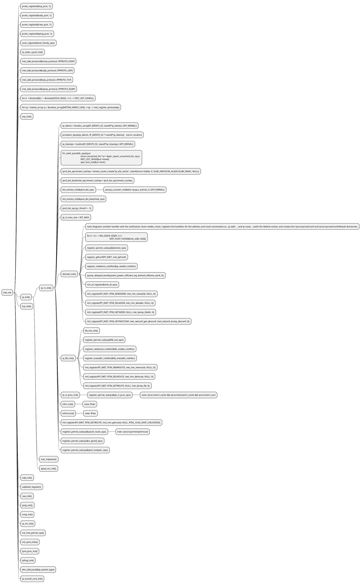
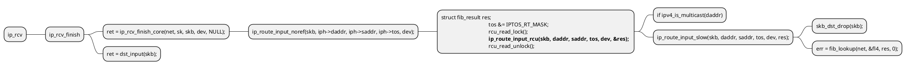

# Route

## The IPv4 Routing Subsystem


* Forwarding Information Base (FIB) It is often referred to simply as the routing table

### Forwarding and the FIB
One of the important goals of the Linux Networking stack is to forward traffic.

#### The basic of routing


you have two Ethernet Local Area Networks, LAN1 and LAN2. On LAN1 you have a subnet of 192.168.1.0/24, and on LAN2 you have a subnet of 192.168.2.0/24. There is a machine between these two LANs, which will be called a “forwarding router.” There are two Ethernet network interface cards (NICs) in the forwarding router. The network interface connected to LAN1 is eth0 and has an IP address of 192.168.1.200, and the network interface connected to LAN2 is eth1 and has an IP address of 192.168.2.200, as you can see in Figure 5-1. For the sake of simplicity, let’s assume that no firewall daemon runs on the forwarding router. You start sending traffic from LAN1, which is destined to LAN2. The process of forwarding incoming packets, which are sent from LAN1 and which are destined to LAN2 (or vice versa), according to data structures that are called routing tables, is called routing. I discuss this process and the routing table data structures in this chapter and in the next as well.

- default gateway : every packet that is not handled by the other routing entries (if there are such entries) must be forwarded to it, regardless of the destination address in the IP header of this packet. 
```sh
ip route add default via 192.168.2.1
```

- default route : The default route is designated as 0.0.0.0/0 in Classless Inter-Domain Routing (CIDR) notation.

#### Performing a Lookup in the Routing Subsystem
A lookup in the routing subsystem is done for each packet, both in the Rx path and in the Tx path

```c++
int fib_lookup(struct net *net, const struct flowi4 *flp, struct fib_result *res)
```
> fib_result: When the `fib_lookup()` method finds a proper entry in the routing subsystem, it builds a `fib_result` object, which consists of various routing parameters, and it returns 0.
> flowi4: consists of fields that are important to the IPv4 routing lookup process, including the destination address, source address, Type of Service (TOS), and more. For IPv6 there is a parallel object named flowi6

The fib_lookup() method first searches the local FIB table. If the lookup fails, it performs a lookup in the main FIB table

After a lookup is successfully done, either in the Rx path or the Tx path, a dst object is built (an instance of the dst_entry structure, the destination cache

The dst object is embedded in a structure called rtable
The rtable object, in fact, represents a routing entry which can be associated with an SKB

The most important members of the dst_entry object are two callbacks named input and output

```c
struct dst_entry {
    ...
    int  (*input)(struct sk_buff *);
    int  (*output)(struct sk_buff *);
    ...
}

struct fib_nh;
struct fib_info;
struct uncached_list;
struct rtable {
	struct dst_entry	dst;

	int			rt_genid;
	unsigned int		rt_flags;
	__u16			rt_type;
	__u8			rt_is_input;
	__u8			rt_uses_gateway;

	int			rt_iif;

	u8			rt_gw_family;
	/* Info on neighbour */
	union {
		__be32		rt_gw4;
		struct in6_addr	rt_gw6;
	};

	/* Miscellaneous cached information */
	u32			rt_mtu_locked:1,
				rt_pmtu:31;

	struct list_head	rt_uncached;
	struct uncached_list	*rt_uncached_list;
};
```

- rt_flags: The rtable object flags; some of the important flags are mentioned here:
  - RTCF_BROADCAST: When set, the destination address is a broadcast address. This flag is set in the `__mkroute_output()` method and in the `ip_route_input_slow()` method.
  - RTCF_MULTICAST: When set, the destination address is a multicast address. This flag is set in the ip_route_input_mc() method and in the `__mkroute_output()` method.
  - RTCF_DOREDIRECT: When set, an ICMPv4 Redirect message should be sent as a response for an incoming packet. Several conditions should be fulfilled for this flag to be set, including that the input device and the output device are the same and the corresponding procfs send_redirects entry is set. There are more conditions, as you will see later in this chapter. This flag is set in the `__mkroute_input()` method.
   - RTCF_LOCAL: When set, the destination address is local. This flag is set in the following methods: `ip_route_input_slow()`, `__mkroute_output()`, `ip_route_input_mc()` and `__ip_route_output_key()`. Some of the RTCF_XXX flags can be set simultaneously. For example, RTCF_LOCAL can be set when RTCF_BROADCAST or RTCF_MULTICAST are set. For the complete list of RTCF_ XXX flags, look in include/uapi/linux/in_route.h. Note that some of them are unused.
- rt_is_input: A flag that is set to 1 when this is an input route.
- rt_uses_gateway: Gets a value according to the following:
  - When the nexthop is a gateway, rt_uses_gateway is 1.
  - When the nexthop is a direct route, rt_uses_gateway is 0.
- rt_iif: The ifindex of the incoming interface. (Note that the rt_oif member was removed from the rtable structure in kernel 3.6; it was set to the oif of the specified flow key, but was used in fact only in one method).
- rt_pmtu: The Path MTU (the smallest MTU along the route).

- For incoming unicast packets destined to the local host, the input callback of the dst object is set to ip_local_deliver()
- for incoming unicast packets that should be forwarded, this input callback is set to ip_forward()
- For a packet generated on the local machine and sent away, the output callback is set to be ip_output()
- For a multicast packet, the input callback can be set to ip_mr_input()
- There are cases when the input callback is set to be ip_error()

```c
struct fib_table;
struct fib_result {
	__be32			prefix;
	unsigned char		prefixlen;
	unsigned char		nh_sel;
	unsigned char		type;
	unsigned char		scope;
	u32			tclassid;
	struct fib_nh_common	*nhc;
	struct fib_info		*fi;
	struct fib_table	*table;
	struct hlist_head	*fa_head;
};
```

- prefixlen: The prefix length, which represents the netmask. Its values are in the range 0 to 32. It is 0 when using the default route. When adding, for example, a routing entry by ip route add 192.168.2.0/24 dev eth0, the prefixlen is 24, according to the netmask which was specified when adding the entry. The prefixlen is set in the check_leaf() method (net/ipv4/fib_trie.c).
- nh_sel: The nexthop number. When working with one nexthop only, it is 0. When working with Multipath Routing, there can be more than one nexthop. The nexthop objects are stored in an array in the routing entry (inside the fib_info object), as discussed in the next section.
- type: The type of the fib_result object is the most important field because it determines in fact how to handle the packet: whether to forward it to a different machine, deliver it locally, discard it silently, discard it with replying with an ICMPv4 message, and so on. The type of the fib_result object is determined according to the packet content (most notably the destination address) and according to routing rules set by the administrator, routing daemons, or a Redirect message. You will see how the type of the fib_result object is determined in the lookup process later in this chapter and in the next. The two most common types of the fib_result objects are the RTN_UNICAST type, which is set when the packet is for forwarding via a gateway or a direct route, and the RTN_LOCAL type, which is set when the packet is for the local host. Other types you will encounter in this book are the RTN_BROADCAST type, for packets that should be accepted locally as broadcasts, the RTN_MULTICAST type, for multicast routes, the RTN_UNREACHABLE type, for packets which trigger sending back an ICMPv4 "Destination Unreachable" message, and more. There are 12 route types in all. For a complete list of all available route types, see include/uapi/linux/rtnetlink.h.
- fi: A pointer to a fib_info object, which represents a routing entry. The fib_info object holds a reference to the nexthop (fib_nh). I discuss the FIB info structure in the section “FIB Info” later in this chapter.
- table: A pointer to the FIB table on which the lookup is done. It is set in the check_leaf() method (net/ipv4/fib_trie.c).
- fa_head: A pointer to a fib_alias list (a list of fib_alias objects associated with this route); optimization of routing entries is done when using fib_alias objects, which avoids creating a separate fib_info object for each routing entry, regardless of the fact that there are other fib_info objects which are very similar. All FIB aliases are sorted by fa_tos descending and fib_priority (metric) ascending. Aliases whose fa_tos is 0 are the last and can match any TOS. I discuss the fib_alias structure in the section “FIB Alias” later in this chapter.

#### FIB Tables
The main data structure of the routing subsystem is the routing table, which is represented by the `fib_table` structure. 
A routing table can be described, in a somewhat simplified way, as a table of entries where each entry determines which nexthop should be chosen for traffic destined to a subnet (or to a specific IPv4 destination address). This entry has other parameters, of course, discussed later in this chapter. Each routing entry contains a `fib_info` object (`include/net/ip_fib.h`), which stores the most important routing entry parameters (but not all, as you will see later in this chapter). The `fib_info` object is created by the `fib_create_info()` method (`net/ipv4/fib_semantics.c`) and is stored in a hash table named `fib_info_hash`. When the route uses prefsrc, the `fib_info` object is added also to a hash table named `fib_info_laddrhash`.

```c
struct fib_table {
        struct hlist_node       tb_hlist;
        u32                     tb_id;
        int                     tb_default;
        int                     tb_num_default;
        unsigned long           tb_data[0];
};
```

- tb_id: The table identifier. For the main table, tb_id is **254** (`RT_TABLE_MAIN`), and for the local table, tb_id is **255** (`RT_TABLE_LOCAL`). I talk about the main table and the local table soon—for now, just note that when working without Policy Routing, only these two FIB tables, the main table and the local table, are created in boot.
- tb_num_default: The number of the default routes in the table. The fib_trie_table() method, which creates a table, initializes tb_num_default to 0. Adding a default route increments tb_num_default by 1, by the `fib_table_insert()` method. Deleting a default route decrements tb_num_default by 1, by the fib_table_delete() method.
- tb_data[0] : A placeholder for a routing entry (trie) object.

**FIB Info**
A routing entry is represented by a fib_info structure. It consists of important routing entry parameters, such as the outgoing network device (fib_dev), the priority (fib_priority), the routing protocol identifier of this route (fib_protocol), and more. Let’s take a look at the fib_info structure:
```c
struct fib_info {
    struct hlist_node    fib_hash;
    struct hlist_node    fib_lhash;
    struct net        *fib_net;
    int               fib_treeref;
    atomic_t          fib_clntref;
    unsigned int      fib_flags;
    unsigned char     fib_dead;
    unsigned char     fib_protocol;
    unsigned char     fib_scope;
    unsigned char     fib_type;
    __be32            fib_prefsrc;
    u32               fib_priority;
    u32               *fib_metrics;
#define fib_mtu fib_metrics[RTAX_MTU-1]
#define fib_window fib_metrics[RTAX_WINDOW-1]
#define fib_rtt fib_metrics[RTAX_RTT-1]
#define fib_advmss fib_metrics[RTAX_ADVMSS-1]
    int               fib_nhs;
#ifdef CONFIG_IP_ROUTE_MULTIPATH
    int               fib_power;
#endif
    struct rcu_head   rcu;
    struct fib_nh     fib_nh[0];
#define fib_dev       fib_nh[0].nh_dev
};
```

- fib_net: The network namespace the `fib_info` object belongs to.
- fib_treeref: A reference counter that represents the number of `fib_alias` objects which hold a reference to this `fib_info` object. This reference counter is incremented in the `fib_create_info()` method and decremented in the `fib_release_info()` method. Both methods are in `net/ipv4/fib_semantics.c`.
- fib_clntref: A reference counter that is incremented by the `fib_create_info()` method (`net/ipv4/fib_semantics.c`) and decremented by the `fib_info_put()` method (`include/net/ip_fib.h`). If, after decrementing it by 1 in the `fib_info_put()` method, it reaches zero, than the associated fib_info object is freed by the `free_fib_info()` method.
- fib_dead: A flag that indicates whether it is permitted to free the `fib_info` object with the `free_fib_info()` method; `fib_dead` must be set to 1 before calling the `free_fib_info()` method. If the fib_dead flag is not set (its value is 0), then it is considered alive, and trying to free it with the `free_fib_info()` method will fail.
- fib_protocol: The routing protocol identifier of this route. When adding a routing rule from userspace without specifying the routing protocol ID, the fib_protocol is assigned to be `RTPROT_BOOT`. The administrator may add a route with the “proto static” modifier, which indicates that the route was added by an administrator; this can be done, for example, like this: `ip route add proto static 192.168.5.3 via 192.168.2.1`. The `fib_protocol` can be assigned one of these flags:
    - RTPROT_UNSPEC: An error value.
    - RTPROT_REDIRECT: When set, the routing entry was created as a result of receiving an ICMP Redirect message. The RTPROT_REDIRECT protocol identifier is used only in IPv6.
    - RTPROT_KERNEL: When set, the routing entry was created by the kernel (for example, when creating the local IPv4 routing table, explained shortly).
    - RTPROT_BOOT: When set, the admin added a route without specifying the “proto static” modifier.
  - RTPROT_STATIC: Route installed by system administrator.
  - RTPROT_RA: Don’t misread this— this protocol identifier is not for Router Alert; it is for RDISC/ND Router Advertisements, and it is used in the kernel by the IPv6 subsystem only; see: net/ipv6/route.c.
- fib_scope: The scope of the destination address. In short, scopes are assigned to addresses and routes. Scope indicates the distance of the host from other nodes. The `ip address show` command shows the scopes of all configured IP addresses on a host. The `ip route show` command displays the scopes of all the route entries of the main table. A scope can be one of these:
  - host (RT_SCOPE_HOST): The node cannot communicate with the other network nodes. The loopback address has scope host.
  - global (RT_SCOPE_UNIVERSE): The address can be used anywhere. This is the most common case.
  - link (RT_SCOPE_LINK): This address can be accessed only from directly attached hosts.
  - site (RT_SCOPE_SITE): This is used in IPv6 only (I discuss it in Chapter 8).
  - nowhere (RT_SCOPE_NOWHERE): Destination doesn't exist.

  When a route is added by an administrator without specifying a scope, the fib_scope field is assigned a value according to these rules:
  - global scope (RT_SCOPE_UNIVERSE): For all gatewayed unicast routes.
  - scope link (RT_SCOPE_LINK): For direct unicast and broadcast routes.
  - scope host (RT_SCOPE_HOST): For local routes.

- fib_type: The type of the route. The fib_type field was added to the fib_info structure as a key to make sure there is differentiation among fib_info objects by their type. The fib_type field was added to the fib_info struct in kernel 3.7. You can add a rule to block traffic according to a specified category, for example, by: `ip route add prohibit 192.168.1.17 from 192.168.2.103`.
- fib_prefsrc: There are cases when you want to provide a specific source address to the lookup key. This is done by setting `fib_prefsrc`.
- fib_priority: The priority of the route, by default, is 0, which is the **highest** priority. The higher the value of the priority, the lower the priority is. For example, a priority of 3 is lower than a priority of 0, which is the highest priority. You can configure it, for example, with the ip command, in one of the following ways:  
  ```ip route add 192.168.1.10 via 192.168.2.1 metric 5```  
  ```ip route add 192.168.1.10 via 192.168.2.1 priority 5```  
  ```ip route add 192.168.1.10 via 192.168.2.1 preference 5```  
  Each of these three commands sets the fib_priority to 5; there is no difference at all between them. 
- fib_mtu, fib_window, fib_rtt, and fib_advmss simply give more convenient names to commonly used elements of the fib_metrics array. fib_metrics is an array of 15 (RTAX_MAX) elements consisting of various metrics. It is initialized to be dst_default_metrics in net/core/dst.c. Many metrics are related to the TCP protocol, such as the Initial Congestion Window (initcwnd) metric. Table 5-1, at the end of the chapter shows all the available metrics and displays whether each is a TCP-related metric or not. From userspace, the TCPv4 initcwnd metric can be set thus, for example:  
  ```ip route add 192.168.1.0/24 initcwnd 35```
- fib_nhs: The number of nexthops. When Multipath Routing (`CONFIG_IP_ROUTE_MULTIPATH`) is not set, it cannot be more than 1. The Multipath Routing feature sets multiple alternative paths for a route, possibly assigning different weights to these paths. This feature provides benefits such as fault tolerance, increased bandwidth, or improved security.
- fib_dev: The network device that will transmit the packet to the nexthop.
- fib_nh[0]: The fib_nh[0] member represents the nexthop. When working with Multipath Routing, you can define more than one nexthop in a route, and in this case there is an array of nexthops. Defining two nexthop nodes can be done like this, for example:   
`ip route add default scope global nexthop dev eth0 nexthop dev eth1`.

**Nexthop (fib_nh)**
The fib_nh structure represents the nexthop. It consists of information such as the outgoing nexthop network device (nh_dev), outgoing nexthop interface index (nh_oif), the scope (nh_scope), and more. Let’s take a look:
```c
struct fib_nh {
    struct net_device       *nh_dev;
    struct hlist_node       nh_hash;
    struct fib_info         *nh_parent;
    unsigned int            nh_flags;
    unsigned char           nh_scope;
#ifdef CONFIG_IP_ROUTE_MULTIPATH
    int                     nh_weight;
    int                     nh_power;
#endif
#ifdef CONFIG_IP_ROUTE_CLASSID
    __u32                   nh_tclassid;
#endif
    int                     nh_oif;
    __be32                  nh_gw;
    __be32                  nh_saddr;
    int                     nh_saddr_genid;
    struct rtable __rcu * __percpu *nh_pcpu_rth_output;
    struct rtable __rcu     *nh_rth_input;
    struct fnhe_hash_bucket *nh_exceptions;
};
```
- nh_dev: represents the network device (`net_device` object) on which traffic to the nexthop will be transmitted. When a network device associated with one or more routes is disabled, a NETDEV_DOWN notification is sent. The FIB callback for handling this event is the `fib_netdev_event()` method, it is the callback of the `fib_netdev_notifier` notifier object, which is registered in the `ip_fib_init()` method by calling the `register_netdevice_notifier()` method (notification chains are discussed in Chapter 14). The `fib_netdev_event()` method calls the `fib_disable_ip()` method upon receiving a `NETDEV_DOWN` notification. In the `fib_disable_ip()` method, the following steps are performed:
  - First, the `fib_sync_down_dev()` method is called (`net/ipv4/fib_semantics.c`). In the `fib_sync_down_dev()` method, the `RTNH_F_DEAD` flag of the nexthop flags (`nh_flags`) is set and the FIB info flags (`fib_flags`) is set.
  - The routes are flushed by the fib_flush() method.
  - The `rt_cache_flush()` method and the `arp_ifdown()` method are invoked. The `arp_ifdown()` method is not on any notifier chain.


### Policy Routing 
When working without Policy Routing (`CONFIG_IP_MULTIPLE_TABLES` is not set), two routing tables are created: the **local** table and the **main** table. The main table id is **254** (`RT_TABLE_MAIN`), and the local table id is **255** (`RT_TABLE_LOCAL`). The local table contains routing entries of local addresses. These routing entries can be added to the local table only by the kernel. Adding routing entries to the `main` table (`RT_TABLE_MAIN`) is done by a system administrator (via `ip route add`, for example). These tables are created by the `fib4_rules_init()` method of `net/ipv4/fib_frontend.c`. These tables were called `ip_fib_local_table` and `ip_fib_main_table` in kernels prior to 2.6.25, but they were removed in favor of using unified access to the routing tables with the `fib_get_table()` method with appropriate argument. By unified access, I mean that access to the routing tables is done in the same way, with the `fib_get_table()` method, both when Policy Routing support is enabled and when it is disabled. The `fib_get_table()` method gets only two arguments: the network namespace and the table id. **Note that there is a different method with the same name, `fib4_rules_init()`, for the Policy Routing case, in net/ipv4/fib_rules.c**, which is invoked when working with Policy Routing support. When working with Policy Routing support (`CONFIG_IP_MULTIPLE_TABLES` is set), there are three initial tables (`local`, `main`, and `default`), and there can be up to 255 routing tables. Access to the **main** routing table can be done as follows:

- By a system administrator command (using `ip route`):
- Adding a route by `ip route add` is implemented by sending `RTM_NEWROUTE` message from userspace, which is handled by the `inet_rtm_newroute()` method. Note that a route is not necessarily always a rule that permits traffic. You can also add a route that blocks traffic, for example, by `ip route add prohibit 192.168.1.17 from 192.168.2.103`. As a result of applying this rule, all packets sent from 192.168.2.103 to 192.168.1.17 will be blocked.
- Deleting a route by `ip route del` is implemented by sending `RTM_DELROUTE` message from userspace, which is handled by the `inet_rtm_delroute()` method.
- Dumping a routing table by `ip route show` is implemented by sending `RTM_GETROUTE` message from userspace, which is handled by the `inet_dump_fib()` method.

> Note that `ip route show` displays the **main** table. For displaying the local table, you should run `ip route show table local`.

- Adding a route by `route add` is implemented by sending `SIOCADDRT IOCTL`, which is handled by the `ip_rt_ioctl()` method (`net/ipv4/fib_frontend.c`).
- Deleting a route by `route del` is implemented by sending `SIOCDELRT IOCTL`, which is handled by the `ip_rt_ioctl()` method (`net/ipv4/fib_frontend.c`).
- By userspace routing daemons which implement routing protocols like BGP (Border Gateway Protocol), EGP (Exterior Gateway Protocol), OSPF (Open Shortest Path First), or others. These routing daemons run on core routers, which operate in the Internet backbone, and can handle hundreds of thousands of routes.
I should mention here that routes that were changed as a result of an ICMPv4 REDIRECT message or as a result of Path MTU discovery are cached in the nexthop exception table, discussed shortly. The next section describes the FIB alias, which helps in routing optimizations.

**FIB Alias (fib_alias)**

There are cases when several routing entries to the same destination address or to the same subnet are created. These routing entries differ only in the value of their TOS. Instead of creating a fib_info for each such route, a fib_alias object is created. A fib_alias is smaller, which reduces memory consumption. Here is a simple example of creating 3 fib_alias objects:

```sh
ip route add 192.168.1.10 via 192.168.2.1 tos 0x2
ip route add 192.168.1.10 via 192.168.2.1 tos 0x4
ip route add 192.168.1.10 via 192.168.2.1 tos 0x6
```

```c
struct fib_alias {
        struct list_head        fa_list;
        struct fib_info         *fa_info;
        u8                      fa_tos;
        u8                      fa_type;
        u8                      fa_state;
        struct rcu_head         rcu;
};
```

The `fib_alias` object stores routes to the same subnet but with different parameters. You can have one `fib_info` object which will be shared by many `fib_alias` objects. The `fa_info` pointer in all these `fib_alias` objects, in this case, will point to the same shared `fib_info` object. you can see one `fib_info` object which is shared by three `fib_alias` objects, each with a different `fa_tos`. Note that the reference counter value of the `fib_info` object is 3 (fib_treeref).


### Rx Path

In the Rx path, first the `ip_route_input_common()` method is invoked. This method performs a lookup in the IPv4 routing cache, which is much quicker than the lookup in the IPv4 routing tables. Lookup in these routing tables is based on the Longest Prefix Match (LPM) search algorithm. With the LPM search, the most specific table entry—the one with the highest subnet mask—is called the Longest Prefix Match. In case the lookup in the routing cache fails (“cache miss”), a lookup in the routing tables is being performed by calling the `ip_route_input_slow()` method. This method calls the `fib_lookup()` method to perform the actual lookup. Upon success, it calls the `ip_mkroute_input()` method which (among other actions) inserts the routing entry into the routing cache by calling the `rt_intern_hash()` method.

### Tx Path

In the Tx path, first the `ip_route_output_key()` method is invoked. This method performs a lookup in the IPv4 routing cache. In case of a cache miss, it calls the `ip_route_output_slow()` method, which calls the `fib_lookup()` method to perform a lookup in the routing subsystem. Subsequently, upon success, it calls the `ip_mkroute_output()` method which (among other actions) inserts the routing entry into the routing cache by calling the `rt_intern_hash()` method.


### Kernel Options

- The ones that are always supported, and that only need to be enabled or configured by the user, such as via /proc.
- The ones whose support may be added or removed by recompiling the kernel with the right options. The CONFIG_WAN_ROUTER option and the options under the CONFIG_IP_ROUTE_MULTIPATH_CACHED menu can be compiled as modules; the others must be compiled into the main kernel.

#### These options can be configured from the Networking Options menu, as shown in the make xconfig

### Routing Subsystem Initialization
The initialization of the IPv4 routing code starts in net/ipv4/route.c with ip_rt_init, which is called by the IP subsystem when it is initialized with ip_init in net/ipv4/ip_output.c at boot time. ip_init is described in Chapter 19; here we will see ip_rt_init.



<svg id="mindmap"></svg>
<script src="https://cdn.jsdelivr.net/npm/d3@6.3.0"></script><script src="https://cdn.jsdelivr.net/npm/markmap-view@0.2.0"></script><script>((e,t)=>{const{Markmap:r}=e();window.mm=r.create("svg#mindmap",null,t)})(()=>window.markmap,{"t":"list_item","d":2,"p":{},"v":"inet_init","c":[{"t":"list_item","d":4,"p":{},"v":"proto_register(&amp;tcp_prot, 1);"},{"t":"list_item","d":4,"p":{},"v":"proto_register(&amp;udp_prot, 1);"},{"t":"list_item","d":4,"p":{},"v":"proto_register(&amp;raw_prot, 1);"},{"t":"list_item","d":4,"p":{},"v":"proto_register(&amp;ping_prot, 1);"},{"t":"list_item","d":4,"p":{},"v":"sock_register(&amp;inet_family_ops);"},{"t":"list_item","d":4,"p":{},"v":"ip_static_sysctl_init();"},{"t":"list_item","d":4,"p":{},"v":"inet_add_protocol(&amp;icmp_protocol, IPPROTO_ICMP)"},{"t":"list_item","d":4,"p":{},"v":"inet_add_protocol(&amp;udp_protocol, IPPROTO_UDP)"},{"t":"list_item","d":4,"p":{},"v":"inet_add_protocol(&amp;tcp_protocol, IPPROTO_TCP)"},{"t":"list_item","d":4,"p":{},"v":"inet_add_protocol(&amp;igmp_protocol, IPPROTO_IGMP)"},{"t":"list_item","d":4,"p":{},"v":"for (r = &amp;inetsw[0]; r &lt; &amp;inetsw[SOCK_MAX]; ++r) --&gt; INIT_LIST_HEAD(r);"},{"t":"list_item","d":4,"p":{},"v":"for (q = inetsw_array; q &lt; &amp;inetsw_array[INETSW_ARRAY_LEN]; ++q) --&gt; inet_register_protosw(q);"},{"t":"list_item","d":4,"p":{},"v":"arp_init();"},{"t":"list_item","d":4,"p":{},"v":"ip_init();","c":[{"t":"list_item","d":6,"p":{},"v":"ip_rt_init();","c":[{"t":"list_item","d":8,"p":{},"v":"ip_idents = kmalloc_array(IP_IDENTS_SZ, sizeof(*ip_idents), GFP_KERNEL);"},{"t":"list_item","d":8,"p":{},"v":"prandom_bytes(ip_idents, IP_IDENTS_SZ * sizeof(*ip_idents));   (set to random)"},{"t":"list_item","d":8,"p":{},"v":"ip_tstamps = kcalloc(IP_IDENTS_SZ, sizeof(*ip_tstamps), GFP_KERNEL);"},{"t":"list_item","d":8,"p":{},"v":"for_each_possible_cpu(cpu) \\n<br>\nstruct uncached_list *ul = &amp;per_cpu(rt_uncached_list, cpu); \\n<br>\nINIT_LIST_HEAD(&amp;ul-&gt;head); \\n<br>\nspin_lock_init(&amp;ul-&gt;lock);"},{"t":"list_item","d":8,"p":{},"v":"ipv4_dst_ops.kmem_cachep = kmem_cache_create(&quot;ip_dst_cache&quot;, sizeof(struct rtable), 0, SLAB_HWCACHE_ALIGN|SLAB_PANIC, NULL);"},{"t":"list_item","d":8,"p":{},"v":"ipv4_dst_blackhole_ops.kmem_cachep = ipv4_dst_ops.kmem_cachep;"},{"t":"list_item","d":8,"p":{},"v":"dst_entries_init(&amp;ipv4_dst_ops)","c":[{"t":"list_item","d":10,"p":{},"v":"percpu_counter_init(&amp;dst-&gt;pcpuc_entries, 0, GFP_KERNEL);"}]},{"t":"list_item","d":8,"p":{},"v":"dst_entries_init(&amp;ipv4_dst_blackhole_ops)"},{"t":"list_item","d":8,"p":{},"v":"ipv4_dst_ops.gc_thresh = ~0;"},{"t":"list_item","d":8,"p":{},"v":"ip_rt_max_size = INT_MAX;"},{"t":"list_item","d":8,"p":{},"v":"devinet_init();","c":[{"t":"list_item","d":10,"p":{},"v":"note: Registers another handler with the notification chain netdev_chain, registers the handlers for the address and route commands (i.e., ip addr ... and ip route ...) with the Netlink socket, and creates the /proc/sys/net/conf and /proc/sys/net/conf/default directories."},{"t":"list_item","d":10,"p":{},"v":"for (i = 0; i &lt; IN4_ADDR_HSIZE; i++) \\n <br>\nINIT_HLIST_HEAD(&amp;inet_addr_lst[i]);"},{"t":"list_item","d":10,"p":{},"v":"register_pernet_subsys(&amp;devinet_ops);"},{"t":"list_item","d":10,"p":{},"v":"register_gifconf(PF_INET, inet_gifconf);"},{"t":"list_item","d":10,"p":{},"v":"register_netdevice_notifier(&amp;ip_netdev_notifier);"},{"t":"list_item","d":10,"p":{},"v":"queue_delayed_work(system_power_efficient_wq, &amp;check_lifetime_work, 0);"},{"t":"list_item","d":10,"p":{},"v":"rtnl_af_register(&amp;inet_af_ops);"},{"t":"list_item","d":10,"p":{},"v":"rtnl_register(PF_INET, RTM_NEWADDR, inet_rtm_newaddr, NULL, 0);"},{"t":"list_item","d":10,"p":{},"v":"rtnl_register(PF_INET, RTM_DELADDR, inet_rtm_deladdr, NULL, 0);"},{"t":"list_item","d":10,"p":{},"v":"rtnl_register(PF_INET, RTM_GETADDR, NULL, inet_dump_ifaddr, 0);"},{"t":"list_item","d":10,"p":{},"v":"rtnl_register(PF_INET, RTM_GETNETCONF, inet_netconf_get_devconf, inet_netconf_dump_devconf, 0);"}]},{"t":"list_item","d":8,"p":{},"v":"ip_fib_init();","c":[{"t":"list_item","d":10,"p":{},"v":"fib_trie_init();"},{"t":"list_item","d":10,"p":{},"v":"register_pernet_subsys(&amp;fib_net_ops);"},{"t":"list_item","d":10,"p":{},"v":"register_netdevice_notifier(&amp;fib_netdev_notifier);"},{"t":"list_item","d":10,"p":{},"v":"register_inetaddr_notifier(&amp;fib_inetaddr_notifier);"},{"t":"list_item","d":10,"p":{},"v":"rtnl_register(PF_INET, RTM_NEWROUTE, inet_rtm_newroute, NULL, 0);"},{"t":"list_item","d":10,"p":{},"v":"rtnl_register(PF_INET, RTM_DELROUTE, inet_rtm_delroute, NULL, 0);"},{"t":"list_item","d":10,"p":{},"v":"rtnl_register(PF_INET, RTM_GETROUTE, NULL, inet_dump_fib, 0);"}]},{"t":"list_item","d":8,"p":{},"v":"ip_rt_proc_init()","c":[{"t":"list_item","d":10,"p":{},"v":"register_pernet_subsys(&amp;ip_rt_proc_ops);","c":[{"t":"list_item","d":12,"p":{},"v":"note: /proc/net/rt_cache &amp;&amp; /proc/net/stat/rt_cache &amp;&amp; /proc/net/rt_acct"}]}]},{"t":"list_item","d":8,"p":{},"v":"xfrm_init();","c":[{"t":"list_item","d":10,"p":{},"v":"note: IPsec"}]},{"t":"list_item","d":8,"p":{},"v":"xfrm4_init()","c":[{"t":"list_item","d":10,"p":{},"v":"note: IPsec"}]},{"t":"list_item","d":8,"p":{},"v":"rtnl_register(PF_INET, RTM_GETROUTE, inet_rtm_getroute, NULL, RTNL_FLAG_DOIT_UNLOCKED);"},{"t":"list_item","d":8,"p":{},"v":"register_pernet_subsys(&amp;sysctl_route_ops);","c":[{"t":"list_item","d":10,"p":{},"v":"note: /proc/sys/net/ipv4/route"}]},{"t":"list_item","d":8,"p":{},"v":"register_pernet_subsys(&amp;rt_genid_ops);"},{"t":"list_item","d":8,"p":{},"v":"register_pernet_subsys(&amp;ipv4_inetpeer_ops);"}]},{"t":"list_item","d":6,"p":{},"v":"inet_initpeers();"},{"t":"list_item","d":6,"p":{},"v":"igmp_mc_init();"}]},{"t":"list_item","d":4,"p":{},"v":"tcp_init();"},{"t":"list_item","d":4,"p":{},"v":"udp_init();"},{"t":"list_item","d":4,"p":{},"v":"udplite4_register();"},{"t":"list_item","d":4,"p":{},"v":"raw_init();"},{"t":"list_item","d":4,"p":{},"v":"ping_init();"},{"t":"list_item","d":4,"p":{},"v":"icmp_init()"},{"t":"list_item","d":4,"p":{},"v":"ip_mr_init()"},{"t":"list_item","d":4,"p":{},"v":"init_inet_pernet_ops()"},{"t":"list_item","d":4,"p":{},"v":"init_ipv4_mibs()"},{"t":"list_item","d":4,"p":{},"v":"ipv4_proc_init()"},{"t":"list_item","d":4,"p":{},"v":"ipfrag_init()"},{"t":"list_item","d":4,"p":{},"v":"dev_add_pack(&amp;ip_packet_type)"},{"t":"list_item","d":4,"p":{},"v":"ip_tunnel_core_init()"}]})</script>


```c
static struct dst_ops ipv4_dst_ops = {
	.family =		AF_INET,
	.check =		ipv4_dst_check,
	.default_advmss =	ipv4_default_advmss,
	.mtu =			ipv4_mtu,
	.cow_metrics =		ipv4_cow_metrics,
	.destroy =		ipv4_dst_destroy,
	.negative_advice =	ipv4_negative_advice,
	.link_failure =		ipv4_link_failure,
	.update_pmtu =		ip_rt_update_pmtu,
	.redirect =		ip_do_redirect,
	.local_out =		__ip_local_out,
	.neigh_lookup =		ipv4_neigh_lookup,
	.confirm_neigh =	ipv4_confirm_neigh,
};

static struct dst_ops ipv4_dst_blackhole_ops = {
	.family			=	AF_INET,
	.check			=	ipv4_blackhole_dst_check,
	.mtu			=	ipv4_blackhole_mtu,
	.default_advmss		=	ipv4_default_advmss,
	.update_pmtu		=	ipv4_rt_blackhole_update_pmtu,
	.redirect		=	ipv4_rt_blackhole_redirect,
	.cow_metrics		=	ipv4_rt_blackhole_cow_metrics,
	.neigh_lookup		=	ipv4_neigh_lookup,
};
```

- fib_netdev_event updates the routing tables.
- fib_rules_event updates the policy database, when policy routing is in effect.
- ip_netdev_event updates the device’s IP configuration.[*]

### Organization of Routing Hash Tables
To support the key goal of returning information quickly for a wide variety of operations, Linux defines a number of different hash tables that point to the same data structures describing routes:
- A set of hash tables that access routes based on their netmask length
- A set of hash tables that search fib_info structures directly
- One hash table, indexed on the network device, used to quickly search the next hops of the configured routes
- One hash table that, indegiven a route and a device, quickly identifies the gateway used by the route’s next hop


ORGANIZATION OF PER-NETMASK TABLES

At the highest level, routes are organized into different hash tables based on the lengths of their netmasks. Because IPv4 uses 32-bit addresses, 33 different netmask lengths (ranging from /0 to /32, where /0 represents default routes) can be associated with an IP address. The routing subsystem maintains a different hash table for each netmask length. These hash tables are then combined into other tables

Basic structures for hash table organization

pointers, one for each netmask, and each pointing to a data structure of type fn_zone. (The term zone refers to the networks that share a single netmask.) The fn_zone structures organize routes into hash tables, so routes that lead to destination networks with the same netmask length share the same hash table. Therefore, given any route, its associated hash table can be quickly identified by the route’s netmask length. Nonempty fn_zone buckets are linked together, and the head of the list is saved in fn_zone_list

For each unique subnet there is one instance of fib_node, identified by a variable named fn_key whose value is the subnet. For example, given the subnet 10.1.1.0/24, fn_key is 10.1.1. Note that the fib_node structure (and therefore its fn_key variable) is associated to a subnet, not to a single route; it’s important to keep this in mind to avoid confusion later. The importance of this detail derives from the possibility of having different routes to the same subnet.

Different routes leading to the same subnet (i.e., the same fn_key) share the same fib_node. Each route is assigned its own fib_alias structure. You can have, for instance, different routes leading to the same subnet and differing only with regard to the TOS values: each fib_alias instance would therefore be assigned a different TOS value. Each fib_alias instance is associated with a fib_info structure, which stores the real routing information (i.e., how to get to the destination).



```c
/*
 *	NOTE. We drop all the packets that has local source
 *	addresses, because every properly looped back packet
 *	must have correct destination already attached by output routine.
 *	Changes in the enforced policies must be applied also to
 *	ip_route_use_hint().
 *
 *	Such approach solves two big problems:
 *	1. Not simplex devices are handled properly.
 *	2. IP spoofing attempts are filtered with 100% of guarantee.
 *	called with rcu_read_lock()
 */

static int ip_route_input_slow(struct sk_buff *skb, __be32 daddr, __be32 saddr,
			       u8 tos, struct net_device *dev,
			       struct fib_result *res)
{
	struct in_device *in_dev = __in_dev_get_rcu(dev);
	struct flow_keys *flkeys = NULL, _flkeys;
	struct net    *net = dev_net(dev);
	struct ip_tunnel_info *tun_info;
	int		err = -EINVAL;
	unsigned int	flags = 0;
	u32		itag = 0;
	struct rtable	*rth;
	struct flowi4	fl4;
	bool do_cache = true;

	/* IP on this device is disabled. */

	if (!in_dev)
		goto out;

	/* Check for the most weird martians, which can be not detected
	   by fib_lookup.
	 */

	tun_info = skb_tunnel_info(skb);
	if (tun_info && !(tun_info->mode & IP_TUNNEL_INFO_TX))
		fl4.flowi4_tun_key.tun_id = tun_info->key.tun_id;
	else
		fl4.flowi4_tun_key.tun_id = 0;
	skb_dst_drop(skb);

	if (ipv4_is_multicast(saddr) || ipv4_is_lbcast(saddr))
		goto martian_source;

	res->fi = NULL;
	res->table = NULL;
	if (ipv4_is_lbcast(daddr) || (saddr == 0 && daddr == 0))
		goto brd_input;

	/* Accept zero addresses only to limited broadcast;
	 * I even do not know to fix it or not. Waiting for complains :-)
	 */
	if (ipv4_is_zeronet(saddr))
		goto martian_source;

	if (ipv4_is_zeronet(daddr))
		goto martian_destination;

	/* Following code try to avoid calling IN_DEV_NET_ROUTE_LOCALNET(),
	 * and call it once if daddr or/and saddr are loopback addresses
	 */
	if (ipv4_is_loopback(daddr)) {
		if (!IN_DEV_NET_ROUTE_LOCALNET(in_dev, net))
			goto martian_destination;
	} else if (ipv4_is_loopback(saddr)) {
		if (!IN_DEV_NET_ROUTE_LOCALNET(in_dev, net))
			goto martian_source;
	}

	/*
	 *	Now we are ready to route packet.
	 */
	fl4.flowi4_oif = 0;
	fl4.flowi4_iif = dev->ifindex;
	fl4.flowi4_mark = skb->mark;
	fl4.flowi4_tos = tos;
	fl4.flowi4_scope = RT_SCOPE_UNIVERSE;
	fl4.flowi4_flags = 0;
	fl4.daddr = daddr;
	fl4.saddr = saddr;
	fl4.flowi4_uid = sock_net_uid(net, NULL);

	if (fib4_rules_early_flow_dissect(net, skb, &fl4, &_flkeys)) {
		flkeys = &_flkeys;
	} else {
		fl4.flowi4_proto = 0;
		fl4.fl4_sport = 0;
		fl4.fl4_dport = 0;
	}

	err = fib_lookup(net, &fl4, res, 0);
	if (err != 0) {
		if (!IN_DEV_FORWARD(in_dev))
			err = -EHOSTUNREACH;
		goto no_route;
	}

	if (res->type == RTN_BROADCAST) {
		if (IN_DEV_BFORWARD(in_dev))
			goto make_route;
		/* not do cache if bc_forwarding is enabled */
		if (IPV4_DEVCONF_ALL(net, BC_FORWARDING))
			do_cache = false;
		goto brd_input;
	}

	if (res->type == RTN_LOCAL) {
		err = fib_validate_source(skb, saddr, daddr, tos,
					  0, dev, in_dev, &itag);
		if (err < 0)
			goto martian_source;
		goto local_input;
	}

	if (!IN_DEV_FORWARD(in_dev)) {
		err = -EHOSTUNREACH;
		goto no_route;
	}
	if (res->type != RTN_UNICAST)
		goto martian_destination;

make_route:
	err = ip_mkroute_input(skb, res, in_dev, daddr, saddr, tos, flkeys);
out:	return err;

brd_input:
	if (skb->protocol != htons(ETH_P_IP))
		goto e_inval;

	if (!ipv4_is_zeronet(saddr)) {
		err = fib_validate_source(skb, saddr, 0, tos, 0, dev,
					  in_dev, &itag);
		if (err < 0)
			goto martian_source;
	}
	flags |= RTCF_BROADCAST;
	res->type = RTN_BROADCAST;
	RT_CACHE_STAT_INC(in_brd);

local_input:
	do_cache &= res->fi && !itag;
	if (do_cache) {
		struct fib_nh_common *nhc = FIB_RES_NHC(*res);

		rth = rcu_dereference(nhc->nhc_rth_input);
		if (rt_cache_valid(rth)) {
			skb_dst_set_noref(skb, &rth->dst);
			err = 0;
			goto out;
		}
	}

	rth = rt_dst_alloc(l3mdev_master_dev_rcu(dev) ? : net->loopback_dev,
			   flags | RTCF_LOCAL, res->type,
			   IN_DEV_CONF_GET(in_dev, NOPOLICY), false, do_cache);
	if (!rth)
		goto e_nobufs;

	rth->dst.output= ip_rt_bug;
#ifdef CONFIG_IP_ROUTE_CLASSID
	rth->dst.tclassid = itag;
#endif
	rth->rt_is_input = 1;

	RT_CACHE_STAT_INC(in_slow_tot);
	if (res->type == RTN_UNREACHABLE) {
		rth->dst.input= ip_error;
		rth->dst.error= -err;
		rth->rt_flags 	&= ~RTCF_LOCAL;
	}

	if (do_cache) {
		struct fib_nh_common *nhc = FIB_RES_NHC(*res);

		rth->dst.lwtstate = lwtstate_get(nhc->nhc_lwtstate);
		if (lwtunnel_input_redirect(rth->dst.lwtstate)) {
			WARN_ON(rth->dst.input == lwtunnel_input);
			rth->dst.lwtstate->orig_input = rth->dst.input;
			rth->dst.input = lwtunnel_input;
		}

		if (unlikely(!rt_cache_route(nhc, rth)))
			rt_add_uncached_list(rth);
	}
	skb_dst_set(skb, &rth->dst);
	err = 0;
	goto out;

no_route:
	RT_CACHE_STAT_INC(in_no_route);
	res->type = RTN_UNREACHABLE;
	res->fi = NULL;
	res->table = NULL;
	goto local_input;

	/*
	 *	Do not cache martian addresses: they should be logged (RFC1812)
	 */
martian_destination:
	RT_CACHE_STAT_INC(in_martian_dst);
#ifdef CONFIG_IP_ROUTE_VERBOSE
	if (IN_DEV_LOG_MARTIANS(in_dev))
		net_warn_ratelimited("martian destination %pI4 from %pI4, dev %s\n",
				     &daddr, &saddr, dev->name);
#endif

e_inval:
	err = -EINVAL;
	goto out;

e_nobufs:
	err = -ENOBUFS;
	goto out;

martian_source:
	ip_handle_martian_source(dev, in_dev, skb, daddr, saddr);
	goto out;
}
```

```c
#ifndef CONFIG_IP_MULTIPLE_TABLES
static inline int fib_lookup(struct net *net, const struct flowi4 *flp,
			     struct fib_result *res, unsigned int flags)
{
	struct fib_table *tb;
	int err = -ENETUNREACH;

	rcu_read_lock();

	tb = fib_get_table(net, RT_TABLE_MAIN);
	if (tb)
		err = fib_table_lookup(tb, flp, res, flags | FIB_LOOKUP_NOREF);

	if (err == -EAGAIN)
		err = -ENETUNREACH;

	rcu_read_unlock();

	return err;
}
#else
static inline int fib_lookup(struct net *net, struct flowi4 *flp,
			     struct fib_result *res, unsigned int flags)
{
	struct fib_table *tb;
	int err = -ENETUNREACH;

	flags |= FIB_LOOKUP_NOREF;
	if (net->ipv4.fib_has_custom_rules)
		return __fib_lookup(net, flp, res, flags);

	rcu_read_lock();

	res->tclassid = 0;

	tb = rcu_dereference_rtnl(net->ipv4.fib_main);
	if (tb)
		err = fib_table_lookup(tb, flp, res, flags);

	if (!err)
		goto out;

	tb = rcu_dereference_rtnl(net->ipv4.fib_default);
	if (tb)
		err = fib_table_lookup(tb, flp, res, flags);

out:
	if (err == -EAGAIN)
		err = -ENETUNREACH;

	rcu_read_unlock();

	return err;
}
#endif
```

[Ipv4 Route Lookup Linux](https://vincent.bernat.ch/en/blog/2017-ipv4-route-lookup-linux)
