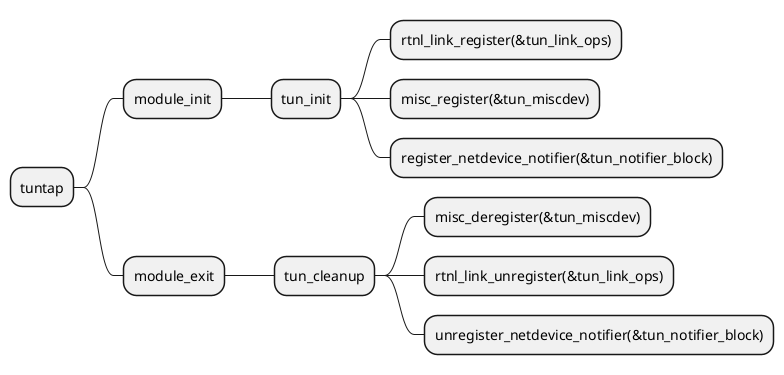
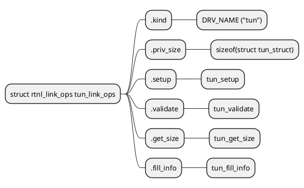
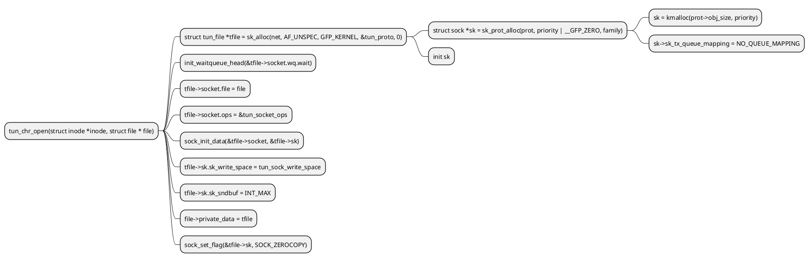
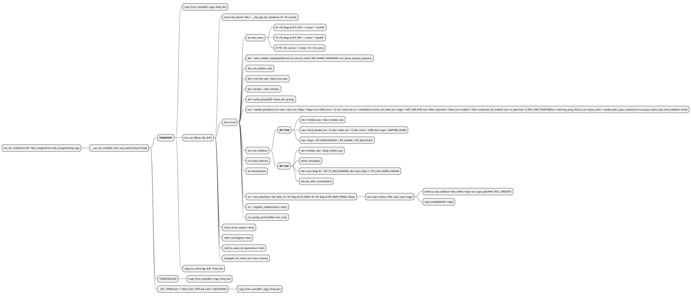
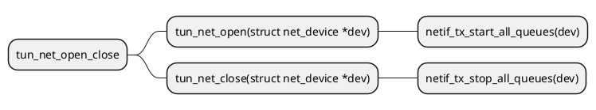
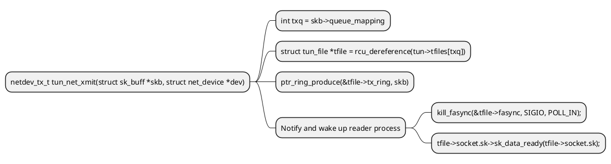
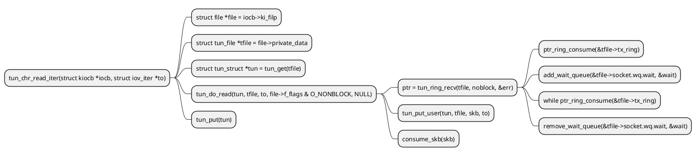
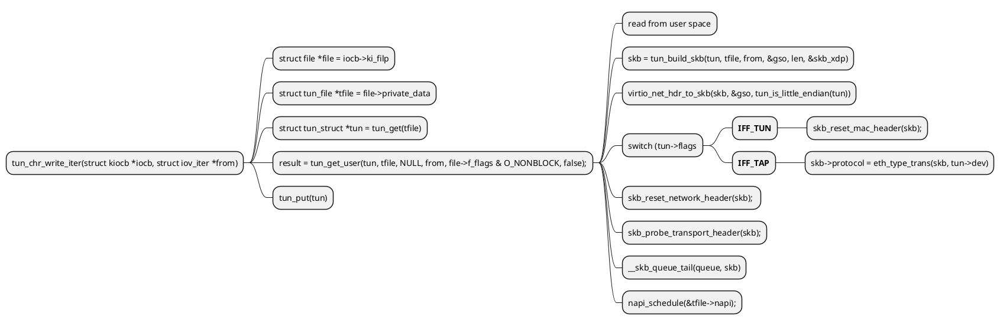
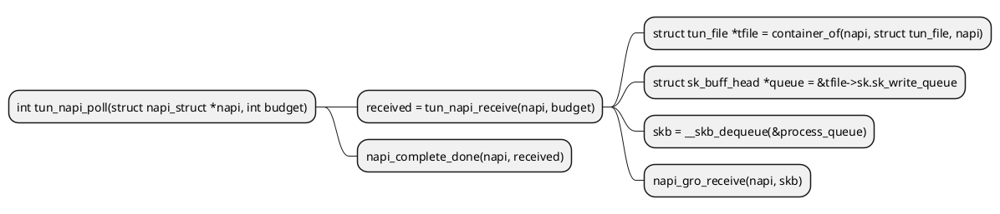
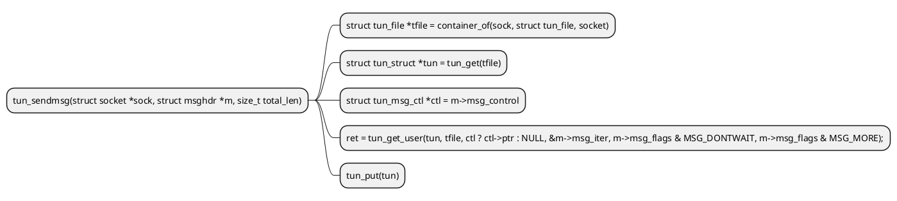

# TUN TAP
## Reference
- [Linux虚拟网络设备之tun/tap](https://segmentfault.com/a/1190000009249039)
- [Universal TUN/TAP device driver](https://www.kernel.org/doc/Documentation/networking/tuntap.txt)
- [Tun/Tap interface tutorial](https://backreference.org/2010/03/26/tuntap-interface-tutorial/)

## Overview
```
+----------------------------------------------------------------+
|                                                                |
|  +--------------------+      +--------------------+            |
|  | User Application A |      | User Application B |<-----+     |
|  +--------------------+      +--------------------+      |     |
|               | 1                    | 5                 |     |
|...............|......................|...................|.....|
|               ↓                      ↓                   |     |
|         +----------+           +----------+              |     |
|         | socket A |           | socket B |              |     |
|         +----------+           +----------+              |     |
|                 | 2               | 6                    |     |
|.................|.................|......................|.....|
|                 ↓                 ↓                      |     |
|             +------------------------+                 4 |     |
|             | Network Protocol Stack |                   |     |
|             +------------------------+                   |     |
|                | 7                 | 3                   |     |
|................|...................|.....................|.....|
|                ↓                   ↓                     |     |
|        +----------------+    +----------------+          |     |
|        |      eth0      |    |      tun0      |          |     |
|        +----------------+    +----------------+          |     |
|    10.32.0.11  |                   |   192.168.3.11      |     |
|                | 8                 +---------------------+     |
|                |                                               |
+----------------|-----------------------------------------------+
                 ↓
         Physical Network
```

tun0是一个Tun/Tap虚拟设备，从上图中可以看出它和物理设备eth0的差别，它们的一端虽然都连着协议栈，但另一端不一样，eth0的另一端是物理网络，这个物理网络可能就是一个交换机，而tun0的另一端是一个用户层的程序，协议栈发给tun0的数据包能被这个应用程序读取到，并且应用程序能直接向tun0写数据。

下面来看看数据包的流程：
1. 应用程序A是一个普通的程序，通过socket A发送了一个数据包，假设这个数据包的目的IP地址是192.168.3.1
2. socket将这个数据包丢给协议栈
3. 协议栈根据数据包的目的IP地址，匹配本地路由规则，知道这个数据包应该由tun0出去，于是将数据包交给tun0
4. tun0收到数据包之后，发现另一端被进程B打开了，于是将数据包丢给了进程B
5. 进程B收到数据包之后，做一些跟业务相关的处理，然后构造一个新的数据包，将原来的数据包嵌入在新的数据包中，最后通过socket B将数据包转发出去，这时候新数据包的源地址变成了eth0的地址，而目的IP地址变成了一个其它的地址，比如是10.33.0.1.
6. socket B将数据包丢给协议栈
7. 协议栈根据本地路由，发现这个数据包应该要通过eth0发送出去，于是将数据包交给eth0
8. eth0通过物理网络将数据包发送出去

10.33.0.1收到数据包之后，会打开数据包，读取里面的原始数据包，并转发给本地的192.168.3.1，然后等收到192.168.3.1的应答后，再构造新的应答包，并将原始应答包封装在里面，再由原路径返回给应用程序B，应用程序B取出里面的原始应答包，最后返回给应用程序A


TUN/TAP虚拟网络设备为用户空间程序提供了网络数据包的发送和接收能力。他既可以当做点对点设备（TUN），也可以当做以太网设备（TAP）。

TUN/TAP虚拟网络设备的原理比较简单，他在Linux内核中添加了一个TUN/TAP虚拟网络设备的驱动程序和一个与之相关连的字符设备/dev/net/tun，字符设备tun作为用户空间和内核空间交换数据的接口。当内核将数据包发送到虚拟网络设备时，数据包被保存在设备相关的一个队列中，直到用户空间程序通过打开的字符设备tun的描述符读取时，它才会被拷贝到用户空间的缓冲区中，其效果就相当于，数据包直接发送到了用户空间。通过系统调用write发送数据包时其原理与此类似。

值得注意的是：一次read系统调用，有且只有一个数据包被传送到用户空间，并且当用户空间的缓冲区比较小时，数据包将被截断，剩余部分将永久地消失，write系统调用与read类似，每次只发送一个数据包。所以在编写此类程序的时候，请用足够大的缓冲区，直接调用系统调用read/write，避免采用C语言的带缓存的IO函数。

### tun/tap的实现
#### tun/tap设备驱动初始化也是从init开始，主要进行操作如下:

1.注册netlink用以提供用户空间查看和设置网卡的接口。
2.注册miscdev设备,注册完之后将在系统中生成一个“/dev/net/tun”文件,同字符设备类似, 当应用程序使用open系统调用打开这个文件时,将生成file文件对象,而其file_operations将指向tun_fops。
3.注册网络事件监听回调tun_notifier_block。

#### tun/tap设备创建
1.用户态调用open函数打开字符设备。
2.然后调用ioctl通知内核创建tun/tap虚拟设备。
3.内核收到请求后会调用tun_chr_ioctl --> __tun_chr_ioctl。
4.__tun_chr_ioctl通过一系列参数检查会调用tun_set_iff进行处理。
5.tun_set_iff函数中申请net_device结构,并net_device私有数据内存大小为struct tun_struct结构体大小。
6.对申请的net_device进行初始化,根据虚拟接口类型对dev->netdev_ops进行赋值,tun赋值为tun_netdev_ops,tap赋值为tap_netdev_ops。
7.私有数据字段用tun变量保存,对tun各字段进行赋值,然后调用tun_attach将tun跟tfile进行关联。
8.将dev注册至net_device列表。

#### 读取数据包流程
1.用户态通过read函数调用内核注册的tun_chr_read_iter函数。
2.tun_chr_read_iter函数根据用户空间传递的文件描述符查到到对应的tfile,tun等信息然后调用tun_do_read读取skb。
3.tun_do_read函数中先调用tun_ring_recv读取skb,如果当前没有skb读取,则调用schedule等待下次调度时再读取。
4.然后调用tun_put_user将读取到的skb进行一些处理(主要是vlan处理),然后再拷贝到用户空间,通过read返回。

#### 数据包写入流程
1.用户态通过write函数调用内核注册的tun_chr_write_iter函数。
2.tun_chr_write_iter函数根据用户空间传递的文件描述符查到到对应的tfile,tun等信息然后调用tun_get_user处理。
3.tun_get_user函数首先进行一些非法检查,然后根据tun->flags对数据进行一些处理,然后申请skb,将数据封装进入skb,根据接口类型tun/tap对skb相关字段进行设置。

4.设置skb的网络层头部字段,然后调用netif_rx_ni,最终会进入netif_receive_skb进入协议栈。


## Kernel code
```c
static int __init tun_init(void)
{
	int ret = 0;

	pr_info("%s, %s\n", DRV_DESCRIPTION, DRV_VERSION);

	ret = rtnl_link_register(&tun_link_ops);     // Route NetLink
	if (ret) {
		pr_err("Can't register link_ops\n");
		goto err_linkops;
	}

	ret = misc_register(&tun_miscdev);           // MISC register
	if (ret) {
		pr_err("Can't register misc device %d\n", TUN_MINOR);
		goto err_misc;
	}

	ret = register_netdevice_notifier(&tun_notifier_block);
	if (ret) {
		pr_err("Can't register netdevice notifier\n");
		goto err_notifier;
	}

	return  0;
}

static struct rtnl_link_ops tun_link_ops __read_mostly = {
	.kind		= DRV_NAME,
	.priv_size	= sizeof(struct tun_struct),
	.setup		= tun_setup,
	.validate	= tun_validate,
	.get_size       = tun_get_size,
	.fill_info      = tun_fill_info,
};

static struct miscdevice tun_miscdev = {
	.minor = TUN_MINOR,  // MISC major = 10, TUN_MINOR = 200
	.name = "tun",
	.nodename = "net/tun", // /dev/net/tun
	.fops = &tun_fops,
};

static const struct file_operations tun_fops = {
	.owner	= THIS_MODULE,
	.llseek = no_llseek,
	.read_iter  = tun_chr_read_iter,
	.write_iter = tun_chr_write_iter,
	.poll	= tun_chr_poll,
	.unlocked_ioctl	= tun_chr_ioctl,
#ifdef CONFIG_COMPAT
	.compat_ioctl = tun_chr_compat_ioctl,
#endif
	.open	= tun_chr_open,
	.release = tun_chr_close,
	.fasync = tun_chr_fasync,
#ifdef CONFIG_PROC_FS
	.show_fdinfo = tun_chr_show_fdinfo,
#endif
};
```

```sh
# misc major 10 minor TUN_MINOR(200)
ls -al /dev/net/tun
```

### Key structures


### Module Init




### Open


### ioctl


### net dev open/close


### net xmit


### char read


### char write


### net recv


### tun_sendmsg


### tun_recvmsg
```
@startmindmap
*  tun_recvmsg(struct socket *sock, struct msghdr *m, size_t total_len,
	* struct tun_file *tfile = container_of(sock, struct tun_file, socket)
	* struct tun_struct *tun = tun_get(tfile)
	* tun_do_read(tun, tfile, &m->msg_iter, flags & MSG_DONTWAIT, ptr)
		* tun_put_user(tun, tfile, skb, to)
		* consume_skb(skb)
	* tun_put(tun)
@endmindmap
```

### List all ioctl cmd
```c
#define TUNSETNOCSUM  _IOW('T', 200, int) 
#define TUNSETDEBUG   _IOW('T', 201, int) 
#define TUNSETIFF     _IOW('T', 202, int) 
#define TUNSETPERSIST _IOW('T', 203, int) 
#define TUNSETOWNER   _IOW('T', 204, int)
#define TUNSETLINK    _IOW('T', 205, int)
#define TUNSETGROUP   _IOW('T', 206, int)
#define TUNGETFEATURES _IOR('T', 207, unsigned int)
#define TUNSETOFFLOAD  _IOW('T', 208, unsigned int)
#define TUNSETTXFILTER _IOW('T', 209, unsigned int)
#define TUNGETIFF      _IOR('T', 210, unsigned int)
#define TUNGETSNDBUF   _IOR('T', 211, int)
#define TUNSETSNDBUF   _IOW('T', 212, int)
#define TUNATTACHFILTER _IOW('T', 213, struct sock_fprog)
#define TUNDETACHFILTER _IOW('T', 214, struct sock_fprog)
#define TUNGETVNETHDRSZ _IOR('T', 215, int)
#define TUNSETVNETHDRSZ _IOW('T', 216, int)
#define TUNSETQUEUE  _IOW('T', 217, int)
#define TUNSETIFINDEX	_IOW('T', 218, unsigned int)
#define TUNGETFILTER _IOR('T', 219, struct sock_fprog)
#define TUNSETVNETLE _IOW('T', 220, int)
#define TUNGETVNETLE _IOR('T', 221, int)
/* The TUNSETVNETBE and TUNGETVNETBE ioctls are for cross-endian support on
 * little-endian hosts. Not all kernel configurations support them, but all
 * configurations that support SET also support GET.
 */
#define TUNSETVNETBE _IOW('T', 222, int)
#define TUNGETVNETBE _IOR('T', 223, int)
#define TUNSETSTEERINGEBPF _IOR('T', 224, int)
#define TUNSETFILTEREBPF _IOR('T', 225, int)
#define TUNSETCARRIER _IOW('T', 226, int)
#define TUNGETDEVNETNS _IO('T', 227)
```

## Procedure
### commands
```sh
ip tuntap add dev tap0 mod tap
ip tuntap add dev tun0 mod tun

ip addr add 172.16.1.1/24 dev tap0
ip addr add 172.16.2.1/24 dev tun0
```

### Code of simpletun
```c
/**************************************************************************
 * simpletun.c                                                            *
 *                                                                        *
 * A simplistic, simple-minded, naive tunnelling program using tun/tap    *
 * interfaces and TCP. Handles (badly) IPv4 for tun, ARP and IPv4 for     *
 * tap. DO NOT USE THIS PROGRAM FOR SERIOUS PURPOSES.                     *
 *                                                                        *
 * You have been warned.                                                  *
 *                                                                        *
 * (C) 2009 Davide Brini.                                                 *
 *                                                                        *
 * DISCLAIMER AND WARNING: this is all work in progress. The code is      *
 * ugly, the algorithms are naive, error checking and input validation    *
 * are very basic, and of course there can be bugs. If that's not enough, *
 * the program has not been thoroughly tested, so it might even fail at   *
 * the few simple things it should be supposed to do right.               *
 * Needless to say, I take no responsibility whatsoever for what the      *
 * program might do. The program has been written mostly for learning     *
 * purposes, and can be used in the hope that is useful, but everything   *
 * is to be taken "as is" and without any kind of warranty, implicit or   *
 * explicit. See the file LICENSE for further details.                    *
 *************************************************************************/

#include <arpa/inet.h>
#include <errno.h>
#include <fcntl.h>
#include <linux/if.h>
#include <linux/if_tun.h>
#include <stdarg.h>
#include <stdio.h>
#include <stdlib.h>
#include <string.h>
#include <sys/ioctl.h>
#include <sys/select.h>
#include <sys/socket.h>
#include <sys/stat.h>
#include <sys/time.h>
#include <sys/types.h>
#include <unistd.h>

/* buffer for reading from tun/tap interface, must be >= 1500 */
#define BUFSIZE 2000
#define CLIENT 0
#define SERVER 1
#define PORT 55555

/* some common lengths */
#define IP_HDR_LEN 20
#define ETH_HDR_LEN 14
#define ARP_PKT_LEN 28

int debug;
char *progname;

int assign_ip(char * dev, char * ip)
{
	struct ifreq ifr;

	int fd = socket(AF_INET, SOCK_DGRAM, 0);
	ifr.ifr_addr.sa_family = AF_INET;
	memcpy(ifr.ifr_name, dev, IFNAMSIZ-1);
	struct sockaddr_in *addr = (struct sockaddr_in *)&ifr.ifr_addr;
	inet_pton(AF_INET, ip, &addr->sin_addr);

	ioctl(fd, SIOCSIFADDR, &ifr);

	inet_pton(AF_INET, "255.255.255.0", ifr.ifr_addr.sa_data + 2);
	ioctl(fd, SIOCSIFNETMASK, &ifr);

	ioctl(fd, SIOCGIFFLAGS, &ifr);
	strncpy(ifr.ifr_name, dev, IFNAMSIZ);
	ifr.ifr_flags |= (IFF_UP | IFF_RUNNING);

	ioctl(fd, SIOCSIFFLAGS, &ifr);
	close(fd);
	return 0;
}

/**************************************************************************
 * tun_alloc: allocates or reconnects to a tun/tap device. The caller     *
 *            needs to reserve enough space in *dev.                      *
 **************************************************************************/
int tun_alloc(char *dev, int flags) {
	struct ifreq ifr;
	int fd, err;

	if ((fd = open("/dev/net/tun", O_RDWR)) < 0) {
		perror("Opening /dev/net/tun");
		return fd;
	}

	memset(&ifr, 0, sizeof(ifr));

	ifr.ifr_flags = flags;

	if (*dev) {
		strncpy(ifr.ifr_name, dev, IFNAMSIZ);
	}

	if ((err = ioctl(fd, TUNSETIFF, (void *)&ifr)) < 0) {
		perror("ioctl(TUNSETIFF)");
		close(fd);
		return err;
	}

	strcpy(dev, ifr.ifr_name);

	return fd;
}

/**************************************************************************
 * cread: read routine that checks for errors and exits if an error is    *
 *        returned.                                                       *
 **************************************************************************/
int cread(int fd, char *buf, int n) {

	int nread;

	if ((nread = read(fd, buf, n)) < 0) {
		perror("Reading data");
		exit(1);
	}
	return nread;
}

/**************************************************************************
 * cwrite: write routine that checks for errors and exits if an error is  *
 *         returned.                                                      *
 **************************************************************************/
int cwrite(int fd, char *buf, int n) {

	int nwrite;

	if ((nwrite = write(fd, buf, n)) < 0) {
		perror("Writing data");
		exit(1);
	}
	return nwrite;
}

/**************************************************************************
 * read_n: ensures we read exactly n bytes, and puts those into "buf".    *
 *         (unless EOF, of course)                                        *
 **************************************************************************/
int read_n(int fd, char *buf, int n) {

	int nread, left = n;

	while (left > 0) {
		if ((nread = cread(fd, buf, left)) == 0) {
			return 0;
		} else {
			left -= nread;
			buf += nread;
		}
	}
	return n;
}

/**************************************************************************
 * do_debug: prints debugging stuff (doh!)                                *
 **************************************************************************/
void do_debug(char *msg, ...) {

	va_list argp;

	if (debug) {
		va_start(argp, msg);
		vfprintf(stderr, msg, argp);
		va_end(argp);
	}
}

/**************************************************************************
 * my_err: prints custom error messages on stderr.                        *
 **************************************************************************/
void my_err(char *msg, ...) {

	va_list argp;

	va_start(argp, msg);
	vfprintf(stderr, msg, argp);
	va_end(argp);
}

/**************************************************************************
 * usage: prints usage and exits.                                         *
 **************************************************************************/
void usage(void) {
	fprintf(stderr, "Usage:\n");
	fprintf(stderr,
			"%s -i <ifacename> [-s|-c <serverIP>] [-p <port>] [-u|-a] [-d]\n",
			progname);
	fprintf(stderr, "%s -h\n", progname);
	fprintf(stderr, "\n");
	fprintf(stderr, "-i <ifacename>: Name of interface to use (mandatory)\n");
	fprintf(stderr, "-s|-c <serverIP>: run in server mode (-s), or specify "
			"server address (-c <serverIP>) (mandatory)\n");
	fprintf(stderr, "-p <port>: port to listen on (if run in server mode) or to "
			"connect to (in client mode), default 55555\n");
	fprintf(stderr, "-u|-a: use TUN (-u, default) or TAP (-a)\n");
	fprintf(stderr, "-d: outputs debug information while running\n");
	fprintf(stderr, "-h: prints this help text\n");
	exit(1);
}

int main(int argc, char *argv[]) {

	int tap_fd, option;
	int flags = IFF_TUN;
	char if_name[IFNAMSIZ] = "";
	int header_len = IP_HDR_LEN;
	int maxfd;
	uint16_t nread, nwrite, plength;
	//  uint16_t total_len, ethertype;
	char buffer[BUFSIZE];
	struct sockaddr_in local, remote;
	char remote_ip[16] = "";
	unsigned short int port = PORT;
	int sock_fd, net_fd, optval = 1;
	socklen_t remotelen;
	int cliserv = -1; /* must be specified on cmd line */
	unsigned long int tap2net = 0, net2tap = 0;

	progname = argv[0];

	/* Check command line options */
	while ((option = getopt(argc, argv, "i:sc:p:uahd")) > 0) {
		switch (option) {
			case 'd':
				debug = 1;
				break;
			case 'h':
				usage();
				break;
			case 'i':
				strncpy(if_name, optarg, IFNAMSIZ - 1);
				break;
			case 's':
				cliserv = SERVER;
				break;
			case 'c':
				cliserv = CLIENT;
				strncpy(remote_ip, optarg, 15);
				break;
			case 'p':
				port = atoi(optarg);
				break;
			case 'u':
				flags = IFF_TUN;
				break;
			case 'a':
				flags = IFF_TAP;
				header_len = ETH_HDR_LEN;
				break;
			default:
				my_err("Unknown option %c\n", option);
				usage();
		}
	}

	argv += optind;
	argc -= optind;

	if (argc > 0) {
		my_err("Too many options!\n");
		usage();
	}

	if (*if_name == '\0') {
		my_err("Must specify interface name!\n");
		usage();
	} else if (cliserv < 0) {
		my_err("Must specify client or server mode!\n");
		usage();
	} else if ((cliserv == CLIENT) && (*remote_ip == '\0')) {
		my_err("Must specify server address!\n");
		usage();
	}

	/* initialize tun/tap interface */
	if ((tap_fd = tun_alloc(if_name, flags | IFF_NO_PI)) < 0) {
		my_err("Error connecting to tun/tap interface %s!\n", if_name);
		exit(1);
	}

	do_debug("Successfully connected to interface %s\n", if_name);

	if ((sock_fd = socket(AF_INET, SOCK_STREAM, 0)) < 0) {
		perror("socket()");
		exit(1);
	}

	if (cliserv == CLIENT) {
		assign_ip(if_name, "172.16.3.2");
		/* Client, try to connect to server */

		/* assign the destination address */
		memset(&remote, 0, sizeof(remote));
		remote.sin_family = AF_INET;
		remote.sin_addr.s_addr = inet_addr(remote_ip);
		remote.sin_port = htons(port);

		/* connection request */
		if (connect(sock_fd, (struct sockaddr *)&remote, sizeof(remote)) < 0) {
			perror("connect()");
			exit(1);
		}

		net_fd = sock_fd;
		do_debug("CLIENT: Connected to server %s\n", inet_ntoa(remote.sin_addr));

	} else {
		assign_ip(if_name, "172.16.3.1");
		/* Server, wait for connections */

		/* avoid EADDRINUSE error on bind() */
		if (setsockopt(sock_fd, SOL_SOCKET, SO_REUSEADDR, (char *)&optval,
					sizeof(optval)) < 0) {
			perror("setsockopt()");
			exit(1);
		}

		memset(&local, 0, sizeof(local));
		local.sin_family = AF_INET;
		local.sin_addr.s_addr = htonl(INADDR_ANY);
		local.sin_port = htons(port);
		if (bind(sock_fd, (struct sockaddr *)&local, sizeof(local)) < 0) {
			perror("bind()");
			exit(1);
		}

		if (listen(sock_fd, 5) < 0) {
			perror("listen()");
			exit(1);
		}

		/* wait for connection request */
		remotelen = sizeof(remote);
		memset(&remote, 0, remotelen);
		if ((net_fd = accept(sock_fd, (struct sockaddr *)&remote, &remotelen)) <
				0) {
			perror("accept()");
			exit(1);
		}

		do_debug("SERVER: Client connected from %s\n", inet_ntoa(remote.sin_addr));
	}

	/* use select() to handle two descriptors at once */
	maxfd = (tap_fd > net_fd) ? tap_fd : net_fd;

	while (1) {
		int ret;
		fd_set rd_set;

		FD_ZERO(&rd_set);
		FD_SET(tap_fd, &rd_set);
		FD_SET(net_fd, &rd_set);

		ret = select(maxfd + 1, &rd_set, NULL, NULL, NULL);

		if (ret < 0 && errno == EINTR) {
			continue;
		}

		if (ret < 0) {
			perror("select()");
			exit(1);
		}

		if (FD_ISSET(tap_fd, &rd_set)) {
			/* data from tun/tap: just read it and write it to the network */

			nread = cread(tap_fd, buffer, BUFSIZE);

			tap2net++;
			do_debug("TAP2NET %lu: Read %d bytes from the tap interface\n", tap2net,
					nread);

			/* write length + packet */
			plength = htons(nread);
			nwrite = cwrite(net_fd, (char *)&plength, sizeof(plength));
			nwrite = cwrite(net_fd, buffer, nread);

			do_debug("TAP2NET %lu: Written %d bytes to the network\n", tap2net,
					nwrite);
		}

		if (FD_ISSET(net_fd, &rd_set)) {
			/* data from the network: read it, and write it to the tun/tap interface.
			 * We need to read the length first, and then the packet */

			/* Read length */
			nread = read_n(net_fd, (char *)&plength, sizeof(plength));
			if (nread == 0) {
				/* ctrl-c at the other end */
				break;
			}

			net2tap++;

			/* read packet */
			nread = read_n(net_fd, buffer, ntohs(plength));
			do_debug("NET2TAP %lu: Read %d bytes from the network\n", net2tap, nread);

			/* now buffer[] contains a full packet or frame, write it into the tun/tap
			 * interface */
			nwrite = cwrite(tap_fd, buffer, nread);
			do_debug("NET2TAP %lu: Written %d bytes to the tap interface\n", net2tap,
					nwrite);
		}
	}

	return (0);
}
```

Usage
```
# server 10.129.65.248
./simpletun -i tun0 -s -u -d -p 8080

# client 10.182.67.252
./simpletun -i tun0 -c 10.129.65.248 -d -p 8080
```

### data structures
ptr_ring


tun/tap bridge how to work
multi tun devices created, what about the msg?


