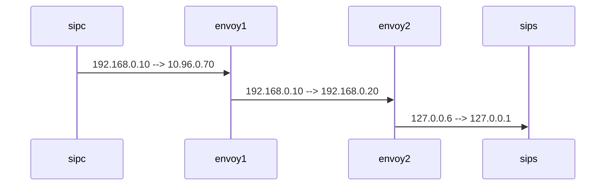

# CNCS

## ENVIRONMENT

Kubernetes Cluster Info:

| Ip          | node        | user | password |
| ----------- | ----------- | ---- | -------- |
| 10.30.37.44 | k8s-tc05-c  | root | newsys   |
| 10.30.38.22 | k8s-tc05-e1 | root | newsys   |
| 10.30.38.21 | k8s-tc05-e2 | root | newsys   |
| 10.30.37.47 | k8s-tc05-w1 | root | newsys   |
| 10.30.37.37 | k8s-tc05-w2 | root | newsys   |
| 10.30.37.38 | k8s-tc05-w3 | root | newsys   |


## ENVOY

### Build

https://github.com/envoyproxy/envoy/blob/e3f616ec7faa8650fa84e6afaa40754a31056dbf/ci/README.md
```
./ci/run_envoy_docker.sh './ci/do_ci.sh bazel.dev'
```

to show verbose build commands info:
```
bazel build -s //source/exe/envoy
```

### Terminology

- **Downstream**
    A downstream host connects to Envoy, sends requests, and receives responses.
- **Upstream**
    An upstream host receives connections and requests from Envoy and returns responses.
- **Listener**
    A listener is a named network location (e.g., port, unix domain socket, etc.) that can be connected to by downstream clients. Envoy exposes one or more listeners that downstream hosts connect to.
- **Cluster**
    A cluster is a group of logically similar upstream hosts that Envoy connects to. Envoy discovers the members of a cluster via service discovery. It optionally determines the health of cluster members via active health checking. The cluster member that Envoy routes a request to is determined by the load balancing policy.
- **Mesh**
    A group of hosts that coordinate to provide a consistent network topology. In this documentation, an “Envoy mesh” is a group of Envoy proxies that form a message passing substrate for a distributed system comprised of many different services and application platforms.h

### Code

- main entry `source/exe/main.cc`

[Envoy源码分析之一--Server初始化](https://www.jianshu.com/p/204d1631239d)


# Service Mesh Poc on CNCS

### TC05 LAB Info

### login tc01

```
ssh root@10.30.41.69
password: bcmt@R00T
```

### Enable sidecar auto injector for namespace cncs

```
kubectl label namespace cncs istio-injection=enabled
```

> **Note**: use following command to disable
>
> ​	`kubectl label namespace cncs istio-injection-`

### Modify manifest to add customized sidecar image:

```yaml
# kubectl edit deployment cngss -n cncs
spec:
   containers:
   - name: istio-proxy
     image: felixdu.hz.dynamic.nsn-net.net/proxyv2:1.10-devv
```

> Because  cngss serviceaccount set **automountServiceAccountToken: false,** so there is no /var/run/secrets/kubernetes.io/serviceaccount/token  auto created.  
>
> **SOLUTION**:  *automountServiceAccountToken:  true* or delete it.  
>
> ```
> 2021-07-14T06:08:10.800505Z   warn  failed to fetch token from file: open /var/run/secrets/kubernetes.io/serviceaccount/token: no such file or directory
> 2021-07-14T06:08:10.800627Z   info  xdsproxy    connected to upstream XDS server: istiod.istio-system.svc:15012
> 2021-07-14T06:08:10.801800Z   warn  xdsproxy    upstream terminated with unexpected error rpc error: code = Unauthenticated desc = authentication failure
> ```
>
> ---
>
> ```yaml
> [root@bcmtcncs-control-01 ~]# kubectl get sa -n cncs cngss -o yaml
> apiVersion: v1
> automountServiceAccountToken: true
> kind: ServiceAccount
> metadata:
>  creationTimestamp: "2021-06-28T02:40:30Z"
>  managedFields:
>  - apiVersion: v1
>   fieldsType: FieldsV1
>   fieldsV1:
>    f:secrets:
>     .: {}
>     k:{"name":"cngss-token-8r5sn"}:
>      .: {}
>      f:name: {}
>   manager: kube-controller-manager
>   operation: Update
>   time: "2021-06-28T02:40:30Z"
>   - apiVersion: v1
>   fieldsType: FieldsV1
>   fieldsV1:
>    f:automountServiceAccountToken: {}
>   manager: kubectl-edit
>   operation: Update
>   time: "2021-07-15T07:11:16Z"
>  name: cngss
>  namespace: cncs
>  resourceVersion: "35281038"
>  selfLink: /api/v1/namespaces/cncs/serviceaccounts/cngss
>  uid: 1c67ea36-ccbe-428e-9233-c2b081dbd4d6
> secrets:
> - name: cngss-token-8r5sn
> ```

### ReadinessProbe Check

```bash
/opt/SMAW/SMAWrtp/bin/livenessProbe_check.py
/opt/SMAW/SMAWrtp/bin/readinessprobe_check.py
curl -v http://localhost:9989/routingtable

cfxsouthdb.cncs.svc.cluster.local
```

### Stop icscfc and scscfc

```
IcmAdminTool.pl ProcessesStop IMS_ICMGW01
```

### Trace

```bash
IcmAdminTool.pl TraceStart one ALL_6 IMS_SCSCF
IcmAdminTool.pl TraceStop one ALL_6 IMS_SCSCF

grep -A 1 -E "from_addr|to_addr" *
```

### Bypass ports

```yaml
# kubectl edit deployment -n cncs cncs-icscf/cncs-icscfc/cncs-scscf/cncs-scscfc
annotations:
    traffic.sidecar.istio.io/excludeInboundPorts: 12000,12001,2000,12009,13016
    traffic.sidecar.istio.io/excludeOutboundPorts: 12000,12001,2000,12009,13016
    # traffic.sidecar.istio.io/includeInboundPorts: "" (don’t include)
```

**Scscf port conflict 15090** need to rebuild istio to use 15190 for 普罗米修斯

### Basic Call

```bash
ssh bcmtcncs-edge-02
[root@bcmtcncs-edge-02 ~]# iota
root@bcmtcncs-edge-02:/# cd iota
root@bcmtcncs-edge-02:/iota# ./startsip
iota> source ue 
iota>
iota> ua1 register
iota> P-CSCF-ua1 <<+-- REGISTER ----- ua1
iota> P-CSCF-ua1 ----- 401 Unauthorized --+>> ua1
iota> P-CSCF-ua1 <<+-- REGISTER (challenge resp) ----- ua1
iota> P-CSCF-ua1 ----- 200 OK REGISTER --+>> ua1
iota>
iota> ua2 register
iota> P-CSCF-ua2 <<+-- REGISTER ----- ua2
iota> P-CSCF-ua2 ----- 401 Unauthorized --+>> ua2
iota> P-CSCF-ua2 <<+-- REGISTER (challenge resp) ----- ua2
iota> P-CSCF-ua2 ----- 200 OK REGISTER --+>> ua2
iota>
iota> ua1 invite [ua2 cget -myaddress]
iota> P-CSCF-ua1 <<+-- INVITE ----- ua1
iota> P-CSCF-ua1 <<+-- INVITE sip:tc01sub3@cncs.nokialab.com SIP/2.0 (SDP) ----- ua1
iota> P-CSCF-ua1 ----- 100 Trying --+>> ua1
iota> P-CSCF-ua2 ----- INVITE sip:tc01sub3@10.30.41.212:38613 SIP/2.0 --+>> ua2
iota> P-CSCF-ua2 <<+-- 100 Trying ----- ua2
iota> P-CSCF-ua2 <<+-- 180 Ringing ----- ua2
iota> P-CSCF-ua1 ----- 180 INVITE --+>> ua1
iota>
iota> ua2 answer
iota> P-CSCF-ua2 <<+-- 200 OK INVITE (SDP) ----- ua2
iota> P-CSCF-ua1 ----- 200 OK INVITE (SDP) --+>> ua1
iota> P-CSCF-ua1 <<+-- ACK ----- ua1
iota> Timer E fires!
iota> P-CSCF-ua2 <<+-- 200 ----- ua2
iota> P-CSCF-ua2 ----- ACK --+>> ua2
iota> P-CSCF-ua2 ----- ACK --+>> ua2
iota> Call established.
iota> Call established.
iota>
iota> ua1 bye
iota> P-CSCF-ua1 <<+-- BYE ----- ua1
iota> P-CSCF-ua1 ----- 200 OK BYE --+>> ua1
iota> Call disconnected
iota> P-CSCF-ua2 ----- BYE --+>> ua2
iota> P-CSCF-ua2 <<+-- 200 OK BYE ----- ua2
iota> Call disconnected
iota>
iota> ua1 deregister
iota> P-CSCF-ua1 <<+-- REGISTER ----- ua1
iota> P-CSCF-ua1 ----- 401 Unauthorized --+>> ua1
iota> P-CSCF-ua1 <<+-- REGISTER (challenge resp) ----- ua1
iota> P-CSCF-ua1 ----- 200 OK REGISTER --+>> ua1
iota> 
iota> ua2 deregister
iota> P-CSCF-ua2 <<+-- REGISTER ----- ua2
iota> P-CSCF-ua2 ----- 401 Unauthorized --+>> ua2
iota> P-CSCF-ua2 <<+-- REGISTER (challenge resp) ----- ua2
iota> P-CSCF-ua2 ----- 200 OK REGISTER --+>> ua2
```


135398 SIP/2.0 401 Unauthorized^M
135399 Via: SIP/2.0/TCP 192.169.180.163:5060;branch=z9hG4bKf04f0fc6a31df4805a31060b6a2a83f7611e1ab1-0-0-611e1ebd2b18f899;**received=127.0.0.6**^M
135400 Via: SIP/2.0/UDP 127.0.0.1;branch=z9hG4bK_0002_1-139803345332556;lsstag=pt-1.1^M
135401 Via: SIP/2.0/UDP 10.30.41.212:38612;received=10.30.41.212;branch=z9hG4bK261433^M
135402 From: <sip:tc01sub1@cncs.nokialab.com>;tag=267888^M                                                                                                                                                                                                   135403 To: <sip:tc01sub1@cncs.nokialab.com>;tag=762440101^M
135404 Call-ID: tc01sub1-1@10.30.41.212-38612^M
135405 CSeq: 1 REGISTER^M
135406 P-Charging-Vector: icid-value="PCSF:1-cfed-0-1-00000000611e1ebd-0000000000000000"^M
135407 WWW-Authenticate: Digest realm="cncs.nokialab.com",nonce="5a22bc14611e1ebe23Febe50e11b77a5d4d4a06ac481f67beca6f1",algorithm=MD5,qop="auth";**opaque=127.0.0.6**^M
135408 Content-Length: 0^M
135409 P-Nokia-Cookie-IP-Mapping: I3F2=192.169.60.213^M

Second REG no opaque

135560 Authorization: Digest username="tc01sub1@cncs.nokialab.com", realm="cncs.nokialab.com", nonce="5a22bc14611e1ebe23Febe50e11b77a5d4d4a06ac481f67beca6f1", algorithm=MD5, uri="sip:10.30.41.244", response="1f9aff94e4246c59a0dea8f847e9604a", nc=0120120       1, cnonce="123456", qop=auth^M


**P -> UE deleted opaque**


Notify No ep in <span style="color:red">Contact</span>

xxx<span><b>10.96.0.70</b></span>xxx


initial INVITE Route with ep  reuse upstream request




to CFX no ed add, go throuth x-suri

compare x-suri and ep cluster fqdn


enable sidecar injection for specific pods

sidecar.istio.io/inject: "true"


x-afi

skey

ut-coverage


istio-proxy coredump in /var/lib/istio/istio-data


